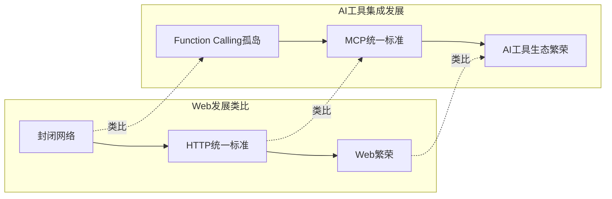
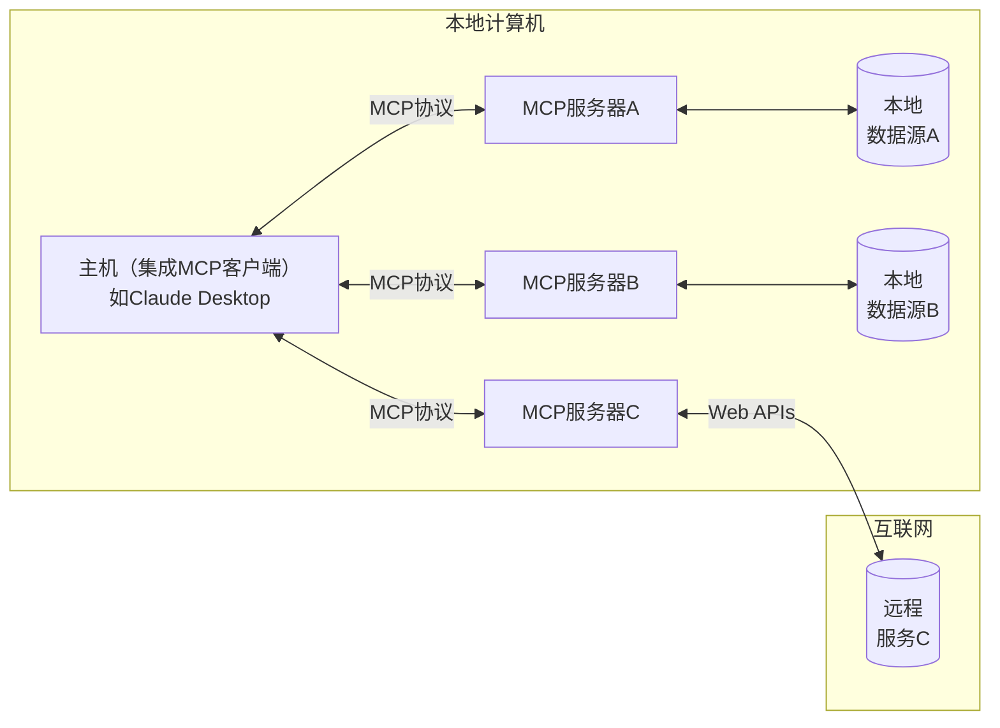
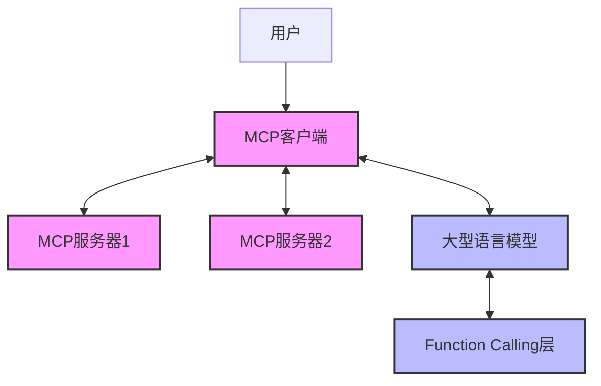

С появлением Model Context Protocol (MCP) пространство интеграции инструментов ИИ претерпевает глубокую смену парадигмы. В этой статье мы рассмотрим эволюцию от вызова функций к MCP, проанализируем их существенные различия, а также изучим текущее состояние и будущее развитие экосистемы MCP. Независимо от того, являетесь ли вы исследователем, разработчиком или просто наблюдателем, интересующимся технологиями ИИ, эта статья поможет вам лучше понять эту развивающуюся область.

<!--more-->

## 从Function Calling到MCP：技术演进的历史必然

Прежде чем детально сравнивать эти две технологические парадигмы, необходимо понять исторический контекст, в котором они возникли.

### Function Calling：早期AI工具集成的主流方案

Вызов функций был ранним решением для взаимодействия больших языковых моделей (LLM) с внешними инструментами, позволяя модели самой решать, когда вызывать предопределенные функции и генерировать структурированные параметры. В этой парадигме модель анализирует намерения пользователя, решает, нужно ли вызывать определенную функцию для выполнения задачи, и предоставляет необходимые параметры.

На примере вызова функций OpenAI разработчикам необходимо:
1. определить структуру функции (название, параметры, описание и т. д.) в каждом запросе API
2. дождаться, пока модель распознает намерение пользователя и сгенерирует запрос на вызов функции
3. получить запрос на вызов функции, выполнить фактическую функцию и вернуть результат в модель.

```python
# OpenAI Function Calling示例（简化版）
response = client.chat.completions.create(
    model="gpt-4o",
    messages=[
        {"role": "user", "content": "北京现在的天气如何？"}
    ],
    tools=[{
        "type": "function",
        "function": {
            "name": "get_weather", 
            "description": "获取指定位置的天气信息",
            "parameters": {
                "type": "object", 
                "properties": {
                    "location": {"type": "string", "description": "城市名称"},
                    "unit": {"type": "string", "enum": ["celsius", "fahrenheit"]}
                }, 
                "required": ["location"]
            }
        }
    }]
)
```

### Function Calling的局限性与微调的必要

Несмотря на то, что Function Calling добавляет ИИ возможность взаимодействовать с внешними системами, на практике было выявлено несколько ключевых ограничений:

1. **Закрытая экосистема**: каждый поставщик ИИ (например, OpenAI, Anthropic, Google) имеет собственную реализацию вызова функций, не совместимую друг с другом.
2. **Отсутствие стандартов**: отсутствие единых стандартов приводит к тому, что разработчикам приходится адаптировать разный код для каждой платформы.
3. **Необходимость тонкой настройки**: чтобы добиться наилучшей производительности, модель обычно необходимо точно настроить под цель.

В частности, по последнему пункту в документации Microsoft Azure OpenAI прямо говорится, что "Тонкая настройка моделей с помощью примеров вызовов инструментов может **улучшить результаты модели**, позволяя вам:
- Получать последовательно оформленные ответы, даже если не предоставлены полные определения функций
- Получить более точные и последовательные результаты".

В связи с этим возникает вопрос: почему вызов функций нуждается в тонкой настройке?

Основная причина заключается в том, что если LLM понимает естественный язык, то вызов функций - это интерфейс, определяемый человеком, который требует от модели изучения определенных шаблонов вызова. Модель должна понимать:
1. когда следует вызывать функцию (а не прямой ответ)
2. какую функцию следует вызвать
3. как правильно сконструировать параметры

Тонкая настройка обучает модель этим навыкам, предоставляя большое количество примеров, но это означает, что для каждой новой функции или набора функций может потребоваться дополнительная работа по тонкой настройке.

## MCP：开放协议重新定义AI工具集成

Model Context Protocol (MCP) использует совершенно иной подход к проблеме интеграции инструментов ИИ. MCP - это не API-функция, а скорее **открытый стандартный протокол**, определяющий единый способ взаимодействия систем ИИ с внешними инструментами и ресурсами.

### MCP的核心理念

MCP придерживается следующей основной философии проектирования:

1. **Первый протокол**: кроссплатформенная совместимость за счет определения стандартных протоколов вместо API.
2. **Клиент-серверная архитектура**: четкое разделение модели ИИ (клиент) и поставщика инструментов (сервер).
3. **Многочисленные прото-языки**: не только вызовы функций, но и доступ к ресурсам, шаблоны подсказок и другие многочисленные режимы взаимодействия
4. **Человек в петле**: акцент на безопасности, клиент контролирует доступ к инструментам.
5. **Открытые стандарты**: открытые стандарты, управляемые сообществом, чтобы избежать привязки к производителю.

### MCP与HTTP的类比：从信息孤岛到开放生态

Между MCP и HTTP существуют наводящие на размышления параллели. На заре существования Сети различные компьютерные сети общались с помощью проприетарных протоколов (например, AOL, CompuServe), создавая изолированные информационные пространства. Появление HTTP как открытого стандартного протокола объединило сетевые коммуникации и вызвало взрывной рост Сети.

Аналогичным образом, до появления MCP все крупные поставщики ИИ имели собственные реализации Function Calling, создавая "силосы возможностей ИИ". MCP обладает потенциалом для преобразования всей экосистемы интеграции инструментов ИИ в единый стандарт.



### MCP的技术架构

MCP использует архитектуру клиент-сервер и включает в себя следующие основные компоненты:

1. **Хост**: например, Claude Desktop, интегрированный клиент MCP.
2. **Клиент**: поддерживает соединение 1:1 с сервером.
3. **Сервер**: предоставляет инструменты, ресурсы и советы.
4. **Транспорт**: поддерживает несколько методов обмена данными (например, stdio, SSE).



### 为什么MCP不需要微调？

Вернемся к первоначальному вопросу: почему MCP не нуждается в тонкой настройке? Ответ кроется в дизайне протокола и стандартизированных интерфейсах:

1. **Унифицированные интерфейсы**: MCP определяет стандартизированные интерфейсы для инструментов, ресурсов и подсказок, чтобы модели естественным образом понимали, как их использовать
2. **Структурированное взаимодействие**: архитектура клиент-сервер обеспечивает последовательную модель взаимодействия, которую легко освоить моделям.
3. **Самоописывающиеся инструменты**: инструменты MCP содержат богатые метаданные, которые позволяют моделям понять, как использовать инструмент
4. **Разделение забот**: MCP разделяет понятия "как выполнять" и "когда выполнять", так что модели нужно сосредоточиться только на последнем.

Точно так же, как нам не нужно специально обучать браузеры понимать различные HTTP-серверы, модели с поддержкой MCP естественным образом понимают MCP-совместимые инструменты.

## MCP生态系统现状与索引问题

С ростом популярности MCP все больше разработчиков и организаций создают MCP-сервисы. Однако в связи с этим возникает новая проблема: как эффективно обнаруживать и индексировать эти сервисы?

### 当前MCP服务索引方案

Существует несколько основных методов индексации услуг MCP:

#### 1. GitHub搜索和Awesome列表

Откройте для себя MCP-сервисы через поиск на GitHub или поддерживаемые сообществом списки "Awesome":
- [punkpeye/awesome-mcp-servers](https://github.com/punkpeye/awesome-mcp-servers)
- [appcypher/awesome-mcp-servers](https://github.com/appcypher/awesome-mcp-servers)

Преимущества:
- Открытый исходный код, управляемый сообществом, быстрое обновление контента
- Базовая категоризация и фильтрация
- С контролем качества (через PR и аудит)

Недостаточно:
- Фрагментация информации
- Отсутствие интуитивного пользовательского опыта
- Отсутствие данных о производительности и совместимости в реальном времени

#### 2. 专门收集网站

Ряд сайтов посвящен сбору и организации MCP-сервисов:
- [glama.ai/mcp/servers](https://glama.ai/mcp/servers)
- [pulsemcp.com](https://www.pulsemcp.com)

Преимущество:
- Более структурированное представление данных
- Улучшение пользовательского опыта и функциональности поиска
- Предоставление дополнительной информации (например, совместимость, рейтинги безопасности)

Недостаточно:
- Зависимость обновлений от владельца веб-сайта
- Возможная коммерциализация
- Отсутствие глубокого вовлечения сообщества

### MCP服务发现的未来：会出现"谷歌"吗？

Существующие механизмы индексирования сервисов MCP находятся на ранних стадиях, подобно каталогам и спискам ссылок в раннем Web. По мере развития экосистемы мы сможем увидеть более зрелые решения для обнаружения сервисов:

1. **Специализированная поисковая система**: аналогична поисковой системе Google для MCP-сервисов, но с большим упором на показатели разработчиков, такие как техническая совместимость, стабильность API и т. д.

2. **Протоколы со встроенными механизмами обнаружения**: MCP сам может развивать встроенные протоколы обнаружения услуг, аналогичные системе DNS.

3. **Распределенный каталог**: децентрализованный каталог доверенных услуг на основе блокчейна или аналогичных технологий

4. **Экосистемные хабы**: платформы, уже находящиеся в центре экосистемы ИИ (например, Anthropic, OpenAI или GitHub), скорее всего, станут доминирующими игроками.

Идеальная система индексирования MCP должна иметь:
- Стандартизированные метаданные
- Мониторинг в реальном времени
- Система обратной связи с пользователями
- Автоматизированное тестирование
- Контроль версий
- Семантический поиск

## 实例：使用MCP天气服务

Чтобы продемонстрировать полезность MCP, ниже приведены подробные шаги по установке и использованию сервиса "adhikasp/mcp-weather":

### 安装准备

1. **Пререквизиты**
   - Получите API-ключ AccuWeather ([developer.accuweather.com](https://developer.accuweather.com/)).
   - Установите Python 3.8+ и инструменты управления пакетами uv

2. **Метод установки**

方法1: 直接使用GitHub仓库
   ```bash
   git clone https://github.com/adhikasp/mcp-weather.git
   cd mcp-weather
   uv venv
   uv sync
   echo "ACCUWEATHER_API_KEY=your_api_key_here" > .env
   python -m mcp_weather.weather  # 仅测试
   ```

方法2: 使用预打包的PyPI包（如已发布）
   ```bash
   pip install mcp-weather
   ```

3. **Конфигурация Claude для рабочего стола**.

在Claude for Desktop配置文件中添加：
   ```json
   {
     "mcpServers": {
       "weather": {
         "command": "uvx",
         "args": [
           "--from", 
           "git+https://github.com/adhikasp/mcp-weather.git", 
           "mcp-weather"
         ],
         "env": {
           "ACCUWEATHER_API_KEY": "your_api_key_here"
         }
       }
     }
   }
   ```

### 服务实现细节

Давайте посмотрим на основной код реализации этого сервиса MCP:

```python
@mcp.tool()
async def get_hourly_weather(location: str) -> Dict:
    """Get hourly weather forecast for a location."""
    api_key = os.getenv("ACCUWEATHER_API_KEY")
    base_url = "http://dataservice.accuweather.com"
    
    # 获取位置信息
    location_key = get_cached_location_key(location) or await fetch_location_key(location)
    
    # 获取当前天气和预报
    current_conditions = await fetch_current_conditions(location_key)
    forecast = await fetch_hourly_forecast(location_key)
    
    # 格式化返回数据
    return {
        "location": location,
        "current_conditions": format_current_conditions(current_conditions),
        "hourly_forecast": format_hourly_forecast(forecast)
    }
```

Эта упрощенная версия кода показывает основную структуру реализации инструмента MCP. Определяя инструмент через декоратор Python `@mcp.tool()`, фреймворк FastMCP автоматически обрабатывает определение типа, проверку параметров и преобразование результатов.

### 服务工具使用

После установки и настройки службы MCP вы можете использовать ее, естественно, в Claude:

1. запрос: "Будет ли завтра дождь в Пекине?"
2. Claude распознает этот запрос как запрос о погоде и автоматически вызывает службу MCP
3. служба MCP запрашивает AccuWeather API для получения данных.
4. Клод получает данные и генерирует ответ на естественном языке.

Весь процесс прозрачен для пользователя и обеспечивает бесперебойную работу.

## MCP与Function Calling的共存与互补

Хотя MCP решает многие проблемы Function Calling, эти две технологии, вероятно, будут сосуществовать еще долгое время, каждая из которых будет обслуживать различные сценарии:

### 共存的理由

1. **Различные сценарии применения**.
   - FC подходит для простых сценариев с прямыми вызовами API и профессиональных приложений, требующих глубокой настройки модели.
   - MCP подходит для сложной интеграции нескольких инструментов и кроссплатформенных приложений.

2. **Путь развития технологии**.
   - FC может перенять опыт MCP и принять более стандартизированные интерфейсы
   - MCP может также интегрировать некоторые преимущества FC, такие как более тесная интеграция моделей

3. **Факторы бизнес-стратегии**.
   - Поставщики бизнес-моделей мотивированы поддерживать свои собственные экосистемы API.
   - С другой стороны, сообщества разработчиков открытого кода стимулируют развитие открытых стандартов

### 可能的未来架构

В будущем мы можем увидеть гибридную архитектуру: нижний уровень, использующий вызов функций (возможно, с тонкой настройкой) для обеспечения преимуществ производительности, и верхний уровень, предоставляющий единую абстракцию и экосистему инструментов через MCP.



## 结语

MCP представляет собой будущее направление интеграции инструментов ИИ, решая многочисленные проблемы, стоящие перед Function Calling, с помощью открытых протоколов. Это не только устраняет зависимость от тонкой настройки, но и создает процветающую экосистему сервисов.

Конечно, экосистема MCP все еще находится на ранних стадиях и сталкивается с такими проблемами, как открытие сервисов и развитие стандартов. По мере того как все больше разработчиков и организаций присоединяются к экосистеме MCP, мы ожидаем появления новых инновационных решений.

Будучи ключевой инфраструктурой для развития ИИ, MCP обещает стать ключевым инструментом для интеграции и масштабирования возможностей ИИ так же, как HTTP для Web. Никогда еще не было лучшего времени для разработчиков и пользователей, чтобы понять и принять участие в этой технологической волне.

Что вы ожидаете от MCP в будущем? Считаете ли вы, что он полностью заменит Function Calling? Не стесняйтесь делиться своими соображениями в разделе комментариев!