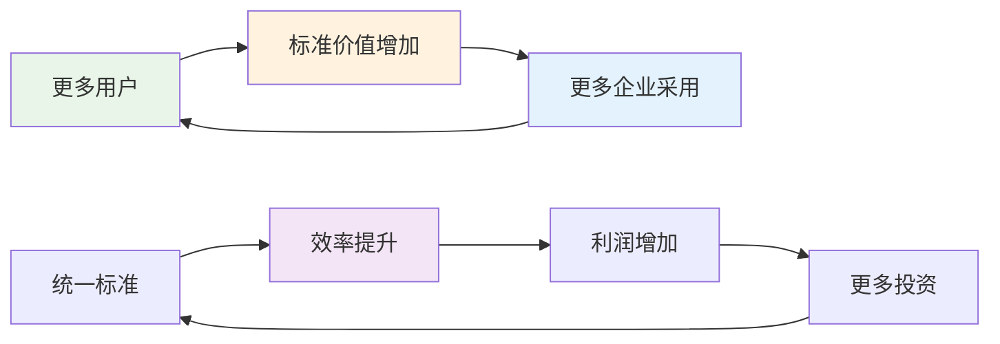
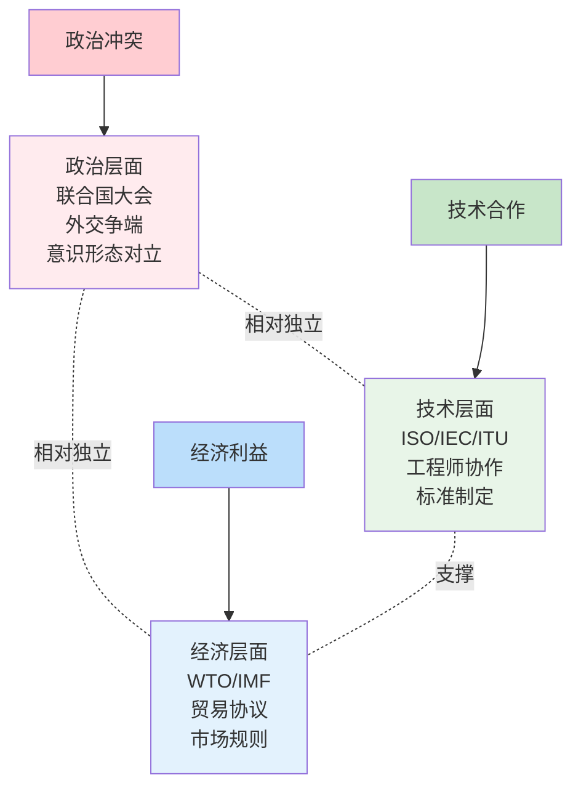

在前一篇文章《[从Gi到联合国]()》中，我们追溯了技术标准化的历史。但这引出了一个更深层的问题：为什么人类能够建立起如此复杂的全球合作体系？答案可能比我们想象的更加反直觉。

<!--more-->

## 现代文明的驱动公式

现代文明可以用一个简单而深刻的公式来概括：

**资本要求更多利润 → 国际贸易要求更多标准 → 联合国要求更多政治家坐下来谈判**

这不是理想主义的道德进步，而是**利益驱动的制度演化**。让我们拆解这个看似冷酷但却有效的机制。

## 第一环：资本的永动机

### 贪婪是一种制度力量

资本天然具有扩张性。一家公司不满足于本地市场，必然要寻求更大的市场、更高的效率、更多的利润。这种看似"贪婪"的动机，实际上成为了推动全球化的原动力。

让我们看一个具体例子：

**苹果的全球供应链**：
- 设计在美国加利福尼亚
- 芯片制造在中国台湾省
- 组装在中国内地
- 稀土材料来自非洲
- 销售遍及全球193个国家

这不是出于国际主义情怀，而是为了**成本最优化**和**利润最大化**。但客观结果是什么？全球数百万人参与了同一个生产网络。

### 竞争推动创新

更有趣的是，激烈的竞争反而推动了合作。当苹果和三星在专利法庭上激烈交锋时，它们同时也在：
- 共同制定5G标准
- 使用相同的USB-C接口
- 遵循相同的安全认证标准

为什么？因为**重新发明轮子的成本太高了**。

## 第二环：标准化的铁律

### 交易成本的经济学

诺贝尔经济学奖获得者罗纳德·科斯提出了"交易成本"理论。在国际贸易中，如果每个国家都有自己的标准，交易成本会高到让贸易变得不可能。

想象一下这样的世界：
- 每个国家都有自己的度量衡标准
- 每家公司都有专属的数据格式
- 每种设备都使用不同的接口

这样的世界里，一台简单的打印机可能需要配备50种不同的驱动程序。

### 网络效应的威力

标准化具有强大的**网络效应**：使用同一标准的人越多，这个标准就越有价值。

这创造了一种**自我强化的循环**：标准越统一，合作的收益就越大；合作的收益越大，就有更多人愿意遵循标准。

### 被迫的合作

关键在于，这种标准化往往是**被迫的**，而不是自愿的：

- **欧盟强制手机使用USB-C充电口**：不是因为苹果突然变得慷慨，而是法律要求
- **国际航空标准**：如果你的飞机不符合国际标准，就不能进入其他国家的领空
- **互联网协议**：如果你不使用TCP/IP，就无法接入全球互联网

## 第三环：政治协调的必要恶

### 冲突管理的制度化

当经济利益产生冲突时，需要政治机制来协调。联合国体系本质上是一个**冲突管理的制度化平台**。

政治家们在联合国里的谈判，看起来是在讨论理想和原则，实际上是在为各自的经济利益集团争取更好的条件。但这种"文明的争吵"比战争要好得多。

### 分层治理的智慧

现代国际体系最巧妙的设计是**分层治理**：

这种设计让技术合作能够超越政治分歧。即使两国在政治上敌对，它们的工程师仍然可以在技术委员会里合作制定标准。

## 现代文明的反直觉真相

### 自私导向合作

现代文明最大的成就不是让人类变得更善良，而是建立了一套制度，让**自私的行为产生合作的结果**。

这就像亚当·斯密的"看不见的手"：屠夫、酿酒师和面包师为我们提供晚餐，不是出于慈善，而是出于对自身利益的考虑。

### 制度比道德更可靠

依靠道德来维持合作是不可靠的，因为道德标准因人而异、因时而变。但制度是可以设计的，可以让即使道德水平一般的人也能产生合作行为。

**联合国的投票机制**就是一个典型例子：
- 不是因为各国领导人突然变得理性了
- 而是因为投票比战争的成本更低
- 即使投票结果不满意，也比承受战争后果要好

### 副产品式的进步

人类很多最重要的成就都是"副产品"：

- **互联网**：最初是军事项目，现在成了全人类的信息基础设施
- **GPS系统**：军事导航技术，现在让我们能叫到外卖
- **疫苗国际合作**：各国为了保护自己的经济，客观上建立了全球疾病防控网络

这些都不是为了"造福人类"而设计的，但客观上确实让世界变得更好了。

## 这台文明机器如何运转

### 燃料：竞争与贪婪

这台文明机器的燃料是人性中最原始的动机：贪婪、竞争、自保。这些看似负面的动机，在制度的引导下，变成了推动进步的动力。

### 齿轮：标准与协议

各种技术标准、法律协议、国际条约就像齿轮一样，把原始的竞争冲动转化为有序的合作行为。

### 刹车系统：政治谈判

当竞争过于激烈可能导致灾难性后果时，政治谈判和法律框架起到刹车作用，防止系统失控。

### 产出：技术进步与相对和平

这台机器的产出是技术进步、经济发展，以及相对的和平（相比于人类历史上的其他时期）。

## 对个人的启示

理解这个机制对我们个人有什么意义？

### 1. 超越道德判断

不要简单地把商业竞争视为"恶"，把国际合作视为"善"。两者都是这个复杂系统的组成部分。

### 2. 关注制度设计

比起批评人性的贪婪，更重要的是思考如何设计更好的制度，让自私的行为产生更好的集体结果。

### 3. 理解合作的逻辑

真正持久的合作不是基于道德说教，而是基于共同利益。理解这一点，能让我们在工作和生活中建立更有效的合作关系。

## 未来的挑战

这套机制并不完美，面临着新的挑战：

- **数字主权之争**：各国开始建立自己的互联网标准
- **AI伦理分歧**：不同文化对AI的价值观存在根本差异
- **气候变化**：需要前所未有的全球协调
- **太空资源**：新的竞争领域，旧的合作机制可能不适用

但理解了现代文明的基本运作机制，我们就能更好地应对这些挑战：不是通过道德说教，而是通过聪明的制度设计。

## 结语

现代文明是一个**用制度化合作来驯服原始竞争本能**的体系。它不完美，经常出故障，但它确实在运转，而且比人类历史上任何其他系统都要高效。

当你下次看到国际新闻中的冲突和争议时，不妨换个角度思考：这可能不是文明的倒退，而是这台复杂机器的正常运作过程。重要的是，即使在争吵和竞争中，那些让我们能够进行全球协作的基础设施——从技术标准到制度框架——依然在默默运转。

这或许不是最理想的文明形态，但考虑到人性的现实，这已经是一个相当了不起的成就了。毕竟，让几百万年来习惯了部落争斗的人类学会在联合国里用投票而不是用石头解决争端，这本身就是一个奇迹。

---

*这篇文章是对《从Gi到联合国：一段被遗忘的国际化历史》的深度思考。如果说上一篇文章告诉我们国际合作是如何形成的，这篇文章则试图解释它为什么能够持续运转。*
