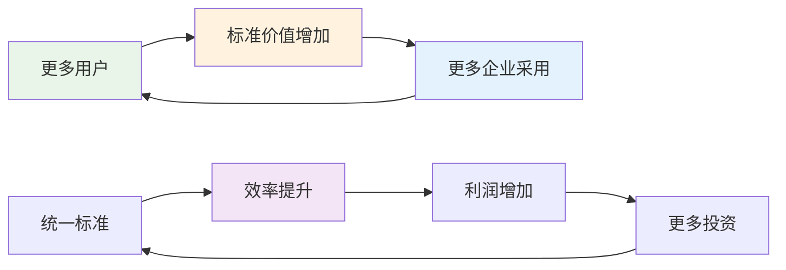
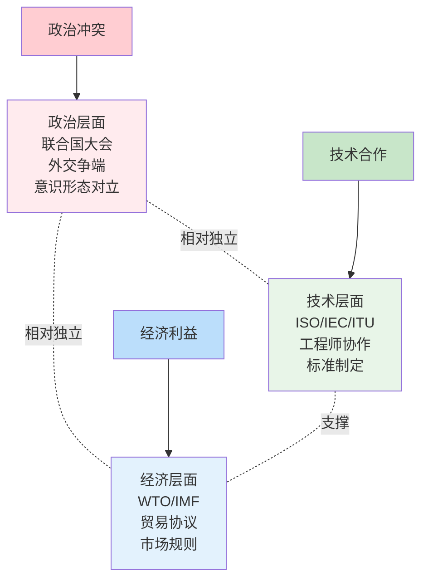

В предыдущей заметке "[От Джи до ООН]()" мы проследили историю технической стандартизации. Но это приводит к более глубокому вопросу: как человечество смогло построить такую сложную систему глобального сотрудничества? Ответ может быть более контринтуитивным, чем мы думаем.

<!--more-->

## 现代文明的驱动公式

Современную цивилизацию можно выразить простой, но глубокой формулой:

**Капитал требует больше прибыли → Международная торговля требует больше стандартов → ООН требует больше политиков, чтобы сесть и договориться **.

Это не идеалистический моральный прогресс, а **институциональная эволюция, обусловленная интересами**. Давайте демонтируем этот, казалось бы, холодный, но эффективный механизм.

## 第一环：资本的永动机

### 贪婪是一种制度力量

Капитал - это естественная экспансия. Компания, не удовлетворенная своим местным рынком, неизбежно будет стремиться к расширению рынка, повышению эффективности и увеличению прибыли. Этот кажущийся "жадным" мотив на самом деле является движущей силой глобализации.

Давайте рассмотрим конкретный пример:

**Глобальная цепочка поставок компании Apple**:
- Разработка в Калифорнии, США
- Производство микросхем в китайской провинции Тайвань
- Сборка в континентальном Китае
- Редкоземельные материалы из Африки
- Продается в 193 странах мира.

Это происходит не из интернационалистских чувств, а из соображений **оптимизации затрат** и **максимизации прибыли**. Но каков объективный результат? Миллионы людей по всему миру участвуют в одной и той же производственной сети.

### 竞争推动创新

Что еще более интересно, так это то, что жесткая конкуренция подталкивает к сотрудничеству. Пока Apple и Samsung ожесточенно сражаются в патентном суде, они в то же время:
- совместно работают над стандартами 5G
- Используют одинаковые порты USB-C
- следуют одним и тем же стандартам сертификации безопасности

Почему? Потому что **изобретение колеса обходится слишком дорого**.

## 第二环：标准化的铁律

### 交易成本的经济学

Рональд Коуз, экономист, удостоенный Нобелевской премии, выдвинул теорию "транзакционных издержек". В международной торговле, если бы каждая страна имела свои собственные стандарты, транзакционные издержки были бы настолько высоки, что сделали бы торговлю невозможной.

Представьте себе такой мир:
- В каждой стране есть свой стандарт мер и весов.
- У каждой компании свой формат данных.
- Каждое устройство использует свой интерфейс.

Для простого принтера в таком мире может потребоваться 50 различных драйверов.

### 网络效应的威力

Стандартизация обладает мощным **сетевым эффектом**: чем больше людей используют один и тот же стандарт, тем более ценным он становится.

Это создает **самоусиливающийся цикл**: чем более единообразны стандарты, тем больше выгод от сотрудничества; чем больше выгод от сотрудничества, тем больше людей готовы следовать стандартам.

### 被迫的合作

Дело в том, что эта стандартизация часто является **принудительной**, а не добровольной:

- **ЕС обязывает использовать порты USB-C для зарядки мобильных телефонов**: это не потому, что Apple внезапно стала щедрой, это требуется по закону
- **Международные авиационные стандарты**: если ваш самолет не соответствует международным стандартам, вы не сможете войти в воздушное пространство других стран
- **Интернет-протокол**: если вы не используете TCP/IP, вы не сможете получить доступ к глобальной сети Интернет

## 第三环：政治协调的必要恶

### 冲突管理的制度化

Когда экономические интересы вступают в конфликт, необходимы политические механизмы для их координации. Система ООН, по сути, является **институционализированной платформой для управления конфликтами**.

Политики, ведущие переговоры в Организации Объединенных Наций, вроде бы обсуждают идеалы и принципы, но на самом деле они борются за лучшие условия для своих экономических интересов. Но эти "цивилизованные препирательства" гораздо лучше, чем война.

### 分层治理的智慧

Самая гениальная конструкция современной международной системы - это **стратифицированное управление**:

Такая конструкция позволяет техническому сотрудничеству преодолевать политические разногласия. Даже если две страны политически враждебны, их инженеры все равно могут работать вместе в технических комитетах по разработке стандартов.

## 现代文明的反直觉真相

### 自私导向合作

Величайшим достижением современной цивилизации стало не то, что люди стали добрее, а создание системы, в которой **эгоистичное поведение приводит к совместным результатам**.

Это как "невидимая рука" Адама Смита: мясник, пивовар и пекарь обеспечивают нас обедом не из милосердия, а из корыстных побуждений.

### 制度比道德更可靠

Полагаться на мораль для поддержания сотрудничества ненадежно, поскольку моральные нормы варьируются от человека к человеку и от времени к времени. Однако можно разработать институты, позволяющие даже людям со средними моральными качествами демонстрировать кооперативное поведение.

**Механизм голосования в Организации Объединенных Наций** - яркий тому пример:
- Не потому, что лидеры вдруг стали рациональными.
- Не потому, что лидеры вдруг стали рациональными, а потому, что голосование обходится дешевле, чем война.
- Даже если результат будет неудовлетворительным, это лучше, чем страдать от последствий войны.

### 副产品式的进步

Многие из важнейших достижений человечества - это "побочные продукты":

- **Интернет**: то, что начиналось как военный проект, теперь является информационной инфраструктурой для всего человечества
- **GPS-система**: военная навигационная технология, которая теперь позволяет нам заказывать еду на вынос
- **Международное сотрудничество в области вакцин**: страны объективно создают глобальные сети профилактики и контроля заболеваний, чтобы защитить свою экономику

Все это не направлено на "благо человечества", но объективно делает мир лучше.

## 这台文明机器如何运转

### 燃料：竞争与贪婪

Эта цивилизационная машина питается самыми примитивными мотивами человеческой природы: жадностью, конкуренцией, самосохранением. Эти, казалось бы, негативные мотивы, направляемые системой, становятся движущей силой прогресса.

### 齿轮：标准与协议

Различные технические стандарты, юридические соглашения и международные договоры действуют как шестеренки, преобразуя примитивные конкурентные импульсы в упорядоченное совместное поведение.

### 刹车系统：政治谈判

Политические переговоры и правовые рамки служат тормозом, не позволяющим системе выйти из-под контроля, когда конкуренция становится слишком интенсивной и может привести к катастрофическим последствиям.

### 产出：技术进步与相对和平

Результатом работы этой машины стали технический прогресс, экономическое развитие и относительный мир (по сравнению с другими периодами человеческой истории).

## 对个人的启示

Что означает понимание этого механизма для нас как личностей?

### 1. 超越道德判断

Конкуренция в бизнесе не должна рассматриваться просто как "зло", а международное сотрудничество - как "добро". И то, и другое - часть сложной системы.

### 2. 关注制度设计

Вместо того чтобы критиковать человеческую жадность, важнее подумать о том, как создать более совершенные системы, позволяющие эгоистичному поведению приводить к лучшим коллективным результатам.

### 3. 理解合作的逻辑

Настоящее и прочное сотрудничество основано не на моральных поучениях, а на общих интересах. Понимание этого позволяет нам строить более эффективные отношения сотрудничества на работе и в жизни.

## 未来的挑战

Этот механизм не совершенен и сталкивается с новыми проблемами:

- **Битва за цифровой суверенитет**: страны начинают создавать свои собственные интернет-стандарты
- **Этические разногласия по поводу ИИ**: фундаментальные различия в ценностях, которые различные культуры придают ИИ
- **Изменение климата**: необходима беспрецедентная глобальная координация
- **Космические ресурсы**: новое игровое поле, где старые механизмы сотрудничества могут оказаться неприменимыми

Но, понимая основные принципы работы современной цивилизации, мы сможем лучше справиться с этими вызовами: не с помощью моральных проповедей, а с помощью разумного институционального дизайна.

## 结语

Современная цивилизация - это система, которая **укрощает примитивные инстинкты соперничества** с помощью институционализированного сотрудничества. Она не идеальна и часто ломается, но она работает, причем более эффективно, чем любая другая система в истории человечества.

Когда в следующий раз вы увидите в международных новостях конфликты и споры, подумайте об этом по-другому: возможно, это не шаг назад для цивилизации, а нормальный ход функционирования этой сложной машины. Важно отметить, что даже в разгар склок и соперничества инфраструктуры, позволяющие нам сотрудничать на глобальном уровне - от технологических стандартов до институциональных рамок, - продолжают бесшумно работать.

Возможно, это не самая идеальная форма цивилизации, но, учитывая реалии человеческой природы, это весьма выдающееся достижение. В конце концов, заставить людей, миллионы лет привыкших к племенным войнам, научиться решать свои споры в Организации Объединенных Наций путем голосования, а не побивания камнями, - это само по себе чудо.

---

* Эта статья представляет собой глубокое размышление на тему "От Джи до ООН: забытая история интернационализации". Если предыдущая статья рассказывала о том, как возникло международное сотрудничество, то в этой статье мы попытаемся объяснить, почему оно продолжает функционировать. *