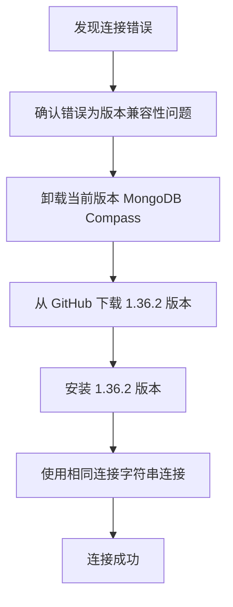

你是否曾经在使用 MongoDB Compass 连接 Azure Cosmos DB 时遇到过令人费解的版本兼容性问题？明明按照教程一步步操作，却始终无法连接成功？本文将为你揭示背后的原因，并提供一个简单有效的解决方案。

<!--more-->

## 问题现象

小张是一家电商公司的数据分析师，他需要查看公司部署在 Azure Cosmos DB 上的 MongoDB 数据库。按照公司文档的指引，他安装了最新版的 MongoDB Compass，填入了连接字符串，却收到了如下错误：

```
MongoServerSelectionError: Server at enterprise-data-warehouse.mongo.cosmos.azure.com:10255 reports maximum wire version 6, but this version of the Node.js Driver requires at least 7 (MongoDB 4.0)
```

这个错误让小张一头雾水。明明连接字符串是正确的，为什么会提示版本不兼容呢？

## 问题分析

这个错误信息实际上已经告诉我们问题所在：

1. Azure Cosmos DB 的 MongoDB API 版本对应的是 wire version 6（对应 MongoDB 3.6）
2. 最新版的 MongoDB Compass 内部使用了较新的 Node.js 驱动程序（6.10.0 或更高版本），这个驱动要求至少 wire version 7（对应 MongoDB 4.0）

简单来说，就是**新版 MongoDB Compass 不再支持连接到旧版的 MongoDB 服务器**。

这一变化是在 MongoDB Node.js 驱动程序 6.10.0 版本引入的，正如 MongoDB 官方论坛上所述：

> "As of Node.js Driver 6.10.0 the minimum version of MongoDB required is 4.0."

## 解决方案

对于这个问题，有两种解决方案：

### 方案一：降级 MongoDB Compass（推荐）

最简单的解决方案是安装较旧版本的 MongoDB Compass，具体步骤如下：

1. 卸载当前版本的 MongoDB Compass
2. 访问 MongoDB Compass 的 [GitHub 发布页面](https://github.com/mongodb-js/compass/releases)
3. 下载 1.36.2 版本的安装包（这是经过验证可以连接到 MongoDB 3.6 的最新版本）
4. 安装下载的 MongoDB Compass 1.36.2 版本
5. 使用相同的连接字符串重新尝试连接



### 方案二：升级 Azure Cosmos DB 的 MongoDB API 版本

如果你有权限修改 Azure Cosmos DB 的配置，也可以考虑将其 MongoDB API 版本升级到 4.0 或更高：

1. 登录 Azure 门户
2. 找到你的 Cosmos DB 账户
3. 在设置中查找并升级 MongoDB API 版本到 4.0 或更高

⚠️ **警告**：升级数据库版本可能会影响现有应用程序的兼容性，建议在生产环境中谨慎操作，最好先在测试环境验证。

## 为什么会出现这个问题？

MongoDB 作为一款流行的数据库，不时会更新其协议和功能。从 MongoDB 4.0 版本开始，引入了一些重要的变化，包括事务支持和认证机制的改进。为了支持这些新特性，驱动程序也需要相应更新。

不幸的是，这导致了新版驱动程序无法兼容旧版服务器的情况。对于云服务如 Azure Cosmos DB，用户通常无法轻易升级其版本，因此降级客户端工具成为了更实用的解决方案。

## 总结

在使用 MongoDB Compass 连接 Azure Cosmos DB 时，如果遇到版本兼容性问题，最简单的解决方案是降级到 MongoDB Compass 1.36.2 版本。这一问题告诉我们，在数据库操作中，版本兼容性同样重要，有时"最新"并不意味着"最适合"。

希望这个解决方案能帮助到遇到类似问题的你。如果你有其他 MongoDB 相关问题，欢迎在评论区留言讨论！
