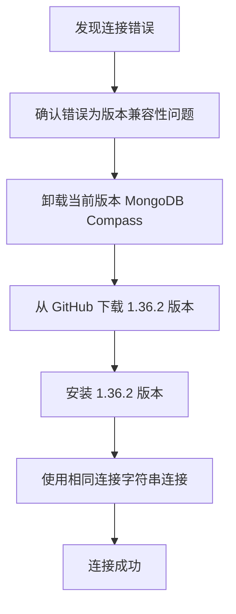

Сталкивались ли вы с проблемами совместимости версий при подключении к Azure Cosmos DB с помощью MongoDB Compass? Очевидно, что вы следовали руководству шаг за шагом, но так и не смогли успешно подключиться? В этой статье мы раскроем причину и предложим вам простое и эффективное решение.

<!--more-->

## 问题现象

Сяо Чжан - аналитик данных в компании, занимающейся электронной коммерцией, и ему необходимо просмотреть базу данных MongoDB компании, развернутую в Azure Cosmos DB. Следуя указаниям в документации компании, он устанавливает последнюю версию MongoDB Compass, заполняет строку подключения и получает следующую ошибку:

```
MongoServerSelectionError: Server at enterprise-data-warehouse.mongo.cosmos.azure.com:10255 reports maximum wire version 6, but this version of the Node.js Driver requires at least 7 (MongoDB 4.0)
```

Эта ошибка поставила Чжана в тупик. Очевидно, что строка подключения правильная, почему же она выдает сообщение о несовместимости версий?

## 问题分析

Это сообщение об ошибке фактически говорит нам о том, в чем проблема:

1. версия API MongoDB для Azure Cosmos DB соответствует версии 6 (что соответствует MongoDB 3.6).
2. последняя версия MongoDB Compass использует внутри себя более новый драйвер Node.js (6.10.0 или более поздней версии), для которого требуется как минимум wire версии 7 (соответствует MongoDB 4.0).

Проще говоря, **новые версии MongoDB Compass больше не поддерживают подключения к старым серверам MongoDB**.

Это изменение было введено в версии 6.10.0 драйвера MongoDB Node.js, как описано на официальных форумах MongoDB:

> "Начиная с версии Node.js Driver 6.10.0 минимальная версия MongoDB, необходимая для работы, составляет 4.0".

## 解决方案

У этой проблемы есть два решения:

### 方案一：降级 MongoDB Compass（推荐）

Самое простое решение - установить более старую версию MongoDB Compass, как описано ниже:

1. Удалите текущую версию MongoDB Compass.
2. Посетите страницу выпуска MongoDB Compass [GitHub release page](https://github.com/mongodb-js/compass/releases).
3. Загрузите версию 1.36.2 программы установки (это последняя версия, проверенная для подключения к MongoDB 3.6).
4. Установите загруженную версию 1.36.2 MongoDB Compass.
5. Повторите подключение, используя ту же строку подключения



### 方案二：升级 Azure Cosmos DB 的 MongoDB API 版本

Если у вас есть доступ к изменению конфигурации Azure Cosmos DB, вы также можете рассмотреть возможность обновления версии API MongoDB до 4.0 или выше:

1. Войдите в портал Azure
2. Найдите свою учетную запись Cosmos DB
3. Найдите и обновите версию API MongoDB до 4.0 или выше в разделе "Настройки".

⚠️ **ПРЕДУПРЕЖДЕНИЕ**: Обновление версии базы данных может повлиять на совместимость существующих приложений, поэтому рекомендуется соблюдать осторожность в производственных средах, и лучше всего сначала проверить это в тестовой среде.

## 为什么会出现这个问题？

MongoDB, популярная база данных, время от времени обновляет свои протоколы и функции. Начиная с версии MongoDB 4.0, были внесены некоторые важные изменения, включая улучшения в поддержке транзакций и механизмах аутентификации. Для поддержки этих новых возможностей необходимо соответствующим образом обновить драйвер.

К сожалению, это приводит к тому, что новые версии драйверов оказываются несовместимыми со старыми версиями серверов. Для облачных сервисов, таких как Azure Cosmos DB, пользователи часто не могут легко обновить свою версию, поэтому понижение версии клиентского инструмента является более практичным решением.

## 总结

При использовании MongoDB Compass для подключения к Azure Cosmos DB, если вы столкнулись с проблемами совместимости версий, самым простым решением будет понижение до версии MongoDB Compass 1.36.2. Эта проблема показывает нам, что совместимость версий одинаково важна при работе с базами данных, и что иногда "новейший" не означает "лучший".

Надеюсь, это решение поможет вам, если вы столкнетесь с подобными проблемами. Если у вас есть другие проблемы, связанные с MongoDB, пожалуйста, оставьте сообщение в разделе комментариев для обсуждения!