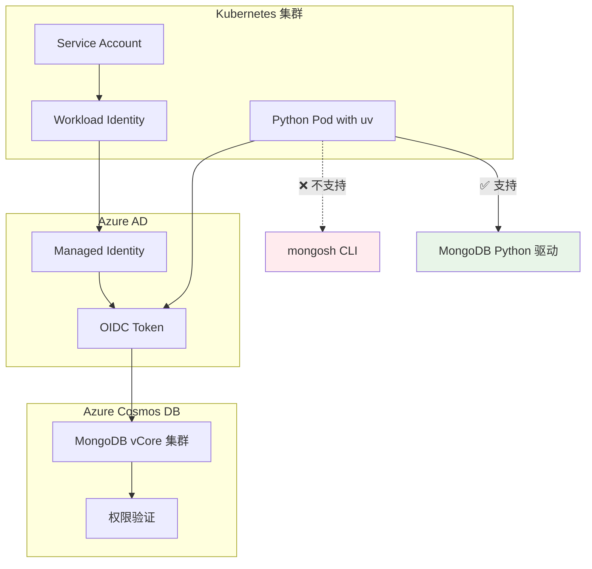

在现代云原生架构中，无密码认证（Passwordless Authentication）已成为安全最佳实践。然而，当我们尝试在 Kubernetes 集群中使用 OIDC 认证连接 Azure Cosmos DB MongoDB vCore 时，却遭遇了一个看似简单却让人抓狂的问题。

<!--more-->

## 问题的开始：一个"不起眼"的错误

故事开始于一个常见的场景：一个运维工程师需要在 Kubernetes 集群中部署一个测试 Pod，用来验证对 Azure Cosmos DB MongoDB 的访问权限。按照 Microsoft 官方文档的指导，他配置了工作负载身份（Workload Identity），启用了 OIDC 认证，一切看起来都很完美。

```bash
kubectl exec -it test-pod -- mongosh "mongodb+srv://cluster.mongocluster.cosmos.azure.com/?tls=true&authMechanism=MONGODB-OIDC"
```

然而，返回的错误信息让人措手不及：

```
MongoInvalidArgumentError: Host 'cluster.mongocluster.cosmos.azure.com:10260' is not valid for OIDC authentication with ALLOWED_HOSTS of '*.mongodb.net,*.mongodb-dev.net,*.mongodbgov.net,localhost,127.0.0.1,::1'
```

这个错误信息很清晰地说明了问题：MongoDB Shell（mongosh）内置的 OIDC 认证机制有一个硬编码的主机白名单，而 Azure Cosmos DB 的主机名并不在这个列表中。

## 深入调研：发现的真相

经过深入调研，我们发现了一个容易被忽略的关键信息：**Microsoft 官方文档中明确声明，MongoDB vCore 的 Microsoft Entra ID 认证"不支持 Mongo shell (mongosh) 和 MongoDB Compass"**。

这意味着：
- ❌ 传统的 mongosh 命令行工具无法使用 OIDC 连接 Azure Cosmos DB
- ❌ MongoDB Compass 图形界面工具同样不支持
- ✅ 只有官方 MongoDB 驱动程序（如 Python PyMongo、Node.js MongoDB Driver）支持

## 解决方案架构

既然 mongosh 不可行，我们需要设计一个新的方案。经过分析，我们选择了基于 Python 的解决方案：



## 技术实现详解

### 1. 容器环境准备

我们选择使用 `uv`（新一代 Python 包管理工具）来构建我们的测试环境，它比传统的 pip 更快更可靠：

```yaml
apiVersion: v1
kind: Pod
metadata:
  name: mongodb-client
  labels:  
    azure.workload.identity/use: "true"
spec:
  serviceAccountName: "workload-identity-sa"
  containers:
  - name: python-client
    image: ghcr.io/astral-sh/uv:python3.11-alpine
    env:
    - name: CLUSTER_NAME
      value: "your-cluster-name"
    - name: UV_CACHE_DIR
      value: "/workspace/.uv-cache"
    - name: HOME
      value: "/workspace"
```

### 2. Python 项目配置

使用现代化的 `pyproject.toml` 来管理依赖：

```toml
[project]
name = "mongodb-oidc-client"
version = "0.1.0"
dependencies = [
    "azure-identity>=1.15.0",
    "pymongo>=4.6.0",
]
requires-python = ">=3.11"
```

### 3. OIDC 认证核心代码

最关键的部分是实现 OIDC 回调机制：

```python
from azure.identity import DefaultAzureCredential
from pymongo.auth_oidc import OIDCCallback, OIDCCallbackContext, OIDCCallbackResult

class AzureIdentityTokenCallback(OIDCCallback):
    def __init__(self, credential):
        self.credential = credential

    def fetch(self, context: OIDCCallbackContext) -> OIDCCallbackResult:
        token_response = self.credential.get_token(
            'https://ossrdbms-aad.database.windows.net/.default'
        )
        return OIDCCallbackResult(
            access_token=token_response.token,
            expires_in_seconds=int(token_response.expires_on - time.time())
        )
```

### 4. MongoDB 客户端配置

连接配置中最重要的是设置 `ALLOWED_HOSTS`：

```python
client = MongoClient(
    f"mongodb+srv://{cluster_name}.global.mongocluster.cosmos.azure.com/",
    connectTimeoutMS=120000,
    tls=True,
    retryWrites=False,
    maxIdleTimeMS=120000,
    authMechanism="MONGODB-OIDC",
    authMechanismProperties={
        "OIDC_CALLBACK": AzureIdentityTokenCallback(credential),
        "ALLOWED_HOSTS": ["*.azure.com"]  # 关键：允许 Azure 主机
    }
)
```

## 权限验证方案

为了系统性地验证数据库访问权限，我们设计了一个六级验证体系：

### 验证层级

1. **连接测试**：基础连接能力
2. **数据库列表**：查看所有数据库（需要管理员权限）
3. **数据库访问**：访问特定数据库和集合
4. **读取权限**：查询文档、计数、获取元数据
5. **写入权限**：增删改操作（使用隔离的测试数据）
6. **管理员权限**：服务器状态和管理操作

### 权限级别判断

根据验证结果，系统会自动判断当前身份的权限级别：

| 权限级别 | 能力描述 | 适用场景 |
|----------|----------|----------|
| 🔥 **完全管理员** | 所有操作 + 服务器管理 | 数据库管理员 |
| 📝 **读写权限** | 数据的增删改查 | 应用服务 |
| 👀 **只读权限** | 仅查询数据 | 分析、报表 |
| 📋 **列表权限** | 只能查看结构 | 监控、发现 |
| 🔌 **仅连接** | 基础连接 | 连接测试 |
| ❌ **无权限** | 无法连接 | 配置错误 |

### 安全的写入测试

为了验证写入权限而又不影响生产数据，我们设计了一个安全的测试流程：

1. 创建独立的测试数据库 `permission_test_db`
2. 插入一个测试文档
3. 读取验证
4. 更新测试
5. 删除测试
6. 完全清理测试数据

整个过程不会接触任何现有数据，确保生产环境的安全。

## 实际部署和使用

### 部署步骤

```bash
# 1. 部署测试 Pod
kubectl apply -f mongodb-client.yaml

# 2. 进入 Pod 并安装依赖
kubectl exec -it mongodb-client -- sh
uv sync

# 3. 运行权限验证
uv run verify-permissions.py
```

### 验证输出示例

```
🚀 启动 MongoDB OIDC 客户端...
🔗 连接到集群: my-cluster
✅ 连接成功!

🔍 权限验证测试
====================================================
✅ PASS 数据库连接
✅ PASS 列出数据库 - 找到 3 个数据库
✅ PASS 数据库访问 - 集合: 5, 对象: 1,250
✅ PASS 读取权限 - 检索 5 个文档
✅ PASS 写入权限 - 完成增删改操作
✅ PASS 管理员权限 - 服务器版本: 4.4.0

🎯 整体权限级别: 🔥 完全管理员
```

## 技术难点和解决思路

### 难点1：uv 缓存权限问题

在受限的容器环境中，uv 默认会尝试在用户主目录创建缓存，可能遇到权限问题。

**解决方案**：设置自定义缓存目录
```bash
export UV_CACHE_DIR=/workspace/.uv-cache
export UV_PYTHON_INSTALL_DIR=/workspace/.uv-python
```

### 难点2：OIDC Token 生命周期管理

Azure AD Token 有过期时间，需要在回调中正确处理。

**解决方案**：动态计算过期时间
```python
expires_in_seconds=int(token_response.expires_on - time.time())
```

### 难点3：MongoDB API 适配

Cosmos DB 对 MongoDB API 的支持有一些细微差别。

**解决方案**：使用兼容性更好的 API 调用
```python
# ✅ 正确方式
databases = client.list_database_names()

# ❌ 可能出错
admin_db = client.get_database('admin')
databases = admin_db.list_database_names()  # 在 Cosmos DB 中可能失败
```

## 方案的价值和意义

### 技术价值

1. **安全性提升**：完全消除了密码管理的需求
2. **符合最佳实践**：使用 Azure 原生身份认证
3. **系统性验证**：提供了完整的权限验证方法论
4. **工具现代化**：使用 uv 等现代 Python 工具链

### 运维价值

1. **自动化友好**：脚本化的验证过程易于集成到 CI/CD
2. **问题排查**：清晰的权限级别判断有助于快速定位问题
3. **标准化流程**：可复制的验证方法适用于多个环境

### 业务价值

1. **降低运维成本**：减少密码轮换和管理开销
2. **提高安全合规**：符合零信任安全架构要求
3. **加速部署**：标准化的验证流程减少试错时间

## 扩展思考

这个解决方案虽然解决了 MongoDB OIDC 认证的具体问题，但它揭示了一个更广泛的趋势：**随着云原生技术的发展，传统的命令行工具在某些场景下正在被更灵活的编程接口所取代**。

类似的情况可能出现在：
- 其他云数据库服务的认证机制
- 容器化环境中的工具兼容性
- 微服务架构中的服务间认证

**开放性思考**：在你的工作环境中，是否也遇到过传统工具无法适应新架构的情况？你是如何解决这种工具链演进带来的挑战的？

---

*本文基于真实的技术实践总结而成，相关代码和配置已在生产环境验证。如果你在实施过程中遇到问题，欢迎交流讨论。*
