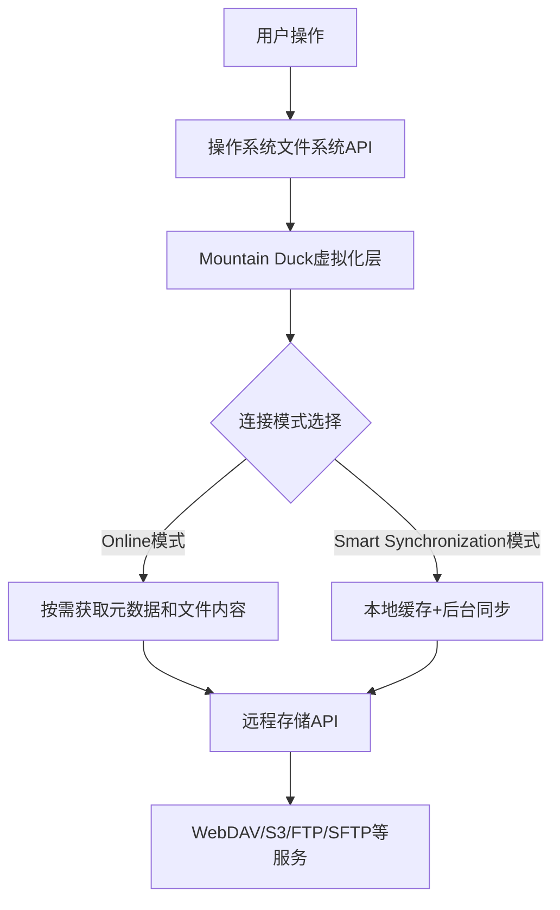
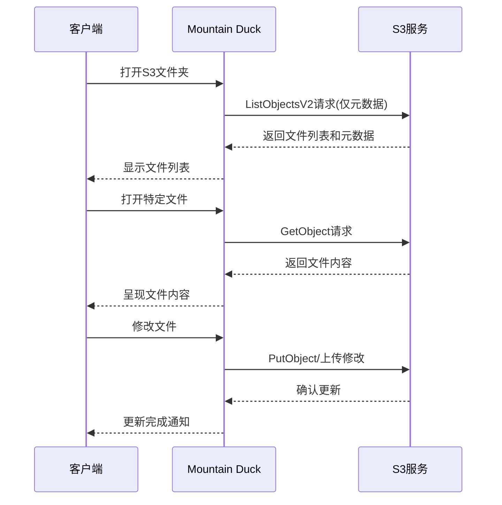

在云服务大行其道的今天，我们的数据往往分散在多个云存储平台上。每个平台都有自己的客户端，各自为政，占用大量系统资源。而Mountain Duck作为一款轻量级云存储挂载工具，通过巧妙的连接模式设计，提供了一种更高效的云存储访问方式。

<!--more-->

## 云存储访问的技术挑战

当今的工作环境中，我们经常需要同时访问多种云存储服务：企业数据可能存储在对象存储(如S3)中，协作文档位于WebDAV服务器上，设计资源则分散在各种云盘中。传统的云存储客户端解决方案主要有三种模式：

1. **完全同步模式**：将云端所有文件同步到本地，如Dropbox的默认行为
2. **选择性同步模式**：选择特定文件夹同步，忽略其他内容
3. **流式访问模式**：实时流式访问云端内容，不在本地保存

每种模式都有其优缺点。完全同步提供最佳的离线体验但占用大量磁盘空间；选择性同步需要预先规划；流式访问则对网络依赖性强。这些模式往往不能完美平衡资源占用与使用便捷性。

## Mountain Duck的技术架构

Mountain Duck采用了一种独特的方法来解决这一问题，它通过文件系统虚拟化技术，将远程存储作为本地磁盘挂载到操作系统中。

从技术架构上看，Mountain Duck的创新之处在于将两种存储访问模式——按需访问与智能同步——整合在一个统一的文件系统接口下。

### 核心连接模式解析

#### 1. Online模式的实现原理

Online模式（按需下载）的工作流程：

1. **元数据预取**：连接时只获取目录结构和文件元数据（名称、大小、修改日期等）
2. **延迟加载**：文件内容仅在用户实际打开文件时才从服务器获取
3. **临时缓存**：打开的文件会暂时缓存在本地，但在连接断开后被清除
4. **即时同步**：文件修改后立即上传到远程服务器

Online模式采用类似"懒加载"的理念，最小化资源占用。在技术实现上，它通过拦截文件系统的读取调用，实时从远程服务器获取数据，实现了虚拟化的按需访问。

#### 2. Smart Synchronization模式的实现原理

Smart Synchronization模式提供更平衡的解决方案：

1. **选择性缓存**：自动缓存用户访问过的文件，为后续访问加速
2. **后台同步**：文件修改会先保存到本地缓存，然后在后台上传
3. **冲突处理**：处理同一文件在多个地方被修改的情况
4. **离线访问**：允许离线编辑缓存的文件，连接恢复后自动同步

此模式使用了复杂的缓存管理算法，包括最近最少使用(LRU)策略和文件访问频率分析，以优化本地缓存的使用效率。

## 网络协议与连接优化

Mountain Duck支持多种网络协议，每种协议都有其特定的实现和优化方法：

### WebDAV协议实现

WebDAV(Web Distributed Authoring and Versioning)是HTTP协议的扩展，支持协作式文件管理。Mountain Duck在实现WebDAV连接时优化了以下方面：

1. **连接池管理**：维护持久连接以减少握手开销
2. **并发请求限制**：防止服务器过载
3. **锁定机制支持**：确保协作编辑时的文件完整性
4. **证书验证**：支持TLS和相互TLS(mTLS)验证

### S3协议实现

对于Amazon S3及兼容S3的存储服务，Mountain Duck进行了专门优化：

1. **分块上传支持**：大文件传输采用Multi-part Upload API
2. **存储类别管理**：支持设置不同的存储类别(Standard, IA, Glacier等)
3. **区域端点优化**：自动使用最近的区域端点
4. **签名版本兼容**：支持不同版本的签名算法（V2和V4）

### 网络连接状态管理

Mountain Duck实现了智能的网络连接状态管理：

1. **自动重连**：网络中断后自动尝试重新建立连接
2. **状态检测**：定期检查连接健康状态
3. **带宽调节**：根据网络质量调整传输并发度
4. **错误恢复**：实现指数退避算法处理连接失败

## 文件系统集成与兼容性

Mountain Duck通过文件系统虚拟化技术与操作系统集成：

### macOS实现

在macOS上，Mountain Duck使用macFUSE实现文件系统虚拟化，并通过Finder扩展提供文件状态叠加图标。它利用macOS的NSWorkspace API实现系统通知和无缝集成。

### Windows实现

Windows版本使用Dokany文件系统驱动进行虚拟化，并通过Shell扩展提供文件状态标识。它还利用Windows的网络驱动器API为挂载点分配驱动器盘符。

### 文件状态追踪机制

Mountain Duck通过元数据跟踪来识别和显示文件状态：

1. **状态类型**：
   - Online Only：文件仅在服务器上存在
   - Up to Date：文件已缓存且同步
   - In Sync：文件被标记为始终同步
   - Sync in Progress：正在同步的文件
   - Sync Error：同步失败的文件

2. **状态存储**：状态信息存储在本地数据库中，确保重启后状态一致性

## 性能与资源管理

Mountain Duck在性能和资源管理方面进行了精心优化：

### 内存使用优化

1. **内存映射**：对大型文件使用内存映射技术，避免将整个文件加载到内存
2. **资源限制**：通过可配置的线程池和连接池限制资源使用
3. **垃圾回收**：定期清理不再需要的缓存和临时文件

### 网络性能优化

1. **请求合并**：将多个小请求合并为批量操作以减少往返延迟
2. **压缩传输**：支持gzip内容编码减少传输数据量
3. **增量传输**：只传输文件的更改部分（对支持的协议）

### 本地缓存管理

在Smart Synchronization模式下，缓存管理使用了复杂的算法：

1. **自适应缓存大小**：根据磁盘空间自动调整缓存上限
2. **访问频率分析**：优先缓存频繁访问的文件
3. **预测性缓存**：基于用户行为模式预测可能需要的文件并提前缓存
4. **LRU淘汰策略**：当缓存达到上限时，删除最近最少使用的文件

## 安全性考量

Mountain Duck在多个层面实现了安全保障：

1. **传输安全**：
   - 支持TLS/SSL加密连接
   - 证书验证和证书固定(Certificate Pinning)
   - 支持相互TLS(mTLS)客户端认证

2. **认证方法**：
   - 基本认证和摘要认证
   - OAuth 2.0集成（对支持的服务）
   - 密钥管理集成（使用系统密钥链/凭据管理器）

3. **数据安全**：
   - 本地缓存文件加密
   - 安全的凭据存储
   - 支持服务器端加密选项（如S3的SSE）

## 实际应用场景分析

### 多云环境数据科学工作流

数据科学家经常需要处理分布在不同位置的大型数据集。使用Mountain Duck的Online模式，可以：

1. 同时挂载多个数据源（S3数据湖、企业WebDAV、SFTP服务器）
2. 使用Jupyter Notebook直接读取远程数据，而不必下载整个数据集
3. 只获取实际需要的数据子集进行分析
4. 将结果直接写回到适当的存储位置

这种工作流显著减少了数据准备时间和本地存储需求。

### 媒体制作环境

视频编辑工作室面临大量媒体资产管理挑战。使用Mountain Duck的混合模式：

1. 使用Online模式浏览整个媒体库，快速预览文件
2. 将活跃项目设置为Smart Synchronization模式，确保编辑素材始终可用
3. 直接从云存储流式播放低分辨率代理文件进行预览
4. 只将当前工作的高分辨率源文件缓存到本地

这种方法平衡了存储效率和工作便捷性。

## 与其他解决方案的技术比较

### vs. 原生同步客户端（如Dropbox客户端）

| 特性 | Mountain Duck | 原生同步客户端 |
|------|--------------|--------------|
| 存储占用 | 在Online模式下几乎为零 | 通常需要同步全部或选定文件夹 |
| 多服务支持 | 单一接口支持多种服务 | 每个服务需要单独客户端 |
| 资源消耗 | 轻量级，按需使用资源 | 持续运行同步进程 |
| 离线支持 | Smart模式下支持 | 完全支持（已同步内容） |

### vs. WebDAV/S3文件系统挂载工具

| 特性 | Mountain Duck | 传统挂载工具 |
|------|--------------|------------|
| 连接模式 | 提供在线和同步两种模式 | 通常只提供在线模式 |
| 缓存管理 | 智能缓存和状态管理 | 基础或无缓存 |
| 用户界面 | 集成状态指示和文件管理 | 通常仅提供挂载功能 |
| 协议支持 | 多协议统一界面 | 通常专注于单一协议 |

## 配置最佳实践

### Online模式最佳实践

在Online模式下获得最佳性能的配置建议：

1. **连接设置**：
   - 启用连接池以减少重连开销
   - 根据网络质量调整超时设置
   - 对稳定连接禁用自动断开功能

2. **传输优化**：
   - 对大文件启用分块传输
   - 调整并发请求数量匹配网络带宽

3. **缓存策略**：
   - 保持默认的临时缓存清理设置
   - 为经常访问的文件夹启用元数据缓存

### Smart Synchronization模式最佳实践

为Smart Synchronization模式优化配置：

1. **缓存管理**：
   - 设置适当的缓存大小限制（建议为可用空间的10-20%）
   - 配置自动清理参数（如30天未访问的文件）

2. **同步设置**：
   - Bonjour设置对本地服务的自动发现
   - 根据网络条件调整同步频率
   - 配置冲突解决策略

3. **针对特定协议的优化**：
   - WebDAV：启用锁定支持，防止协作冲突
   - S3：选择适当的存储类别，平衡访问速度和成本

## 未来展望：AI与云存储的融合

随着AI技术的发展，云存储访问工具也在演化。未来的发展方向可能包括：

1. **智能缓存预测**：使用机器学习预测用户可能需要的文件
2. **内容感知访问**：基于文件内容而非仅仅是名称组织和访问文件
3. **自动化工作流集成**：与AI工作流工具集成，实现数据处理自动化
4. **语义搜索**：跨多个云存储实现基于内容的搜索

这些进步将使工具如Mountain Duck从简单的存储访问工具演变为智能数据管理平台。

## 结论

Mountain Duck通过创新的连接模式设计，解决了云存储访问中的核心技术挑战——如何在本地资源占用和访问便捷性之间取得平衡。Online模式特别适合需要浏览大量远程内容而不占用本地存储的场景，为存储资源有限的用户提供了理想解决方案。

理解Mountain Duck的工作原理和两种连接模式的区别，可以帮助用户根据自己的具体需求选择最合适的配置，实现高效的多云存储管理。对于开发者和技术专业人士来说，掌握这些知识不仅有助于优化当前工作流程，也为设计未来的存储访问解决方案提供了宝贵参考。

你是否曾思考过，随着云存储和AI技术的进一步融合，我们访问和管理数据的方式会发生怎样的革命性变化？
