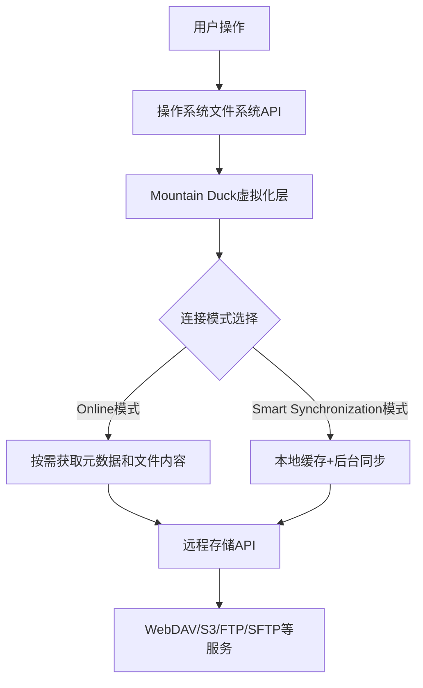
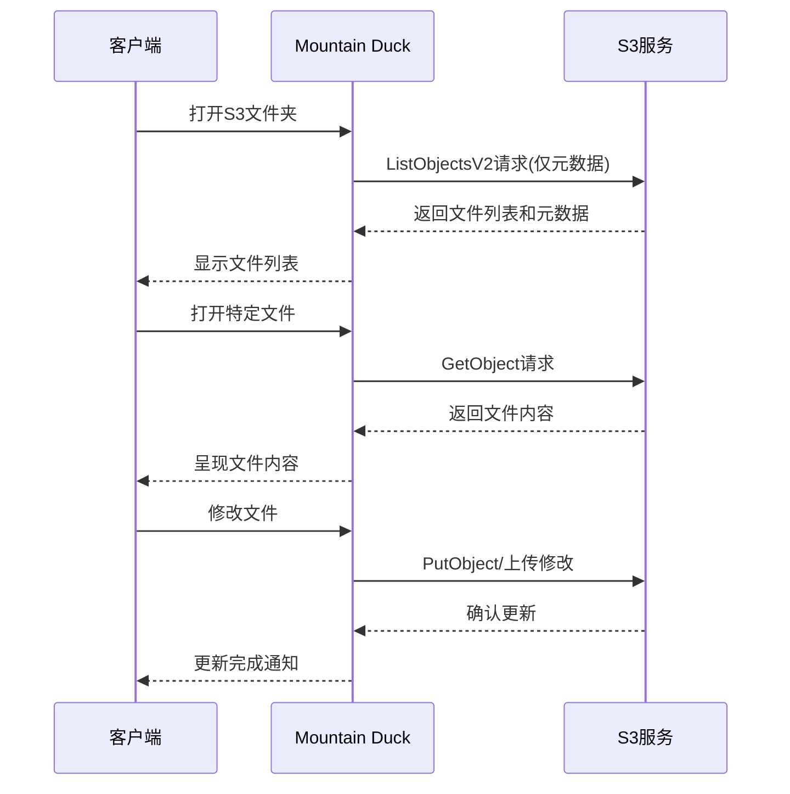

В современном мире облачных сервисов наши данные часто разбросаны по нескольким платформам облачного хранения. У каждой платформы есть свой клиент, который работает отдельно и занимает много системных ресурсов. Mountain Duck, являясь легким инструментом для монтирования облачных хранилищ, обеспечивает более эффективный способ доступа к ним благодаря продуманной схеме подключения.

<!--more-->

## 云存储访问的技术挑战

В современной рабочей среде нам часто требуется одновременный доступ к нескольким облачным сервисам хранения данных: корпоративные данные могут храниться в объектном хранилище (например, S3), документы для совместной работы располагаются на серверах WebDAV, а проектные ресурсы разбросаны по разным облачным дискам. Существует три основных модели традиционных клиентских решений для облачных хранилищ:

1. **Режим полной синхронизации**: синхронизируйте все файлы в облаке локально, как в Dropbox по умолчанию.
2. **Режим выборочной синхронизации**: выбор определенных папок для синхронизации, игнорирование остального содержимого
3. **Режим потокового доступа**: потоковый доступ в реальном времени к содержимому в облаке, не хранящемуся локально

У каждого режима есть свои преимущества и недостатки. Полная синхронизация обеспечивает наилучшие возможности работы в автономном режиме, но занимает много места на диске; выборочная синхронизация требует предварительного планирования; а потоковый доступ сильно зависит от сети. В этих режимах часто не удается найти идеальный баланс между потреблением ресурсов и удобством использования.

## Mountain Duck的技术架构

Mountain Duck использует уникальный подход к решению этой проблемы, используя технологию виртуализации файловой системы для монтирования удаленных хранилищ как локальных дисков в операционной системе.

С точки зрения технической архитектуры инновация Mountain Duck заключается в интеграции двух режимов доступа к хранилищу - доступа по требованию и интеллектуальной синхронизации - в рамках единого интерфейса унифицированной файловой системы.

### 核心连接模式解析

#### 1. Online模式的实现原理

Онлайн-режим (загрузка по требованию) рабочего процесса:

1. **Предварительная выборка метаданных**: при подключении извлекается только структура каталога и метаданные файла (имя, размер, дата модификации и т.д.)
2. **Задержка загрузки**: содержимое файла извлекается с сервера только тогда, когда пользователь действительно открывает файл.
3. **Временный кэш**: открытые файлы временно кэшируются локально, но очищаются при разрыве соединения
4. **Мгновенная синхронизация**: файлы загружаются на удаленный сервер сразу же после их изменения.

Модель Online использует концепцию "ленивой загрузки" для минимизации использования ресурсов. С точки зрения технической реализации, она перехватывает вызовы чтения файловой системы и получает данные с удаленных серверов в режиме реального времени, обеспечивая виртуализированный доступ по требованию.

#### 2. Smart Synchronization模式的实现原理

Режим Smart Synchronisation обеспечивает более сбалансированное решение:

1. **Выборочный кэш**: автоматическое кэширование файлов, посещаемых пользователями, для ускорения последующих посещений.
2. **Фондовая синхронизация**: изменения файлов сначала сохраняются в локальном кэше, а затем загружаются в фоновом режиме.
3. **Обработка конфликтов**: обработка ситуации, когда один и тот же файл изменяется в нескольких местах.
4. **Оффлайн-доступ**: возможность автономного редактирования кэшированных файлов и автоматическая синхронизация при восстановлении соединения.

Этот режим использует сложные алгоритмы управления кэшем, включая политику наименьшего использования (LRU) и анализ частоты доступа к файлам, для оптимизации эффективности использования локального кэша.

## 网络协议与连接优化

Mountain Duck поддерживает широкий спектр сетевых протоколов, каждый из которых имеет свои особенности реализации и методы оптимизации:

### WebDAV协议实现

WebDAV (Web Distributed Authoring and Versioning) - это расширение протокола HTTP, поддерживающее совместное управление файлами. Mountain Duck оптимизировала следующие аспекты при реализации соединения WebDAV:

1. **Управление пулом подключений**: поддерживает постоянные соединения для снижения накладных расходов на рукопожатие
2. **Ограничение количества одновременных запросов**: предотвращает перегрузку сервера
3. **Поддержка механизма блокировки**: обеспечивает целостность файлов во время совместного редактирования
4. **Аутентификация сертификатов**: поддерживает аутентификацию TLS и взаимную аутентификацию TLS (mTLS).

### S3协议实现

Для сервисов хранения данных Amazon S3 и S3-совместимых сервисов Mountain Duck специально оптимизирован:

1. **Поддержка загрузки фрагментов**: API многокомпонентной загрузки для передачи больших файлов.
2. **Управление классами хранения**: поддержка установки различных классов хранения (Standard, IA, Glacier и т. д.).
3. **Оптимизация региональных конечных точек**: автоматическое использование ближайших региональных конечных точек.
4. **Совместимость версий подписи**: поддержка различных версий алгоритмов подписи (V2 и V4).

### 网络连接状态管理

Mountain Duck обеспечивает интеллектуальное управление состоянием сетевых соединений:

1. **Автоматическое переподключение**: автоматически пытается восстановить соединение после обрыва сети.
2. **Проверка состояния**: периодически проверяет состояние соединения.
3. **Регулировка пропускной способности**: регулировка параллельности передачи данных в зависимости от качества сети.
4. **Восстановление после ошибок**: реализует алгоритм экспоненциального отката для обработки сбоев соединения.

## 文件系统集成与兼容性

Mountain Duck интегрируется с операционной системой с помощью технологии виртуализации файловой системы:

### macOS实现

В macOS Mountain Duck использует macFUSE для виртуализации файловой системы и предоставляет значки наложения состояния файлов через расширения Finder. Он использует API NSWorkspace в macOS для системных уведомлений и бесшовной интеграции.

### Windows实现

Версия для Windows использует драйвер файловой системы Dokany для виртуализации и предоставляет идентификаторы состояния файлов с помощью расширений Shell. Она также использует API сетевых дисков Windows для назначения букв дисковых накопителей точкам монтирования.

### 文件状态追踪机制

Mountain Duck идентифицирует и отображает состояние файлов с помощью отслеживания метаданных:

1. **Тип состояния**:
   - Только онлайн: файл существует только на сервере.
   - Актуально: файл кэшируется и синхронизируется
   - В синхронизации: файл отмечен как всегда синхронизированный
   - В процессе синхронизации: файлы, которые находятся в процессе синхронизации
   - Ошибка синхронизации: файлы, которые не удалось синхронизировать

2. **Хранилище состояний**: информация о состоянии хранится в локальной базе данных для обеспечения согласованности состояния после перезагрузки

## 性能与资源管理

Mountain Duck была тщательно оптимизирована с точки зрения производительности и управления ресурсами:

### 内存使用优化

1. **Отображение памяти**: используйте методы отображения памяти для больших файлов, чтобы избежать загрузки всего файла в память.
2. **Ограничение ресурсов**: ограничьте использование ресурсов с помощью настраиваемых пулов потоков и соединений.
3. **Уборка мусора**: периодически очищайте кэш и временные файлы, которые больше не нужны.

### 网络性能优化

1. **Слияние запросов**: объединение нескольких небольших запросов в пакетную операцию для уменьшения задержки при прохождении маршрута.
2. **Сжатая передача**: поддержка кодирования содержимого gzip для уменьшения объема передаваемых данных
3. **Инкрементная передача**: передача только измененной части файла (для поддерживаемых протоколов)

### 本地缓存管理

В режиме Smart Synchronization для управления кэшем используются сложные алгоритмы:

1. **Адаптивный размер кэша**: автоматически настраивает лимит кэша в зависимости от объема дискового пространства
2. **Анализ частоты доступа**: устанавливает приоритет кэширования часто используемых файлов.
3. **Предиктивное кэширование**: предсказывает файлы, которые могут понадобиться, на основе моделей поведения пользователя и кэширует их заранее
4. **Политика удаления LRU**: когда кэш достигает предела, удаляются наименее часто используемые файлы.

## 安全性考量

Mountain Duck обеспечивает безопасность на нескольких уровнях:

1. **Безопасность передачи данных**:
   - Поддержка зашифрованных соединений TLS/SSL.
   - Проверка сертификатов и их закрепление.
   - Поддержка взаимной аутентификации клиентов по протоколу TLS (mTLS)

2. **Методы аккредитации**:
   - Базовая и дайджест-аутентификация
   - Интеграция OAuth 2.0 (для поддерживаемых сервисов)
   - Интеграция управления ключами (с использованием системной цепочки ключей / менеджера мандатов)

3. **Безопасность данных**:
   - Шифрование файлов локального кэша
   - Безопасное хранение учетных данных
   - Поддержка вариантов шифрования на стороне сервера (например, SSE для S3).

## 实际应用场景分析

### 多云环境数据科学工作流

Ученым, изучающим данные, часто приходится работать с большими массивами данных, распределенными по разным местам. Используя модель Mountain Duck's Online, можно:

1. одновременное подключение нескольких источников данных (озеро данных S3, корпоративный WebDAV, SFTP-сервер)
2. использование Jupyter Notebook для прямого чтения удаленных данных, без необходимости загружать весь набор данных
3. получайте только то подмножество данных, которое вам действительно нужно проанализировать
4. записывайте результаты непосредственно в соответствующее хранилище

Этот рабочий процесс значительно сокращает время подготовки данных и требования к локальному хранению.

### 媒体制作环境

Студии видеомонтажа сталкиваются с множеством проблем, связанных с управлением медиаактивами. Используйте гибридный режим Mountain Duck:

1. просматривайте всю медиатеку в режиме Online для быстрого предварительного просмотра файлов.
2. переведите активные проекты в режим интеллектуальной синхронизации, чтобы отредактированные материалы всегда были доступны.
3. потоковая передача прокси-файлов низкого разрешения для предварительного просмотра непосредственно из облачного хранилища
4. локально кэшируйте только исходный файл высокого разрешения для текущей работы

Такой подход позволяет сбалансировать эффективность хранения и удобство работы.

## 与其他解决方案的技术比较

### vs. 原生同步客户端（如Dropbox客户端）

| Особенности | Mountain Duck | Native Sync Client |
|------|--------------|--------------|
| Использование хранилища | Практически нулевое в режиме Online | Обычно требуется синхронизировать все или выбранные папки |
| Поддержка мультисервисов | Один интерфейс поддерживает несколько сервисов | Для каждого сервиса требуется отдельный клиент |
| Потребление ресурсов | Легкое использование ресурсов по требованию | Непрерывно запущенный процесс синхронизации | Поддержка автономного режима | Smart
| Поддержка в автономном режиме | Поддержка в интеллектуальном режиме | Полная поддержка (синхронизированный контент) | Поддержка в автономном режиме | Поддержка в автономном режиме | Поддержка в интеллектуальном режиме | Полная поддержка (синхронизированный контент)

### vs. WebDAV/S3文件系统挂载工具

| Особенности | Mountain Duck | Традиционные инструменты для крепления |
|------|--------------|------------|
| Режимы подключения | Доступны режимы Online и Synchronised | Обычно режим Online-only |
| Управление кэшем | Интеллектуальное управление кэшем и статусом | Базовый кэш или отсутствие кэша |
| Пользовательский интерфейс | Интегрированная индикация состояния и управление файлами | Обычно только монтирование | Поддержка протоколов | Мультипротокол | Мультипротокол
| Поддержка протоколов | Унифицированный многопротокольный интерфейс | Обычно фокусируется на одном протоколе

## 配置最佳实践

### Online模式最佳实践

Рекомендации по конфигурации для оптимальной работы в режиме Online:

1. **Настройки подключения**:
   - Включите объединение соединений, чтобы уменьшить накладные расходы на переподключение.
   - Настройте параметры таймаута в зависимости от качества сети
   - Отключите автоматическое отключение для стабильных соединений

2. **Оптимизация передачи**:
   - Включение фрагментарной передачи для больших файлов
   - Настройте количество одновременных запросов в соответствии с пропускной способностью сети

3. **Политика кэша**:
   - Сохраняйте настройки очистки временного кэша по умолчанию
   - Включите кэширование метаданных для часто используемых папок

### Smart Synchronization模式最佳实践

Оптимизированная конфигурация для режима Smart Synchronization:

1. **Управление кэшем**:
   - Установите соответствующие ограничения на размер кэша (рекомендуется 10-20 процентов от доступного пространства).
   - Настройте параметры автоматической очистки (например, файлы, к которым не было доступа в течение 30 дней).

2. **Синхронизация настроек**:
   - Настройки Bonjour для автоматического обнаружения локальных служб
   - Настройте частоту синхронизации в соответствии с условиями сети
   - Настройка политик разрешения конфликтов

3. **Оптимизировано для определенных протоколов**:
   - WebDAV: включите поддержку блокировки для предотвращения конфликтов при совместной работе
   - S3: сбалансируйте скорость доступа и стоимость, выбрав соответствующий класс хранилища

## 未来展望：AI与云存储的融合

По мере развития технологий искусственного интеллекта развиваются и инструменты доступа к облачным хранилищам. Будущие направления могут включать в себя:

1. **Интеллектуальное прогнозирование кэша**: использует машинное обучение, чтобы предсказать, какие файлы могут понадобиться пользователю.
2. **Контентно-ориентированный доступ**: организация и доступ к файлам на основе их содержимого, а не только названия
3. **Автоматизированная интеграция рабочих процессов**: интеграция с инструментами ИИ для автоматизации обработки данных
4. **Семантический поиск**: возможность поиска по содержимому в нескольких облачных хранилищах.

Эти достижения позволят таким инструментам, как Mountain Duck, превратиться из простых средств доступа к хранилищам в интеллектуальные платформы управления данными.

## 结论

Инновационная модель подключения Mountain Duck призвана решить основную техническую проблему доступа к облачным хранилищам - сбалансировать использование локальных ресурсов и простоту доступа. Онлайн-режим особенно подходит для сценариев, в которых необходимо просмотреть большой объем удаленного контента, не занимая локальное хранилище, и представляет собой идеальное решение для пользователей с ограниченными ресурсами хранения. Это идеальное решение для пользователей с ограниченными ресурсами хранения.

Понимание принципов работы Mountain Duck и разницы между двумя режимами подключения поможет пользователям выбрать наиболее подходящую конфигурацию для своих нужд и добиться эффективного управления многооблачным хранилищем. Для разработчиков и специалистов по технологиям эти знания не только помогут оптимизировать текущие рабочие процессы, но и станут ценным справочным материалом при проектировании будущих решений для доступа к хранилищам.

Задумывались ли вы когда-нибудь о том, как изменится способ доступа к данным и управления ими благодаря дальнейшему слиянию облачных хранилищ и технологий искусственного интеллекта?