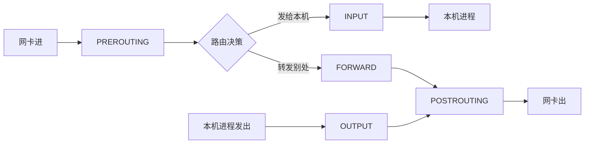

云厂商的 NAT 网关、家里的路由器、Kubernetes 的 Service——背后都是同一套 Linux 机制：NAT 改写地址，conntrack 记住怎么改回来。这篇文章不堆术语，用「导航软件」和「储物柜」两个比喻，把 DNAT、SNAT、Netfilter、conntrack 这一家子的分工彻底讲透——包括一个大多数教程都讲错的点：**回程根本不查规则**。

<!--more-->

## NAT：改快递单的两种改法

数据包就是一件快递，包裹单上写着两行字：寄件人（源 IP:端口）和收件人（目标 IP:端口）。NAT（网络地址转换）就是在快递中转站改单子，改法只有两种：

- **DNAT（Destination NAT）——改收件人**。快递写着「送到大楼前台」，前台把收件人改成「3 楼 302 室的张三」，包裹才能送进真正的房间。典型场景：外部流量进集群、进内网（云厂商的 DNAT 规则、K8s 的 NodePort 都是它）
- **SNAT（Source NAT）——改寄件人**。302 室的张三往外寄件，前台把寄件人改成「大楼前台」——因为外面的世界不认识「302 室」这个内部地址，回信只能寄到前台。典型场景：内网机器上外网（云厂商的 SNAT/NAT 网关、家用路由器都是它）

一句话分工：**DNAT 管进门，SNAT 管出门。**

## Netfilter 与 iptables：修路的和贴告示的

这两个名字常被混为一谈，关系其实是「基础设施」与「管理工具」：

- **Netfilter**：Linux 内核里修好的五个**固定检查点**（钩子），任何数据包过内核协议栈都必经其中几个：



- **iptables**：用户态的命令行工具，作用是往这些检查点上「贴告示」（写规则）。没有 Netfilter，iptables 写的规则无处执行；没有 iptables（或它的继任者 nftables），Netfilter 的检查点上空空如也，一律放行

两个改单动作的固定岗位：**DNAT 在 PREROUTING**（进门第一站，趁路由决策还没做，先把收件人改对）；**SNAT 在 POSTROUTING**（出门最后一站，临出网卡前把寄件人改好）。

## 导航比喻：IP 地址是「阶段性目的地」

有一个非常好的直觉模型：NAT 之下，包裹单上的地址**不是永久身份证，而是导航软件里的「当前这一段路的目的地」**。

刚出车库，导航说「先到小区大门」；上了主路，目的地变成「高速收费站」；出了城，又变成「下一座城市」。每换一段路，导航就改写一次目标——数据包也一样：它在每个 NAT 点被改写地址，**始终只知道下一站，不需要知道全程**。

这个模型解释了为什么内网 IP（`10.x.x.x`、`192.168.x.x`）可以在全世界无数个局域网里重复使用而不冲突：它们只是「小区内部的门牌号」，出小区就会被 SNAT 换成公网地址。

## 一个会骗人的口诀，和它背后的恒等式

学到这里，很多人会总结出一个口诀：「**去改终点，回改源**」——去程改收件人，回程改寄件人。听起来工整，但拿两个场景一对照就露馅了：

| 场景 | 去程改了什么 | 回程改了什么 |
|------|------------|------------|
| 入站（外部用户 → 内部服务）| DNAT **改终点** | 响应包的**源**被还原 |
| 出站（内部机器 → 外网）| SNAT **改源** | 响应包的**终点**被还原 |

入站符合口诀，出站恰好**相反**。更糟的是，很多真实场景（比如 K8s 的 NodePort 默认配置）去程会**同时**改终点和源——口诀彻底失效。

失效的原因是：口诀把「源/终点」这个**位置**当成了规律，而真正的规律有两条：

1. **恒等式**：请求包的终点 = 响应包的源；请求包的源 = 响应包的终点。所以「去程改了哪个位置，回程就在**镜像位置**还原」——不是什么新决策，纯粹是几何对称
2. **去程查规则，回程查账本**：NAT 规则只对一条连接的**第一个包**生效；之后的所有包——尤其是全部回程包——**从不匹配规则**，而是由一个「账本」自动完成还原

这个账本，就是 conntrack。

## conntrack：储物柜与双向名片

conntrack（连接跟踪）是 Netfilter 里的记账子系统，整张表放在**内核内存**里（重启即清空），数据结构是经典的**哈希表 + 链表**——像一排编号储物柜，柜里挂着若干记录。

它精妙的地方在于**存**的方式：每笔连接不是存一张名片，而是存**一对方向相反的名片**。

假设内网机器 `10.0.0.5:34567` 访问外部服务器 `203.0.113.9:80`，出门时被 SNAT 成 `198.51.100.2:56789`。conntrack 记下的是：

```
orig  （原始方向）: 10.0.0.5:34567  → 203.0.113.9:80
reply （回复方向）: 203.0.113.9:80  → 198.51.100.2:56789
```

注意 `reply` 不是简单把 `orig` 倒过来——它记录的是**改写之后**回程包应有的样子（目标是 SNAT 后的新端口 `56789`）。

回程包（`203.0.113.9:80 → 198.51.100.2:56789`）抵达时，内核拿它的地址信息算哈希、找到储物柜、逐条比对柜中记录的**两张名片**——命中 `reply` 这张，就立刻知道：「这是那条连接的回信」，按账本把目标还原成 `10.0.0.5:34567`。全程 **不查任何 NAT 规则**，纯查账，哈希查找近似 O(1)。

两个常见疑问顺手解决：

- **「服务器会从 80 端口回包吗？」** 会，而且必须。TCP 连接由四元组（源 IP、源端口、目标 IP、目标端口）唯一确定，服务器若换个端口回包，客户端内核会认为「素不相识」直接丢弃。**谁监听，谁回复**，这是铁律
- **「高并发时账本会记混吗？」** 不会记混，但会**记满**。每条连接（精确到五元组）独占一条记录，绝不「总体对等」地混用；真正的风险是条目数超过 `nf_conntrack_max` 上限——那是另一个话题（见下篇）

想亲眼看看账本，Linux 上执行：

```bash
sudo conntrack -L    # 列出当前全部连接跟踪记录
```

## 总结

- **NAT 只有两招**：DNAT 改收件人（管进门），SNAT 改寄件人（管出门）
- **Netfilter 是关卡，iptables 是贴告示的**；DNAT 守 PREROUTING，SNAT 守 POSTROUTING
- **IP 地址是阶段性目的地**，不是永久身份证——这是理解一切 NAT 场景的心智模型
- **别背「去改终点回改源」**——记恒等式（请求的终点=响应的源）和真规律：**去程查规则，回程查账本**
- **conntrack 是账本**：哈希储物柜里挂着 orig/reply 双向名片，回程靠比对 reply 名片完成自动还原

理解了这一套，再回头看 Kubernetes：Service 的「虚拟 IP」、NodePort 的地址改写、`externalTrafficPolicy` 的源 IP 取舍（见上篇《NodePort 的三个端口谁是谁？》），全都是这五个关卡和一本账的应用题。

---

留一个动手练习：在任何一台 Linux 机器（或容器）上执行 `curl` 访问一个外部网站，同时开着 `sudo conntrack -L | grep <目标IP>` 观察——你能找到那条记录的 orig 和 reply 两个方向吗？对照恒等式验证一下：请求的终点，是不是正好等于响应的源？
