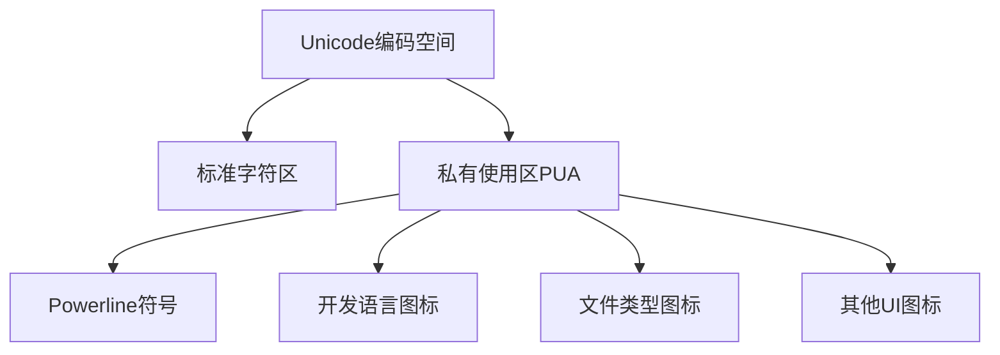
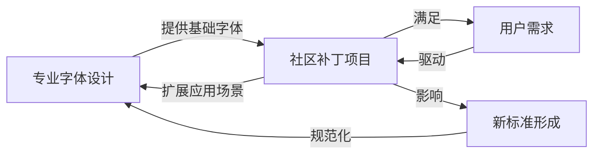

当你在终端中看到这样精美的提示符显示时：

```
FramePack-macos on  main [?] via 🐍 v3.10.16 (env) took 31m27s
󰄛 ❯
```

你是否好奇这些特殊符号是如何实现的？又为何在GitHub等网页平台上无法正常显示？本文将带你深入探讨Nerd字体的技术细节，了解如何在GitHub上正确显示这些符号，并从哲学角度思考字体演化背后的辩证法则。

<!--more-->

## 一、在GitHub上显示Nerd字体符号

### 问题背景

许多开发者在终端中使用Nerd字体或Powerline字体，这些字体包含丰富的编程相关图标和符号。然而，当你将终端内容复制到GitHub的issue、PR或讨论中时，这些特殊符号往往显示为方块或问号，因为网页默认不加载这些特殊字体。

### 解决方案：自定义CSS

使用浏览器扩展为GitHub注入自定义CSS是最简单有效的解决方案：

1. **安装Stylus扩展**
   - 在Chrome网上应用店或Firefox附加组件商店搜索安装"Stylus"

2. **创建自定义样式**
   - 下面的CSS会使GitHub的代码区域使用Nerd字体:

```css
/* 应用于GitHub评论区和代码块 */
.comment-body pre, .markdown-body pre, .comment-body code, .markdown-body code {
  font-family: "SauceCodePro Nerd Font", "Source Code Pro", monospace !important;
}

/* 覆盖更多代码元素 */
.blob-code, .blob-code-inner {
  font-family: "SauceCodePro Nerd Font", "Source Code Pro", monospace !important;
}
```

3. **保存并应用**
   - 将样式限定应用于`github.com`域名
   - 在Stylus的左上角命名并保存样式

完成这些步骤后，GitHub页面上的代码块和特殊符号将能正常显示，让你的终端截图保持原汁原味。

## 二、字体技术的深度解析

要理解Nerd字体为何特殊，我们需要深入字体技术的核心。

### 字体文件的二进制结构

虽然字体文件是二进制格式，但它们有着高度结构化的内部组织：

1. **表格结构**：TrueType和OpenType字体由多个"表"(tables)组成
   - `glyf`表：存储字形轮廓数据
   - `cmap`表：定义字符到字形的映射
   - `name`表：包含字体名称和版权信息
   - `OS/2`表：操作系统相关的指标

这种结构使得字体文件可以被程序化地读取和修改，就像一个微型的文件系统。

### Unicode与私有使用区(PUA)

Unicode标准为全球文字提供统一编码，但同时预留了私有使用区域（U+E000到U+F8FF），供个人或组织自定义使用。Nerd字体正是利用这一区域放置大量特殊图标。



### Nerd字体的补丁机制

Nerd字体本质上是对标准字体的"补丁"，主要通过以下步骤实现：

1. **解析原始字体**：使用FontForge等工具将二进制字体文件转换为可编程的对象

2. **添加新字形**：在PUA区域添加图标字形

3. **更新字符映射**：创建从特定Unicode码点到新字形的映射

4. **调整字体指标**：确保新添加的图标适合字体的整体风格

5. **重命名字体**：如将"Source Code Pro"改为"SauceCodePro Nerd Font"

6. **重新生成二进制文件**：将修改后的字体数据结构序列化回二进制格式

整个过程由Python脚本自动化完成，使得成千上万的图标可以被系统地添加到多种不同的字体中。

### Powerline与Nerd字体的关系

Powerline最初是Vim状态栏插件，它需要特殊字体显示箭头等分隔符。而Nerd字体是一个更全面的项目，它：

- 包含Powerline的所有符号
- 整合了Font Awesome、Devicons等多个图标集
- 支持数千个编程相关图标
- 提供了自动化的字体补丁工具

这展示了技术演进中"否定之否定"的哲学过程：从简单到复杂，从手动到自动化。

## 三、字体演化的辩证思考

字体技术的发展历程展现了完美的唯物辩证法案例。

### 标准化与个性化的矛盾统一

最初，计算机字体是混乱的，每个系统有自己的标准。Unicode的出现代表了第一次否定，建立了全球统一的编码标准。但随即出现了对个性化的需求，这就是第二次否定。

Unicode标准必须在"统一性"内部为"多样性"留出空间，这就是PUA区域的存在意义。它代表了对立的统一：在标准中容纳非标准。

### 量变到质变的跃迁

早期的字体修改是手工作业，每添加一个符号都需要专业技能。随着自动化工具的发展，特别是Nerd字体项目的Python脚本，单个字体可以一次性添加数千个图标，这是量变引起质变的典型案例。

自动化程度的提高不仅改变了字体修改的效率，更彻底改变了字体设计的可能性边界，创造出新的应用场景。

### 专业与民间力量的相互作用

传统字体设计是专业设计师的领域，而Nerd字体等项目代表了社区力量的崛起。这种民间创造力与专业标准的交融，推动了整个字体生态系统的发展。



## 四、实用指南：创建你自己的Nerd字体

如果你对字体技术产生了兴趣，可以尝试自己动手制作或修改Nerd字体。

### 准备工作

1. **安装FontForge**：开源字体编辑工具
   ```bash
   # macOS
   brew install fontforge
   
   # Ubuntu
   sudo apt install fontforge
   ```

2. **克隆Nerd Fonts仓库**
   ```bash
   git clone https://github.com/ryanoasis/nerd-fonts.git
   cd nerd-fonts
   ```

### 为现有字体打补丁

使用Nerd Fonts提供的脚本，你可以为任何字体添加图标：

```bash
# 为单个字体添加所有图标
./font-patcher path/to/your/font.ttf --complete

# 仅添加Powerline符号
./font-patcher path/to/your/font.ttf --powerline
```

### 创建自定义图标集

如果你想添加自己设计的图标，需要：

1. 准备SVG格式的图标文件
2. 使用FontForge的Python API将图标导入到字体中
3. 在PUA区域分配合适的Unicode点位

示例脚本框架：

```python
import fontforge

# 打开原始字体
font = fontforge.open("OriginalFont.ttf")

# 添加自定义图标
new_glyph = font.createChar(0xE000)  # 使用PUA区域的第一个码点
new_glyph.importOutlines("my-icon.svg")
new_glyph.width = font.em  # 调整宽度与字体匹配

# 保存修改后的字体
font.generate("MyCustomFont.ttf")
```

通过这种方式，你可以创建满足特定需求的自定义字体，将个人创意融入到日常开发工具中。

## 结语：技术与哲学的交融

字体技术的发展历程告诉我们，技术演进不是简单的线性过程，而是充满矛盾、跳跃和综合的辩证过程。从最初的混沌到Unicode的标准化，再到Nerd字体对个性化的重新探索，每一步都体现了辩证法中"否定之否定"的原则。

这种思考方式不仅适用于字体技术，也适用于我们所面对的许多其他技术和社会发展过程。它提醒我们，矛盾不是障碍，而是推动发展的动力；统一性和多样性不是对立的，而是相互依存的。

下次当你在终端中看到那些精美的图标符号，或是成功地在GitHub上展示它们时，不妨思考一下这背后蕴含的深刻哲学：在标准的规范中找到创新的空间，在技术的发展中体现思想的力量。
