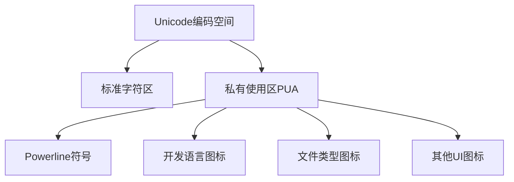
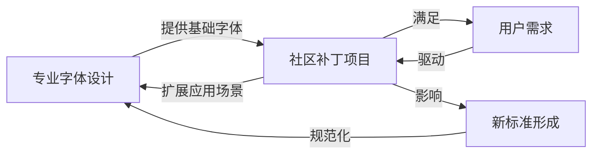

Когда вы увидите в терминале красивую подсказку, подобную этой:

```
FramePack-macos on  main [?] via 🐍 v3.10.16 (env) took 31m27s
󰄛 ❯
```

Вам интересно, как получаются эти специальные символы? И почему они не отображаются должным образом на таких веб-платформах, как GitHub? В этой статье мы углубимся в технические детали шрифта Nerd, узнаем, как правильно отображать эти символы на GitHub, и поразмышляем о диалектических правилах, лежащих в основе эволюции шрифтов.

<!--more-->

## 一、在GitHub上显示Nerd字体符号

### 问题背景

Многие разработчики используют в Терминале шрифты Nerd или Powerline, которые содержат богатые значки и символы, связанные с программированием. Однако, когда вы копируете содержимое терминала в проблему, PR или обсуждение на GitHub, эти специальные символы часто отображаются в виде квадратиков или вопросительных знаков, потому что страница не загружает эти специальные шрифты по умолчанию.

### 解决方案：自定义CSS

Внедрение пользовательского CSS в GitHub с помощью расширения для браузера - самое простое и эффективное решение:

1. **Установите расширение Stylus**.
   - Найдите и установите "Stylus" в Интернет-магазине Chrome или Магазине дополнений Firefox.

2. **Создание пользовательских стилей**.
   - Следующий CSS заставит область кода GitHub использовать шрифт Nerd:.

```css
/* 应用于GitHub评论区和代码块 */
.comment-body pre, .markdown-body pre, .comment-body code, .markdown-body code {
  font-family: "SauceCodePro Nerd Font", "Source Code Pro", monospace !important;
}

/* 覆盖更多代码元素 */
.blob-code, .blob-code-inner {
  font-family: "SauceCodePro Nerd Font", "Source Code Pro", monospace !important;
}
```

3. **Сохранить и применить**.
   - Примените квалификацию стиля к доменному имени `github.com`.
   - Назовите и сохраните стиль в левом верхнем углу Stylus

После выполнения этих шагов блоки кода и специальные символы на вашей странице GitHub будут отображаться правильно, а скриншоты из терминала останутся нетронутыми.

## 二、字体技术的深度解析

Чтобы понять, почему шрифты Nerd особенные, нам нужно вникнуть в суть технологии шрифтов.

### 字体文件的二进制结构

Несмотря на то, что файлы шрифтов имеют двоичный формат, их внутренняя организация очень структурирована:

1. **Структура таблицы**: шрифты TrueType и OpenType состоят из нескольких "таблиц".
   - Таблица `glyf`: хранит данные о начертании глифов.
   - Таблица `cmap`: определяет сопоставление символов с глифами.
   - Таблица `name`: содержит название шрифта и информацию об авторских правах.
   - Таблица `OS/2`: метрики, связанные с операционной системой.

Такая структура позволяет читать и изменять файлы шрифтов программно, подобно миниатюрной файловой системе.

### Unicode与私有使用区(PUA)

Стандарт Unicode обеспечивает единую кодировку для всех шрифтов мира, но оставляет область частного использования (от U+E000 до U+F8FF) для индивидуального использования частными лицами или организациями. Именно эту область используют шрифты Nerd для размещения большого количества специальных значков.



### Nerd字体的补丁机制

Ботанические шрифты - это, по сути, "заплатки" к стандартным шрифтам, и реализуются они следующим образом:

1. **Разбор исходных шрифтов**: использование таких инструментов, как FontForge, для преобразования двоичных файлов шрифтов в программируемые объекты

2. **Добавить новый глиф**: добавить глиф иконки в область PUA

3. **Обновление отображений символов**: создание отображений определенных кодовых точек Unicode на новые глифы

4. **Настройка шрифтовых индикаторов**: убедитесь, что вновь добавленные иконки вписываются в общий стиль шрифта

5. **Переименование шрифтов**: например, "Source Code Pro" в "SauceCodePro Nerd Font".

6. **Регенерация бинарного файла**: сериализация модифицированной структуры данных шрифта обратно в бинарный формат

Весь процесс автоматизирован с помощью скриптов Python, что позволяет систематически добавлять тысячи иконок к разным шрифтам.

### Powerline与Nerd字体的关系

Powerline начинался как плагин для строки состояния Vim, которому требовались специальные шрифты для отображения разделителей вроде стрелок. А Nerd fonts был более комплексным проектом:

- Включает все символы из Powerline
- Интеграция с Font Awesome, Devicons и многими другими наборами иконок
- Поддерживает тысячи иконок, связанных с программированием
- Предоставляет инструменты для автоматического исправления шрифтов

Это демонстрирует философский процесс "отрицания отрицания" в эволюции технологий: от простоты к сложности, от ручного труда к автоматизации.

## 三、字体演化的辩证思考

Эволюция технологии шрифтов демонстрирует идеальный случай материалистической диалектики.

### 标准化与个性化的矛盾统一

Изначально компьютерные шрифты были запутанными, каждая система имела свой собственный стандарт. Появление Unicode стало первым отрицанием, установив единый стандарт кодирования во всем мире. Но затем возникла потребность в персонализации, что стало вторым отрицанием.

В стандарте Unicode должно быть место для "разнообразия" в рамках "единообразия", именно поэтому существует область PUA. Она представляет собой единство противоположностей: размещение нестандартов в рамках стандартов.

### 量变到质变的跃迁

На первых порах модификация шрифтов была ручным процессом, требующим специальных навыков для добавления каждого символа. С развитием автоматизированных инструментов, в частности Python-скриптов для проекта шрифта Nerd, в один шрифт можно добавлять тысячи значков одновременно - классический случай, когда количественные изменения приводят к качественным.

Возросшая автоматизация не только изменила эффективность модификации шрифтов, но и коренным образом расширила границы типографских возможностей, создав новые сценарии применения.

### 专业与民间力量的相互作用

В то время как традиционный дизайн шрифтов является сферой деятельности профессиональных дизайнеров, такие проекты, как шрифт Nerd, представляют собой подъем общественной власти. Это пересечение гражданского творчества и профессиональных стандартов определяет всю экосистему шрифтов.



## 四、实用指南：创建你自己的Nerd字体

Если вы заинтересовались технологией создания шрифтов, попробуйте сами создать или изменить шрифт Nerd.

### 准备工作

1. **安装FontForge**：开源字体编辑工具
   ```bash
   # macOS
   brew install fontforge
   
   # Ubuntu
   sudo apt install fontforge
   ```

2. **克隆Nerd Fonts仓库**
   ```bash
   git clone https://github.com/ryanoasis/nerd-fonts.git
   cd nerd-fonts
   ```

### 为现有字体打补丁

С помощью скриптов, поставляемых вместе с Nerd Fonts, вы можете добавить иконки к любому шрифту:

```bash
# 为单个字体添加所有图标
./font-patcher path/to/your/font.ttf --complete

# 仅添加Powerline符号
./font-patcher path/to/your/font.ttf --powerline
```

### 创建自定义图标集

Если вы хотите добавить иконки собственного дизайна, вам необходимо:

1. Подготовьте файл с иконками в формате SVG.
2. Используйте Python API FontForge для импорта иконок в шрифт.
3. Назначьте подходящие точки Юникода в области PUA.

Пример скриптового фреймворка:

```python
import fontforge

# 打开原始字体
font = fontforge.open("OriginalFont.ttf")

# 添加自定义图标
new_glyph = font.createChar(0xE000)  # 使用PUA区域的第一个码点
new_glyph.importOutlines("my-icon.svg")
new_glyph.width = font.em  # 调整宽度与字体匹配

# 保存修改后的字体
font.generate("MyCustomFont.ttf")
```

Таким образом, вы можете создавать пользовательские шрифты, отвечающие конкретным потребностям, внедряя свой творческий потенциал в повседневные инструменты разработки.

## 结语：技术与哲学的交融

История развития шрифтовой технологии говорит нам о том, что технологическая эволюция - это не простой линейный процесс, а диалектический, полный противоречий, скачков и синтеза. От первоначального хаоса до стандартизации Unicode, а затем до повторного исследования персонализации в шрифтах Nerd - каждый шаг отражает принцип "отрицание отрицания" в диалектике.

Этот образ мышления применим не только к шрифтовой технологии, но и ко многим другим процессам технологического и социального развития, с которыми мы сталкиваемся. Он напоминает нам о том, что противоречия - это не препятствие, а движущая сила развития; что единство и разнообразие - это не противоположности, а взаимозависимость.

В следующий раз, когда вы увидите эти красивые значки в своем терминале или успешно отобразите их на GitHub, подумайте о глубокой философии, стоящей за этим: найти место для инноваций в нормах стандартов и отразить силу идей в развитии технологий.