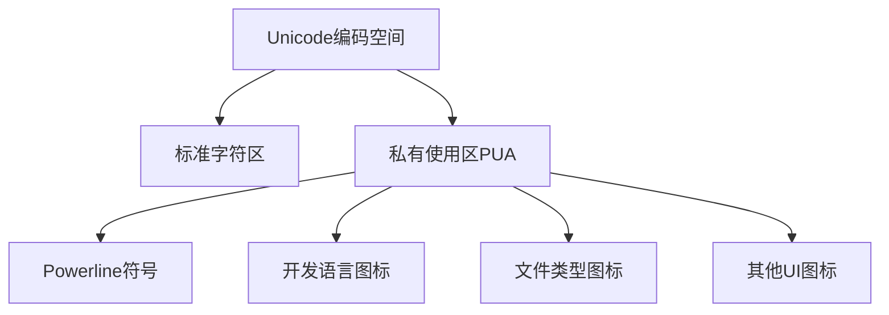
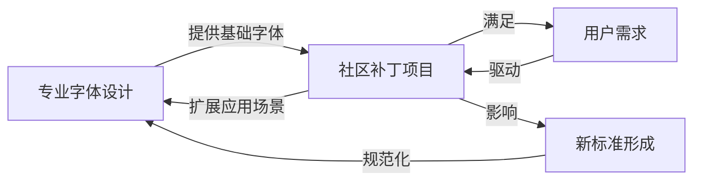

Когда вы увидите в терминале красивую подсказку, подобную этой:

```
FramePack-macos on  main [?] via 🐍 v3.10.16 (env) took 31m27s
󰄛 ❯
```.

Вам интересно, как получаются эти специальные символы? И почему они не отображаются должным образом на веб-платформах, таких как GitHub? В этой статье мы углубимся в технические детали шрифта Nerd, узнаем, как правильно отображать эти символы на GitHub, и философски рассмотрим диалектические правила, лежащие в основе эволюции шрифтов.

<! --подробнее-->

## I. Отображение символов шрифта Nerd на GitHub

### Предыстория проблемы

Многие разработчики используют в своих терминалах шрифты Nerd или Powerline, которые содержат множество иконок и символов, связанных с программированием. Однако, когда вы копируете содержимое терминала в проблему, PR или обсуждение на GitHub, эти специальные символы часто отображаются в виде квадратиков или вопросительных знаков, потому что страница не загружает эти специальные шрифты по умолчанию.

### Решение: пользовательский CSS

Внедрение пользовательского CSS в GitHub с помощью расширения для браузера - это самое простое и эффективное решение:

1. **Установите расширение Stylus**.
   - Найдите "Stylus" в Chrome Web Store или Firefox Add-ons Store и установите его.

2. **Создайте пользовательские стили
   - Следующий CSS заставит область кода GitHub использовать шрифт Nerd.

```css
/* 应用于GitHub评论区和代码块 */
.comment-body pre, .markdown-body pre, .comment-body code, .markdown-body code {
  font-family: "SauceCodePro Nerd Font", "Source Code Pro", monospace !important;
}

/* 覆盖更多代码元素 */
.blob-code, .blob-code-inner {
  font-family: "SauceCodePro Nerd Font", "Source Code Pro", monospace !important;
}
```.

3. **Сохранить и применить**
   - Примените квалификацию стиля к доменному имени `github.com`.
   - Назовите и сохраните стиль в левом верхнем углу Stylus

После выполнения этих шагов блоки кода и специальные символы на странице GitHub будут отображаться корректно, а скриншоты конечной точки останутся нетронутыми.

## II Глубокий анализ технологии шрифтов

Чтобы понять, почему шрифт Nerd особенный, нам нужно разобраться в технологии шрифтов.

### Двоичная структура файла шрифта

Несмотря на то что файлы шрифтов имеют двоичный формат, их внутренняя организация очень структурирована:

1. **Табличная структура**: шрифты TrueType и OpenType состоят из множества "таблиц".
   - __PROTECTED_INLINE_CODE__9__ таблицы: хранят данные о начертании глифов
   - Таблица `cmap`: определяет сопоставление символов с глифами.
   - Таблица __PROTECTED_INLINE_CODE__11__: содержит название шрифта и информацию об авторских правах.
   - __PROTECTED_INLINE_CODE__12__ таблица: метрики, связанные с операционной системой

Эта структура позволяет читать и изменять файлы шрифтов программно, подобно миниатюрной файловой системе.

### Юникод и частные области использования (PUA)

Стандарт Unicode обеспечивает единую кодировку для всех шрифтов мира, но оставляет область частного использования (от U+E000 до U+F8FF) для индивидуальной или организационной настройки, и шрифты Nerd используют эту область для размещения большого количества специальных значков.



### Механизм исправления шрифта Nerd

Шрифты Nerd - это, по сути, "заплатки" к стандартным шрифтам, которые реализуются следующим образом:

1. **Парсинг оригинальных шрифтов**: использование таких инструментов, как FontForge, для преобразования двоичных файлов шрифтов в программируемые объекты.

2. **Добавление новых глифов**: добавление глифов иконок в область PUA.

3. **Обновление отображений символов**: создание отображений определенных кодовых точек Unicode на новые глифы.

4. **Настройте метрики шрифта**: убедитесь, что вновь добавленные значки соответствуют общему стилю шрифта.

5. **Переименовать шрифты**: например, изменить "Source Code Pro" на "SauceCodePro Nerd Font".

6. **Перегенерируйте двоичный файл**: преобразуйте измененную структуру данных шрифта обратно в двоичный формат.

Весь процесс автоматизирован с помощью скриптов Python, что позволяет систематически добавлять тысячи иконок во множество различных шрифтов.

### Powerline vs. Nerd fonts

Powerline начинался как плагин для строки состояния Vim, которому требовались специальные шрифты для отображения разделителей вроде стрелок. Шрифты Nerd, с другой стороны, являются более комплексным проектом, который:

- Содержит все символы Powerline
- Интегрирует несколько наборов иконок, таких как Font Awesome, Devicons и т. д.
- Поддерживает тысячи иконок, связанных с программированием
- Предоставляет инструмент для автоматического исправления шрифтов

Это демонстрирует философский процесс "отрицания отрицания" в эволюции технологий: от простоты к сложности, от ручного труда к автоматизации.

## Диалектическое мышление об эволюции шрифтов

Эволюция технологии шрифта представляет собой идеальный случай материалистической диалектики.

### Парадоксальное единство стандартизации и персонализации

Изначально компьютерные шрифты были запутанными, каждая система имела свой собственный стандарт, и появление Unicode стало первым отрицанием, установившим единый стандарт кодирования во всем мире. Но затем возникла потребность в индивидуализации, которая стала вторым отрицанием.

В стандарте Unicode пришлось оставить место для "разнообразия" в рамках "единообразия", поэтому и существует регион PUA. Она представляет собой единство противоположностей: размещение нестандартов в рамках стандартов.

### Количественный и качественный скачок ###

На первых порах модификация шрифтов была ручным процессом, требующим специальных навыков для добавления каждого символа. С развитием автоматизированных инструментов, в частности Python-скриптов проекта Nerd font, в один шрифт можно добавлять тысячи иконок одновременно - классический случай, когда количественные изменения приводят к качественным.

Возросшая автоматизация не только изменила эффективность модификации шрифтов, но и перевернула границы возможного в шрифтовом дизайне, создав новые сценарии применения.

### Взаимодействие профессиональных и гражданских сил

В то время как традиционный дизайн шрифтов является сферой деятельности профессиональных дизайнеров, такие проекты, как шрифты Nerd, представляют собой подъем общественных сил. Это переплетение гражданского творчества и профессиональных стандартов определяет развитие всей экосистемы шрифтов.



## Четыре: Практическое руководство по созданию собственного ботанического шрифта

Если вы интересуетесь технологией создания шрифтов, вы можете попробовать создать или модифицировать шрифт Nerd самостоятельно.

### Подготовка

1. **Установите FontForge**: инструмент для редактирования шрифтов с открытым исходным кодом.
   ```bash
   # macOS
   brew install fontforge
   
   # Ubuntu
   sudo apt install fontforge
   ```.

2. **Склонируйте репозиторий Nerd Fonts**.
   ```bash
   git clone https://github.com/ryanoasis/nerd-fonts.git
   cd nerd-fonts
   ```

### Исправьте существующие шрифты

С помощью скриптов, предоставляемых Nerd Fonts, вы можете добавить иконки к любому шрифту:

```bash
# 为单个字体添加所有图标
./font-patcher path/to/your/font.ttf --complete

# 仅添加Powerline符号
./font-patcher path/to/your/font.ttf --powerline
```.

### Создание пользовательских наборов иконок

Требуется, если вы хотите добавить иконки собственного дизайна:

1. подготовьте файл иконок в формате SVG
2. используйте Python API FontForge для импорта иконок в шрифт
3. назначьте подходящие точки Unicode в области PUA.

Пример скрипта Framework:

```python
import fontforge

# 打开原始字体
font = fontforge.open("OriginalFont.ttf")

# 添加自定义图标
new_glyph = font.createChar(0xE000)  # 使用PUA区域的第一个码点
new_glyph.importOutlines("my-icon.svg")
new_glyph.width = font.em  # 调整宽度与字体匹配

# 保存修改后的字体
font.generate("MyCustomFont.ttf")
```.

Таким образом, вы можете создавать пользовательские шрифты, отвечающие конкретным потребностям, воплощая свой творческий потенциал в повседневных инструментах разработки.

## Заключение: Где технология встречается с философией

История развития шрифтовой технологии говорит нам о том, что технологическая эволюция - это не простой линейный процесс, а диалектический процесс, полный противоречий, скачков и синтеза. От первоначального хаоса до стандартизации Unicode, а затем до повторного исследования персонализации в шрифтах Nerd - каждый шаг отражает принцип "отрицание отрицания" в диалектике.

Этот способ мышления применим не только к шрифтовой технологии, но и ко многим другим процессам технологического и социального развития, с которыми мы сталкиваемся. Он напоминает нам, что противоречие - это не препятствие, а движущая сила развития; что единство и разнообразие - это не противоположности, а взаимозависимость.

В следующий раз, когда вы увидите эти красивые иконки-символы в своем терминале или успешно отобразите их на GitHub, задумайтесь о глубокой философии, стоящей за этим: найти место для инноваций в стандартизированных нормах и отразить силу идей в технологическом развитии.
