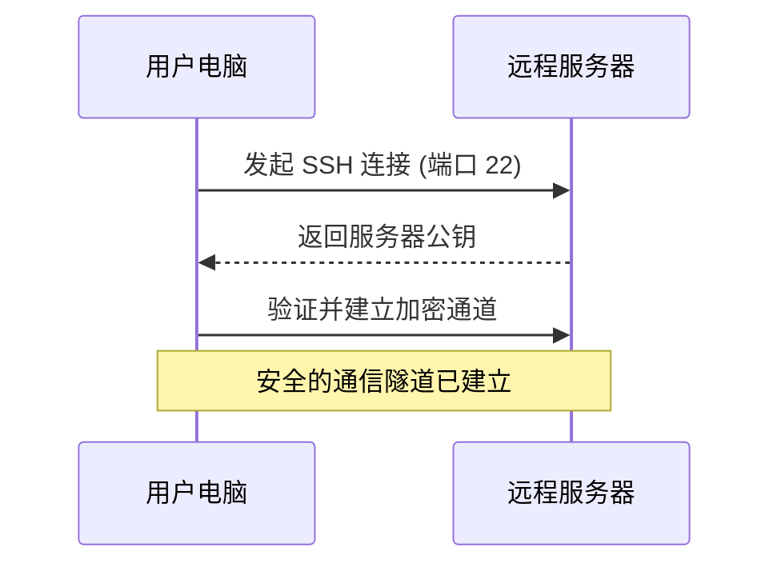
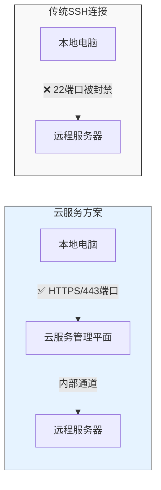
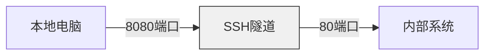
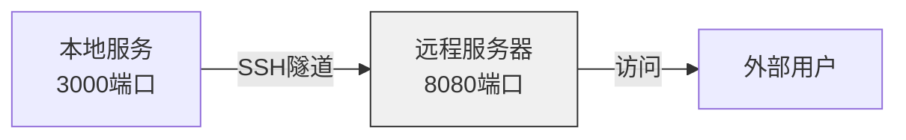
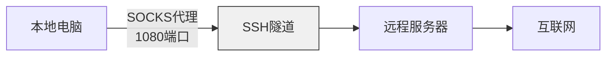

在当今的办公环境中，远程连接服务器、访问内部系统是很常见的需求。本文将从最基础的 SSH 连接开始，一步步介绍网络隧道技术，帮助你理解和使用这些强大的工具。

<!--more-->

## SSH：远程连接的基础

SSH（Secure Shell）是一个安全的远程连接工具。想象一下，你要去另一个城市的办公室处理一些文件。在没有远程连接的时代，你可能需要亲自过去。但有了 SSH，你就可以安全地\"远程登录\"到那台电脑，就像坐在它面前一样操作。



最基本的 SSH 连接命令是：
```bash
ssh username@server
# 例如：ssh john@192.168.1.100
```

## 端口转发：搭建数据传输的桥梁

SSH 不仅能远程登录，还能建立安全的数据传输通道。就像在两个城市之间修建了一条地下隧道，可以安全地运送各种物资。

1. 本地端口转发（Local Port Forwarding）
```bash
ssh -L 8080:internal.server:80 username@server
```

2. 远程端口转发（Remote Port Forwarding）
```bash
ssh -R 8080:localhost:3000 username@server
```

3. 动态端口转发（Dynamic Port Forwarding）
```bash
ssh -D 1080 username@server
```

## 当传统 SSH 受限时：云服务方案

有时候，由于网络策略限制（例如封禁 22 端口），传统的 SSH 连接会受阻：



这时，我们可以使用云服务提供的特殊通道。以 Azure 为例，它提供了 `az ssh vm` 命令：

```bash
# 基本连接
az ssh vm -n VM_NAME -g RESOURCE_GROUP

# 使用端口转发
az ssh vm -n VM_NAME -g RESOURCE_GROUP -- -L 8080:internal:80
```

这个方案的特点是：
- 使用 HTTPS（443端口）建立连接，避开了常见的端口限制
- 通过云平台的管理通道，提供额外的安全保障
- 支持与标准 SSH 相同的端口转发功能

## 端口转发的实际应用

### 1. 访问内部系统


示例命令：
```bash
# 传统 SSH
ssh -L 8080:internal.system:80 user@server

# 云服务方案
az ssh vm -n myVM -g myGroup -- -L 8080:internal.system:80
```

### 2. 分享本地服务


示例命令：
```bash
# 传统 SSH
ssh -R 8080:localhost:3000 user@server

# 云服务方案
az ssh vm -n myVM -g myGroup -- -R 8080:localhost:3000
```

### 3. 设置代理服务


示例命令：
```bash
# 传统 SSH
ssh -D 1080 user@server

# 云服务方案
az ssh vm -n myVM -g myGroup -- -D 1080
```

## 如何验证连接是否正常？

1. 检查端口是否在监听：
```bash
# 查看本地监听的端口
lsof -i :1080
```

2. 测试代理连接：
```bash
# 使用 curl 测试 SOCKS 代理
curl --socks5 localhost:1080 "https://api.ipify.org?format=json"
```

3. 针对特定程序使用代理：
```bash
# 设置环境变量
export https_proxy=socks5://localhost:1080
export http_proxy=socks5://localhost:1080
```

## 常见问题处理

1. **连接被重置**
   - 检查网络连接是否稳定
   - 确认服务器是否允许该类型的连接
   - 验证防火墙规则是否允许连接

2. **代理设置失效**
   - 检查是否有企业安全软件在管理代理设置
   - 尝试使用应用程序级别的代理配置
   - 考虑使用支持独立代理设置的应用程序

3. **性能问题**
   - 选择地理位置较近的服务器
   - 避免在单个连接中转发过多端口
   - 定期清理不再使用的连接

## 安全建议

1. 使用强密码和密钥认证
2. 及时关闭不需要的连接
3. 遵守公司的网络使用策略
4. 定期更新客户端和服务器软件
5. 避免在公共网络中使用明文传输

## 总结

无论是传统的 SSH 还是云服务提供的解决方案，它们都为我们提供了安全、灵活的网络连接方式。理解这些工具的工作原理，可以帮助我们：
- 在网络受限时找到替代方案
- 安全地访问内部系统
- 灵活地处理各种网络连接需求

选择合适的连接方式，遵守安全原则，就能让远程办公和系统访问变得更加便捷和安全。
