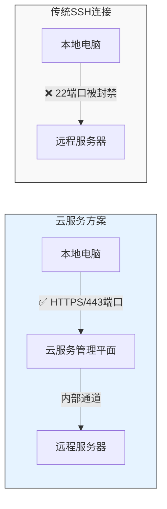

В современной офисной среде часто возникает необходимость подключаться к серверам и получать удаленный доступ к внутренним системам. В этой статье мы начнем с самых простых SSH-соединений и шаг за шагом познакомим вас с техниками сетевого туннелирования, чтобы помочь вам понять и использовать эти мощные инструменты.

<! --подробнее-->

## SSH: основы удаленных подключений

SSH (Secure Shell) - это безопасное средство удаленного подключения. Представьте, что вам нужно поехать в офис в другом городе, чтобы поработать с некоторыми файлами. В те времена, когда не было удаленных подключений, вам, возможно, пришлось бы ехать туда лично. Но с помощью SSH вы можете безопасно \"удаленно войти\" в этот компьютер и работать с ним так, как будто вы сидите перед ним.

```mermaid
sequenceDiagram
    participant User as 用户电脑
    participant Server as 远程服务器
    User->>Server: 发起 SSH 连接 (端口 22)
    Server-->>User: 返回服务器公钥
    User->>Server: 验证并建立加密通道
    Note over User,Server: 安全的通信隧道已建立
```_.

Самая основная команда подключения SSH - это:
```bash
ssh username@server
# 例如：ssh john@192.168.1.100
```

## Переадресация портов: создание мостов для передачи данных

SSH не только позволяет удаленно входить в систему, но и создает безопасный канал для передачи данных. Это все равно что построить подземный туннель между двумя городами для безопасной транспортировки любых грузов.

1. локальная переадресация портов (LPF)
```bash
ssh -L 8080:internal.server:80 username@server
```.

2. Удаленная переадресация портов
Удаленная переадресация портов ```bash
ssh -R 8080:localhost:3000 username@server
```.

3. Динамическая переадресация портов
Динамическая переадресация портов ```bash
ssh -D 1080 username@server
```

## Когда традиционный SSH ограничен: решения для облачных сервисов

Иногда традиционные SSH-соединения блокируются из-за ограничений сетевой политики, например, блокировки порта 22:



В этом случае мы можем использовать специальный канал, предоставляемый облачной службой. Например, Azure предоставляет команду `az ssh vm`:

```bash
# 基本连接
az ssh vm -n VM_NAME -g RESOURCE_GROUP

# 使用端口转发
az ssh vm -n VM_NAME -g RESOURCE_GROUP -- -L 8080:internal:80
```

Эта опция включает в себя:
- Устанавливает соединения по протоколу HTTPS (порт 443), обходя обычные ограничения портов.
- Обеспечивает дополнительную безопасность через канал управления облачной платформой.
- Поддерживает ту же проброску портов, что и стандартный SSH.

## Переадресация портов в действии

### 1. Доступ к внутренним системам
```mermaid
flowchart LR
    A[本地电脑] -- 8080端口 --> B[SSH隧道] -- 80端口 --> C[内部系统]
    style B fill:#f0f0f0,stroke:#333
```_.

Пример команды:
```bash
# 传统 SSH
ssh -L 8080:internal.system:80 user@server

# 云服务方案
az ssh vm -n myVM -g myGroup -- -L 8080:internal.system:80
```

### 2. Совместное использование локальных сервисов


Пример команды:
```bash
# 传统 SSH
ssh -R 8080:localhost:3000 user@server

# 云服务方案
az ssh vm -n myVM -g myGroup -- -R 8080:localhost:3000
```

### 3. Настройка прокси-сервисов


Пример команды:
```bash
# 传统 SSH
ssh -D 1080 user@server

# 云服务方案
az ssh vm -n myVM -g myGroup -- -D 1080
```

## Как проверить, что соединение работает?

1. Проверьте, прослушивается ли порт:
```bash
# 查看本地监听的端口
lsof -i :1080
```

2. Проверьте соединение с прокси:
```bash
# 使用 curl 测试 SOCKS 代理
curl --socks5 localhost:1080 "https://api.ipify.org?format=json"
```.

3. Используйте прокси для определенной программы:
```bash
# 设置环境变量
export https_proxy=socks5://localhost:1080
export http_proxy=socks5://localhost:1080
```

## Часто задаваемые вопросы

1. **Соединение обрывается
   - Проверьте, стабильно ли сетевое соединение
   - Убедитесь, что сервер разрешает данный тип соединения
   - Убедитесь, что правила брандмауэра разрешают подключение

2. **Настройки прокси-сервера не работают
   - Убедитесь, что корпоративное программное обеспечение безопасности управляет настройками прокси.
   - Попробуйте использовать конфигурацию прокси на уровне приложения
   - Рассмотрите возможность использования приложения, поддерживающего независимые настройки прокси.

3. **Проблемы с производительностью**
   - Выбирайте географически близкие серверы
   - Избегайте проброса слишком большого количества портов в одном соединении
   - Регулярно очищайте соединения, которые больше не используются

## Рекомендации по безопасности

1. используйте надежные пароли и ключи для аутентификации
2. своевременно закрывайте ненужные соединения
3. соблюдайте политику компании по использованию сети
4. регулярно обновляйте клиентское и серверное программное обеспечение
5. избегайте передачи данных открытым текстом в публичных сетях.

## Резюме

Будь то традиционный SSH или решения, предоставляемые облачными сервисами, они предоставляют нам безопасный и гибкий способ подключения к сети. Понимание того, как работают эти инструменты, может помочь нам:
- найти альтернативные варианты, когда сеть ограничена
- Безопасный доступ к внутренним системам
- гибко решать различные задачи подключения к сети

Выбрав правильное подключение и соблюдая принципы безопасности, вы сможете сделать удаленную работу и доступ к системам проще и безопаснее.
