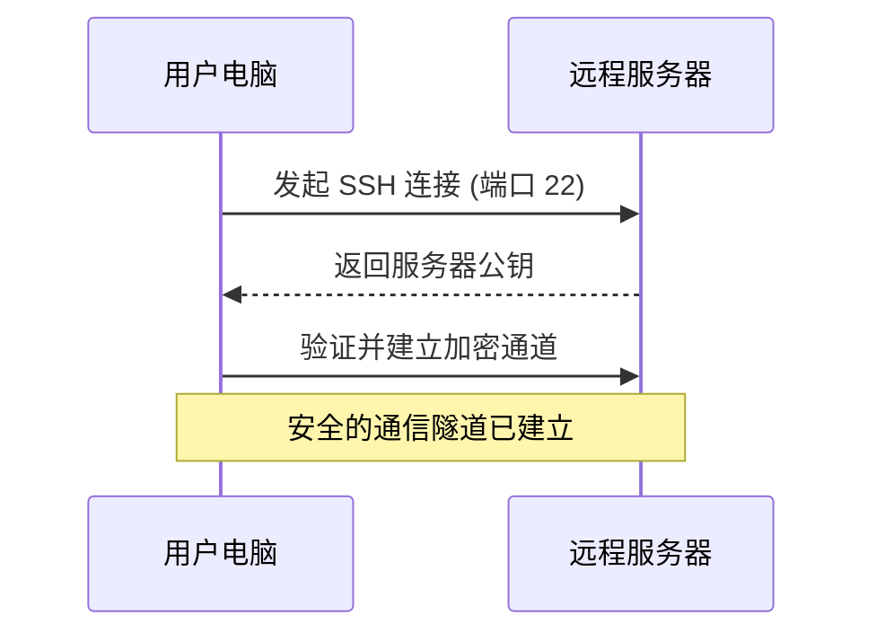
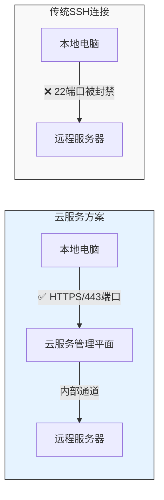

В современной офисной среде часто возникает необходимость подключаться к серверам и получать удаленный доступ к внутренним системам. В этой статье мы начнем с самых простых SSH-соединений и шаг за шагом познакомим вас с техниками сетевого туннелирования, чтобы помочь вам понять и использовать эти мощные инструменты.

<!--more-->

## SSH：远程连接的基础

SSH (Secure Shell) - это средство безопасного удаленного подключения. Представьте, что вам нужно поехать в офис в другом городе, чтобы поработать с некоторыми файлами. В те времена, когда не было удаленных подключений, вам, скорее всего, пришлось бы ехать туда лично. Но с помощью SSH вы можете безопасно \"удаленно войти\" в этот компьютер и работать с ним так, как будто вы сидите перед ним.



最基本的 SSH 连接命令是：
```bash
ssh username@server
# 例如：ssh john@192.168.1.100
```

## 端口转发：搭建数据传输的桥梁

SSH не только позволяет удаленно входить в систему, но и создает защищенный канал для передачи данных. Это все равно что построить подземный тоннель между двумя городами для безопасной транспортировки всевозможных грузов.

1. 本地端口转发（Local Port Forwarding）
```bash
ssh -L 8080:internal.server:80 username@server
```

2. 远程端口转发（Remote Port Forwarding）
```bash
ssh -R 8080:localhost:3000 username@server
```

3. 动态端口转发（Dynamic Port Forwarding）
```bash
ssh -D 1080 username@server
```

## 当传统 SSH 受限时：云服务方案

Иногда традиционные SSH-соединения блокируются из-за ограничений сетевой политики, например, блокировки порта 22:



В этом случае можно воспользоваться специальным каналом, предоставляемым облачной службой. В случае Azure, например, он предоставляет команду `az ssh vm`:

```bash
# 基本连接
az ssh vm -n VM_NAME -g RESOURCE_GROUP

# 使用端口转发
az ssh vm -n VM_NAME -g RESOURCE_GROUP -- -L 8080:internal:80
```

Этот сценарий включает в себя:
- Устанавливает соединения по протоколу HTTPS (порт 443), обходя обычные ограничения по портам.
- Обеспечивает дополнительную безопасность через канал управления облачной платформой
- Поддерживает те же функции проброса портов, что и стандартный SSH.

## 端口转发的实际应用

### 1. 访问内部系统


示例命令：
```bash
# 传统 SSH
ssh -L 8080:internal.system:80 user@server

# 云服务方案
az ssh vm -n myVM -g myGroup -- -L 8080:internal.system:80
```

### 2. 分享本地服务


示例命令：
```bash
# 传统 SSH
ssh -R 8080:localhost:3000 user@server

# 云服务方案
az ssh vm -n myVM -g myGroup -- -R 8080:localhost:3000
```

### 3. 设置代理服务


示例命令：
```bash
# 传统 SSH
ssh -D 1080 user@server

# 云服务方案
az ssh vm -n myVM -g myGroup -- -D 1080
```

## 如何验证连接是否正常？

1. 检查端口是否在监听：
```bash
# 查看本地监听的端口
lsof -i :1080
```

2. 测试代理连接：
```bash
# 使用 curl 测试 SOCKS 代理
curl --socks5 localhost:1080 "https://api.ipify.org?format=json"
```

3. 针对特定程序使用代理：
```bash
# 设置环境变量
export https_proxy=socks5://localhost:1080
export http_proxy=socks5://localhost:1080
```

## 常见问题处理

1. **Сброс соединения**.
   - Проверьте, стабильно ли сетевое соединение
   - Убедитесь, что сервер разрешает данный тип соединения
   - Убедитесь, что правила брандмауэра разрешают соединение

2. **Настройки прокси не работают**.
   - Проверьте, не управляет ли какое-либо корпоративное программное обеспечение безопасности настройками прокси.
   - Попробуйте использовать конфигурацию прокси на уровне приложения
   - Рассмотрите возможность использования приложения, поддерживающего автономные настройки прокси.

3. **Проблемы производительности**.
   - Выбирайте географически близкие серверы
   - Избегайте проброса слишком большого количества портов в одном соединении
   - Регулярно очищайте соединения, которые больше не используются.

## 安全建议

1. Используйте надежные пароли и ключи аутентификации
2. своевременно закрывайте ненужные соединения
3. соблюдайте политику компании по использованию сети
4. регулярно обновляйте клиентское и серверное программное обеспечение
5. избегайте использования передачи данных открытым текстом в сетях общего пользования.

## 总结

Будь то традиционный SSH или решения, предоставляемые облачными сервисами, они предоставляют нам безопасный и гибкий способ подключения к сети. Понимание того, как работают эти инструменты, может помочь нам:
- найти альтернативные варианты, когда сеть ограничена
- Обеспечить безопасный доступ к внутренним системам
- гибко решать различные задачи подключения к сети

Выбрав правильное подключение и соблюдая принципы безопасности, вы сможете сделать удаленную работу и доступ к системе более простым и безопасным.