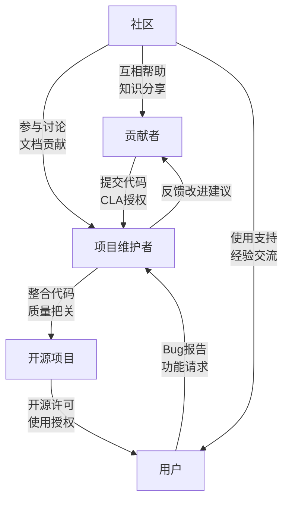

当你为开源项目提交第一个PR时，是否曾被要求签署一份CLA(贡献者许可协议)？这些法律文件背后有什么含义？开源项目又该如何建立一个真正平等、包容的协作模式？本文将深入探讨开源世界中的法律框架和理想的治理模式。

<!--more-->

## CLA协议：开源贡献的法律保障

初次接触开源项目时，很多开发者会遇到这样的场景：提交了一段代码，却收到需要签署CLA的提示。这是什么？为什么需要它？

### CLA的本质与作用

CLA（Contributor License Agreement，贡献者许可协议）是一份法律文件，明确了贡献者与项目之间的权利义务关系。它不是"卖身契"，而更像是一份"使用授权书"：贡献者保留代码的版权，同时授予项目使用、修改和分发这些代码的权利。

这份协议的核心价值在于：
- 为贡献者提供法律保护，明确免责范围
- 为项目提供明确的使用授权，降低法律风险
- 为用户提供清晰的许可链，增强使用信心

### 价值链中的风险隔离

这种机制可以类比为商品流通链中的责任交接：农民不必为消费者使用其产品的方式负责，中间商不必承担农田管理风险。同样，代码贡献者也不必为最终用户的使用情况承担责任。

正如一位贡献者所说："我提供代码，但不对最终产品负全责；项目整合我的代码，但不担心所有权纠纷；用户使用软件，但明白这是按原样提供的。"

## 贡献者协议的种类

开源世界存在多种贡献模式的法律框架：

1. **CLA（贡献者许可协议）**
   - 个人CLA：适用于个人贡献者
   - 公司CLA：适用于代表公司工作的贡献者

2. **DCO（开发者原产地证书）**
   - 更轻量级的选择，由Linux内核社区开发
   - 通过提交信息中的签名行表明贡献原创性

3. **版权转让协议**
   - 要求贡献者转让版权所有权
   - 通常用于有强中央控制的项目

每个项目可以根据自身需求选择合适的协议类型。值得注意的是，这些协议对各方都有益处：

- **项目维护者获益**：获得明确法律权利，减少版权纠纷
- **贡献者获益**：明确权利边界，减轻法律责任
- **用户获益**：使用软件时有法律保障
- **商业用户获益**：降低法律风险，便于商业化

## 开源项目的理想治理模式

讨论完法律框架，我们来探讨一个更深层次的问题：开源项目应该采用什么样的治理模式？

### 传统的"仁慈的暴君"模式

许多知名项目，如Linux内核，采用了所谓的"仁慈的暴君"模式：
- 创始人或核心维护者拥有最终决定权
- 形成层级化的信任网络和责任分配
- 子系统维护者在各自领域有较大自主权

这种模式有其优势，但也存在明显问题：
- 过度依赖个人判断和领导魅力
- 形成进入壁垒，限制新贡献者参与
- 面临领导者交替的可持续性挑战

### 走向真正的民主：包容性参与模式

理想的开源治理应该体现真正的民主精神——人民当家做主，每个人都能参与并影响决策。这种模式强调：

1. **降低参与门槛**
   - 欢迎任何水平的贡献者
   - 不设置人为的精英筛选机制

2. **平等的贡献价值观**
   - 重视每一份贡献，无论大小
   - 通过代码审核而非贡献者筛选来保证质量

3. **透明的决策过程**
   - 公开讨论重要决策
   - 建立基于共识而非权威的决策机制

4. **成长导向的社区文化**
   - 鼓励互助和知识分享
   - 为新人提供友好的学习环境

## 构建你的开源项目：实用建议

如果你计划创建自己的开源项目，以下是一些实用建议：

### 明确项目基础

1. **选择合适的许可证**
   - MIT/BSD：非常宽松，几乎可以任意使用
   - Apache 2.0：包含专利授权条款
   - GPL：要求衍生作品也必须开源

2. **确定贡献流程**
   - 是否需要CLA或DCO
   - 如何处理PR和代码审核
   - 编写清晰的贡献指南

### 构建包容性社区

1. **制定行为准则**
   - 明确社区价值观和行为规范
   - 创造友好、包容的氛围

2. **多元化贡献渠道**
   - 不仅是代码，还有文档、测试、用户支持
   - 识别并认可各种形式的贡献

3. **透明决策机制**
   - 公开讨论项目方向
   - 让社区成员有发言权

### 保持项目可持续性

1. **建立自动化流程**
   - 持续集成/持续部署
   - 自动化测试和代码质量检查

2. **文档先行**
   - 编写详细的用户和开发者文档
   - 保持文档与代码同步更新

3. **考虑长期发展**
   - 培养核心贡献者团队
   - 探索可能的商业支持模式

## 结语

开源不仅是一种软件开发模式，也是一种协作哲学。在法律框架的保障下，通过包容性的治理模式，我们可以创建真正民主、创新的开源社区。

无论你是贡献者还是项目创建者，希望这些见解能够帮助你在开源世界中找到自己的位置。开源的魅力在于集体智慧的力量，而这种力量最终来自于每一个参与者的贡献和热情。

一张展示开源协作关系的流程图或概念图，展示贡献者、项目维护者和用户之间的关系与权利义务流动：

你是否正在考虑创建自己的开源项目？哪种贡献模式和治理结构更适合你的项目愿景？欢迎分享你的想法和经验！
