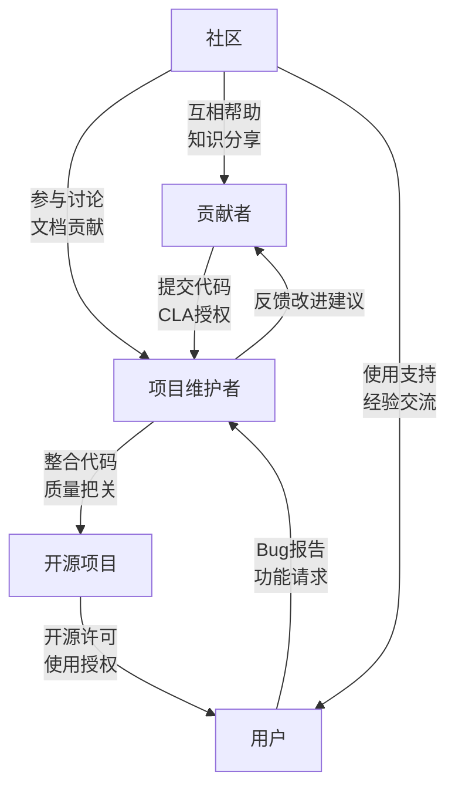

Просили ли вас когда-нибудь подписать CLA (Contributor Licence Agreement) при подаче вашего первого PR для проекта с открытым исходным кодом? Какой смысл скрывается за этими юридическими документами? И как проекты с открытым исходным кодом могут создать по-настоящему равноправную и инклюзивную модель сотрудничества? В этой статье мы рассмотрим правовые рамки и идеальную модель управления в мире открытого исходного кода.

<!--more-->

## CLA协议：开源贡献的法律保障

При первом знакомстве с проектами с открытым исходным кодом многие разработчики сталкиваются с таким сценарием: они отправляют часть кода, но получают сообщение о необходимости подписать CLA. Что это такое? Зачем он мне нужен?

### CLA的本质与作用

CLA (Contributor Licence Agreement) - это юридический документ, определяющий права и обязанности между соавтором и проектом. Это не "договор купли-продажи", а скорее "лицензия на использование": автор сохраняет авторские права на код и предоставляет проекту право использовать, изменять и распространять его.

Основная ценность этого соглашения заключается в следующем:
- Обеспечить правовую защиту и четкие исключения для авторов
- Обеспечить четкую лицензию для проектов, снижая юридические риски.
- Предоставление пользователям четкой цепочки лицензий, что повышает доверие к использованию.

### 价值链中的风险隔离

Этот механизм можно сравнить с передачей ответственности в цепочке распределения товаров: фермерам не нужно отвечать за то, как потребители используют их продукцию, а посредникам не нужно брать на себя риск управления их сельскохозяйственными угодьями. Точно так же авторы кода не должны брать на себя ответственность за то, как конечные пользователи будут его использовать.

Как сказал один из участников, "я предоставляю код, но не беру на себя полную ответственность за конечный продукт; проект интегрирует мой код, но не беспокоится о спорах о праве собственности; а пользователь использует программное обеспечение, но понимает, что оно предоставляется как есть".

## 贡献者协议的种类

В мире открытого исходного кода существует правовая база для различных моделей вклада:

1. **CLA (Contributor Licence Agreement)**.
   - Индивидуальный CLA: применяется к индивидуальным авторам.
   - CLA компании: применяется к авторам, работающим от имени компании

2. **DCO (Developer Certificate of Origin)**.
   - Более легкий вариант, разработанный сообществом разработчиков ядра Linux.
   - Оригинальность вклада указывается строкой подписи в сообщении о фиксации

3. **Соглашения о передаче авторских прав**.
   - Требует от соавторов передачи авторских прав.
   - Обычно используется в проектах с сильным центральным контролем

Каждый проект может выбрать подходящий для него тип соглашения. Важно отметить, что такие соглашения выгодны всем сторонам:

- **Выгода для сопровождающих проекта**: получение четких юридических прав и уменьшение количества споров об авторских правах
- **Соавторы получают выгоду**: четкие границы прав и снижение юридической ответственности
- **Пользователи получают выгоду**: правовая защита при использовании программного обеспечения
- **Бизнес-пользователи получают выгоду**: снижение юридических рисков и простота коммерциализации

## 开源项目的理想治理模式

После обсуждения правовой базы давайте рассмотрим более глубокий вопрос: какую модель управления должны принять проекты с открытым исходным кодом?

### 传统的"仁慈的暴君"模式

Многие известные проекты, такие как ядро Linux, придерживаются так называемой модели "доброжелательного тирана":
- Основатель или основной сопровождающий имеет последнее слово.
- Формируется иерархическая сеть доверия и ответственности.
- Сопровождающие подсистемы имеют большую автономию в своих областях.

У этой модели есть свои сильные стороны, но есть и очевидные проблемы:
- Чрезмерная зависимость от личных суждений и харизмы лидера
- Создание барьеров для входа, которые ограничивают участие новых участников
- Проблемы устойчивости, связанные со сменой руководства

### 走向真正的民主：包容性参与模式

Идеальное управление с открытым исходным кодом должно воплощать в себе истинный дух демократии - когда люди стоят у руля и каждый может участвовать и влиять на решения. Эта модель подчеркивает:

1. **Снижение порога участия**.
   - Приветствуются участники любого уровня
   - Отсутствие искусственного механизма отбора элиты

2. **Равная ценность вклада**
   - Ценим каждый вклад, большой или маленький
   - Обеспечение качества через обзор кода, а не через отбор участников

3. **Прозрачный процесс принятия решений**
   - Открытое обсуждение важных решений
   - Создание механизмов принятия решений, основанных на консенсусе, а не на авторитете

4. **Ориентированная на рост культура сообщества**.
   - Поощрять взаимную поддержку и обмен знаниями
   - Обеспечить дружественную среду обучения для новичков

## 构建你的开源项目：实用建议

Если вы планируете создать свой собственный проект с открытым исходным кодом, вот несколько практических рекомендаций:

### 明确项目基础

1. **Выбор правильной лицензии**.
   - MIT/BSD: очень свободная и почти произвольная
   - Apache 2.0: включает условия патентной лицензии
   - GPL: требует, чтобы производные работы также были с открытым исходным кодом

2. **Определение процесса внесения взносов**.
   - Требуется ли CLA или DCO
   - Как работать с PR и обзорами кода
   - Написать четкие рекомендации по внесению вклада

### 构建包容性社区

1. **Разработка кодекса поведения**
   - Разъяснение ценностей и поведенческих норм сообщества
   - Создание дружественной и инклюзивной атмосферы

2. **Диверсифицированные каналы вклада**.
   - Не только код, но и документация, тестирование, поддержка пользователей.
   - Признавайте и отмечайте все формы вклада

3. **Прозрачный механизм принятия решений**
   - Открытое обсуждение направления проекта
   - Предоставление членам сообщества права голоса

### 保持项目可持续性

1. **Установка автоматизированных процессов**.
   - Непрерывная интеграция/непрерывное развертывание
   - Автоматизированное тестирование и проверка качества кода

2. **Документация превыше всего**
   - Пишите подробную документацию для пользователей и разработчиков
   - Поддерживайте документацию в актуальном состоянии

3. **Забота о долгосрочном развитии**.
   - Создание основной команды участников
   - Изучить возможные модели поддержки бизнеса

## 结语

Открытый исходный код - это не только модель разработки программного обеспечения, но и философия сотрудничества. С помощью инклюзивной модели управления, гарантированной правовой базой, мы можем создать по-настоящему демократические и инновационные сообщества с открытым исходным кодом.

Независимо от того, являетесь ли вы участником или создателем проекта, надеемся, что эти сведения помогут вам найти свое место в мире открытого кода. Красота открытого исходного кода заключается в силе коллективного разума, который в конечном итоге складывается из вклада и энтузиазма каждого участника.

Блок-схема или концептуальная диаграмма, показывающая отношения сотрудничества с открытым исходным кодом, демонстрирующая взаимосвязь и поток прав и обязанностей между участниками, сопровождающими проект, и пользователями:

Вы подумываете о создании собственного проекта с открытым исходным кодом? Какая модель взносов и структура управления лучше подходит для видения вашего проекта? Не стесняйтесь делиться своими мыслями и опытом!