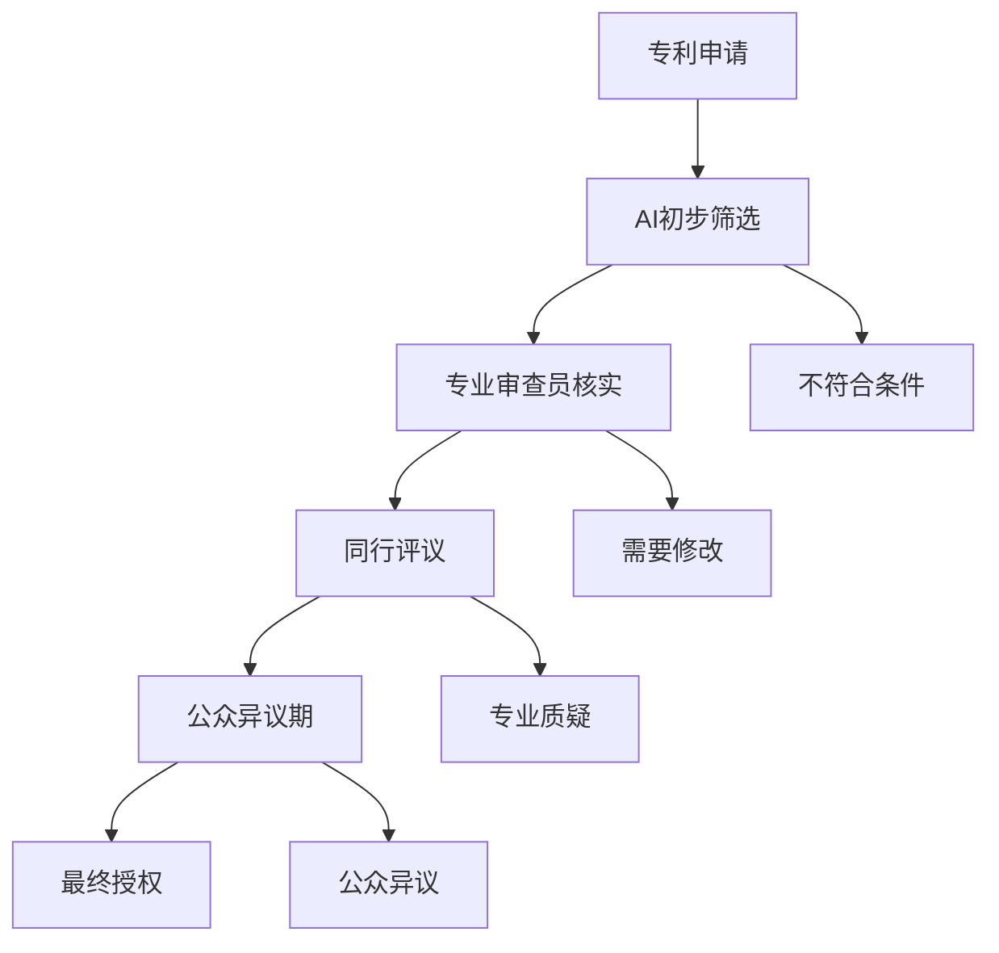

当人工智能可以在几秒钟内生成一个发明创意时，一个设计了几百年的专利制度正面临前所未有的挑战。数据显示，全球专利申请量正在爆炸式增长，而审查机构却陷入了前所未有的困境。

<!--more-->

## 一个正在崩溃的体系

### 令人震惊的数字

最新统计数据揭示了专利制度面临的严峻现实：

- **美国专利商标局（USPTO）**：2024年专利授权量增长5.7%，达到36.86万件
- **待审积压**：超过120万件申请等待审查
- **人员危机**：2025年撤回了600个专利审查员的工作offer
- **审查时间**：平均每件专利申请仅有19小时的审查时间

这些数字背后隐藏着一个残酷的现实：专利制度正在被其自身的成功所压垮。

### AI专利申请的爆炸式增长

更令人担忧的是AI相关专利的激增：

**生成式AI专利竞赛**：
- 中国过去十年申请了38,200件生成式AI专利
- 美国同期仅有6,300件
- 2023年全球生成式AI专利申请超过50,000件

**增长速度惊人**：
- 2013-2016年期间，AI专利申请增长了262%
- AI专利诉讼已超过1,000起

## "显而易见性"判断的困境

专利法的核心原则之一是"非显而易见性"——发明必须对本领域普通技术人员（PHOSITA）来说不是显而易见的。然而，这一原则在AI时代面临巨大挑战。

### 理论与现实的巨大鸿沟

**理论上的审查标准**：
专利审查员需要判断，在发明申请时，本领域的普通技术人员是否会显而易见地想到这个解决方案。

**现实中的操作困境**：
- 审查员平均只有19小时处理一件申请
- 现代技术（AI、量子计算、生物技术）越来越复杂
- 审查员的知识更新速度跟不上技术发展

### 经典案例的启示

**亚马逊的"一键购买"专利**是一个经典例子：
- 代码实现可能只需半小时
- 但在1999年，电商界普遍使用复杂的多步骤购买流程
- 没有人想到可以简化成一键操作
- 结果获得专利，因为当时的"本领域普通技术人员"不会显而易见地想到这个思路

这个案例说明，专利的价值不在于技术实现的复杂度，而在于创新思维的独特性。

## AI时代带来的根本性挑战

### 1. 发明生产的工业化

AI正在改变发明的生产方式：

**传统模式**：
- 人类发明者经过长期思考和实验
- 发明数量受到人类认知能力限制
- 每个发明都有明确的人类创造者

**AI辅助模式**：
- AI可以快速生成大量创意方案
- 发明数量可能呈指数级增长
- 人类与AI的贡献边界模糊

### 2. DABUS案例的开创性影响

**DABUS（Device for the Autonomous Bootstrapping of Unified Sentience）** 是全球首个尝试申请专利的AI系统：

- 南非成为首个承认AI为发明人的国家
- 澳大利亚法院经过波折最终支持AI发明人身份
- 这直接挑战了"只有人类才能成为发明人"的传统观念

### 3. 审查能力与申请量的剪刀差

假设一个AI系统每秒生成一个"潜在发明"：
- 一天产生86,400个想法
- 即便只有1%值得申请专利，一天也是864件
- 一个AI一年就能产生31万专利申请

而USPTO现在一年总共才处理37万件申请。这意味着仅仅一个AI工具就能让美国专利局的工作量翻倍。

## 专利制度面临的三重危机

### 1. 质量危机

**大量低质量专利获得授权**：
- 审查员时间不足，无法深入分析
- 复杂技术领域的专业门槛过高
- "先批准，后无效"成为常态

**"专利垃圾"现象**：
- 大量明显不应该获得专利的申请通过审查
- 专利质量参差不齐，公信力下降
- 后续的无效程序和诉讼成本高昂

### 2. 效率危机

**审查积压持续恶化**：
- 从2年审查周期可能扩大到5-10年
- 技术发展速度远超专利审查速度
- 专利保护失去时效性

**人才缺口无法填补**：
- 专业审查员培养周期长
- 薪资待遇难以吸引顶尖人才
- 技术更新换代速度超过人员培训速度

### 3. 公平危机

**大公司vs小企业的不平等**：
- 大公司有资源进行大规模专利申请
- 小企业和个人发明者被边缘化
- 专利成为资本游戏而非创新保护

**地缘政治工具化**：
- 专利成为国际竞争的武器
- 技术封锁通过专利体系实现
- 创新合作受到政治因素干扰

## 现有改革尝试及其局限性

### 1. AI辅助审查的探索

**技术手段**：
- 利用AI帮助现有技术检索
- 自动化的相似性分析
- 智能化的审查流程管理

**局限性**：
- AI审查AI发明的悖论
- 技术理解的深度问题
- 责任归属的法律困境

### 2. 审查标准的调整

**提高审查门槛**：
- 对软件专利更严格的要求
- 增加"技术效果"的证明义务
- 缩小可专利主题的范围

**快速审查通道**：
- 关键技术领域的绿色通道
- 简化程序的小发明保护
- 分层次的专利保护体系

### 3. 国际协调努力

**多边合作机制**：
- 专利审查高速公路（PPH）
- 统一的审查标准制定
- 跨国专利纠纷解决机制

**协调难度**：
- 各国法律体系差异
- 经济利益冲突
- 技术主权争议

## 未来十五年的可能情景

### 阶段一（2025-2030）：系统性拥堵

**预期现象**：
- 专利积压从2年扩大到5-10年
- 大量低质量专利获得授权
- 专利诉讼成本飙升，只有大公司玩得起

**应对措施**：
- 大规模扩招审查员（可能性低）
- 引入AI辅助审查工具
- 提高专利申请费用以控制数量

### 阶段二（2030-2035）：信任危机

**预期现象**：
- 专利质量严重下降，公众失去信任
- 出现大规模"专利无效潮"
- 小公司和个人发明者退出专利体系

**可能变化**：
- 某些技术领域退出专利保护
- 替代性知识产权保护制度兴起
- 开源和共享创新模式扩张

### 阶段三（2035-2040）：体系重构

**根本性改革**：
- AI审查员vs AI发明者的新平衡
- 专利保护期限和范围的重新定义
- 国际专利体系的分化或统一

**新兴模式**：
- 基于区块链的分布式专利系统
- 实时更新的动态专利数据库
- 以使用为基础的知识产权保护

## 对法律界和政策制定者的建议

### 1. 重新审视专利制度的根本目标

**核心问题**：
- 专利制度是为了促进创新还是保护创新者？
- 在AI时代，什么样的创新值得保护？
- 如何平衡创新激励和社会公共利益？

**政策建议**：
- 明确AI参与发明的法律地位
- 重新定义"本领域普通技术人员"标准
- 建立针对AI辅助发明的特殊审查程序

### 2. 建立多层次的知识产权保护体系

**不同保护模式**：
- 传统专利：复杂、原创性高的重大发明
- 实用新型：改进型、应用型的小发明
- 开源保护：AI生成、快速迭代的算法创新
- 商业秘密：核心技术和商业模式

### 3. 加强国际合作与标准统一

**合作领域**：
- 统一的AI发明审查标准
- 跨国专利检索数据库
- 专利质量评估体系
- 争议解决机制

## 技术解决方案的探索

### 1. 分布式专利审查系统

### 2. 智能化现有技术检索

**技术架构**：
- 语义理解的专利检索引擎
- 跨语言的技术文献分析
- 实时更新的技术发展数据库
- 智能化的相似性判断算法

### 3. 动态专利价值评估

**评估维度**：
- 技术创新程度
- 商业应用潜力
- 社会影响评估
- 时效性分析

## 结语：寻找新的平衡点

专利制度正站在历史的十字路口。AI时代的到来不是简单的技术升级，而是对整个知识产权理念的根本挑战。

我们面临的不是一个可以通过修修补补解决的问题，而是需要重新思考知识产权制度在新时代的定位和作用。这个过程可能会很痛苦，也可能会有很多试错，但这是技术发展的必然代价。

关键在于，我们需要在保护创新激励和促进知识共享之间找到新的平衡点。这个平衡点不能只考虑法律条文，还要考虑技术现实、经济利益和社会公正。

专利制度的未来，不仅关系到法律界的职业发展，更关系到整个人类创新活动的走向。我们今天的选择，将决定明天的创新生态。

---

*在这个变革的时代，唯一不变的是变化本身。专利制度需要与时俱进，但更需要坚持促进人类整体福祉这一根本目标。*
