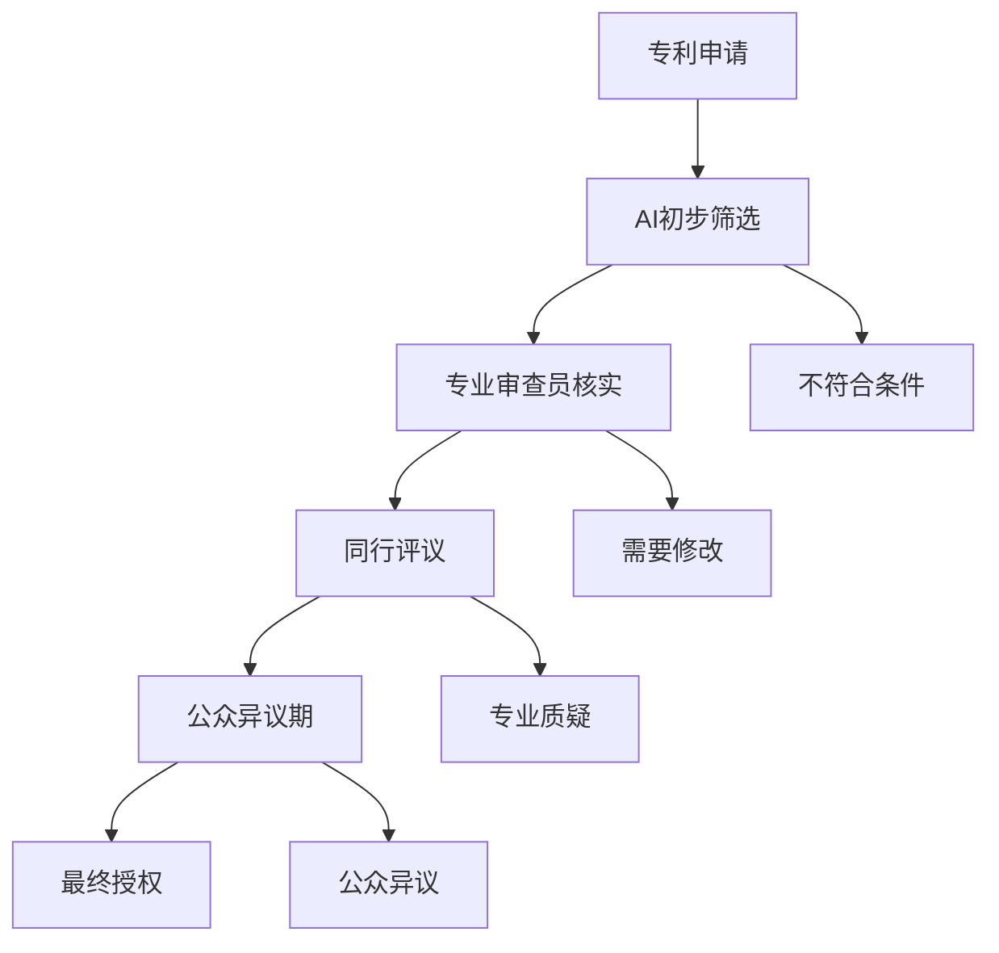

В то время как искусственный интеллект может генерировать идею для изобретения за считанные секунды, патентная система, создававшаяся веками, сталкивается с беспрецедентными проблемами. Данные показывают, что количество патентных заявок в мире растет, в то время как организации, проводящие экспертизу, находятся в беспрецедентном затруднительном положении.

<!--more-->

## 一个正在崩溃的体系

### 令人震惊的数字

Последние статистические данные показывают суровую реальность, с которой сталкивается патентная система:

- **Управление США по патентам и товарным знакам (USPTO)**: рост числа выданных патентов на 5,7 процента до 368 600 в 2024 году
- **Задержка в рассмотрении**: более 1,2 миллиона заявок ожидают экспертизы
- **Кадровый кризис**: 600 вакансий патентных экспертов будут отозваны в 2025 году
- **Время экспертизы**: в среднем на одну патентную заявку отводится всего 19 часов экспертизы

За этими цифрами скрывается суровая реальность: патентную систему захлестывает ее собственный успех.

### AI专利申请的爆炸式增长

Еще большее беспокойство вызывает распространение патентов, связанных с ИИ:

**Гонка патентов генеративного ИИ**:
- Китай подал 38 200 патентов на генеративный ИИ за последнее десятилетие.
- Только 6 300 в США за тот же период времени.
- К 2023 году в мире будет подано более 50 000 патентов на генеративный ИИ

**Темпы роста просто ошеломляют**:
- В период с 2013 по 2016 год число заявок на патенты в области ИИ выросло на 262 %.
- Подано более 1000 судебных исков по патентам на ИИ

## "显而易见性"判断的困境

Одним из основных принципов патентного права является принцип "неочевидности" - изобретение не должно быть очевидным для человека, обладающего обычными навыками в данной области (PHOSITA). Однако в эпоху ИИ этот принцип сталкивается с серьезными проблемами.

### 理论与现实的巨大鸿沟

**Теоретический стандарт рассмотрения**:
Патентный эксперт должен определить, было ли решение очевидным для человека с обычными навыками в данной области на момент подачи заявки на изобретение.

**Реалистичная операционная дилемма**:
- В среднем у экзаменаторов есть всего 19 часов на обработку заявки
- Современные технологии (ИИ, квантовые вычисления, биотехнологии) становятся все более сложными.
- Знания экзаменаторов обновляются не так быстро, как технологический прогресс

### 经典案例的启示

**Классический пример - патент Amazon на "покупку в один клик "**:
- Реализация кода может занять всего полчаса.
- Но в 1999 году мир электронной коммерции был полон сложных, многоэтапных процессов покупки.
- Но в 1999 году мир электронной коммерции использовал сложный, многоступенчатый процесс покупки, и никто не думал, что его можно упростить до одного клика.
- Патент был выдан, потому что в то время он не был бы очевиден для "человека, обладающего обычными навыками в данной области".

Этот случай показывает, что ценность патента заключается не в сложности технической реализации, а в уникальности инновационного мышления.

## AI时代带来的根本性挑战

### 1. 发明生产的工业化

ИИ меняет способы создания изобретений:

**Традиционная модель**:
- Люди-изобретатели долгое время думали и экспериментировали.
- Количество изобретений ограничено когнитивными способностями человека
- У каждого изобретения есть четкий создатель - человек

**Режим помощи ИИ**:
- ИИ может быстро генерировать большое количество творческих решений
- Количество изобретений может расти экспоненциально
- Размытые границы между вкладом человека и ИИ

### 2. DABUS案例的开创性影响

**DABUS (Device for the Autonomous Bootstrapping of Unified Sentience)** - это первая в мире попытка создать систему искусственного интеллекта, защищенную патентом:

- Южная Африка стала первой страной, признавшей ИИ изобретателем
- Австралийские суды после длительного процесса наконец-то подтвердили статус изобретателя ИИ.
- Это прямой вызов общепринятому мнению, что изобретателями могут быть только люди.

### 3. 审查能力与申请量的剪刀差

Предположим, система искусственного интеллекта генерирует одно "потенциальное изобретение" в секунду:
- Это 86 400 идей в день.
- Даже если только 1 % из них пригодны для патентования, это 864 идеи в день.
- ИИ может генерировать 310 000 патентных заявок в год.

А в настоящее время USPTO обрабатывает всего 370 000 заявок в год. Это означает, что всего один инструмент ИИ может удвоить объем работы USPTO.

## 专利制度面临的三重危机

### 1. 质量危机

**Большое количество некачественных патентов было выдано**:
- Недостаток времени у экспертов для проведения углубленного анализа
- Слишком высокий порог специализации в сложных технических областях
- "Сначала выдай, потом признай недействительным" стало нормой

**"Патентный мусор "**:
- На экспертизу поступает большое количество заявок, которые явно не должны были быть запатентованы.
- Неравномерное качество патентов и потеря доверия к ним
- Высокая стоимость последующих процедур признания патентов недействительными и судебных разбирательств

### 2. 效率危机

**Продолжается отставание в рассмотрении заявок**:
- Потенциальное расширение с 2-летнего цикла экспертизы до 5-10 лет
- Развитие технологий значительно опережает патентную экспертизу
- Потеря своевременности патентной защиты

**Нехватка талантов не может быть восполнена**:
- Длительный цикл обучения профессиональных рецензентов
- Сложность привлечения лучших специалистов с помощью пакета окладов
- Темпы технологических изменений превышают темпы подготовки персонала

### 3. 公平危机

**Неравенство крупных компаний и малого бизнеса**:
- Крупные компании имеют ресурсы для подачи крупных патентных заявок.
- Малые предприятия и индивидуальные изобретатели оттеснены на второй план.
- Патенты превратились в игру на капитал, а не в защиту инноваций

**Геополитическая инструментализация**:
- Патенты как оружие международной конкуренции
- Технологическая блокада через патентную систему
- Инновационному сотрудничеству мешают политические факторы

## 现有改革尝试及其局限性

### 1. AI辅助审查的探索

**Технические инструменты**:
- Использование ИИ для помощи в поиске существующих технологий
- Автоматизированный анализ сходства
- Интеллектуальное управление процессом рецензирования

**Ограничения**:
- ИИ рассматривает парадокс изобретения ИИ
- Проблемы глубины технического понимания
- Юридические дилеммы, связанные с распределением ответственности

### 2. 审查标准的调整

**Повышение требований к экспертизе**:
- Более строгие требования к патентам на программное обеспечение
- Увеличение обязанности доказывать "технический эффект"
- Сужение объема патентуемых объектов

Канал **Экспресс-обзор**:
- Зеленые дорожки в ключевых технологических областях
- Защита малых изобретений с упрощенными процедурами
- Иерархическая система патентной защиты

### 3. 国际协调努力

**Механизм многостороннего сотрудничества**:
- Магистраль патентного досмотра (PPH)
- Установление согласованных стандартов экспертизы
- Транснациональный механизм разрешения патентных споров

**Трудности гармонизации**:
- Различия в национальных правовых системах
- Конфликт экономических интересов
- Споры о технологическом суверенитете

## 未来十五年的可能情景

### 阶段一（2025-2030）：系统性拥堵

**Ожидаемое явление**:
- Патентное отставание увеличится с 2 до 5-10 лет
- Выдано большое количество низкокачественных патентов
- Патентные судебные издержки стремительно растут, и только крупные игроки могут себе это позволить

**Ответ**:
- Массовое расширение цензуры (маловероятно)
- Внедрение инструментов экспертизы с помощью ИИ
- Увеличение пошлин за подачу патентных заявок для контроля объема

### 阶段二（2030-2035）：信任危机

**Ожидания**:
- Серьезное ухудшение качества патентов и потеря общественного доверия
- Массовая "волна признания патентов недействительными".
- Отказ малых компаний и индивидуальных изобретателей от участия в патентной системе

**Возможные изменения**:
- Отказ от патентной защиты в некоторых областях техники
- Возникновение альтернативных систем защиты ИС
- Расширение моделей инноваций с открытым исходным кодом и совместного использования

### 阶段三（2035-2040）：体系重构

**Фундаментальная реформа**:
- Новый баланс между экспертами по ИИ и изобретателями по ИИ
- Переопределение срока и объема патентной охраны
- Фрагментация или гармонизация международной патентной системы

**Развивающаяся модель**:
- Распределенная патентная система на основе блокчейна
- Динамическая патентная база данных с обновлениями в режиме реального времени
- Защита интеллектуальной собственности на основе использования

## 对法律界和政策制定者的建议

### 1. 重新审视专利制度的根本目标

**Центральный вопрос**:
- Патентная система призвана поощрять инновации или защищать новаторов?
- Какие инновации стоит защищать в эпоху искусственного интеллекта?
- Как сбалансировать стимулы для инноваций и общественные интересы?

**Политические рекомендации**:
- Уточнить правовой статус участия ИИ в изобретениях
- Пересмотреть стандарт "человек, обладающий обычными навыками в данной области".
- Установить специальную процедуру экспертизы для изобретений, созданных с помощью ИИ.

### 2. 建立多层次的知识产权保护体系

**Различные способы охраны**:
- Традиционные патенты: сложные, очень оригинальные и значительные изобретения
- Полезные модели: усовершенствованные, прикладные незначительные изобретения
- Охрана открытого источника: генерируемые искусственным интеллектом, быстро итеративные алгоритмические инновации
- Коммерческая тайна: основные технологии и бизнес-модели

### 3. 加强国际合作与标准统一

**Область сотрудничества**:
- Согласованные стандарты экспертизы изобретений в области ИИ
- База данных трансграничного патентного поиска
- Система оценки качества патентов
- Механизм разрешения споров

## 技术解决方案的探索

### 1. 分布式专利审查系统

### 2. 智能化现有技术检索

**Техническая архитектура**:
- Система патентного поиска для семантического понимания
- Межъязыковой анализ технической литературы
- Обновляемая в режиме реального времени база данных по развитию технологий
- Интеллектуальный алгоритм оценки сходства

### 3. 动态专利价值评估

**Оценочное измерение**:
- Степень технологической инновации
- Потенциал коммерческого применения
- Оценка социального воздействия
- Анализ своевременности

## 结语：寻找新的平衡点

Патентная система стоит на перепутье в своей истории. Наступление эры искусственного интеллекта - это не просто технологическое обновление, а фундаментальный вызов всей концепции интеллектуальной собственности.

Мы сталкиваемся не с проблемой, которую можно решить с помощью возиться, а с необходимостью переосмыслить положение и роль системы интеллектуальной собственности в новую эпоху. Этот процесс может быть болезненным, в нем может быть много проб и ошибок, но это неизбежная цена технологического развития.

Крайне важно найти новый баланс между защитой стимулов к инновациям и поощрением обмена знаниями. Этот баланс должен учитывать не только букву закона, но и технологические реалии, экономические интересы и социальную справедливость.

Будущее патентной системы влияет не только на карьерный рост юристов, но и на направление инновационной деятельности всего человечества. Выбор, который мы сделаем сегодня, определит инновационную экологию завтрашнего дня.

---

* В эпоху перемен единственной константой являются сами перемены. Патентная система должна развиваться в ногу со временем, но более того, она должна придерживаться фундаментальной цели - способствовать благополучию человечества в целом. *