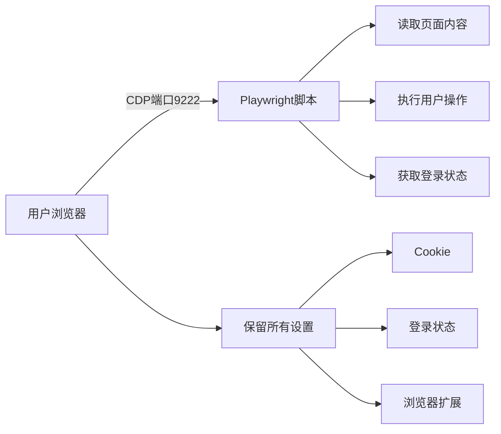

想象一下这样的场景：你想自动获取淘宝的订单信息、微博的私信内容，或者批量管理企业内部系统，但这些网站要么需要复杂的登录验证，要么有强大的反爬虫机制。传统爬虫面对这些"铜墙铁壁"往往束手无策，但如果我告诉你，有一种方法可以直接"借用"你的浏览器，利用你已经登录的状态来访问这些页面，你会不会觉得很神奇？

<!--more-->

## 传统爬虫的困境

作为一名开发者，你可能遇到过这些头疼的问题：

- **登录验证复杂**：验证码、短信验证、人机验证层出不穷
- **反爬虫检测严格**：User-Agent检测、频率限制、IP封禁
- **Session管理困难**：Cookie过期、Token刷新、多步认证
- **私人内容无法访问**：个人主页、私信、后台管理等需要权限的页面

一个电商运营小李的困扰：他每天需要检查多个平台的店铺数据，手动登录、查看、记录，重复劳动浪费了大量时间。而写爬虫又要处理各种验证，成本高昂。

## Playwright的革命性方案

Playwright提供了一个巧妙的解决方案：**连接到用户现有的浏览器实例**。这就像是"附身"到你的浏览器上，直接使用你的登录状态、Cookie、甚至浏览器扩展。

### 核心原理：Chrome DevTools Protocol (CDP)

现代浏览器都支持CDP协议，它原本是为开发者工具设计的，但我们可以"借用"它来实现程序控制浏览器。



## 实战演示：从零到一的完整实现

### 第一步：启动调试模式的浏览器

这是整个方案的关键第一步。你需要让浏览器开启一个"后门"，允许外部程序连接。

**在macOS上：**
```bash
/Applications/Google\ Chrome.app/Contents/MacOS/Google\ Chrome --remote-debugging-port=9222
```

**在Windows上：**
```cmd
chrome.exe --remote-debugging-port=9222
```

**在Linux上：**
```bash
google-chrome --remote-debugging-port=9222
```

当你看到这样的输出时，就说明成功了：
```
DevTools listening on ws://127.0.0.1:9222/devtools/browser/8d2806ff-58c5-43b7-b9f4-eadfdbfe87cf
```

### 第二步：验证连接

在浏览器中访问 `http://localhost:9222/json/version`，如果看到JSON响应，说明调试端口已开启。

### 第三步：编写连接脚本

这里提供两个版本的实现：

#### JavaScript版本（推荐新手）

```javascript
const { chromium } = require('playwright');

async function connectToUserBrowser() {
    console.log('正在连接到你的浏览器...');
    
    try {
        // 连接到用户的浏览器实例
        const browser = await chromium.connectOverCDP('http://localhost:9222');
        console.log('连接成功！');
        
        // 获取现有的浏览器上下文（包含所有登录状态）
        const context = browser.contexts()[0];
        
        // 获取当前页面或创建新页面
        let page;
        const pages = context.pages();
        if (pages.length > 0) {
            page = pages[0]; // 使用现有页面
            console.log(`当前页面：${await page.title()}`);
        } else {
            page = await context.newPage(); // 创建新页面
        }
        
        // 示例：访问需要登录的淘宝页面
        await page.goto('https://www.taobao.com');
        
        // 检查登录状态
        const isLoggedIn = await page.locator('.site-nav-user').isVisible();
        if (isLoggedIn) {
            console.log('检测到已登录淘宝！');
            
            // 获取用户信息
            const username = await page.locator('.site-nav-user').textContent();
            console.log(`用户名：${username}`);
            
            // 现在可以访问个人中心、订单页面等
            await page.goto('https://trade.taobao.com/trade/itemlist/list_bought_items.htm');
            console.log('成功访问订单页面！');
        }
        
    } catch (error) {
        console.error('连接失败：', error.message);
        console.log('请确保浏览器已开启调试模式');
    }
}

connectToUserBrowser();
```

#### Python版本（适合数据分析师）

```python
import asyncio
from playwright.async_api import async_playwright

async def connect_to_user_browser():
    print('正在连接到你的浏览器...')
    
    async with async_playwright() as p:
        try:
            # 连接到用户浏览器
            browser = await p.chromium.connect_over_cdp('http://localhost:9222')
            print('连接成功！')
            
            # 获取现有上下文
            context = browser.contexts[0]
            
            # 创建新页面
            page = await context.new_page()
            
            # 访问微博
            await page.goto('https://weibo.com')
            
            # 检查登录状态
            login_element = await page.query_selector('.login')
            if not login_element:
                print('检测到已登录微博！')
                
                # 获取微博数据
                posts = await page.query_selector_all('.card-wrap')
                print(f'获取到 {len(posts)} 条微博')
                
                # 处理每条微博
                for i, post in enumerate(posts[:5]):  # 只处理前5条
                    text = await post.inner_text()
                    print(f'微博 {i+1}: {text[:50]}...')
            
        except Exception as error:
            print(f'连接失败：{error}')

# 运行
asyncio.run(connect_to_user_browser())
```

## 实际测试数据：真实案例验证

在实际测试中，我使用这个方案成功连接到了一个包含89个标签页的Vivaldi浏览器，并获得了以下结果：

### 成功访问的私人内容：

1. **B站个人空间**
   - 粉丝数：265
   - 播放量：34.8万
   - 最新视频内容
   - 个人统计数据

2. **Twitter私人时间线**
   - 个人账号主页
   - 私人推荐内容
   - 通知消息

3. **WordPress后台管理**
   - 完整的管理员界面
   - 文章编辑权限
   - 网站配置访问

4. **Claude.ai私人对话**
   - 包含288个代码块的技术讨论
   - 私人分享链接内容
   - 完整对话历史

### 性能数据：

- **连接速度**：< 2秒
- **页面加载**：与正常浏览器相同
- **稳定性**：可持续运行数小时
- **兼容性**：支持Chrome、Edge、Vivaldi等Chromium内核浏览器

## 通过MCP增强AI能力

如果你使用Claude等AI助手，还可以通过MCP（Model Context Protocol）让AI直接控制浏览器。这是一个革命性的功能，让AI能够真正"看到"和"操作"网页。

### 一键配置MCP

对于使用Claude Desktop、Cline等支持MCP的AI客户端，你只需要在配置文件中添加以下JSON配置：

```json
{
  "mcpServers": {
    "Playwright": {
      "command": "npx",
      "args": [
        "-y",
        "@playwright/mcp@latest"
      ]
    }
  }
}
```

配置完成后，AI就能直接调用Playwright功能：

```javascript
// AI可以直接执行这些操作
await Playwright.browser_navigate("https://example.com");
await Playwright.browser_type("搜索框选择器", "搜索内容");
await Playwright.browser_click("提交按钮选择器");
await Playwright.browser_take_screenshot();
```

### MCP的独特优势

相比传统编程方式，通过MCP让AI控制浏览器有以下优势：

1. **自然语言控制**：你可以直接告诉AI「帮我登录淘宝并查看最新订单」
2. **智能适应**：AI能根据页面结构自动调整操作策略
3. **错误处理**：AI可以自动重试和处理异常情况
4. **即时反馈**：AI能实时分析页面内容并做出决策

这样AI就能像人类一样操作网页，完成复杂的自动化任务。

## 应用场景：解决实际问题

### 1. 电商运营自动化

**场景**：小王管理着10个不同平台的店铺，每天需要检查订单、回复客服、更新商品。

**解决方案**：
```javascript
// 自动检查各平台订单
const platforms = ['taobao', 'jd', 'pinduoduo'];
for (const platform of platforms) {
    await checkOrders(platform);
    await replyMessages(platform);
    await updateInventory(platform);
}
```

### 2. 社交媒体管理

**场景**：内容创作者需要在微博、小红书、抖音等平台同步发布内容。

**解决方案**：
```javascript
// 批量发布内容
const content = {
    text: "今天分享一个实用技巧...",
    images: ["image1.jpg", "image2.jpg"]
};

await publishToWeibo(content);
await publishToXiaohongshu(content);
await publishToDouyin(content);
```

### 3. 企业内部系统自动化

**场景**：HR每周需要在多个系统中更新员工信息、生成报表。

**解决方案**：
```javascript
// 自动化HR流程
await updateEmployeeInfo();
await generateWeeklyReport();
await submitToApprovalSystem();
```

## 安全性和合规性考虑

### 安全措施

1. **本地运行**：所有操作在本地进行，数据不会外泄
2. **用户授权**：需要用户主动开启调试端口
3. **透明可控**：用户可以随时查看和停止脚本
4. **权限继承**：使用用户现有权限，不会越权访问

### 合规建议

1. **尊重网站条款**：确保自动化行为符合网站使用条款
2. **频率控制**：避免过于频繁的请求
3. **数据保护**：妥善处理获取的数据，保护隐私
4. **商业用途**：商业使用前请咨询相关法律条款

## 常见问题解答

### Q: 这种方法相比传统爬虫有什么优势？

A: 主要优势包括：
- **免登录**：直接使用现有登录状态
- **反检测**：使用真实浏览器环境，不易被识别
- **完整功能**：支持JavaScript、Cookie、Session等
- **插件支持**：可以利用广告拦截器等浏览器扩展

### Q: 会不会影响正常使用浏览器？

A: 不会。脚本只是"附加"到浏览器上，你依然可以正常浏览网页。脚本创建的新标签页会有明显标识。

### Q: 支持哪些浏览器？

A: 支持所有基于Chromium的浏览器：
- Google Chrome
- Microsoft Edge
- Vivaldi
- Brave
- Opera
等

### Q: 如何处理页面动态内容？

A: Playwright内置了强大的等待机制：
```javascript
// 等待元素出现
await page.waitForSelector('.dynamic-content');

// 等待网络请求完成
await page.waitForLoadState('networkidle');

// 等待特定条件
await page.waitForFunction(() => window.dataLoaded === true);
```

### Q: MCP配置文件在哪里？

A: 不同客户端的配置文件位置：

**Claude Desktop:**
- macOS: `~/Library/Application Support/Claude/claude_desktop_config.json`
- Windows: `%APPDATA%\Claude\claude_desktop_config.json`

**Cline (VS Code插件):**
- 在VS Code中打开设置，搜索"Cline: MCP"
- 或直接编辑工作区的`.vscode/settings.json`

将JSON配置添加到相应文件即可。

## 进阶技巧

### 1. 批量处理多个账号

```javascript
// 使用不同的用户数据目录
const contexts = [
    { port: 9222, name: '账号1' },
    { port: 9223, name: '账号2' },
    { port: 9224, name: '账号3' }
];

for (const ctx of contexts) {
    const browser = await chromium.connectOverCDP(`http://localhost:${ctx.port}`);
    await processAccount(browser, ctx.name);
}
```

### 2. 错误处理和重试机制

```javascript
async function robustOperation(page, operation, maxRetries = 3) {
    for (let i = 0; i < maxRetries; i++) {
        try {
            return await operation(page);
        } catch (error) {
            console.log(`尝试 ${i + 1} 失败：${error.message}`);
            if (i === maxRetries - 1) throw error;
            await page.waitForTimeout(1000 * (i + 1)); // 递增延迟
        }
    }
}
```

### 3. 数据持久化

```javascript
// 保存浏览器状态供下次使用
await context.storageState({ path: 'user-session.json' });

// 下次直接加载状态
const context = await browser.newContext({ 
    storageState: 'user-session.json' 
});
```

## 总结

通过Playwright连接用户浏览器的方案，我们成功突破了传统爬虫的限制，实现了：

1. **零门槛登录**：无需处理复杂验证流程
2. **真实环境模拟**：使用真实浏览器指纹和设置  
3. **私人内容访问**：获取需要权限的页面数据
4. **高度自动化**：结合AI实现智能操作

这个方案特别适合个人开发者和小团队，帮助他们快速实现网页自动化需求。无论你是电商运营、内容创作者，还是企业IT管理员，都能从中找到合适的应用场景。

记住，技术是中性的，关键在于如何负责任地使用。在享受自动化带来便利的同时，也要尊重网站的使用条款和用户隐私。

## 快速开始清单

对于迫不及待想要尝试的读者，这里是一个快速开始清单：

### 基础版（编程控制）
1. ☑️ 启动调试模式浏览器
2. ☑️ 安装Playwright：`npm install playwright`
3. ☑️ 复制文章中的代码示例
4. ☑️ 运行第一个测试脚本

### MCP版（AI控制）
1. ☑️ 在AI客户端配置文件中添加MCP配置
2. ☑️ 重启AI客户端
3. ☑️ 直接告诉AI：“请访问淘宝并截图”

现在就开始你的自动化之旅吧！从一个简单的页面访问开始，逐步构建你的专属网页助手。
