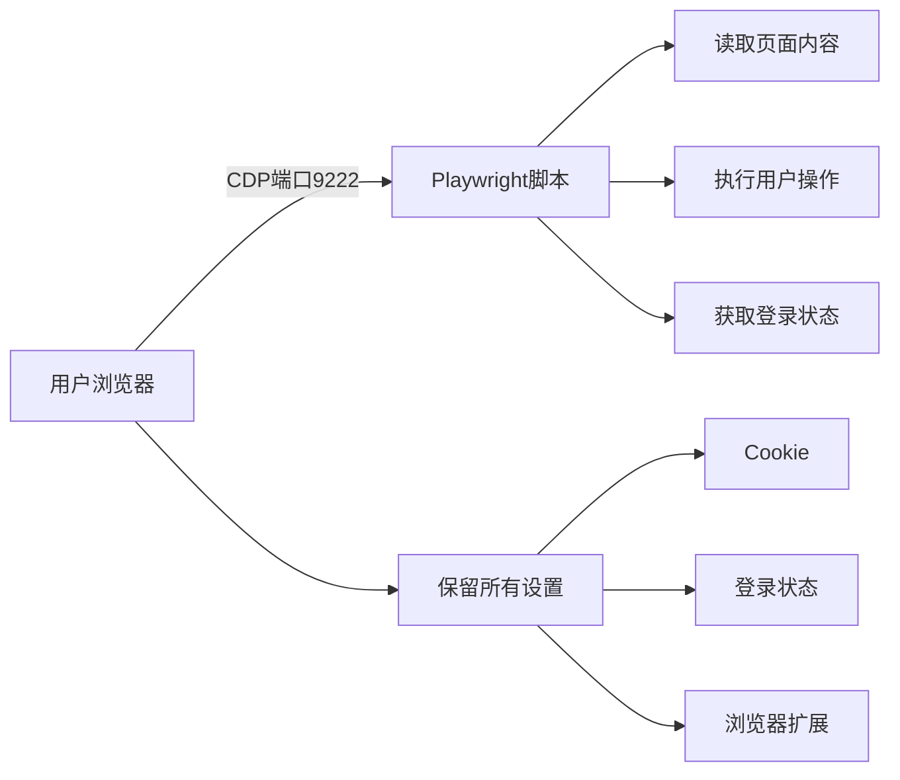

Представьте себе такой сценарий: вы хотите автоматически получить информацию о заказах на Taobao, личные сообщения в Twitter или пакетное управление внутренними системами, но эти сайты либо требуют сложной аутентификации при входе, либо имеют мощный механизм защиты от краулеров. Традиционные краулеры часто оказываются беспомощными перед лицом этих "кирпичных стен", но если я скажу вам, что существует способ напрямую "позаимствовать" ваш браузер, используя ваш статус входа в систему для доступа к этим страницам, вы подумаете, что это удивительно?

<!--more-->

## 传统爬虫的困境

Как разработчик, вы наверняка сталкивались с этой головной болью:

- **Сложная проверка логина**: CAPTCHA, SMS-верификация, человеко-машинная верификация - бесконечное множество вариантов.
- **Строгое обнаружение антикраулеров**: обнаружение User-Agent, ограничение частоты, блокировка IP-адресов.
- **Сложность управления сессиями**: истечение срока действия куки, обновление токенов, многоступенчатая аутентификация
- **Приватное содержимое недоступно**: личная домашняя страница, личные сообщения, управление фоном и другие страницы, требующие разрешений.

Проблема Сяо Ли в электронной коммерции: ему приходится каждый день проверять данные о магазине на нескольких платформах, вручную входить в систему, проверять и записывать, тратя массу времени на повторяющийся труд. А при написании краулера приходится заниматься всевозможными проверками, что требует больших затрат.

## Playwright的革命性方案

Playwright предлагает гениальное решение: **подключение к существующему экземпляру браузера пользователя**. Это как "прикрепление" к браузеру и прямое использование статуса входа, файлов cookie и даже расширений браузера.

### 核心原理：Chrome DevTools Protocol (CDP)

Современные браузеры поддерживают протокол CDP, который изначально создавался как инструмент разработчика, но мы можем "позаимствовать" его для реализации программного управления браузером.



## 实战演示：从零到一的完整实现

### 第一步：启动调试模式的浏览器

Это ключевой первый шаг во всей программе. Вы должны разрешить браузеру открыть "черный ход", чтобы позволить внешним программам подключаться.

**在macOS上：**
```bash
/Applications/Google\ Chrome.app/Contents/MacOS/Google\ Chrome --remote-debugging-port=9222
```

**在Windows上：**
```cmd
chrome.exe --remote-debugging-port=9222
```

**在Linux上：**
```bash
google-chrome --remote-debugging-port=9222
```

当你看到这样的输出时，就说明成功了：
```
DevTools listening on ws://127.0.0.1:9222/devtools/browser/8d2806ff-58c5-43b7-b9f4-eadfdbfe87cf
```

### 第二步：验证连接

Зайдите на `http://localhost:9222/json/version` в браузере, и если вы увидите ответ в формате JSON, значит, отладочный порт открыт.

### 第三步：编写连接脚本

Здесь представлены две версии реализации:

#### JavaScript版本（推荐新手）

```javascript
const { chromium } = require('playwright');

async-функция connectToUserBrowser() {
    console.log('Подключение к браузеру...') ;

    try {
        // Подключение к экземпляру браузера пользователя
        const browser = await chromium.connectOverCDP('http://localhost:9222');
        console.log('Подключение успешно!') ;

        // Получаем существующий контекст браузера (со всеми состояниями входа)
        const context = browser.contexts()[0];

        // Получение текущей или создание новой страницы
        let page; const pages = context.pages(); // Получение текущей страницы или создание новой.
        const pages = context.pages(); if (pages.length > 0)
        if (pages.length > 0) {
            page = pages[0]; // используем существующую страницу
            console.log(`текущая страница: ${await page.title()}`); } else { page = page[0]; // использовать существующую страницу.
        } else {
            page = await context.newPage(); // создаем новую страницу
        }

        // Пример: доступ к странице Taobao, требующей логина
        await page.goto('https://www.taobao.com'); // Создаем новую страницу.

        // Проверяем статус входа
        const isLoggedIn = await page.locator('.site-nav-user').isVisible(); if (isLoggedIn) { // проверка статуса входа в систему; // проверка статуса входа в систему.
        if (isLoggedIn) {
            console.log('Вход на Taobao обнаружен!) ;

            // Получение информации о пользователе
            const username = await page.locator('.site-nav-user').textContent();
            console.log(`Имя пользователя: ${username}`);;

            // Теперь вы можете получить доступ к своему персональному центру, странице заказа и т.д.
            await page.goto('https://trade.taobao.com/trade/itemlist/list_bought_items.htm'); // Теперь вы можете получить доступ к своему персональному центру, странице заказа и т. д.
            console.log('Успешный доступ к странице заказов!') ;)
        }

    } catch (error) {
        console.error('Не удалось установить соединение:', error.message); } catch (error) { console.log('Убедитесь, что ваш браузер получил доступ к странице заказов!
        console.log('Убедитесь, что в вашем браузере включен режим отладки'); }
    }
}

connectToUserBrowser();
```

#### Python版本（适合数据分析师）

```python
import asyncio
from playwright.async_api import async_playwright

async def connect_to_user_browser().
    print('Подключение к вашему браузеру...')

    async с async_playwright() as p.
        try.
            # Подключение к браузеру пользователя
            browser = await p.chromium.connect_over_cdp('http://localhost:9222')
            print('Соединение успешно!')

            # Получение существующих контекстов
            context = browser.contexts[0]

            # Создание новой страницы
            page = await context.new_page()

            # Доступ к микроблогу
            await page.goto('https://weibo.com')

            # Проверка статуса входа в систему
            login_element = await page.query_selector('.login')
            if not login_element.
                print('Вход в твиттер обнаружен!')

                # Получение данных микроблога
                posts = await page.query_selector_all('.card-wrap')
                print(f'Fetched {len(posts)} tweets')

                # Обработка каждого твита
                for i, post in enumerate(posts[:5]): # обрабатываем только первые 5 сообщений
                    text = await post.inner_text()
                    print(f'tweet {i+1}: {text[:50]}...')

        except Exception as error: print(f'Twitter {i+1}: {text[:50]}...')
            print(f'Connection failed: {error}')

# 运行
asyncio.run(connect_to_user_browser())
```

## 实际测试数据：真实案例验证

В ходе реального тестирования я использовал это решение для успешного подключения к браузеру Vivaldi, содержащему 89 вкладок, и получил следующие результаты:

### 成功访问的私人内容：

1. **Личное пространство на сайте B**
   - Количество поклонников: 265
   - Просмотров: 348 000
   - Последние видеоматериалы
   - Личная статистика

2. **Личная временная шкала Twitter**.
   - Домашняя страница личного аккаунта
   - Приватный рекомендуемый контент
   - Сообщения уведомлений

3. **Администрирование бэкенда WordPress**
   - Полный интерфейс администратора
   - Доступ к редактированию статей
   - Доступ к настройке сайта

4. **Приватный диалог Claude.ai**
   - Техническое обсуждение, содержащее 288 блоков кода
   - Приватный обмен связанным контентом
   - Полная история диалога

### 性能数据：

- **Скорость подключения**: < 2 секунд
- **Загрузка страниц**: такая же, как в обычном браузере
- **Стабильность**: работает непрерывно в течение нескольких часов
- **Совместимость**: поддерживает Chrome, Edge, Vivaldi и другие браузеры на ядре Chromium.

## 通过MCP增强AI能力

Если вы используете ИИ-помощника, например Claude, вы также можете позволить ему управлять браузером напрямую через MCP (Model Context Protocol). Это революционная функция, которая позволяет ИИ фактически "видеть" и "манипулировать" веб-страницами.

### 一键配置MCP

Для использования клиентов AI с поддержкой MCP, таких как Claude Desktop, Cline и т. д., вам просто нужно добавить следующую конфигурацию JSON в файл конфигурации:

```json
{
  "mcpServers": {
    "Playwright": {
      "command": "npx",
      "args": [
        "-y",
        "@playwright/mcp@latest"
      ]
    }
  }
}
```

После настройки ИИ сможет напрямую вызывать функцию Playwright:

```javascript
// AI可以直接执行这些操作
await Playwright.browser_navigate("https://example.com");
await Playwright.browser_type("搜索框选择器", "搜索内容");
await Playwright.browser_click("提交按钮选择器");
await Playwright.browser_take_screenshot();
```

### MCP的独特优势

По сравнению с традиционными методами программирования, возможность ИИ управлять браузером через MCP имеет следующие преимущества:

1. **Управление на естественном языке**: Вы можете напрямую сказать ИИ "Помогите мне войти на Taobao и проверить последние заказы".
2. **Интеллектуальная адаптация**: ИИ может автоматически корректировать стратегию работы в соответствии со структурой страницы.
3. **Обработка ошибок**: ИИ может автоматически повторять попытки и обрабатывать исключения.
4. **Мгновенная обратная связь**: ИИ может анализировать содержимое страницы и принимать решения в режиме реального времени.

Это позволяет ИИ манипулировать веб-страницами и выполнять сложные автоматизированные задачи так же, как люди.

## 应用场景：解决实际问题

### 1. 电商运营自动化

**Сценарий**: Сяо Ван управляет магазинами на 10 различных платформах и должен ежедневно проверять заказы, отвечать на запросы клиентов и обновлять товары.

**解决方案**：
```javascript
// 自动检查各平台订单
const platforms = ['taobao', 'jd', 'pinduoduo'];
for (const platform of platforms) {
    await checkOrders(platform);
    await replyMessages(platform);
    await updateInventory(platform);
}
```

### 2. 社交媒体管理

**Сценарий**: Создателям контента необходимо одновременно публиковать материалы на Weibo, Xiaohongshu, Jieyin и других платформах.

**解决方案**：
```javascript
// 批量发布内容
const content = {
    text: "今天分享一个实用技巧...",
    images: ["image1.jpg", "image2.jpg"]
};

await publishToWeibo(content);
await publishToXiaohongshu(content);
await publishToDouyin(content);
```

### 3. 企业内部系统自动化

**Сценарий**: отделу кадров необходимо еженедельно обновлять информацию о сотрудниках и формировать отчеты в нескольких системах.

**解决方案**：
```javascript
// 自动化HR流程
await updateEmployeeInfo();
await generateWeeklyReport();
await submitToApprovalSystem();
```

## 安全性和合规性考虑

### 安全措施

1. **Локальная работа**: все операции выполняются локально, утечка данных исключена
2. **Авторизация пользователя**: требуется, чтобы пользователь активно открыл порт отладки.
3. **Прозрачность и управляемость**: пользователи могут просматривать и останавливать работу скрипта в любое время.
4. **Наследование привилегий**: использование существующих привилегий пользователя, не превышающих права доступа

### 合规建议

1. **Уважение к условиям использования веб-сайта**: обеспечение соответствия автоматического поведения условиям использования веб-сайта
2. **Контроль частоты**: избегайте слишком частых запросов.
3. **Защита данных**: надлежащим образом обрабатывайте полученные данные, чтобы защитить вашу конфиденциальность.
4. **Коммерческое использование**: перед коммерческим использованием ознакомьтесь с соответствующими юридическими условиями.

## 常见问题解答

### Q: 这种方法相比传统爬虫有什么优势？

О: Основные преимущества включают:
- **Нет входа**: напрямую используйте существующий статус входа.
- **Антиобнаружение**: использование реальной среды браузера, нелегко быть распознанным
- **Полная функциональность**: поддерживает JavaScript, Cookies, Session и т.д.
- **Поддержка плагинов**: можно использовать преимущества расширений браузера, таких как блокировщики рекламы

### Q: 会不会影响正常使用浏览器？

О: Нет. Скрипт просто "прикрепляется" к браузеру, и вы можете продолжать просматривать веб-страницы в обычном режиме. Новые вкладки, созданные скриптом, будут четко обозначены.

### Q: 支持哪些浏览器？

О: Поддерживаются все браузеры на базе Chromium:
- Google Chrome
- Microsoft Edge
- Вивальди
- Вивальди
- Opera
и т.д.

### Q: 如何处理页面动态内容？

A: Playwright内置了强大的等待机制：
```javascript
// 等待元素出现
await page.waitForSelector('.dynamic-content');

// Дождитесь завершения сетевого запроса
await page.waitForLoadState('networkidle');

// 等待特定条件
await page.waitForFunction(() => window.dataLoaded === true);
```

### Q: MCP配置文件在哪里？

A: Расположение файлов конфигурации для разных клиентов:

**Клод Десктоп:**.
- macOS: `~/Library/Application Support/Claude/claude_desktop_config.json`.
- Windows: `%APPDATA%\Claude\claude_desktop_config.json`

**Cline (плагин для VS Code):**.
- Откройте Settings в VS Code и найдите "Cline: MCP".
- или просто отредактируйте `.vscode/settings.json` в рабочем пространстве

Просто добавьте конфигурацию JSON в соответствующий файл.

## 进阶技巧

### 1. 批量处理多个账号

```javascript
// 使用不同的用户数据目录
const contexts = [
    { port: 9222, name: '账号1' },
    { port: 9223, name: '账号2' },
    { port: 9224, name: '账号3' }
];

for (const ctx of contexts) {
    const browser = await chromium.connectOverCDP(`http://localhost:${ctx.port}`);
    await processAccount(browser, ctx.name);
}
```

### 2. 错误处理和重试机制

```javascript
async function robustOperation(page, operation, maxRetries = 3) {
    for (let i = 0; i < maxRetries; i++) {
        try {
            return await operation(page);
        } catch (error) {
            console.log(`尝试 ${i + 1} 失败：${error.message}`);
            if (i === maxRetries - 1) throw error;
            await page.waitForTimeout(1000 * (i + 1)); // 递增延迟
        }
    }
}
```

### 3. 数据持久化

```javascript
// 保存浏览器状态供下次使用
await context.storageState({ path: 'user-session.json' });

// 下次直接加载状态
const context = await browser.newContext({ 
    storageState: 'user-session.json' 
});
```

## 总结

Благодаря тому, что Playwright подключается к браузеру пользователя, мы успешно преодолели ограничения традиционных краулеров:

1. **Нулевой порог входа**: нет необходимости разбираться со сложными процессами аутентификации
2. **Имитация реальной среды**: использование реальных отпечатков пальцев и настроек браузера
3. **Доступ к частному содержимому**: получение данных о странице, требующей разрешения.
4. **Высокая степень автоматизации**: в сочетании с искусственным интеллектом для достижения интеллектуальной работы

Это решение особенно подходит для индивидуальных разработчиков и небольших команд, помогая им быстро реализовать свои потребности в веб-автоматизации. Независимо от того, занимаетесь ли вы электронной коммерцией, создаете контент или являетесь ИТ-администратором предприятия, вы сможете найти в нем подходящий сценарий применения.

Помните, что технология нейтральна; все дело в том, насколько ответственно она используется. Наслаждаясь удобством автоматизации, важно соблюдать условия использования веб-сайтов и конфиденциальность пользователей.

## 快速开始清单

Для читателей, которым не терпится опробовать его, вот список для быстрого старта:

### 基础版（编程控制）
1. ☑️ 启动调试模式浏览器
2. ☑️ 安装Playwright：`npm install playwright`
3. ☑️ 复制文章中的代码示例
4. ☑️ 运行第一个测试脚本

### MCP版（AI控制）
1. ☑️ 在AI客户端配置文件中添加MCP配置
2. ☑️ 重启AI客户端
3. ☑️ 直接告诉AI：“请访问淘宝并截图”

Начните свой путь к автоматизации прямо сейчас! Начните с простого посещения страницы и шаг за шагом создавайте своего веб-помощника.