想象一下，如果每个城市都有自己独特的交通规则：红灯在一个城市表示通行，在另一个城市表示停止；有些地方靠左行驶，有些地方靠右行驶，而且没有任何标准可循。这样的世界会是什么样子？

这正是 1980 年代计算机世界的真实写照。不同的 Unix 系统各自为政，相同的程序无法在不同系统间移植，程序员们苦不堪言。直到一个名为 POSIX 的标准出现，它就像制定了统一的"交通规则"，让整个计算机世界变得井然有序。

<!--more-->

## 从混乱到秩序：POSIX 诞生的故事

### 1980 年代的"Unix 战争"

在 POSIX 出现之前，Unix 世界就像是一片群雄割据的战国：

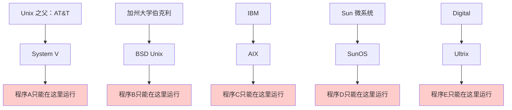

每家公司都在自己的 Unix 版本中添加独特功能，导致：
- 相同的系统调用在不同系统中表现不同
- 命令行工具的参数和行为各不相同
- 程序员需要为每个系统单独适配代码

### POSIX：统一规则的制定者

1985 年，IEEE（电气和电子工程师学会）开始制定一个标准，目标很简单：**让程序能够在不同的 Unix-like 系统之间自由移植**。

这个标准就是 **POSIX**（Portable Operating System Interface），它的作用就像是制定了计算机系统的"交通规则"。

## POSIX 是什么？一个看不见的魔法层

### 传统的计算机层次结构

我们通常这样理解计算机系统：

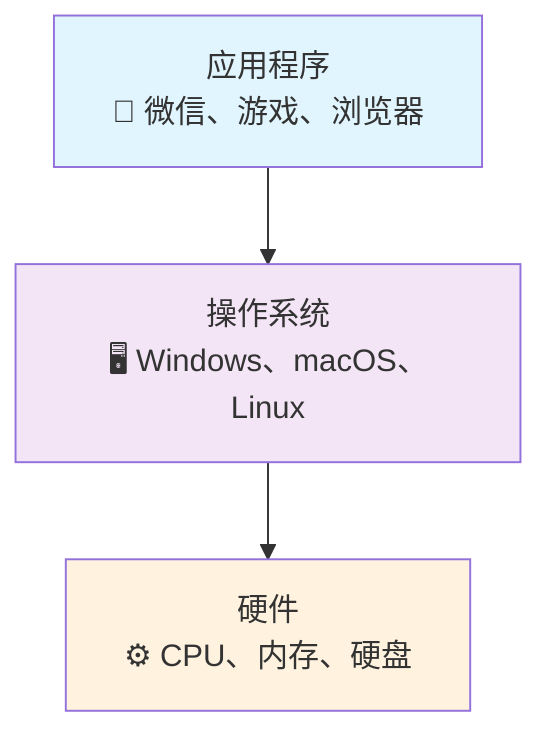

### POSIX 的真实位置

但实际上，POSIX 在其中扮演了一个隐形但至关重要的角色：

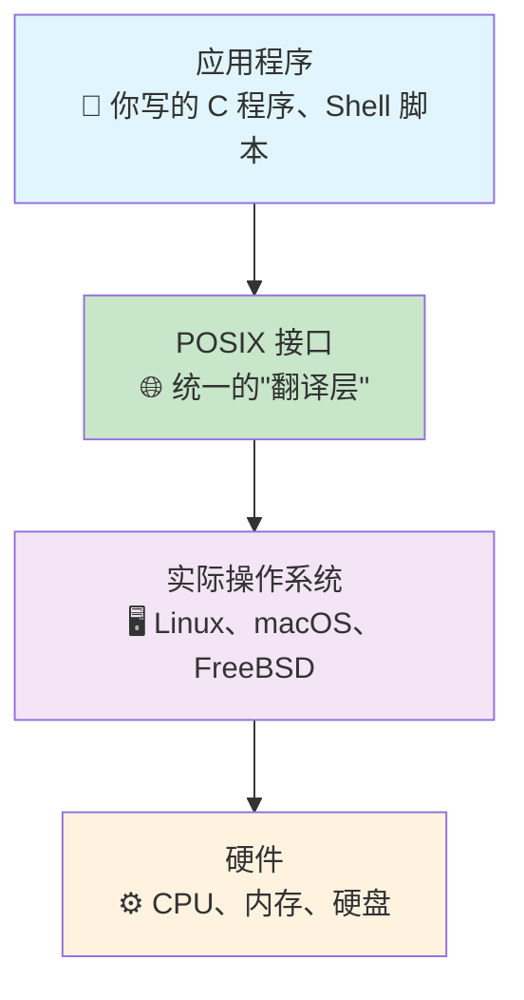

POSIX 就像一个**通用翻译器**，它告诉应用程序："你只需要学会一套标准语言，我来负责和不同的操作系统沟通。"

## POSIX 如何工作：以文件操作为例

让我们通过一个具体例子来理解 POSIX 的工作原理。

### 没有 POSIX 的世界

假设你要写一个简单的程序来读取文件：

```c
// 在不同系统上需要不同的代码
#ifdef SYSTEM_V
    int fd = sysv_open_file(filename, SYSV_READ_MODE);
    sysv_read_data(fd, buffer, size);
#elif BSD_UNIX
    int fd = bsd_file_open(filename, BSD_READ_FLAG);
    bsd_read_content(fd, buffer, size);
#elif IBM_AIX
    int fd = aix_file_access(filename, AIX_READ_OPTION);
    aix_get_data(fd, buffer, size);
#endif
```

### 有了 POSIX 的世界

```c
// 一套代码，到处运行
int fd = open(filename, O_RDONLY);  // POSIX 标准调用
read(fd, buffer, size);             // POSIX 标准调用
close(fd);                          // POSIX 标准调用
```

### POSIX 在背后的工作

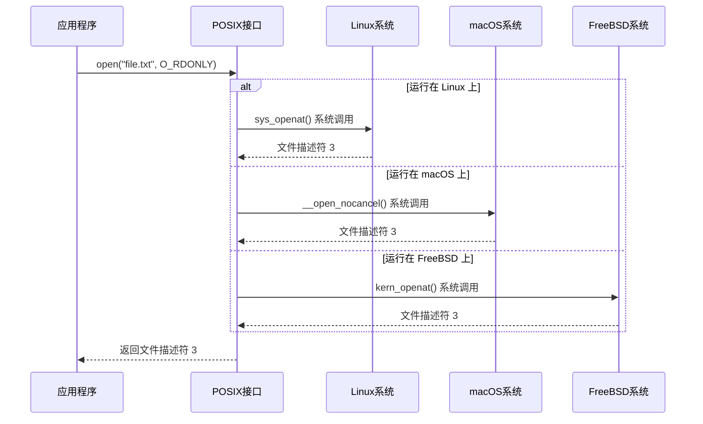

应用程序只需要知道 POSIX 标准，POSIX 层负责将这些标准调用转换为各个系统特有的实现。

## POSIX 的威力：不仅仅是系统调用

POSIX 标准不仅规范了系统调用，还包括了整个 Unix 工具链的行为。

### 命令行工具的统一化

以 `grep` 命令为例，POSIX 规定了它的基本行为：

```bash
# 这些命令在所有 POSIX 兼容系统上都有相同表现
grep "pattern" file.txt           # 基础搜索
grep -n "pattern" file.txt        # 显示行号
grep -i "pattern" file.txt        # 忽略大小写
grep -v "pattern" file.txt        # 反向匹配
```

### 正则表达式的标准化

POSIX 还定义了两套正则表达式标准：

**基础正则表达式（BRE）**：
```bash
# 用于 grep、sed 等工具
grep 'hello.*world' file.txt
sed 's/old/new/' file.txt
```

**扩展正则表达式（ERE）**：
```bash
# 用于 egrep、awk 等工具
egrep 'hello.+world' file.txt
awk '/pattern/ {print}' file.txt
```

### Shell 行为的规范

POSIX 甚至规定了 Shell 的行为，确保脚本的可移植性：

```bash
#!/bin/sh
# 这个脚本在所有 POSIX Shell 中都能正常运行

for file in *.txt; do
    if [ -f "$file" ]; then
        echo "Processing $file"
        grep "TODO" "$file" >> todos.txt
    fi
done
```

## 现代世界中的 POSIX：依然重要且无处不在

### 主流操作系统的 POSIX 支持

让我们看看当今主要操作系统对 POSIX 的支持情况：

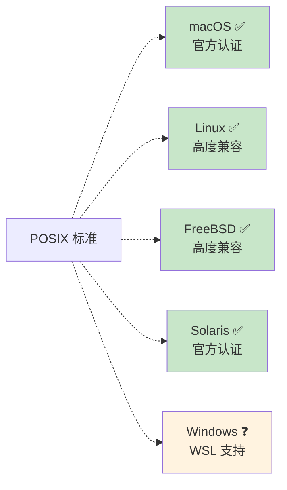

### 容器时代的 POSIX

在 Docker 和 Kubernetes 盛行的今天，POSIX 的重要性更加凸显：

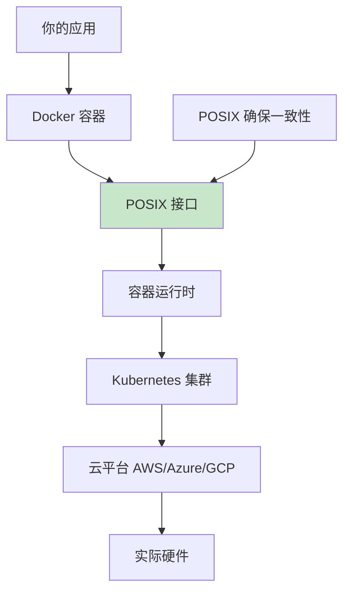

因为有了 POSIX 标准，你的应用可以：
1. 在开发机器上运行（macOS）
2. 在测试容器中运行（Alpine Linux）
3. 在生产环境中运行（Ubuntu/CentOS）
4. 在不同云平台间迁移

### 嵌入式系统中的 POSIX

从智能手机到路由器，从智能家居到汽车电子系统，很多嵌入式设备都使用简化的 POSIX 兼容系统：

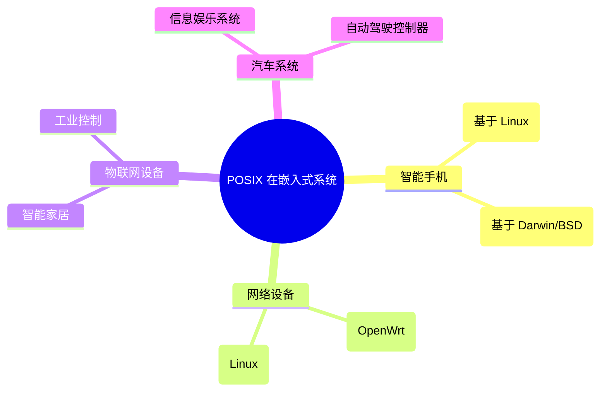

## POSIX 设计哲学：抽象层的艺术

### 好的抽象层应该具备什么特质？

POSIX 的成功告诉我们，一个优秀的抽象层应该：

**1. 足够简单，易于理解**
```c
// POSIX 的接口设计简洁明了
int fd = open(filename, O_RDONLY);  // 打开文件
ssize_t n = read(fd, buffer, size); // 读取数据
close(fd);                          // 关闭文件
```

**2. 足够稳定，向后兼容**
```bash
# 40 年前写的 POSIX 脚本，今天依然能运行
#!/bin/sh
ls -l | grep "^d" | wc -l
```

**3. 足够灵活，适应变化**
```c
// POSIX 接口可以适应不同的底层实现
// 相同的 open() 调用可以：
// - 打开本地文件
// - 访问网络文件系统
// - 操作设备文件
// - 访问虚拟文件系统
```

### 从 POSIX 学到的架构设计原则

**原则一：标准先行**
```mermaid
graph LR
    A[制定标准] --> B[各厂商实现] --> C[应用程序开发] --> D[生态繁荣]
````

**原则二：最小惊讶原则**
```bash
# POSIX 工具的行为符合直觉
cp source.txt dest.txt    # 复制文件
mv old.txt new.txt       # 移动/重命名文件
rm unwanted.txt          # 删除文件
```

**原则三：组合胜过集成**
```bash
# POSIX 工具可以自由组合
ls -l | grep "\.txt$" | wc -l          # 统计 txt 文件数量
find . -name "*.log" | xargs rm        # 删除所有日志文件
ps aux | grep python | awk '{print $2}' | xargs kill  # 杀死所有 Python 进程
```

## 现代启示：其他成功的抽象层

POSIX 的成功启发了许多其他领域的抽象层设计：

### 1. SQL：数据库的通用语言

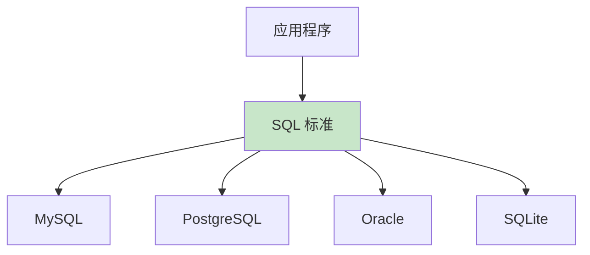

就像 POSIX 统一了操作系统接口，SQL 统一了数据库操作：

```sql
-- 相同的 SQL 在不同数据库中都能运行
SELECT name, age FROM users WHERE age > 18;
```

### 2. HTTP：互联网的通用协议

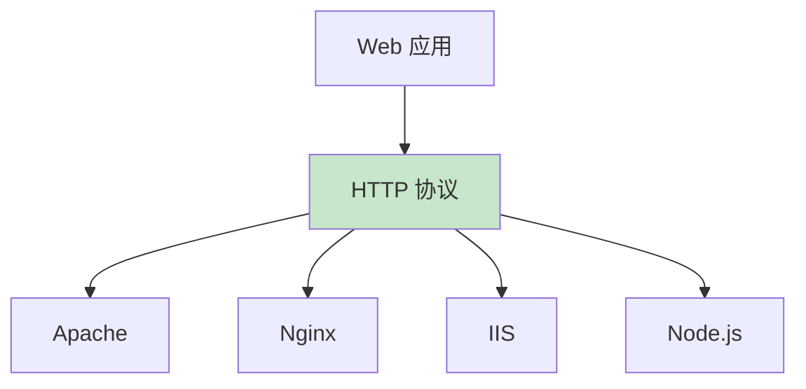

HTTP 协议让不同的 Web 服务器和客户端能够无缝通信。

### 3. Docker：容器的标准接口

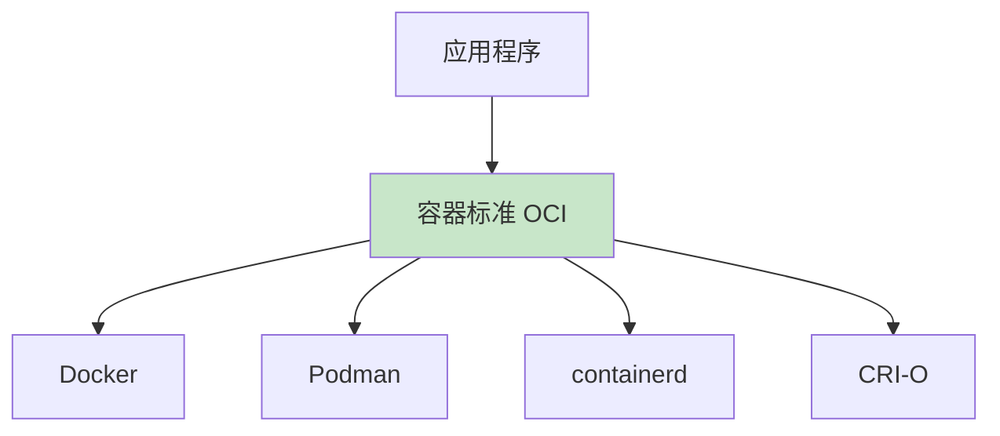

开放容器倡议（OCI）标准让容器技术实现了标准化。

### 4. WebAssembly：跨平台执行环境

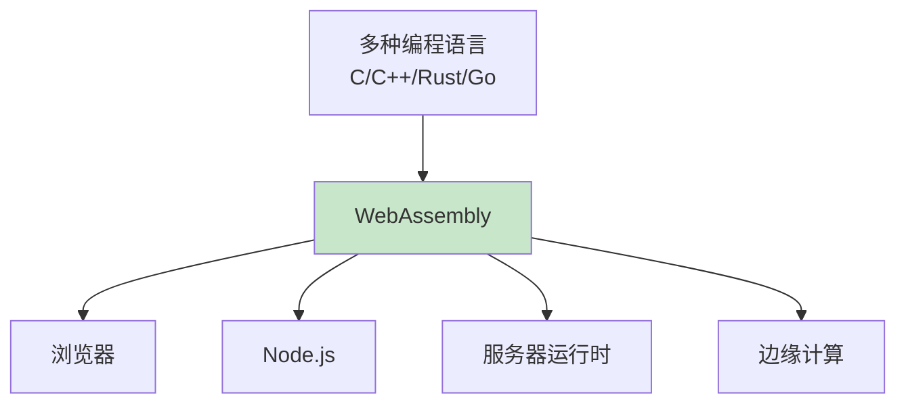

## 抽象层设计的陷阱与教训

### 成功案例的共同特点

通过分析 POSIX 和其他成功的抽象层，我们发现它们都有这些特点：

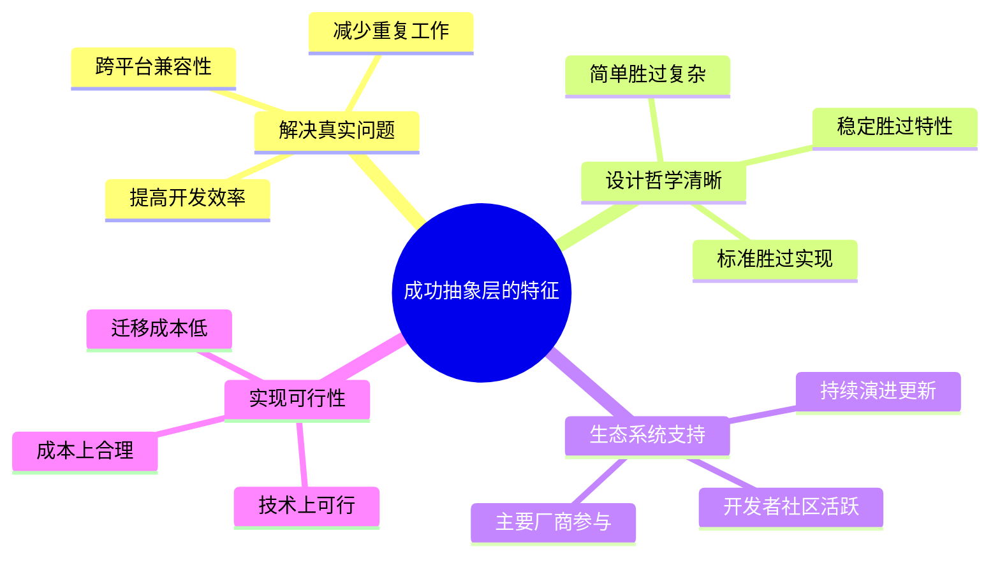

### 失败案例的教训

历史上也有一些抽象层设计失败的例子：

**过度抽象的问题**：
```java
// 某些企业级框架的过度抽象
AbstractFactoryProxyBeanDefinitionCreatorFactory factory = 
    new AbstractFactoryProxyBeanDefinitionCreatorFactoryImpl();
```

**标准战争的危害**：


## 对现代软件架构的启发

### 1. 微服务架构中的抽象层

现代微服务架构中，我们也需要类似 POSIX 的抽象层：

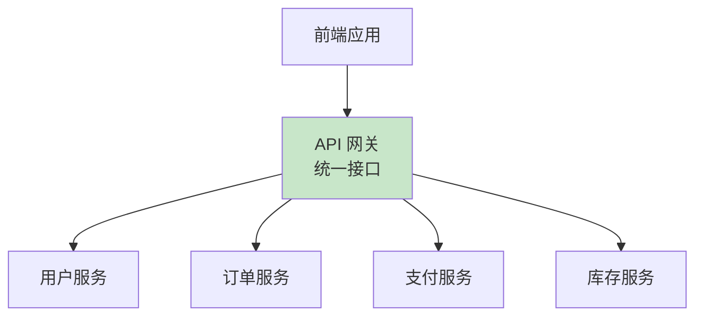

API 网关就像 POSIX 一样，为前端提供统一的接口，隐藏后端服务的复杂性。

### 2. 云原生架构中的抽象

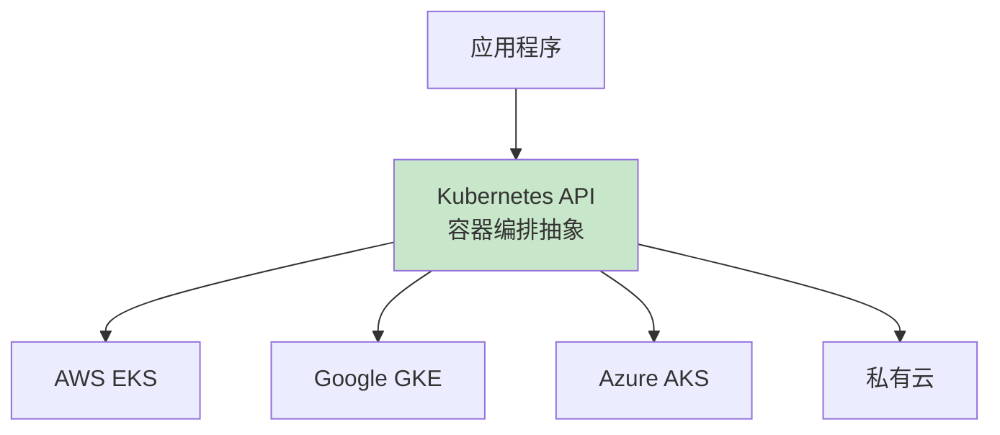

Kubernetes 提供了容器编排的标准接口，让应用可以在不同云平台间迁移。

### 3. 数据库抽象层的演进

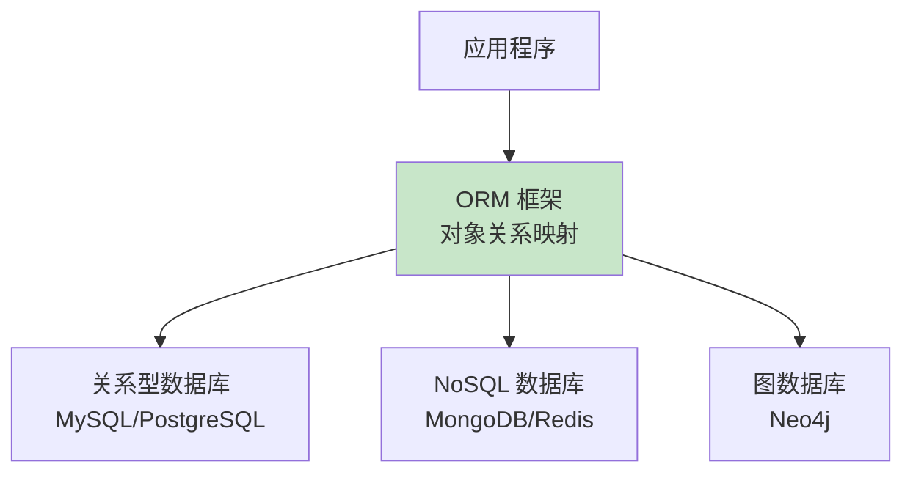

现代 ORM 框架试图抽象不同类型数据库的差异。

## 设计你自己的抽象层

### 何时需要创建抽象层？

当你遇到这些情况时，可能需要考虑设计抽象层：

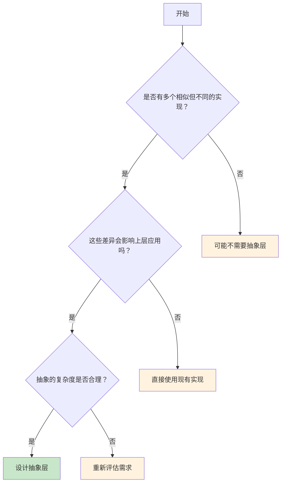

### 抽象层设计的最佳实践

**1. 从用户需求出发**
```python
# 好的抽象：简单直观
cache.set("key", "value")
cache.get("key")
cache.delete("key")

# 不好的抽象：暴露实现细节
redis_client.hset("cache:key", "field", "value")
memcached_client.set("key", pickle.dumps("value"))
```

**2. 保持接口稳定**
```python
# 版本 1.0
def send_email(to, subject, body):
    pass

# 版本 2.0 - 向后兼容的扩展
def send_email(to, subject, body, attachments=None, priority="normal"):
    pass
```

**3. 提供逃生出口**
```python
# 提供高级接口用于常见场景
database.save_user(user)

# 同时保留低级接口用于特殊需求
database.execute_raw_sql("SELECT * FROM users WHERE complex_condition")
```

## 思考未来：抽象层的发展趋势

### 1. AI 驱动的抽象层

未来的抽象层可能会集成 AI 能力：

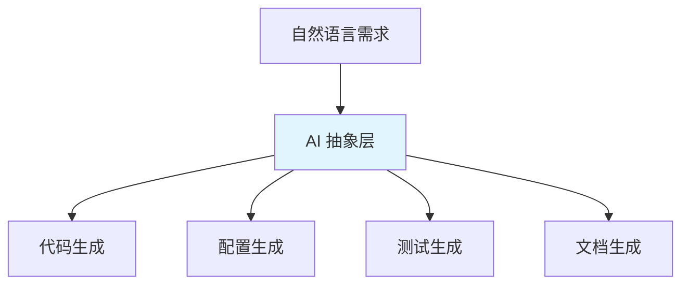

开发者可能只需要用自然语言描述需求，AI 抽象层自动生成相应的实现。

### 2. 自适应抽象层


抽象层可能会根据运行时的性能数据自动调整实现策略。

### 3. 跨语言统一抽象

```mermaid
graph TB
    A[统一抽象层] --> B[Python 绑定]
    A --> C[JavaScript 绑定]
    A --> D[Rust 绑定]
    A --> E[Go 绑定]
    
    style A fill:#fff3e0
```

未来可能出现跨编程语言的统一抽象层，让不同语言的程序能够无缝协作。

## 总结：抽象的力量

POSIX 的故事告诉我们，一个好的抽象层具有巨大的力量：

**它能够**：
- 简化复杂性，让开发者专注于业务逻辑
- 提高可移植性，降低迁移成本
- 促进创新，通过标准化接口让更多人参与
- 创造价值，建立繁荣的生态系统

**设计原则**：
- 解决真实问题，而不是为了抽象而抽象
- 保持简单，避免过度工程
- 确保稳定，维护向后兼容性
- 提供灵活性，允许特殊情况的处理

当你下次设计系统架构时，不妨问问自己：我是否需要一个抽象层？如果需要，我该如何设计才能让它像 POSIX 一样成功？

记住，最好的抽象层是那些让人感觉不到它存在的层次——它们默默工作，让复杂的事情变得简单，让不可能的协作变为可能。这就是抽象的魔法，也是 POSIX 给我们留下的宝贵遗产。
