Представьте себе, что в каждом городе были свои уникальные правила дорожного движения: красный свет означал "проехать" в одном городе и "остановиться" в другом; движение налево в одних местах и направо в других, и никаких стандартов, которым нужно следовать. Как бы выглядел такой мир?

Это правдивая картина компьютерного мира 1980-х годов. Программисты боролись с тем, что разные Unix-системы работали сами по себе, и одни и те же программы нельзя было переносить с одной системы на другую. Пока не появился стандарт под названием POSIX, который, словно единое "правило дорожного движения", навел порядок в компьютерном мире.

<!--more-->

## 从混乱到秩序：POSIX 诞生的故事

### 1980 年代的"Unix 战争"

До появления POSIX мир Unix представлял собой воюющую нацию:

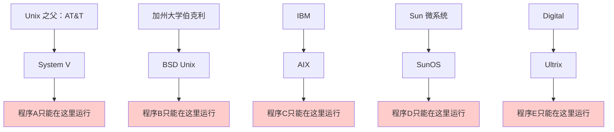

Каждая компания добавляет уникальные функции в свою версию Unix, в результате чего:
- одни и те же системные вызовы ведут себя по-разному в разных системах
- Инструменты командной строки имеют разные параметры и поведение
- Программистам приходится адаптировать код индивидуально для каждой системы.

### POSIX：统一规则的制定者

В 1985 году IEEE (Институт инженеров по электротехнике и электронике) начал работу над стандартом с простой целью: **позволить программам свободно переноситься между различными Unix-подобными системами**.

Этим стандартом является **POSIX** (Portable Operating System Interface), который выступает в качестве "правил дорожного движения" для компьютерных систем.

## POSIX 是什么？一个看不见的魔法层

### 传统的计算机层次结构

Именно так мы обычно понимаем компьютерные системы:

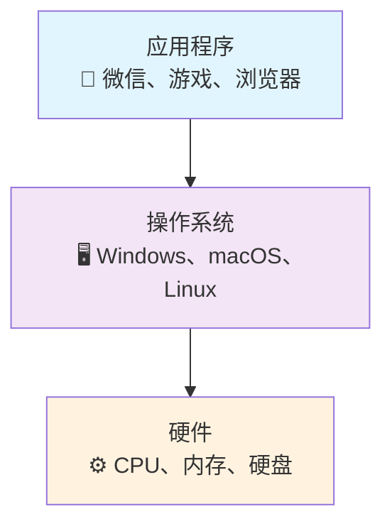

### POSIX 的真实位置

Но на самом деле POSIX играет невидимую, но жизненно важную роль:

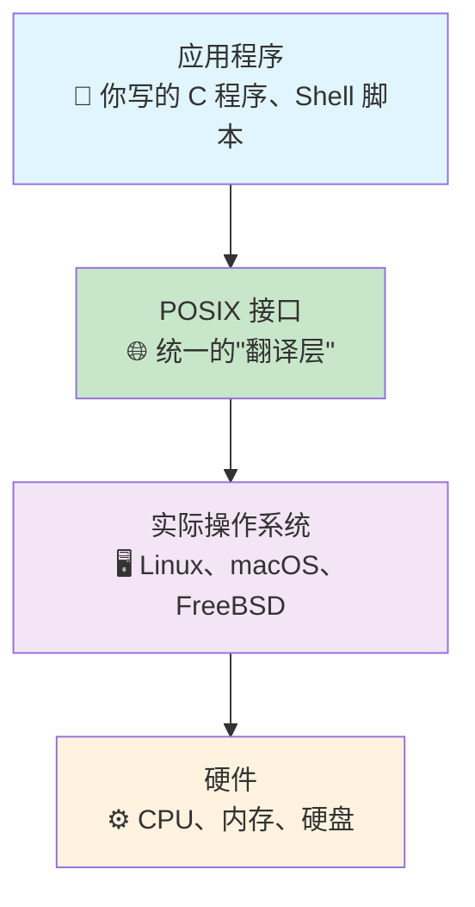

POSIX - это как **универсальный переводчик**, который говорит приложениям: "Вам просто нужно выучить стандартный набор языков, а я позабочусь о взаимодействии с различными операционными системами".

## POSIX 如何工作：以文件操作为例

Давайте разберемся, как работает POSIX, на конкретном примере.

### 没有 POSIX 的世界

Предположим, вы хотите написать простую программу для чтения файла:

```c
// 在不同系统上需要不同的代码
#ifdef SYSTEM_V
    int fd = sysv_open_file(filename, SYSV_READ_MODE);
    sysv_read_data(fd, buffer, size);
#elif BSD_UNIX
    int fd = bsd_file_open(filename, BSD_READ_FLAG);
    bsd_read_content(fd, buffer, size);
#elif IBM_AIX
    int fd = aix_file_access(filename, AIX_READ_OPTION);
    aix_get_data(fd, buffer, size);
#endif
```

### 有了 POSIX 的世界

```c
// 一套代码，到处运行
int fd = open(filename, O_RDONLY);  // POSIX 标准调用
read(fd, buffer, size);             // POSIX 标准调用
close(fd);                          // POSIX 标准调用
```

### POSIX 在背后的工作

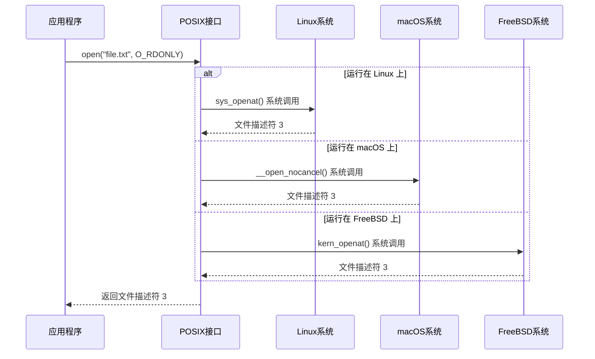

Приложение должно знать только стандарты POSIX, а уровень POSIX отвечает за преобразование этих стандартных вызовов в специфические для системы реализации.

## POSIX 的威力：不仅仅是系统调用

Стандарт POSIX регулирует не только системные вызовы, но и поведение всей цепочки инструментов Unix.

### 命令行工具的统一化

POSIX определяет базовое поведение команды `grep`, например:

```bash
# 这些命令在所有 POSIX 兼容系统上都有相同表现
grep "pattern" file.txt           # 基础搜索
grep -n "pattern" file.txt        # 显示行号
grep -i "pattern" file.txt        # 忽略大小写
grep -v "pattern" file.txt        # 反向匹配
```

### 正则表达式的标准化

POSIX также определяет два набора стандартов регулярных выражений:

**基础正则表达式（BRE）**：
```bash
# 用于 grep、sed 等工具
grep 'hello.*world' file.txt
sed 's/old/new/' file.txt
```

**扩展正则表达式（ERE）**：
```bash
# 用于 egrep、awk 等工具
egrep 'hello.+world' file.txt
awk '/pattern/ {print}' file.txt
```

### Shell 行为的规范

POSIX даже диктует поведение оболочки, чтобы обеспечить переносимость сценариев:

```bash
#!/bin/sh
# 这个脚本在所有 POSIX Shell 中都能正常运行

for file in *.txt; do
    if [ -f "$file" ]; then
        echo "Processing $file"
        grep "TODO" "$file" >> todos.txt
    fi
done
```

## 现代世界中的 POSIX：依然重要且无处不在

### 主流操作系统的 POSIX 支持

Давайте посмотрим на поддержку POSIX в основных современных операционных системах:

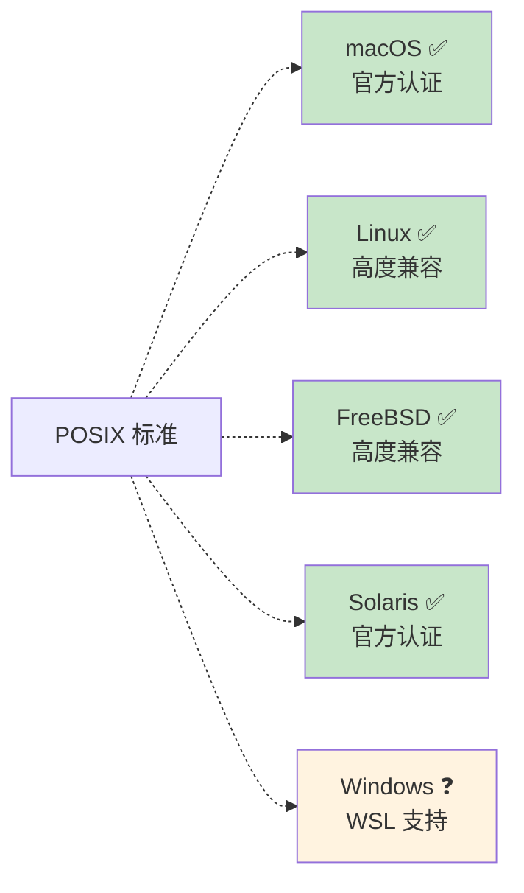

### 容器时代的 POSIX

С учетом распространенности Docker и Kubernetes сегодня POSIX становится еще более важным:

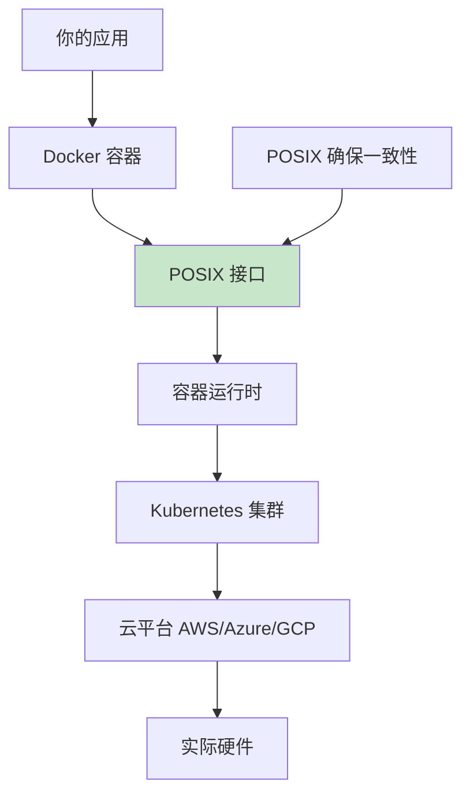

Благодаря стандарту POSIX ваше приложение может:
1. работать на машине разработки (macOS)
2. работать в тестовом контейнере (Alpine Linux)
3. работать в производственной среде (Ubuntu/CentOS)
4. мигрировать между различными облачными платформами

### 嵌入式系统中的 POSIX

От смартфонов до маршрутизаторов, от умных домов до автомобильных электронных систем - во многих встраиваемых устройствах используются упрощенные POSIX-совместимые системы:

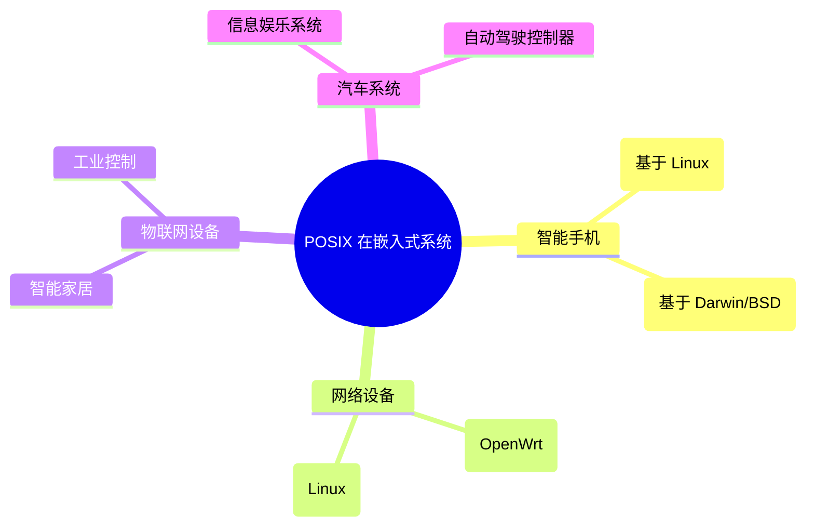

## POSIX 设计哲学：抽象层的艺术

### 好的抽象层应该具备什么特质？

Успех POSIX говорит нам о том, что хороший слой абстракции должен:

**1. 足够简单，易于理解**
```c
// POSIX 的接口设计简洁明了
int fd = open(filename, O_RDONLY);  // 打开文件
ssize_t n = read(fd, buffer, size); // 读取数据
close(fd);                          // 关闭文件
```

**2. 足够稳定，向后兼容**
```bash
# 40 年前写的 POSIX 脚本，今天依然能运行
#!/bin/sh
ls -l | grep "^d" | wc -l
```

**3. 足够灵活，适应变化**
```c
// POSIX 接口可以适应不同的底层实现
// 相同的 open() 调用可以：
// - 打开本地文件
// - 访问网络文件系统
// - 操作设备文件
// - 访问虚拟文件系统
```

### 从 POSIX 学到的架构设计原则

**原则一：标准先行**
```mermaid
graph LR
    A[制定标准] --> B[各厂商实现] --> C[应用程序开发] --> D[生态繁荣]
````

**原则二：最小惊讶原则**
```bash
# POSIX 工具的行为符合直觉
cp source.txt dest.txt    # 复制文件
mv old.txt new.txt       # 移动/重命名文件
rm unwanted.txt          # 删除文件
```

**原则三：组合胜过集成**
```bash
# POSIX 工具可以自由组合
ls -l | grep "\.txt$" | wc -l          # 统计 txt 文件数量
find . -name "*.log" | xargs rm        # 删除所有日志文件
ps aux | grep python | awk '{print $2}' | xargs kill  # 杀死所有 Python 进程
```

## 现代启示：其他成功的抽象层

Успех POSIX вдохновил многие другие области разработки уровней абстракции:

### 1. SQL：数据库的通用语言

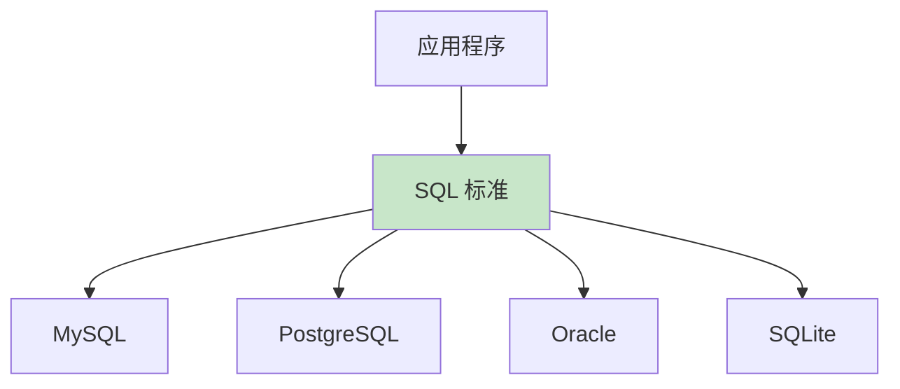

Подобно тому, как POSIX унифицирует интерфейсы операционных систем, SQL унифицирует операции с базами данных:

```sql
-- 相同的 SQL 在不同数据库中都能运行
SELECT name, age FROM users WHERE age > 18;
```

### 2. HTTP：互联网的通用协议

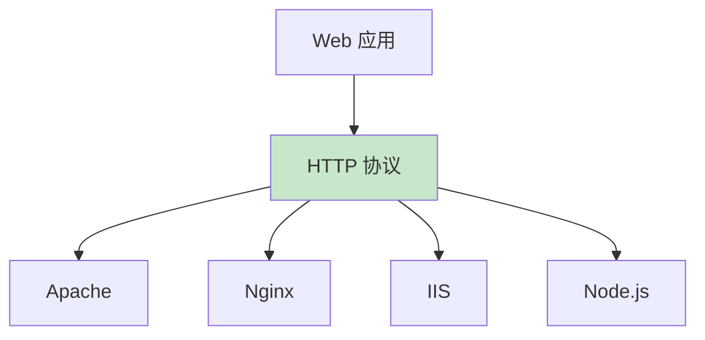

Протокол HTTP позволяет различным веб-серверам и клиентам беспрепятственно взаимодействовать друг с другом.

### 3. Docker：容器的标准接口

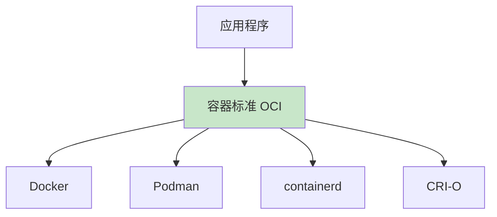

Стандарт Open Container Initiative (OCI) стандартизирует технологию контейнеров.

### 4. WebAssembly：跨平台执行环境

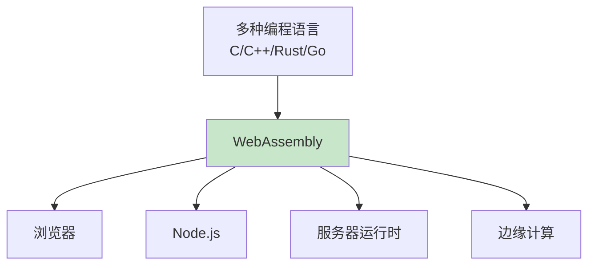

## 抽象层设计的陷阱与教训

### 成功案例的共同特点

Проанализировав POSIX и другие успешные уровни абстракции, мы обнаружили, что все они обладают этими характеристиками:

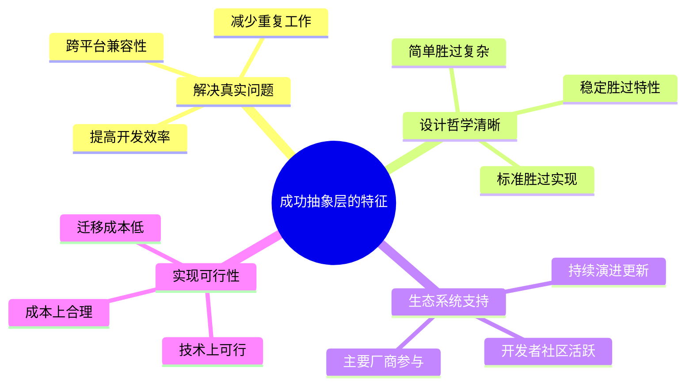

### 失败案例的教训

Существуют исторические примеры неудачных проектов слоев абстракции:

**过度抽象的问题**：
```java
// 某些企业级框架的过度抽象
AbstractFactoryProxyBeanDefinitionCreatorFactory factory = 
    new AbstractFactoryProxyBeanDefinitionCreatorFactoryImpl();
```

**标准战争的危害**：


## 对现代软件架构的启发

### 1. 微服务架构中的抽象层

В современных микросервисных архитектурах нам также необходим POSIX-подобный слой абстракции:

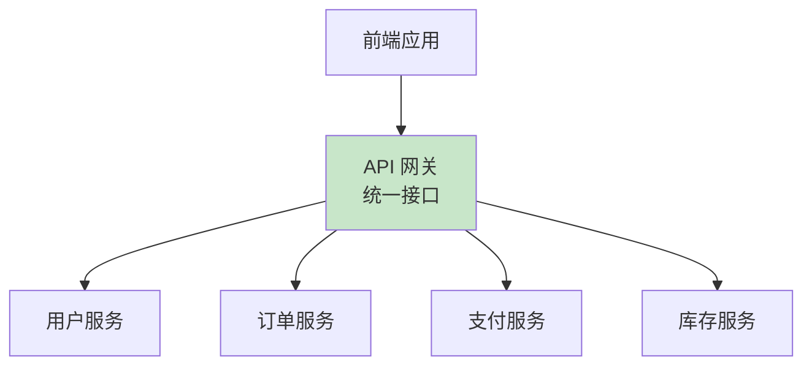

API-шлюз действует как POSIX, предоставляя единый интерфейс для внешнего интерфейса и скрывая сложность внутренних сервисов.

### 2. 云原生架构中的抽象

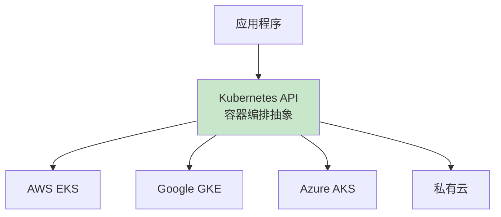

Kubernetes предоставляет стандартный интерфейс для оркестровки контейнеров, позволяя переносить приложения между различными облачными платформами.

### 3. 数据库抽象层的演进

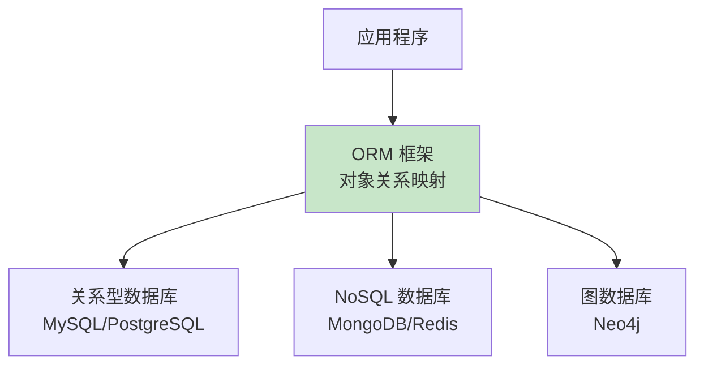

Современные ORM-фреймворки пытаются абстрагироваться от различий между разными типами баз данных.

## 设计你自己的抽象层

### 何时需要创建抽象层？

Когда вы сталкиваетесь с такими ситуациями, вам, возможно, придется задуматься о создании слоев абстракции:

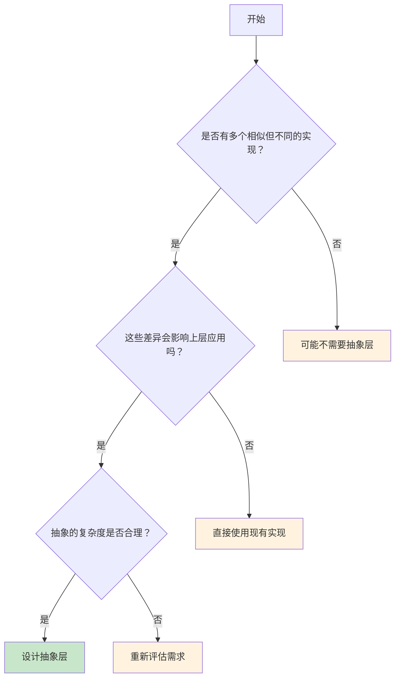

### 抽象层设计的最佳实践

**1. 从用户需求出发**
```python
# 好的抽象：简单直观
cache.set("key", "value")
cache.get("key")
cache.delete("key")

# 不好的抽象：暴露实现细节
redis_client.hset("cache:key", "field", "value")
memcached_client.set("key", pickle.dumps("value"))
```

**2. 保持接口稳定**
```python
# 版本 1.0
def send_email(to, subject, body):
    pass

# 版本 2.0 - 向后兼容的扩展
def send_email(to, subject, body, attachments=None, priority="normal"):
    pass
```

**3. 提供逃生出口**
```python
# 提供高级接口用于常见场景
database.save_user(user)

# 同时保留低级接口用于特殊需求
database.execute_raw_sql("SELECT * FROM users WHERE complex_condition")
```

## 思考未来：抽象层的发展趋势

### 1. AI 驱动的抽象层

Будущие уровни абстракции могут включать в себя возможности искусственного интеллекта:

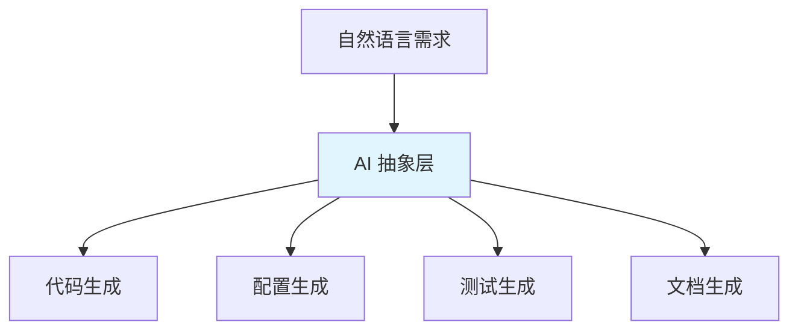

Разработчик может просто описать требования на естественном языке, а слой абстракции ИИ автоматически сгенерирует соответствующую реализацию.

### 2. 自适应抽象层


Уровень абстракции может автоматически корректировать стратегию реализации на основе данных о производительности во время выполнения.

### 3. 跨语言统一抽象

```mermaid
graph TB
    A[统一抽象层] --> B[Python 绑定]
    A --> C[JavaScript 绑定]
    A --> D[Rust 绑定]
    A --> E[Go 绑定]
    
    style A fill:#fff3e0
```

В будущем может появиться единый уровень абстракции для всех языков программирования, который позволит программам на разных языках беспрепятственно сотрудничать друг с другом.

## 总结：抽象的力量

История POSIX говорит нам о том, что хороший слой абстракции обладает огромной силой:

**Это может**:
- Упростить сложность, позволяя разработчикам сосредоточиться на бизнес-логике
- Улучшить переносимость и снизить затраты на миграцию
- Способствовать инновациям, позволяя большему количеству людей участвовать в процессе благодаря стандартизированным интерфейсам
- Создать ценность и построить процветающую экосистему

**Принципы проектирования**:
- Решайте реальные проблемы, а не абстракции ради абстракций
- Сохраняйте простоту и избегайте чрезмерной инженерии
- Обеспечьте стабильность, поддерживайте обратную совместимость
- Обеспечьте гибкость, чтобы учесть особые случаи

Когда вы будете разрабатывать архитектуру системы, спросите себя: нужен ли мне слой абстракции? Если да, то как я могу спроектировать его так, чтобы он работал как POSIX?

Помните, что лучшие слои абстракции - это те, которые не ощущаются как таковые: они работают молча, делая сложное простым, а невозможное возможным. В этом и заключается магия абстракции, и в этом заключается бесценное наследие, которое оставил нам POSIX.