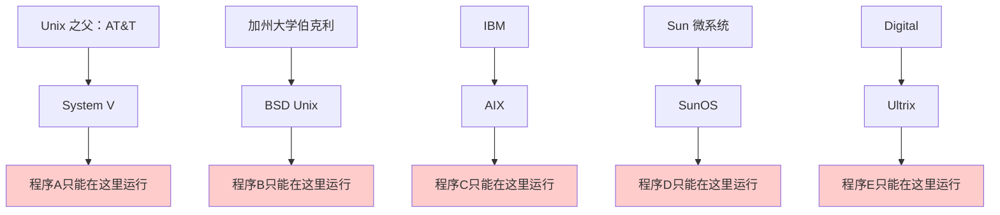
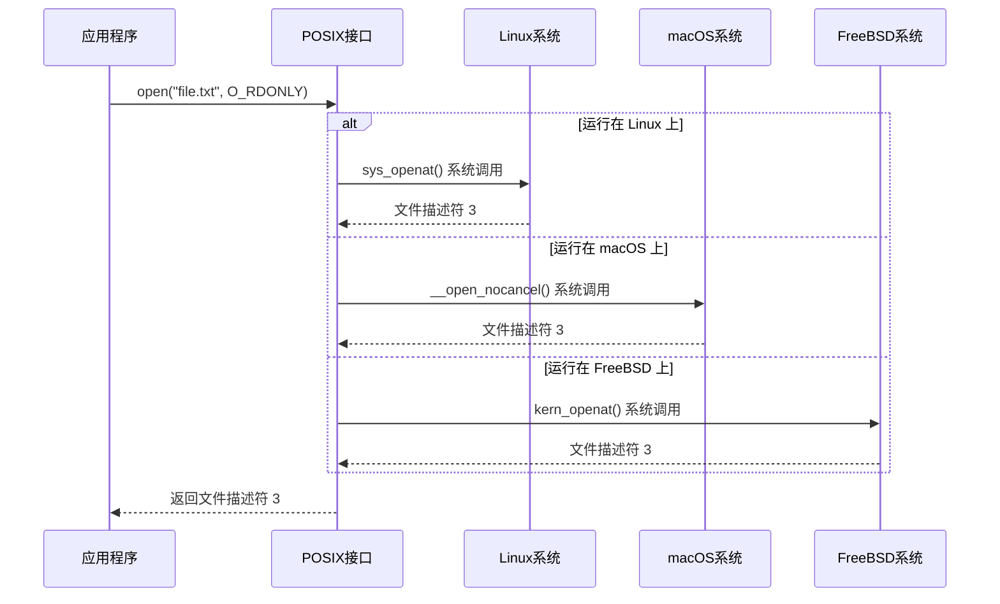
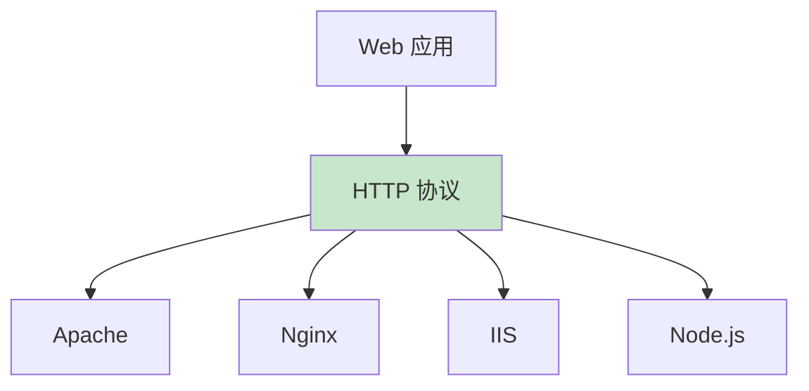

Представьте себе, что в каждом городе были свои уникальные правила дорожного движения: красный свет означал "проехать" в одном городе и "остановиться" в другом; движение налево в одних местах и направо в других, и никаких стандартов, которым нужно следовать. Как бы выглядел такой мир?

Именно таким был компьютерный мир в 1980-х годах. Программисты боролись с тем, что разные системы Unix делали все по-своему, и одни и те же программы не переносились с одной системы на другую. Пока не появился стандарт под названием POSIX, который, словно единое "правило дорожного движения", навел порядок в компьютерном мире.

<! -еще-->

## От хаоса к порядку: история рождения POSIX

### "Войны Unix" 1980-х годов ###

До появления POSIX мир Unix был миром враждующих государств:



Каждая компания добавляла уникальные возможности в свою версию Unix, в результате чего:
- одни и те же системные вызовы ведут себя по-разному в разных системах
- Инструменты командной строки имеют разные аргументы и поведение.
- Программистам приходится адаптировать код индивидуально для каждой системы.

### POSIX: унифицированный создатель правил ### POSIX.

В 1985 году IEEE (Институт инженеров по электротехнике и электронике) начал разработку стандарта с простой целью: **сделать программы свободно переносимыми между различными Unix-подобными системами**.

Этим стандартом стал **POSIX** (Portable Operating System Interface), который выступал в качестве "правила дорожного движения" для компьютерных систем.

## Что такое POSIX? Невидимый слой магии

### Традиционная компьютерная иерархия

Именно так мы обычно понимаем компьютерные системы:

```mermaid
graph TB
    A[应用程序<br/>📱 微信、游戏、浏览器] --> B[操作系统<br/>🖥️ Windows、macOS、Linux]
    B --> C[硬件<br/>⚙️ CPU、内存、硬盘]
    
    style A fill:#e1f5fe
    style B fill:#f3e5f5
    style C fill:#fff3e0
```.

### Истинное местоположение POSIX

Но на самом деле POSIX играет невидимую, но жизненно важную роль:

```mermaid
graph TB
    A["应用程序<br/>📱 你写的 C 程序、Shell 脚本"] --> B["POSIX 接口<br/>🌐 统一的&quot;翻译层&quot;"]
    B --> C["实际操作系统<br/>🖥️ Linux、macOS、FreeBSD"]
    C --> D[硬件<br/>⚙️ CPU、内存、硬盘]
    
    style A fill:#e1f5fe
    style B fill:#c8e6c9
    style C fill:#f3e5f5
    style D fill:#fff3e0
```

POSIX - это как **универсальный переводчик**, который говорит приложениям: "Вам просто нужно выучить стандартный набор языков, а я позабочусь о взаимодействии с различными операционными системами".

## Как работает POSIX: на примере файловых операций

Давайте разберемся, как работает POSIX, на конкретном примере.

### Мир без POSIX

Предположим, вы хотите написать простую программу для чтения файла:

```c
// 在不同系统上需要不同的代码
#ifdef SYSTEM_V
    int fd = sysv_open_file(filename, SYSV_READ_MODE);
    sysv_read_data(fd, buffer, size);
#elif BSD_UNIX
    int fd = bsd_file_open(filename, BSD_READ_FLAG);
    bsd_read_content(fd, buffer, size);
#elif IBM_AIX
    int fd = aix_file_access(filename, AIX_READ_OPTION);
    aix_get_data(fd, buffer, size);
#endif
```

### Мир с POSIX ###

```c
// 一套代码，到处运行
int fd = open(filename, O_RDONLY);  // POSIX 标准调用
read(fd, buffer, size);             // POSIX 标准调用
close(fd);                          // POSIX 标准调用
```

### POSIX работает за кулисами ###



Приложения должны знать только стандарты POSIX, а уровень POSIX отвечает за преобразование этих стандартных вызовов в специфические для системы реализации.

## Сила POSIX: больше, чем просто системные вызовы

Стандарт POSIX регулирует не только системные вызовы, но и поведение всей цепочки инструментов Unix.

### Унификация инструментов командной строки

Если взять в качестве примера команду `grep`, то POSIX определяет ее базовое поведение:

```bash
# 这些命令在所有 POSIX 兼容系统上都有相同表现
grep "pattern" file.txt           # 基础搜索
grep -n "pattern" file.txt        # 显示行号
grep -i "pattern" file.txt        # 忽略大小写
grep -v "pattern" file.txt        # 反向匹配
```

### Нормализация регулярных выражений

POSIX также определяет два набора стандартов регулярных выражений:

**Базовые регулярные выражения (BRE)**:
```bash
# 用于 grep、sed 等工具
grep 'hello.*world' file.txt
sed 's/old/new/' file.txt
```.

**Расширенные регулярные выражения (ERE)**:
```bash
# 用于 egrep、awk 等工具
egrep 'hello.+world' file.txt
awk '/pattern/ {print}' file.txt
```.

### Спецификация поведения оболочки

POSIX даже определяет поведение Shell, чтобы обеспечить переносимость скриптов:

```bash
#!/bin/sh
# 这个脚本在所有 POSIX Shell 中都能正常运行

for file in *.txt; do
    if [ -f "$file" ]; then
        echo "Processing $file"
        grep "TODO" "$file" >> todos.txt
    fi
done
```

## POSIX в современном мире: по-прежнему важен и повсеместно распространен

### Поддержка POSIX в основных операционных системах

Давайте посмотрим на поддержку POSIX в основных современных операционных системах:

```mermaid
graph LR
    A[POSIX 标准] -.-> B[macOS ✅<br/>官方认证]
    A -.-> C[Linux ✅<br/>高度兼容]
    A -.-> D[FreeBSD ✅<br/>高度兼容]
    A -.-> E[Solaris ✅<br/>官方认证]
    A -.-> F[Windows ❓<br/>WSL 支持]
    
    style B fill:#c8e6c9
    style C fill:#c8e6c9
    style D fill:#c8e6c9
    style E fill:#c8e6c9
    style F fill:#fff3e0
```.

### POSIX в эпоху контейнеров

С распространением Docker и Kubernetes сегодня POSIX становится еще более важным:

```mermaid
graph TB
    A[你的应用] --> B[Docker 容器]
    B --> C[POSIX 接口]
    C --> D[容器运行时]
    D --> E[Kubernetes 集群]
    E --> F[云平台 AWS/Azure/GCP]
    F --> G[实际硬件]
    
    style C fill:#c8e6c9
    H[POSIX 确保一致性] --> C
```.

Благодаря стандарту POSIX ваше приложение может:
1. работать на машине разработки (macOS)
2. работать в тестовом контейнере (Alpine Linux)
3. работать в производственной среде (Ubuntu/CentOS)
4. мигрировать между различными облачными платформами

### POSIX во встраиваемых системах

От смартфонов до маршрутизаторов, от умных домов до автомобильной электроники - многие встраиваемые устройства используют упрощенную POSIX-совместимую систему:

```mermaid
mindmap
  root((POSIX 在嵌入式系统))
    智能手机
      Android (基于 Linux)
      iOS (基于 Darwin/BSD)
    网络设备
      路由器 (OpenWrt)
      交换机 (Linux)
    物联网设备
      智能家居
      工业控制
    汽车系统
      信息娱乐系统
      自动驾驶控制器
```.

## Философия дизайна POSIX: искусство уровня абстракции

### Какими качествами должен обладать хороший слой абстракции?

Успех POSIX говорит нам о том, что хороший слой абстракции должен:

**1. быть достаточно простым для понимания **.
```c
// POSIX 的接口设计简洁明了
int fd = open(filename, O_RDONLY);  // 打开文件
ssize_t n = read(fd, buffer, size); // 读取数据
close(fd);                          // 关闭文件
```.

**2. достаточно стабильным, чтобы быть обратно совместимым ** ```c
// POSIX 的接口设计简洁明了
int fd = open(filename, O_RDONLY);  // 打开文件
ssize_t n = read(fd, buffer, size); // 读取数据
close(fd);                          // 关闭文件
```.
```bash
# 40 年前写的 POSIX 脚本，今天依然能运行
#!/bin/sh
ls -l | grep "^d" | wc -l
``` **3.

**```c
// POSIX 的接口设计简洁明了
int fd = open(filename, O_RDONLY);  // 打开文件
ssize_t n = read(fd, buffer, size); // 读取数据
close(fd);                          // 关闭文件
``` **2. достаточно стабилен, чтобы быть обратно совместимым
```c
// POSIX 接口可以适应不同的底层实现
// 相同的 open() 调用可以：
// - 打开本地文件
// - 访问网络文件系统
// - 操作设备文件
// - 访问虚拟文件系统
``` **4.

### Принципы архитектурного проектирования, почерпнутые из POSIX

**```c
// POSIX 接口可以适应不同的底层实现
// 相同的 open() 调用可以：
// - 打开本地文件
// - 访问网络文件系统
// - 操作设备文件
// - 访问虚拟文件系统
``` ### Принципы проектирования архитектуры, почерпнутые из POSIX.
```mermaid
graph LR
    A[制定标准] --> B[各厂商实现] --> C[应用程序开发] --> D[生态繁荣]
````


```bash
# POSIX 工具的行为符合直觉
cp source.txt dest.txt    # 复制文件
mv old.txt new.txt       # 移动/重命名文件
rm unwanted.txt          # 删除文件
``` ```bash
# POSIX 工具的行为符合直觉
cp source.txt dest.txt    # 复制文件
mv old.txt new.txt       # 移动/重命名文件
rm unwanted.txt          # 删除文件
```


```bash
# POSIX 工具可以自由组合
ls -l | grep "\.txt$" | wc -l          # 统计 txt 文件数量
find . -name "*.log" | xargs rm        # 删除所有日志文件
ps aux | grep python | awk '{print $2}' | xargs kill  # 杀死所有 Python 进程
```_.

## Современные откровения: другие успешные слои абстракции

Успех POSIX вдохновил многие другие области разработки слоев абстракции:

### 1. SQL: универсальный язык баз данных

```mermaid
graph TB
    A[应用程序] --> B[SQL 标准]
    B --> C[MySQL]
    B --> D[PostgreSQL]
    B --> E[Oracle]
    B --> F[SQLite]
    
    style B fill:#c8e6c9
```.

Так же как POSIX унифицирует интерфейсы операционных систем, SQL унифицирует операции с базами данных:

```sql
-- 相同的 SQL 在不同数据库中都能运行
SELECT name, age FROM users WHERE age > 18;
```

### 2. HTTP: общий протокол Интернета



Протокол HTTP позволяет различным веб-серверам и клиентам беспрепятственно взаимодействовать друг с другом.

### 3. Docker: стандартный интерфейс для контейнеров

```mermaid
graph TB
    A[应用程序] --> B[容器标准 OCI]
    B --> C[Docker]
    B --> D[Podman]
    B --> E[containerd]
    B --> F[CRI-O]
    
    style B fill:#c8e6c9
```.

Стандарт Open Container Initiative (OCI) стандартизирует технологию контейнеров.

### 4. WebAssembly: кроссплатформенная среда выполнения

```mermaid
graph TB
    A[多种编程语言<br/>C/C++/Rust/Go] --> B[WebAssembly]
    B --> C[浏览器]
    B --> D[Node.js]
    B --> E[服务器运行时]
    B --> F[边缘计算]
    
    style B fill:#c8e6c9
```.

### Подводные камни и уроки проектирования слоев абстракции

### Общие черты успешных примеров

Проанализировав POSIX и другие успешные слои абстракции, мы обнаружили, что все они обладают следующими характеристиками:

```mermaid
mindmap
  root((成功抽象层的特征))
    解决真实问题
      跨平台兼容性
      减少重复工作
      提高开发效率
    
    设计哲学清晰
      简单胜过复杂
      稳定胜过特性
      标准胜过实现
    
    生态系统支持
      主要厂商参与
      开发者社区活跃
      持续演进更新
    
    实现可行性
      技术上可行
      成本上合理
      迁移成本低
```.

### Уроки неудач

Существуют исторические примеры неудач при проектировании слоев абстракции:

**Проблемы чрезмерного абстрагирования**:
```java
// 某些企业级框架的过度抽象
AbstractFactoryProxyBeanDefinitionCreatorFactory factory = 
    new AbstractFactoryProxyBeanDefinitionCreatorFactoryImpl();
```.

**Опасности войн за стандарты**:
```mermaid
graph LR
    A[多个竞争标准] --> B[开发者困惑]
    B --> C[生态分裂]
    C --> D[标准失败]
    
    style D fill:#ffcdd2
```

## Вдохновение для современной архитектуры программного обеспечения

### 1. Уровни абстракции в архитектурах микросервисов

В современных микросервисных архитектурах нам также необходим POSIX-подобный уровень абстракции:

```mermaid
graph TB
    A[前端应用] --> B[API 网关<br/>统一接口]
    B --> C[用户服务]
    B --> D[订单服务]
    B --> E[支付服务]
    B --> F[库存服务]
    
    style B fill:#c8e6c9
```.

API-шлюз, как и POSIX, предоставляет единый интерфейс для внешнего интерфейса и скрывает сложность внутренних сервисов.

### 2. Абстракции в архитектуре Cloud Native

```mermaid
graph TB
    A[应用程序] --> B[Kubernetes API<br/>容器编排抽象]
    B --> C[AWS EKS]
    B --> D[Google GKE]
    B --> E[Azure AKS]
    B --> F[私有云]
    
    style B fill:#c8e6c9
```.

Kubernetes предоставляет стандартный интерфейс для оркестровки контейнеров, позволяя переносить приложения между различными облачными платформами.

### 3. Эволюция уровня абстракции баз данных

```mermaid
graph TB
    A[应用程序] --> B[ORM 框架<br/>对象关系映射]
    B --> C[关系型数据库<br/>MySQL/PostgreSQL]
    B --> D[NoSQL 数据库<br/>MongoDB/Redis]
    B --> E[图数据库<br/>Neo4j]
    
    style B fill:#c8e6c9
```.

Современные ORM-фреймворки пытаются абстрагироваться от различий между разными типами баз данных.

## Создайте свой собственный слой абстракции

### Когда вам нужно создавать слой абстракции?

Вам может понадобиться рассмотреть возможность создания слоя абстракции, когда вы столкнетесь с такими ситуациями:

```mermaid
flowchart TD
    A[开始] --> B{是否有多个相似但不同的实现？}
    B -->|是| C{这些差异会影响上层应用吗？}
    B -->|否| D[可能不需要抽象层]
    
    C -->|是| E{抽象的复杂度是否合理？}
    C -->|否| F[直接使用现有实现]
    
    E -->|是| G[设计抽象层]
    E -->|否| H[重新评估需求]
    
    style G fill:#c8e6c9
    style D fill:#fff3e0
    style F fill:#fff3e0
    style H fill:#fff3e0
```.

### Лучшие практики проектирования уровня абстракции

**1. Начните с потребностей пользователя **.
```python
# 好的抽象：简单直观
cache.set("key", "value")
cache.get("key")
cache.delete("key")

# 不好的抽象：暴露实现细节
redis_client.hset("cache:key", "field", "value")
memcached_client.set("key", pickle.dumps("value"))
```

**```python
# 好的抽象：简单直观
cache.set("key", "value")
cache.get("key")
cache.delete("key")

# 不好的抽象：暴露实现细节
redis_client.hset("cache:key", "field", "value")
memcached_client.set("key", pickle.dumps("value"))
``` **2. Поддерживайте стабильность интерфейса
```python
# 版本 1.0
def send_email(to, subject, body):
    pass

# 版本 2.0 - 向后兼容的扩展
def send_email(to, subject, body, attachments=None, priority="normal"):
    pass
```

**```python
# 版本 1.0
def send_email(to, subject, body):
    pass

# 版本 2.0 - 向后兼容的扩展
def send_email(to, subject, body, attachments=None, priority="normal"):
    pass
``` **3. Обеспечьте пути отступления.
```python
# 提供高级接口用于常见场景
database.save_user(user)

# 同时保留低级接口用于特殊需求
database.execute_raw_sql("SELECT * FROM users WHERE complex_condition")
```

## Размышления о будущем: тенденции развития слоев абстракции

### 1. Абстрактные слои, управляемые искусственным интеллектом

Будущие слои абстракции могут интегрировать возможности искусственного интеллекта:

```mermaid
graph TB
    A[自然语言需求] --> B[AI 抽象层]
    B --> C[代码生成]
    B --> D[配置生成]
    B --> E[测试生成]
    B --> F[文档生成]
    
    style B fill:#e1f5fe
```.

Разработчику достаточно будет описать требования на естественном языке, а слой абстракции ИИ автоматически сгенерирует соответствующую реализацию.

### 2. Адаптивный слой абстракции

```mermaid
graph LR
    A[运行时监控] --> B[性能分析] 
    B --> C[自动优化]
    C --> D[抽象层调整]
    D --> A
    
    style D fill:#e8f5e8
```.

Уровень абстракции может автоматически адаптировать стратегию реализации на основе данных о производительности во время выполнения.

### 3. Унифицированная абстракция для разных языков

```mermaid
graph TB
    A[统一抽象层] --> B[Python 绑定]
    A --> C[JavaScript 绑定]
    A --> D[Rust 绑定]
    A --> E[Go 绑定]
    
    style A fill:#fff3e0
```.

В будущем может появиться единый уровень абстракции для всех языков программирования, который позволит программам на разных языках работать вместе без проблем.

## Резюме: Сила абстракции

История POSIX говорит нам о том, что хороший слой абстракции обладает огромной силой:

**Он может**:
- Упростить сложность, позволяя разработчикам сосредоточиться на бизнес-логике
- Улучшить переносимость и снизить затраты на миграцию
- Способствовать инновациям, позволяя большему количеству людей участвовать в работе благодаря стандартизированным интерфейсам
- Создать ценность и построить процветающую экосистему

**Принципы проектирования**:
- Решайте реальные проблемы, а не абстракции ради абстракций
- Сохраняйте простоту и избегайте чрезмерной инженерии
- Обеспечьте стабильность и поддерживайте обратную совместимость
- Обеспечьте гибкость для решения особых задач

В следующий раз, когда вы будете разрабатывать архитектуру системы, спросите себя: нужен ли мне слой абстракции? Если да, то как я могу спроектировать его так, чтобы он работал как POSIX?

Помните, что лучшие слои абстракции - это те, которые не ощущаются как таковые: они работают молча, делая сложное простым, а невозможное возможным. В этом и заключается магия абстракции, и в этом наследие POSIX.
