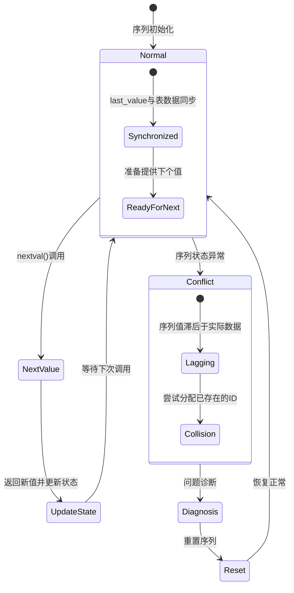
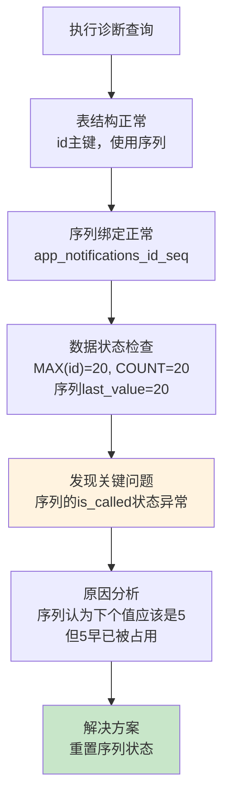
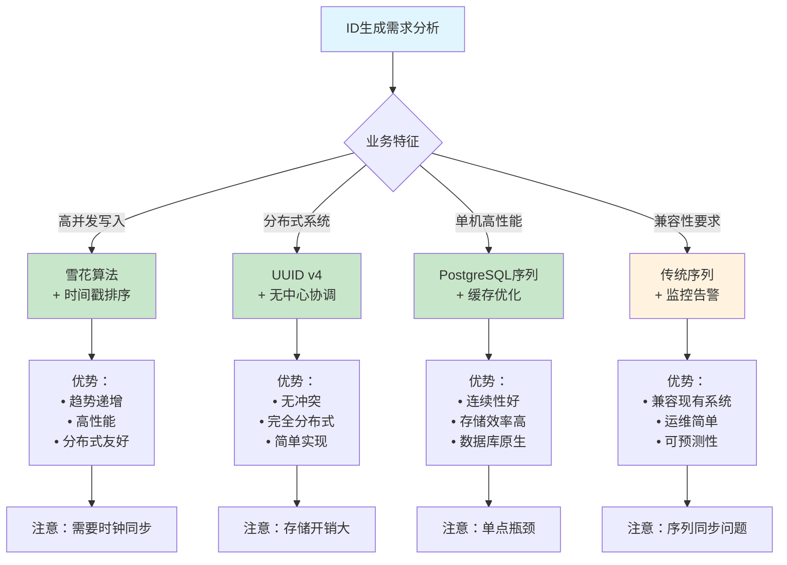
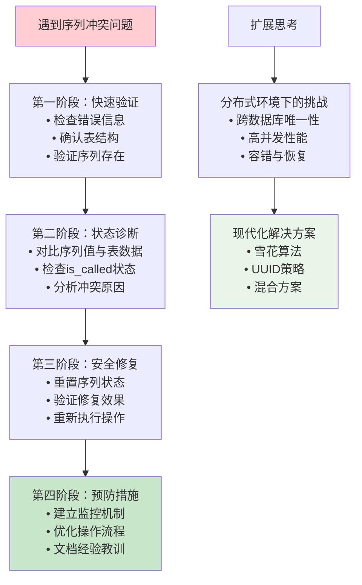

# 深度剖析PostgreSQL序列冲突：从问题诊断到完整解决方案

PostgreSQL的序列（sequence）机制为自增主键提供了高效的解决方案，但在某些场景下会出现"duplicate key value violates unique constraint"错误。本文将深入分析这类问题的成因、诊断方法和完整的解决方案，并通过实际案例演示系统性的故障排除流程。

<!--more-->

## 问题的本质：序列状态与实际数据的不同步

### PostgreSQL序列工作机制

PostgreSQL的序列是一个特殊的数据库对象，它维护以下关键状态：

- **last_value**: 序列的当前值
- **is_called**: 标识last_value是否已被使用
- **increment_by**: 增量步长（通常为1）
- **start_value**: 初始值
- **cache_size**: 缓存大小（性能优化）



### 序列不同步的常见原因

1. **手动插入指定ID值**：直接指定主键值插入，序列不会自动更新
2. **数据导入操作**：从备份恢复或批量导入数据后，序列未重置
3. **事务回滚**：复杂事务回滚可能导致序列状态异常
4. **并发操作冲突**：高并发环境下的竞态条件
5. **系统异常**：数据库崩溃或异常重启

## 系统性诊断方法论

基于我们在实际项目中的经验，建议采用以下系统性诊断流程：

### 第一阶段：表结构验证

```sql
-- 1. 验证表结构和主键设置
SELECT 
    column_name, 
    data_type, 
    is_nullable, 
    column_default
FROM information_schema.columns 
WHERE table_name = 'your_table_name' 
AND table_schema = 'public'
ORDER BY ordinal_position;

-- 2. 确认约束和主键定义
SELECT 
    conname as constraint_name,
    contype as constraint_type,
    pg_get_constraintdef(oid) as constraint_definition
FROM pg_constraint 
WHERE conrelid = 'your_table_name'::regclass;
```

### 第二阶段：序列状态分析

```sql
-- 3. 查找序列名称和绑定关系
SELECT 
    s.relname as sequence_name,
    t.relname as table_name,
    a.attname as column_name
FROM pg_class s
JOIN pg_depend d ON s.oid = d.objid
JOIN pg_class t ON d.refobjid = t.oid
JOIN pg_attribute a ON d.refobjid = a.attrelid AND d.refobjsubid = a.attnum
WHERE s.relkind = 'S'
AND t.relname = 'your_table_name';

-- 4. 检查序列的详细状态
SELECT 
    last_value,
    is_called,
    CASE 
        WHEN is_called THEN last_value + 1 
        ELSE last_value 
    END as next_value_will_be
FROM your_sequence_name;
```

### 第三阶段：数据一致性检查

```sql
-- 5. 对比实际数据与序列状态
SELECT 
    (SELECT MAX(id) FROM your_table_name) as max_table_id,
    (SELECT COUNT(*) FROM your_table_name) as total_records,
    (SELECT last_value FROM your_sequence_name) as sequence_last_value,
    (SELECT 
        CASE WHEN is_called THEN last_value + 1 ELSE last_value END
        FROM your_sequence_name
    ) as sequence_next_value;
```

## 实际案例分析：批量通知设置插入失败

### 案例背景

我们需要为plan_type=1的用户批量添加使用量通知设置（80%和100%阈值），使用了如下复合INSERT语句：

```sql
WITH users_without_alerts AS (
    SELECT pp.user_id
    FROM user_accounts pp
    WHERE (pp.data->>'plan_type')::int = 1
    AND NOT EXISTS (
        SELECT 1
        FROM app_notifications ns
        WHERE ns.user_id = pp.user_id
    )
),
insert_first AS (
    INSERT INTO app_notifications (user_id, config, created_at, updated_at)
    SELECT
        p.user_id,
        '{"template": "usage_eighty_percent.html", "threshold_percentage": 80}'::jsonb,
        NOW(), NOW()
    FROM users_without_alerts p
    RETURNING 1
)
INSERT INTO app_notifications (user_id, config, created_at, updated_at)
SELECT
    p.user_id,
    '{"template": "usage_hundred_percent.html", "threshold_percentage": 100}'::jsonb,
    NOW(), NOW()
FROM users_without_alerts p;
```

### 错误现象与初步分析

**错误信息**：
```
ERROR: duplicate key value violates unique constraint "app_notifications_pkey"
Detail: Key (id)=(5) already exists.
```

**初步困惑**：
- 表中有20条记录，序列last_value也是20
- 目标的3个用户ID确实没有通知设置
- 错误提示ID=5冲突，但这不是我们要插入的记录

### 深入诊断过程



### 问题根因

通过详细诊断发现，问题出在序列的`is_called`状态上。虽然`last_value=20`看起来正常，但`is_called`状态异常，导致PostgreSQL计算下一个可用ID时出现错误。

### 解决方案实施

**步骤1：重置序列状态**
```sql
-- 重置序列到正确状态
SELECT setval('app_notifications_id_seq', 20, true);
```

**步骤2：验证修复效果**
```sql
-- 测试序列是否正常（会消耗一个序列值）
SELECT nextval('app_notifications_id_seq');  -- 应该返回21

-- 重置回正确位置
SELECT setval('app_notifications_id_seq', 20, true);
```

**步骤3：重新执行原始脚本**
```sql
-- 原始脚本成功执行，插入6条记录（3个用户ID × 2种通知设置）
```

### 意外情况处理：重复执行

在解决过程中，脚本被意外执行了两次，产生了重复记录。我们采用了系统性的数据清理方法：

**诊断重复记录**：
```sql
-- 确认重复记录的内容
SELECT 
    id,
    user_id,
    config->>'template' as template,
    config->>'threshold_percentage' as threshold,
    created_at
FROM app_notifications 
WHERE id IN (24, 25, 26)
ORDER BY id;

-- 验证这些记录确实是重复的
SELECT 
    user_id,
    config->>'threshold_percentage' as threshold,
    COUNT(*) as count
FROM app_notifications 
WHERE user_id IN (
    SELECT user_id 
    FROM app_notifications 
    WHERE id IN (24, 25, 26)
)
GROUP BY user_id, config->>'threshold_percentage'
HAVING COUNT(*) > 1;
```

**安全删除重复记录**：
```sql
-- 安全删除指定的重复记录
DELETE FROM app_notifications 
WHERE id IN (24, 25, 26)
AND created_at = (
    SELECT created_at 
    FROM app_notifications 
    WHERE id = 24
    LIMIT 1
);
```

**重新同步序列**：
```sql
-- 删除记录后重置序列
SELECT setval('app_notifications_id_seq', (SELECT MAX(id) FROM app_notifications));
```

## 高级序列管理技巧

### 序列缓存优化

在高并发环境下，可以通过调整序列缓存来提升性能：

```sql
-- 查看当前缓存设置
SELECT cache_size FROM pg_sequences WHERE sequencename = 'your_sequence_name';

-- 调整缓存大小（权衡性能与ID连续性）
ALTER SEQUENCE your_sequence_name CACHE 50;
```

### 批量操作的序列管理

对于大批量数据操作，建议采用以下策略：

```sql
-- 方案1：预分配序列范围
SELECT setval('your_sequence_name', 
    (SELECT MAX(id) FROM your_table) + expected_insert_count);

-- 方案2：使用COPY进行批量插入（自动处理序列）
COPY your_table(non_id_columns) FROM stdin;

-- 方案3：显式事务控制
BEGIN;
-- 执行批量操作
SELECT setval('your_sequence_name', (SELECT MAX(id) FROM your_table));
COMMIT;
```

### 序列监控与告警

建立序列健康监控机制：

```sql
-- 创建序列监控视图
CREATE VIEW sequence_health_check AS
SELECT 
    s.schemaname,
    s.sequencename,
    s.last_value as sequence_value,
    t.max_id as table_max_id,
    t.record_count,
    CASE 
        WHEN s.last_value < t.max_id THEN 'LAGGING'
        WHEN s.last_value > t.max_id + 1000 THEN 'EXCESSIVE'
        ELSE 'HEALTHY'
    END as status
FROM pg_sequences s
JOIN (
    SELECT 
        schemaname,
        tablename,
        MAX(id) as max_id,
        COUNT(*) as record_count
    FROM information_schema.tables t
    -- 这里需要根据实际情况联接具体表
) t ON s.sequencename LIKE t.tablename || '%';
```

## PostgreSQL序列的内部机制深度解析

### 序列的MVCC特性

PostgreSQL的序列操作具有特殊的MVCC（多版本并发控制）特性：

- **nextval()**: 即使在事务回滚后也不会回退，确保ID的唯一性
- **currval()**: 返回当前会话中最后一次nextval()的值
- **setval()**: 可以显式设置序列值和状态

### 并发安全机制

```sql
-- 序列操作是原子性的，但在高并发下仍需注意：

-- 安全模式：让数据库自动分配ID
INSERT INTO your_table (data_column) VALUES ('data');

-- 危险模式：手动指定ID值
INSERT INTO your_table (id, data_column) VALUES (specific_id, 'data');
```

### 序列与复制的考虑

在主从复制环境中，序列的行为需要特别注意：

```sql
-- 为避免主从切换时的ID冲突，可以设置不同的序列范围
-- 主库：奇数ID
ALTER SEQUENCE master_seq INCREMENT BY 2 START WITH 1;

-- 从库：偶数ID  
ALTER SEQUENCE slave_seq INCREMENT BY 2 START WITH 2;
```

## 预防措施与最佳实践

### 1. 代码规范

```sql
-- ✅ 推荐：让数据库自动分配ID
INSERT INTO users (name, email) VALUES ('Alice', 'alice@example.com');

-- ❌ 避免：手动指定ID值
INSERT INTO users (id, name, email) VALUES (100, 'Alice', 'alice@example.com');

-- ✅ 推荐：批量插入时保持一致性
INSERT INTO users (name, email) 
SELECT name, email FROM temp_users;
``` THEN 'CRITICAL'
            ELSE 'HEALTHY'
        END::TEXT,
        CASE 
            WHEN s.last_value < (
                SELECT MAX(id) FROM information_schema.tables 
                WHERE table_name = regexp_replace(s.sequencename, '_id_seq$', '')
            ) THEN 'Run: SELECT setval(''' || s.sequencename || ''', (SELECT MAX(id) FROM ' || regexp_replace(s.sequencename, '_id_seq$', '') || '));'
            ELSE 'No action needed'
        END::TEXT
    FROM pg_sequences s
    WHERE s.sequencename LIKE '%_id_seq';
END;
$$ LANGUAGE plpgsql;
```

## 故障排除工具箱

### 诊断脚本模板

```sql
-- 通用序列诊断脚本
DO $$
DECLARE
    seq_name TEXT;
    tbl_name TEXT;
    max_id BIGINT;
    seq_val BIGINT;
    seq_next BIGINT;
BEGIN
    -- 替换为实际的序列名和表名
    seq_name := 'your_sequence_name';
    tbl_name := 'your_table_name';
    
    -- 获取表中最大ID
    EXECUTE format('SELECT COALESCE(MAX(id), 0) FROM %I', tbl_name) INTO max_id;
    
    -- 获取序列当前值
    EXECUTE format('SELECT last_value FROM %I', seq_name) INTO seq_val;
    
    -- 计算下一个序列值
    EXECUTE format('SELECT CASE WHEN is_called THEN last_value + 1 ELSE last_value END FROM %I', seq_name) INTO seq_next;
    
    -- 输出诊断信息
    RAISE NOTICE 'Table: %, Max ID: %', tbl_name, max_id;
    RAISE NOTICE 'Sequence: %, Current: %, Next: %', seq_name, seq_val, seq_next;
    
    -- 判断是否需要修复
    IF seq_next <= max_id THEN
        RAISE NOTICE 'ISSUE DETECTED: Sequence is lagging behind table data';
        RAISE NOTICE 'Recommended fix: SELECT setval(''%'', %);', seq_name, max_id;
    ELSE
        RAISE NOTICE 'HEALTHY: Sequence is properly synchronized';
    END IF;
END;
$$;
```

### 自动修复脚本

```sql
-- 自动修复序列脚本（谨慎使用）
CREATE OR REPLACE FUNCTION auto_fix_sequence(seq_name TEXT, tbl_name TEXT)
RETURNS BOOLEAN AS $$
DECLARE
    max_id BIGINT;
    old_val BIGINT;
    new_val BIGINT;
BEGIN
    -- 获取表中最大ID
    EXECUTE format('SELECT COALESCE(MAX(id), 0) FROM %I', tbl_name) INTO max_id;
    
    -- 获取序列当前值
    EXECUTE format('SELECT last_value FROM %I', seq_name) INTO old_val;
    
    -- 如果序列滞后，则修复
    IF old_val < max_id THEN
        EXECUTE format('SELECT setval(%L, %L)', seq_name, max_id) INTO new_val;
        RAISE NOTICE 'Fixed sequence % from % to %', seq_name, old_val, new_val;
        RETURN TRUE;
    ELSE
        RAISE NOTICE 'Sequence % is already healthy (current: %, table max: %)', seq_name, old_val, max_id;
        RETURN FALSE;
    END IF;
END;
$$ LANGUAGE plpgsql;

-- 使用示例
SELECT auto_fix_sequence('app_notifications_id_seq', 'app_notifications');
```

## 序列性能优化策略

### 缓存调优

```sql
-- 分析序列使用频率
SELECT 
    schemaname,
    sequencename,
    cache_size,
    last_value,
    -- 估算每秒调用频率
    CASE 
        WHEN cache_size < 10 THEN 'Consider increasing cache'
        WHEN cache_size > 1000 THEN 'May waste sequence numbers'
        ELSE 'Optimal range'
    END as cache_recommendation
FROM pg_sequences;

-- 动态调整缓存大小
ALTER SEQUENCE high_frequency_seq CACHE 100;  -- 高频序列
ALTER SEQUENCE low_frequency_seq CACHE 1;     -- 低频序列
```

### 分区表的序列策略

```sql
-- 分区表的序列设计
CREATE SEQUENCE global_id_seq;

-- 为每个分区使用同一个序列
CREATE TABLE orders_2024 (
    id BIGINT DEFAULT nextval('global_id_seq'),
    order_date DATE,
    -- 其他字段
    PRIMARY KEY (id, order_date)
) PARTITION BY RANGE (order_date);

-- 或者为每个分区使用独立序列（需要全局唯一性时谨慎）
CREATE SEQUENCE orders_2024_id_seq START 202400000000;
CREATE SEQUENCE orders_2025_id_seq START 202500000000;
```

## 现代分布式环境下的ID生成策略

### 超越传统序列：分布式ID方案

随着微服务和分布式系统的普及，传统的PostgreSQL序列面临新的挑战。以下是几种现代化的ID生成策略：

#### 1. 雪花算法（Snowflake）实现

```sql
-- PostgreSQL中的雪花算法实现
CREATE OR REPLACE FUNCTION generate_snowflake_id(
    worker_id INTEGER DEFAULT 1,
    datacenter_id INTEGER DEFAULT 1
) RETURNS BIGINT AS $$
DECLARE
    epoch_offset BIGINT := 1609459200000; -- 2021-01-01 00:00:00 UTC in milliseconds
    current_millis BIGINT;
    sequence_bits INTEGER := 12;
    worker_bits INTEGER := 5;
    datacenter_bits INTEGER := 5;
    max_sequence INTEGER := 4095; -- 2^12 - 1
    worker_shift INTEGER := sequence_bits;
    datacenter_shift INTEGER := sequence_bits + worker_bits;
    timestamp_shift INTEGER := sequence_bits + worker_bits + datacenter_bits;
    
    last_timestamp BIGINT := 0;
    sequence_number INTEGER := 0;
    snowflake_id BIGINT;
BEGIN
    current_millis := extract(epoch from now()) * 1000;
    
    IF current_millis = last_timestamp THEN
        sequence_number := (sequence_number + 1) & max_sequence;
        IF sequence_number = 0 THEN
            -- 等待下一毫秒
            WHILE current_millis <= last_timestamp LOOP
                current_millis := extract(epoch from now()) * 1000;
            END LOOP;
        END IF;
    ELSE
        sequence_number := 0;
    END IF;
    
    last_timestamp := current_millis;
    
    snowflake_id := ((current_millis - epoch_offset) << timestamp_shift) |
                    (datacenter_id << datacenter_shift) |
                    (worker_id << worker_shift) |
                    sequence_number;
    
    RETURN snowflake_id;
END;
$$ LANGUAGE plpgsql;
```

#### 2. UUID策略对比

```sql
-- 不同UUID生成方式的性能对比
SELECT 
    'uuid_generate_v1()' as method,
    uuid_generate_v1() as sample_id,
    'Time-based, MAC address' as characteristics
UNION ALL
SELECT 
    'uuid_generate_v4()' as method,
    uuid_generate_v4() as sample_id,
    'Random, best for distribution' as characteristics
UNION ALL
SELECT 
    'gen_random_uuid()' as method,
    gen_random_uuid() as sample_id,
    'Pure random, PostgreSQL native' as characteristics;
```

#### 3. 混合策略设计



## 总结与思考

通过这个实际案例，我们可以总结出PostgreSQL序列冲突问题的处理方法论：

### 核心原则

1. **系统性诊断**：不要只看错误信息，要全面检查表结构、序列状态和数据一致性
2. **渐进式修复**：先诊断、再修复、后验证，每一步都要确认结果
3. **预防为主**：建立规范的数据操作流程和监控机制
4. **文档记录**：记录每次故障的处理过程，建立知识库

### 方法论总结



### 扩展思考

序列冲突问题虽然看似简单，但背后反映了数据库系统的复杂性。随着微服务架构和分布式系统的普及，传统的单机序列机制面临新的挑战：

- **分布式ID生成**：如何在多个数据库实例间保证ID的全局唯一性？
- **高并发优化**：如何在保证一致性的同时提升序列分配的性能？
- **跨数据中心同步**：在多地域部署中如何处理序列同步？

这些问题的解决方案包括雪花算法（Snowflake）、UUID、以及各种分布式ID生成策略。但无论技术如何演进，理解底层机制、系统性分析问题的方法论始终是最重要的。

### 实践建议

1. **建立标准化诊断流程**：将诊断步骤文档化，培训团队成员
2. **实施自动化监控**：定期检查序列健康状态，及早发现问题
3. **制定应急响应计划**：明确故障处理责任人和升级机制
4. **持续学习改进**：关注新技术发展，适时升级ID生成策略

---

*在你的数据库管理实践中，是否遇到过类似的序列问题？或者在分布式环境下，你是如何设计ID生成策略的？随着AI和机器学习在数据库运维中的应用，你认为这类问题的自动化诊断和修复会如何发展？欢迎分享你的经验和对未来的思考。*
