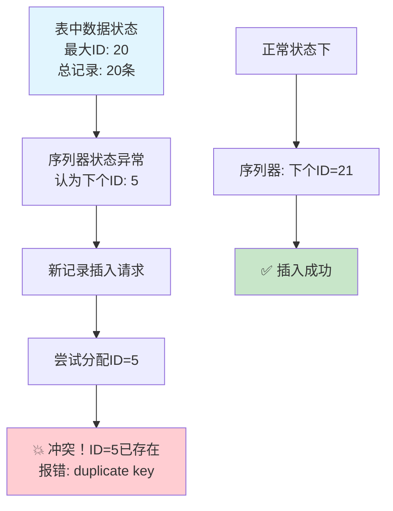

# PostgreSQL数据插入报错？3步快速解决序列冲突问题

如果你是数据库管理员或者开发者，一定遇到过这样的场景：代码运行得好好的，突然插入数据时蹦出一个错误："duplicate key value violates unique constraint"。别慌！这通常是PostgreSQL的序列（自增ID）出了小问题，用3个步骤就能快速修复。

<!--more-->

## 问题场景：好端端的插入突然报错

假设你是一家电商公司的数据分析师，正在为用户账户批量添加通知设置。SQL脚本写得很完美，测试环境也运行正常，但到了生产环境突然报错：

```
ERROR: duplicate key value violates unique constraint "app_notifications_pkey"
Detail: Key (id)=(5) already exists.
```

明明数据库里只有20条记录，为什么会说ID=5已存在？这就是典型的"序列值滞后"问题。

## 什么是序列值滞后？

简单来说，PostgreSQL用一个"序列器（sequence）"来自动生成ID号码。正常情况下：
- 表里有20条记录，最大ID是20
- 序列器记住"下一个号码应该是21"
- 新插入的记录自动获得ID=21

但有时候序列器会"健忘"，以为下一个号码是5，结果ID=5早就被占用了，于是报错。



## 3步快速修复法

### 第1步：确认问题（1分钟）

打开数据库查询工具（如DBeaver、pgAdmin），运行这个查询：

```sql
-- 检查表中最大ID和序列当前值
SELECT 
    (SELECT MAX(id) FROM your_table_name) as max_table_id,
    (SELECT last_value FROM your_sequence_name) as sequence_value;
```

> **小贴士**：不知道序列名？通常是 `表名_id_seq` 的格式

如果看到类似这样的结果：
```
max_table_id: 20
sequence_value: 4
```

恭喜你确认了问题：序列值比实际数据小，需要修复。

### 第2步：重置序列（30秒）

直接运行这条命令，让序列器"记住"正确的下一个号码：

```sql
-- 自动重置序列到正确值
SELECT setval('your_sequence_name', (SELECT MAX(id) FROM your_table_name));
```

这行代码的作用是：
1. 找到表中最大的ID值
2. 告诉序列器："下次从这个数字+1开始"

### 第3步：验证修复（30秒）

确认问题已解决：

```sql
-- 测试序列是否正常工作
SELECT nextval('your_sequence_name');
```

这应该返回一个比最大ID大1的数字。比如表中最大ID是20，这里应该返回21。

然后重置回去（因为我们只是测试）：
```sql
SELECT setval('your_sequence_name', 20, true);
```

现在重新运行你的插入脚本，应该就成功了！

## 实际案例演示

我们最近遇到一个真实案例：为某个项目的用户批量添加使用量通知功能。

**问题现象**：
- 表中有20条记录，最大ID=20
- 插入时报错："Key (id)=(5) already exists"
- 检查发现序列的确出现了滞后

**解决过程**：
1. **确认序列状态**：序列值确实小于实际数据
2. **重置序列**：`setval('app_notifications_id_seq', 20, true)`
3. **成功插入**：为3个用户各添加了2种通知设置

**意外插曲**：脚本被意外执行了两次，产生了重复数据，我们用简单的DELETE语句清理了重复记录，然后重新同步了序列。

## 预防措施

**避免手动指定ID值**：
```sql
-- ❌ 不要这样做
INSERT INTO users (id, name) VALUES (100, 'Alice');

-- ✅ 让数据库自动分配ID
INSERT INTO users (name) VALUES ('Alice');
```

**数据迁移后记得重置序列**：
如果你导入了数据或进行了数据迁移，记得检查并重置相关序列。

## 总结

PostgreSQL的序列冲突问题看起来吓人，实际上用3步就能解决：
1. **确认问题**：对比表中最大ID和序列值
2. **重置序列**：用setval命令修复
3. **验证修复**：确保序列正常工作

记住这个口诀："找最大、告诉它、测一下"，以后遇到类似问题就不会慌了。

---

*遇到其他PostgreSQL问题？欢迎分享你的案例，我们一起探讨解决方案！*
