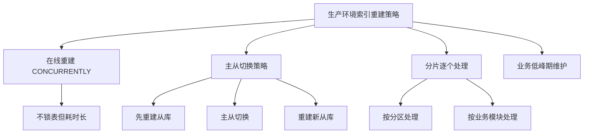

作为一名开发人员，你可能经常需要处理数据库相关的任务：导出表结构、备份数据、查看数据库状态等。虽然这些任务可以通过复杂的SQL语句完成，但PostgreSQL提供了一整套简单实用的命令行工具，让这些工作变得轻松许多。

<!--more-->

## 从一个实际场景说起

假设你是一名后端开发工程师，领导要求你从生产数据库中导出某个表的结构，供其他开发人员参考设计新表。你可能会想到写复杂的SQL查询去获取字段信息、约束条件等，但实际上，PostgreSQL有更简单的解决方案。

## 表结构导出：pg_dump的威力

当你需要导出表结构时，`pg_dump --schema-only` 是最专业的选择：

```bash
# 导出单个表的结构
pg_dump --schema-only --table=portal_user your_database_name > portal_user_schema.sql

# 导出多个表的结构
pg_dump --schema-only --table=users --table=orders your_database_name > tables_schema.sql

# 导出整个schema的结构
pg_dump --schema-only --schema=public your_database_name > public_schema.sql
```

相比手写SQL查询information_schema表，pg_dump的优势显而易见：

**完整性更强** - 不仅包含基本的列信息，还包含索引、约束、触发器、序列等完整定义
**格式标准** - 生成标准的DDL语句，可以直接执行重建表结构  
**可靠性高** - 官方工具，保证输出的准确性和兼容性

## psql：你的数据库瑞士军刀

psql不仅是连接数据库的客户端，更是一个功能强大的管理工具。它的反斜杠命令（虽然都以\d开头，来自"display"的缩写）覆盖了日常工作的大部分需求：

```bash
# 连接数据库
psql -h localhost -U username -d database_name

# 在psql中使用这些快捷命令：
\dt          # 列出所有表（display tables）
\d table_name # 查看表结构（display table structure）
\di          # 列出所有索引（display indexes）
\df          # 列出所有函数（display functions）
\l           # 列出所有数据库
\dn          # 列出所有schema
\du          # 列出所有用户
```

当你需要快速了解数据库结构时，这些命令比记忆复杂的系统表查询要实用得多。

## 数据库管理的基础工具

### 创建和删除操作
PostgreSQL提供了配对的创建/删除工具，命名规整，易于记忆：

```bash
# 数据库操作
createdb new_project_db
dropdb old_project_db

# 用户操作  
createuser --interactive new_developer
dropuser departed_employee
```

### 备份和恢复全家桶

```bash
# 完整备份（结构+数据）
pg_dump database_name > backup.sql

# 只备份数据
pg_dump --data-only database_name > data_only.sql

# 备份整个PostgreSQL实例的所有数据库
pg_dumpall > all_databases.sql

# 恢复数据
pg_restore -d database_name backup.dump
```

这里需要理解PostgreSQL中"集群"的概念：它指的是一个PostgreSQL服务器实例中的所有数据库，包括用户数据库和系统数据库。`pg_dumpall`就是备份整个"集群"的工具。

## 数据库维护工具：像GC一样的vacuumdb

在软件开发中，我们熟悉垃圾回收（GC）的概念。PostgreSQL的`vacuumdb`就像数据库的垃圾回收器：

```bash
# 基本的垃圾回收，随时可执行，不影响业务
vacuumdb database_name

# 带统计信息更新的清理
vacuumdb --analyze database_name

# 完全清理（会锁表，适合维护窗口）
vacuumdb --full database_name
```

`vacuumdb`的作用包括：
- 回收被删除/更新记录占用的磁盘空间
- 更新查询优化器的统计信息  
- 防止事务ID回卷
- **注意：不会删除任何数据，只是清理"垃圾"**

## 索引重建：reindexdb的生产环境考虑

索引重建可以优化查询性能，但在生产环境需要谨慎：

```bash
# 重建数据库的所有索引
reindexdb database_name

# 重建特定表的索引
reindexdb --table=table_name database_name

# 并发重建，减少对业务的影响
reindexdb --jobs=4 database_name
```

对于大型生产系统（比如微信级别的数据库），索引重建需要更复杂的策略：



## 实用的监控工具

```bash
# 检查数据库服务器状态
pg_isready -h localhost -p 5432

# 在psql中查看数据库大小
\l+

# 查看活跃连接
\x \select * from pg_stat_activity;
```

## 工具使用的最佳实践

### 开发环境
在开发环境中，这些工具可以随意使用，帮助你快速了解和操作数据库：

```bash
# 快速查看表结构
psql -d dev_db -c "\d users"

# 导出测试数据
pg_dump --data-only --table=sample_data dev_db > test_data.sql
```

### 生产环境
生产环境需要更加谨慎：

- 使用`--schema-only`导出结构，避免意外导出敏感数据
- 维护操作选择业务低峰期进行
- 重要操作前先在测试环境验证
- 了解每个工具的锁定影响

## 从SQL新手到数据库操作熟手

掌握这些PostgreSQL工具，结合基础的SQL语法知识，足以让一位业余爱好者胜任大部分数据库开发工作。相比记忆复杂的系统表查询和手写DDL语句，这些专用工具：

- **更可靠** - 官方维护，bug更少
- **更完整** - 考虑了各种边界情况
- **更高效** - 专门优化过的操作
- **更易用** - 语义明确的命令行参数

无论你是需要偶尔处理数据库任务的后端开发者，还是刚开始接触数据库管理的运维人员，这套工具都能让你的工作事半功倍。

记住PostgreSQL的设计哲学：**一个工具做好一件事**。与其在复杂的SQL查询中迷失，不如善用这些专门的工具，让数据库操作变得简单而可靠。
