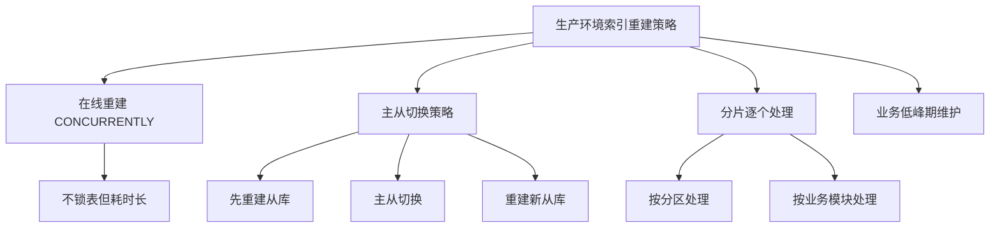

Как разработчику, вам часто приходится решать задачи, связанные с базами данных: экспортировать структуры таблиц, создавать резервные копии данных, проверять состояние базы данных и так далее. Хотя эти задачи можно решить с помощью сложных операторов SQL, PostgreSQL предоставляет набор простых и полезных инструментов командной строки, которые значительно облегчают выполнение этих задач.

<! --подробнее-->

## Начнем с реального сценария

Предположим, вы инженер-разработчик, и ваш руководитель просит вас экспортировать структуру определенной таблицы из производственной базы данных, чтобы другие разработчики могли использовать ее при создании новых таблиц. Вы можете подумать о написании сложных SQL-запросов для получения информации о полях, ограничениях и т. д., но на самом деле в PostgreSQL есть более простое решение.

## Экспорт структуры таблицы: возможности pg_dump

Когда вам нужно экспортировать структуру таблиц, __PROTECTED_INLINE_CODE__9__ является наиболее профессиональным выбором:

```bash
# 导出单个表的结构
pg_dump --schema-only --table=portal_user your_database_name > portal_user_schema.sql

# 导出多个表的结构
pg_dump --schema-only --table=users --table=orders your_database_name > tables_schema.sql

# 导出整个schema的结构
pg_dump --schema-only --schema=public your_database_name > public_schema.sql
```

Преимущества pg_dump перед написанными вручную SQL-запросами для таблиц information_schema очевидны:

**Более полный** - содержит не только основную информацию о столбцах, но и полные определения индексов, ограничений, триггеров, последовательностей и т.д.
**Стандартный формат** - генерирует стандартные DDL-запросы, которые можно выполнить напрямую для перестройки структуры таблицы.
**Высокая надежность** - Официальный инструмент, гарантирующий точность и совместимость выходных данных.

## psql: ваш швейцарский армейский нож для баз данных

psql - это не только клиент для подключения к базам данных, но и мощный инструмент управления. Его команды с обратным слешем (хотя все они начинаются с \d, от аббревиатуры "display") покрывают большинство ваших повседневных потребностей:

```bash
# 连接数据库
psql -h localhost -U username -d database_name

# 在psql中使用这些快捷命令：
\dt          # 列出所有表（display tables）
\d table_name # 查看表结构（display table structure）
\di          # 列出所有索引（display indexes）
\df          # 列出所有函数（display functions）
\l           # 列出所有数据库
\dn          # 列出所有schema
\du          # 列出所有用户
```.

Когда вам нужно быстро понять структуру базы данных, эти команды гораздо полезнее, чем запоминание сложных системных таблиц.

## Основные инструменты для администрирования баз данных

### Операции создания и удаления
PostgreSQL предоставляет парные инструменты создания/удаления, которые хорошо называются и легко запоминаются:

```bash
# 数据库操作
createdb new_project_db
dropdb old_project_db

# 用户操作  
createuser --interactive new_developer
dropuser departed_employee
```.

### Резервное копирование и восстановление семейных ведер

```bash
# 完整备份（结构+数据）
pg_dump database_name > backup.sql

# 只备份数据
pg_dump --data-only database_name > data_only.sql

# 备份整个PostgreSQL实例的所有数据库
pg_dumpall > all_databases.sql

# 恢复数据
pg_restore -d database_name backup.dump
```

Важно понимать понятие "кластер" в PostgreSQL: под ним подразумеваются все базы данных в экземпляре сервера PostgreSQL, включая базу данных пользователей и системную базу данных. PROTECTED_INLINE_CODE_10__ - это инструмент для резервного копирования всего кластера.

## Инструмент для обслуживания баз данных: GC-подобный vacuumdb

В разработке программного обеспечения мы знакомы с концепцией сбора мусора (GC), и `vacuumdb` в PostgreSQL выступает в роли сборщика мусора для базы данных:

```bash
# 基本的垃圾回收，随时可执行，不影响业务
vacuumdb database_name

# 带统计信息更新的清理
vacuumdb --analyze database_name

# 完全清理（会锁表，适合维护窗口）
vacuumdb --full database_name
```

Роль `vacuumdb` включает:
- восстановление дискового пространства, занятого удаленными/обновленными записями
- обновление статистики оптимизатора запросов
- предотвращение перемотки идентификатора транзакции.
- Примечание: данные не удаляются, очищается только "мусор".

## Восстановление индексов: производственные условия для reindexdb

Перестроение индексов может оптимизировать производительность запросов, однако в производственных средах следует соблюдать осторожность:

```bash
# 重建数据库的所有索引
reindexdb database_name

# 重建特定表的索引
reindexdb --table=table_name database_name

# 并发重建，减少对业务的影响
reindexdb --jobs=4 database_name
```.

Для больших производственных систем (например, баз данных уровня microsoft) перестроение индексов требует более сложной стратегии:



## Практические инструменты мониторинга

```bash
# 检查数据库服务器状态
pg_isready -h localhost -p 5432

# 在psql中查看数据库大小
\l+

# 查看活跃连接
\x \select * from pg_stat_activity;
```

## Лучшие практики использования инструментов

### Среда разработки
В среде разработки эти инструменты можно использовать по своему усмотрению, чтобы помочь вам быстро понять базу данных и манипулировать ею:

```bash
# 快速查看表结构
psql -d dev_db -c "\d users"

# 导出测试数据
pg_dump --data-only --table=sample_data dev_db > test_data.sql
```.

### Производственная среда
Производственные среды требуют большей осторожности:

- Используйте структуру экспорта `--schema-only`, чтобы избежать случайного экспорта конфиденциальных данных.
- Операции по обслуживанию должны выполняться в периоды низкого пика деловой активности.
- Проверяйте критические операции в тестовой среде перед их выполнением.
- Поймите последствия блокировки каждого инструмента.

## От новичка в SQL до эксперта по операциям с базами данных

Владение этими инструментами PostgreSQL в сочетании с базовыми знаниями синтаксиса SQL достаточно для того, чтобы любитель мог выполнять большинство задач по разработке баз данных. По сравнению с запоминанием сложного поиска системных таблиц и написанием DDL-запросов вручную, эти специализированные инструменты:

- **Более надежны** - официально поддерживаются с меньшим количеством ошибок
- **Более полные** - учитывают различные граничные случаи
- **Более эффективны** - специально оптимизированы для выполнения операций
- **Проще в использовании** - семантически явные аргументы командной строки

Будь вы бэкэнд-разработчиком, которому приходится время от времени решать задачи, связанные с базами данных, или оперативным сотрудником, который только начинает работать с базами данных, этот набор инструментов сделает вашу работу вдвое проще.

Помните философию разработки PostgreSQL: **Один инструмент, чтобы делать одно дело хорошо**. Вместо того чтобы путаться в сложных SQL-запросах, воспользуйтесь этими специализированными инструментами, чтобы сделать работу с базой данных простой и надежной.
