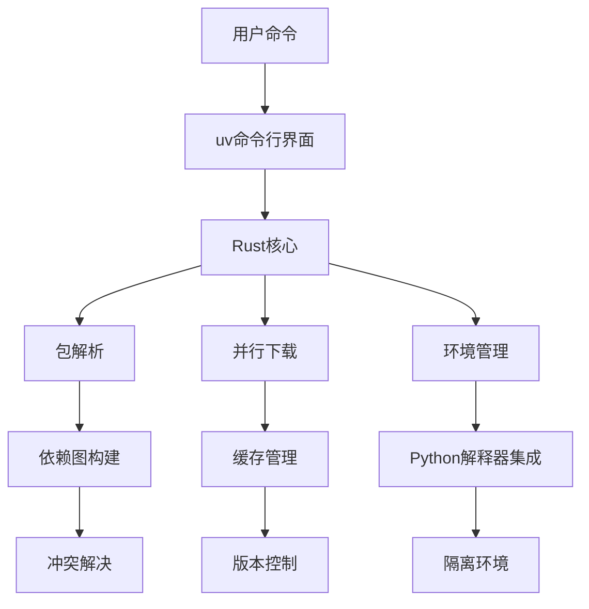
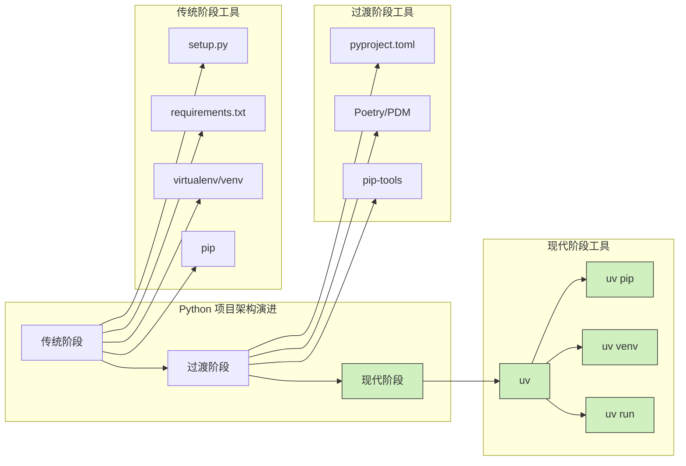

Python 生态系统中的工具链一直以其复杂性而闻名。开发者们被迫在 pip、virtualenv、conda 等工具间切换，每个都有各自的优缺点和使用方式。uv 的出现可能将彻底改变这一现状。

<!--more-->

## uv：现代化 Python 工具链的新选择

uv 是由 Astral（前身为 Basis）团队开发的 Python 包安装器和解析器，完全使用 Rust 语言编写。与传统 Python 工具不同，uv 将多个工具的功能整合到一个高性能的解决方案中，旨在提供更现代、更高效的 Python 开发体验。

### 底层技术原理

uv 之所以能够实现显著的性能提升，主要基于几个关键技术：

1. **Rust 实现**：利用 Rust 语言的内存安全和高性能特性，避免了 Python 自身的解释开销
2. **并行处理**：在依赖解析和包下载安装过程中大量使用并行处理
3. **优化的缓存策略**：智能缓存机制减少重复下载和编译
4. **零拷贝设计**：减少内存使用和系统调用
5. **编译优化**：对于需要编译的包，采用更高效的编译策略



## 全面替代传统工具链

### 与 pip 对比

pip 作为 Python 的官方包管理器，已经服务多年，但存在明显的性能瓶颈：

```bash
# 传统 pip 安装依赖可能需要几分钟
time pip install -r requirements.txt  # 可能需要 2-3 分钟

# uv 在相同硬件上可能只需要几秒钟
time uv pip install -r requirements.txt  # 通常只需 5-10 秒
```

性能差异的原因在于：

1. pip 是单线程解析和下载依赖
2. pip 使用 Python 自身进行包的构建和安装
3. pip 的缓存机制较为简单

uv 的 `pip` 子命令能够完全替代传统 pip 的所有功能，同时提供显著的性能提升。

### 与 virtualenv 对比

virtualenv 是 Python 生态系统中标准的环境隔离工具，但使用过程较为繁琐：

```bash
# 传统方式
virtualenv myenv
source myenv/bin/activate
pip install package
deactivate

# uv 方式
uv venv myenv
source myenv/bin/activate  # 仍需激活，但后续操作更简化
uv pip install package  # 速度更快
```

uv 的改进还体现在：

1. 虚拟环境创建速度更快
2. 与项目配置文件（如 pyproject.toml）的无缝集成
3. 提供 `uv run -p` 等命令简化环境切换

### 与 conda 的比较与互补

conda 是一个强大的环境和包管理器，特别擅长处理科学计算领域的交叉语言依赖。uv 能否完全替代 conda？答案是"部分可以"：

| 功能 | conda | uv | 说明 |
|------|-------|----|----|
| Python 包管理 | ✅ | ✅ | uv 速度更快 |
| 环境管理 | ✅ | ✅ | uv 更轻量 |
| 非 Python 依赖 | ✅ | ❌ | conda 优势 |
| 预编译二进制 | ✅ | ⚠️ | conda 更成熟 |
| 跨平台兼容性 | ✅ | ⚠️ | conda 更广泛 |

对于主要使用 Python 的项目，uv 可以很好地替代 conda；但对于重度依赖 C/C++、Fortran 等其他语言依赖的科学计算工作流，conda 仍有其不可替代性。

## 高级功能与最佳实践

### 跨 Python 版本开发的革命性简化

uv 的最大创新之一是 `uv run -p` 命令，它彻底改变了 Python 多版本开发的方式。传统上，开发者需要创建、管理和切换多个环境，而 uv 完全无需这些步骤：

```bash
# 直接运行任意 Python 版本的解释器
uv run -p 3.10 python
uv run -p 3.12 python

# 不同 Python 版本运行相同脚本
uv run -p 3.9 my_script.py
uv run -p 3.11 my_script.py

# 直接调用指定版本的 pip
uv run -p 3.10 pip install requests

# 甚至可以一次性比较多个版本的行为
for version in 3.8 3.9 3.10 3.11 3.12; do
    echo "Testing with Python $version"
    uv run -p $version python -c "import sys; print(sys.version)"
done
```

这一功能不仅颠覆了传统的工作流程，还彻底简化了跨 Python 版本的开发、测试和实验过程。这个命令的强大之处在于：

1. **即时使用**：直接调用任何已安装的 Python 版本，无需事先配置
2. **零开销切换**：没有环境激活/关闭的过程
3. **隔离并存**：不同版本的命令可以在同一个会话中并行运行
4. **简化 CI/CD**：在自动化测试中，可以轻松测试多版本兼容性

### 现代项目配置与依赖管理

uv 原生支持 PEP 621 规范的 `pyproject.toml` 配置：

```toml
[project]
name = "myproject"
version = "0.1.0"
description = "A sample project"
readme = "README.md"
requires-python = ">=3.8"
license = {text = "MIT"}
dependencies = [
    "requests>=2.28.0",
    "fastapi>=0.95.0",
]

[project.optional-dependencies]
dev = [
    "pytest>=7.0.0",
    "black>=23.0.0",
]
```

如何使用：

```bash
# 安装项目及其依赖
uv pip install --project .

# 安装开发依赖
uv pip install --project .[dev]

# 生成锁文件以确保环境可重现
uv pip compile pyproject.toml -o requirements.lock
```

### 构建系统集成

uv 与现代 Python 构建系统无缝集成：

```bash
# 构建 wheel
uv pip build .

# 发布到 PyPI
uv pip publish
```

### CI/CD 管道优化

在持续集成环境中，uv 的性能优势尤为明显：

```yaml
# GitHub Actions 中使用 uv 的示例
jobs:
  build:
    runs-on: ubuntu-latest
    steps:
      - uses: actions/checkout@v3
      - uses: actions/setup-python@v4
        with:
          python-version: '3.10'
      - name: Install uv
        run: curl -LsSf https://astral.sh/uv/install.sh | sh
      - name: Install dependencies
        run: uv pip install --project .[dev]
      - name: Run tests
        run: uv run pytest
```

## 技术展望与生态发展

### uv 的未来发展

uv 仍在积极开发中，未来可能会有更多功能：

1. 更完善的非 Python 依赖处理
2. 更广泛的构建系统支持
3. 与 Python 内置 venv 模块的更深入集成
4. 可能的 GUI 界面或 IDE 插件

### AI 辅助的依赖管理

随着 AI 技术的发展，uv 这样的工具可能会整合 AI 能力来改进依赖管理：

- 智能推荐兼容的依赖版本
- 自动检测和解决依赖冲突
- 基于项目代码自动推荐依赖

### 社区生态

虽然 uv 相对较新，但其生态系统正在快速发展：

- 越来越多的项目将 uv 纳入官方推荐工具
- IDE 和编辑器正在开发 uv 集成插件
- 企业级支持和培训服务开始出现

## 实际案例：大型项目中的 uv

以下是一个真实场景中迁移到 uv 的性能对比：

| 操作 | 传统工具 | uv | 提升 |
|------|----------|----|----|
| 环境创建 | 15 秒 | 3 秒 | 5 倍 |
| 依赖安装 (100+ 包) | 210 秒 | 17 秒 | 12 倍 |
| 跨版本测试 | 复杂流程 | 单一命令 | 显著简化 |
| CI 构建时间 | 8 分钟 | 90 秒 | 5.3 倍 |



## 结论与实践建议

uv 代表了 Python 工具链的未来发展方向：更高性能、更简化的工作流程、更现代的依赖管理。虽然它可能不会完全取代所有现有工具（特别是 conda 在科学计算领域的应用），但对于大多数 Python 开发者来说，uv 提供了一种更高效、更愉快的开发体验。

建议采取的迁移策略：

1. 从小项目开始尝试 uv
2. 逐步将工作流程从传统工具迁移到 uv
3. 在新项目中全面采用 uv
4. 在 CI/CD 环境中优先使用 uv 以提高构建速度

随着 Python 生态系统的不断发展，像 uv 这样的创新工具将继续推动 Python 在各个领域的应用，使开发者能够更专注于解决问题而非工具配置。

## 深入阅读

- [uv 官方文档](https://github.com/astral-sh/uv)
- [PEP 621 - 存储项目元数据在 pyproject.toml 中](https://peps.python.org/pep-0621/)
- [现代 Python 包管理最佳实践](https://packaging.python.org/guides/tool-recommendations/)

你如何看待 uv 对 Python 生态系统的影响？它是否会成为未来 Python 开发的标准工具之一？欢迎在评论中分享你的观点。
