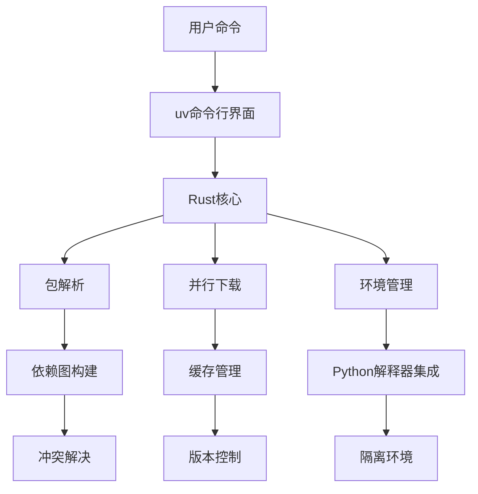
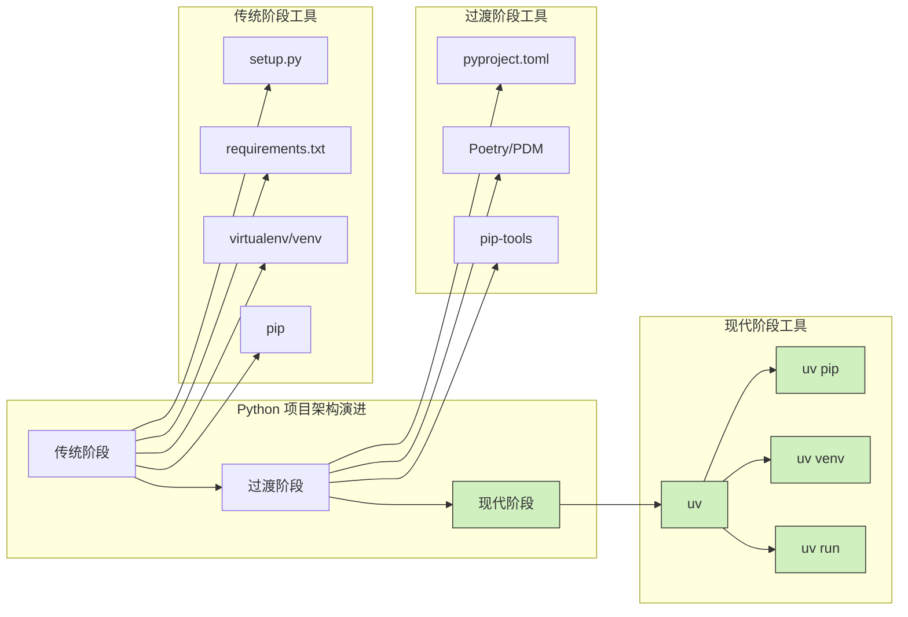

Набор инструментов в экосистеме Python всегда славился своей сложностью. Разработчики были вынуждены переключаться между такими инструментами, как pip, virtualenv, conda и т. д., каждый из которых имел свои сильные и слабые стороны и способы использования. uv может полностью изменить эту ситуацию.

<!--more-->

## uv：现代化 Python 工具链的新选择

uv - это программа для установки и разбора пакетов на языке Python, разработанная командой Astral (ранее Basis) и написанная полностью на языке Rust. В отличие от традиционных инструментов Python, uv объединяет функциональность нескольких инструментов в одно высокопроизводительное решение, призванное обеспечить более современный и эффективный опыт разработки на Python.

### 底层技术原理

Способность uv добиваться значительного повышения производительности основана на нескольких ключевых технологиях:

1. **Реализация Rust**: позволяет избежать накладных расходов Python на интерпретацию, используя преимущества безопасности памяти и высокой производительности языка Rust.
2. **Параллельная обработка**: широкое использование параллельной обработки для разрешения зависимостей, загрузки и установки пакетов.
3. **Оптимизированная стратегия кэширования**: интеллектуальный механизм кэширования уменьшает количество повторных загрузок и компиляций.
4. **Оптимизация с нулевым копированием**: сокращение использования памяти и системных вызовов.
5. **Оптимизация компиляции**: более эффективные стратегии компиляции для пакетов, которые необходимо скомпилировать.



## 全面替代传统工具链

### 与 pip 对比

pip, официальный менеджер пакетов Python, работает уже много лет, но страдает от значительных недостатков производительности:

```bash
# 传统 pip 安装依赖可能需要几分钟
time pip install -r requirements.txt  # 可能需要 2-3 分钟

# uv 在相同硬件上可能只需要几秒钟
time uv pip install -r requirements.txt  # 通常只需 5-10 秒
```

Причина разницы в производительности заключается в следующем:

1. pip анализирует и загружает зависимости в одном потоке
2. pip использует сам Python для сборки и установки пакетов.
3. pip имеет простой механизм кэширования.

Подкоманда `pip` в uv полностью заменяет всю функциональность традиционного pip, обеспечивая при этом значительный прирост производительности.

### 与 virtualenv 对比

virtualenv - это стандартный инструмент изоляции окружения в экосистеме Python, но он громоздок в использовании:

```bash
# 传统方式
virtualenv myenv
source myenv/bin/activate
pip install package
deactivate

# uv 方式
uv venv myenv
source myenv/bin/activate  # 仍需激活，但后续操作更简化
uv pip install package  # 速度更快
```

Также показаны улучшения в области uv:

1. более быстрое создание виртуальных сред
2. бесшовная интеграция с конфигурационными файлами проекта, такими как pyproject.toml.
3. Предоставление команд, таких как `uv run -p`, для упрощения переключения окружений

### 与 conda 的比较与互补

conda - это мощная среда и менеджер пакетов, которая особенно хорошо справляется с межъязыковыми зависимостями в научных вычислениях. может ли uv полностью заменить conda? ответ - "частично":

| функция | conda | uv | описание |
|------|-------|----|----|
| Управление пакетами Python | ✅ | ✅ | uv быстрее |
| Управление окружением | ✅ ✅ | uv Легче |
| Не-Python зависимости | ✅ ✅ | ❌ | преимущества conda |
| Предварительно скомпилированные двоичные файлы | ✅ | ⚠️ | conda является более зрелой |
| | Кроссплатформенная совместимость | ✅ | ⚠️ | conda шире |

Для проектов, использующих в основном Python, uv может стать хорошей заменой conda, но для научных вычислений, которые в значительной степени зависят от других языков, таких как C/C++, Fortran и т.д., conda по-прежнему незаменима.

## 高级功能与最佳实践

### 跨 Python 版本开发的革命性简化

Одна из самых больших инноваций uv - команда `uv run -p`, которая произвела революцию в разработке Python в нескольких версиях. Традиционно разработчики должны были создавать, управлять и переключаться между несколькими окружениями; uv устраняет все эти шаги:

```bash
# 直接运行任意 Python 版本的解释器
uv run -p 3.10 python
uv run -p 3.12 python

# 不同 Python 版本运行相同脚本
uv run -p 3.9 my_script.py
uv run -p 3.11 my_script.py

# 直接调用指定版本的 pip
uv run -p 3.10 pip install requests

# 甚至可以一次性比较多个版本的行为
for version in 3.8 3.9 3.10 3.11 3.12; do
    echo "Testing with Python $version"
    uv run -p $version python -c "import sys; print(sys.version)"
done
```

Эта возможность не только переворачивает с ног на голову традиционные рабочие процессы, но и полностью упрощает процесс разработки, тестирования и экспериментов с разными версиями Python. Сила этой команды заключается в следующем:

1. **На лету**: напрямую вызывает любую установленную версию Python, не требуя предварительной настройки!
2. **Нулевое переключение**: нет процесса активации/деактивации среды.
3. **Изолированное сосуществование**: разные версии команд могут выполняться параллельно в одной и той же сессии
4. **Упрощенный CI/CD**: легкая проверка совместимости с несколькими версиями в автоматизированных тестах.

### 现代项目配置与依赖管理

uv поддерживает конфигурацию `pyproject.toml` из спецификации PEP 621:

```toml
[project]
name = "myproject"
version = "0.1.0"
description = "A sample project"
readme = "README.md"
requires-python = ">=3.8"
license = {text = "MIT"}
dependencies = [
    "requests>=2.28.0",
    "fastapi>=0.95.0",
]

[project.optional-dependencies]
dev = [
    "pytest>=7.0.0",
    "black>=23.0.0",
]
```

Как использовать:

```bash
# 安装项目及其依赖
uv pip install --project .

# 安装开发依赖
uv pip install --project .[dev]

# 生成锁文件以确保环境可重现
uv pip compile pyproject.toml -o requirements.lock
```

### 构建系统集成

uv легко интегрируется с современными системами сборки Python:

```bash
# 构建 wheel
uv pip build .

# 发布到 PyPI
uv pip publish
```

### CI/CD 管道优化

Преимущества производительности uv особенно очевидны в среде непрерывной интеграции:

```yaml
# GitHub Actions 中使用 uv 的示例
jobs:
  build:
    runs-on: ubuntu-latest
    steps:
      - uses: actions/checkout@v3
      - uses: actions/setup-python@v4
        with:
          python-version: '3.10'
      - name: Install uv
        run: curl -LsSf https://astral.sh/uv/install.sh | sh
      - name: Install dependencies
        run: uv pip install --project .[dev]
      - name: Run tests
        run: uv run pytest
```

## 技术展望与生态发展

### uv 的未来发展

uv все еще находится в стадии активной разработки и в будущем может получить больше возможностей:

1. Лучшая обработка зависимостей, не относящихся к Python
2. более широкая поддержка систем сборки
3. более глубокая интеграция со встроенным в Python модулем venv
4. возможный GUI-интерфейс или плагин для IDE

### AI 辅助的依赖管理

По мере развития технологий ИИ такие инструменты, как uv, могут интегрировать возможности ИИ для улучшения управления зависимостями:

- Интеллектуальная рекомендация совместимых версий зависимостей
- Автоматическое обнаружение и разрешение конфликтов зависимостей
- Автоматическая рекомендация зависимостей на основе кода проекта

### 社区生态

Несмотря на то, что технология uv появилась относительно недавно, ее экосистема быстро развивается:

- Все больше и больше проектов включают uv в число официальных рекомендуемых инструментов
- IDE и редакторы разрабатывают плагины для интеграции uv
- Появляются услуги поддержки и обучения на уровне предприятия

## 实际案例：大型项目中的 uv

Ниже приведено сравнение производительности при переходе на uv в реальном сценарии:

| работа | традиционные инструменты | уф | подъемник |
|------|----------|----|----|
| Создание среды | 15 секунд | 3 секунды | 5x |
| Установка зависимостей (100+ пакетов) | 210 секунд | 17 секунд | 12x |
| Кросс-версионное тестирование | Сложные процессы | Одна команда | Значительное упрощение | Время сборки CI
| Время сборки CI | 8 минут | 90 секунд | 5,3x |



## 结论与实践建议

uv - это будущее инструментария Python: более высокая производительность, оптимизированные рабочие процессы и более современное управление зависимостями. Хотя он не может полностью заменить все существующие инструменты (особенно conda в научных вычислениях), uv обеспечивает более эффективный и приятный опыт разработки для большинства разработчиков Python.

Рекомендуемая стратегия миграции:

1. пробуйте uv с небольших проектов
2. постепенно переводите рабочий процесс с традиционных инструментов на uv
3. внедрять uv повсеместно в новых проектах
4. отдайте предпочтение использованию uv в средах CI/CD для ускорения сборки

По мере развития экосистемы Python инновационные инструменты, подобные uv, будут и дальше стимулировать использование Python в самых разных областях, позволяя разработчикам больше сосредоточиться на решении проблем, чем на настройке инструментов.

## 深入阅读

- [Официальная документация uv](https://github.com/astral-sh/uv)
- [PEP 621 - Хранение метаданных проекта в файле pyproject.toml](https://peps.python.org/pep-0621/)
- [Modern Python Package Management Best Practices](https://packaging.python.org/guides/tool-recommendations/)

Как, по вашему мнению, uv повлияет на экосистему Python? Станет ли он одним из стандартных инструментов для разработки на Python в будущем? Не стесняйтесь поделиться своим мнением в комментариях.