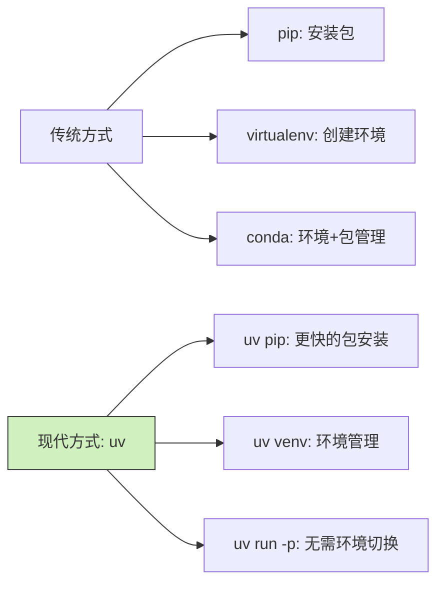

Python 环境管理一直是困扰开发者的难题，是否厌倦了 conda 的臃肿和 virtualenv 的繁琐？uv 可能是你期待已久的救星。

<!--more-->

## 什么是 uv？

小冯是个刚入职的数据分析师，每次接到新任务都要折腾半天环境配置。一次偶然的机会，他的同事向他推荐了 uv：

"你知道吗？有个叫 uv 的工具，用 Rust 写的，安装包比 pip 快 10-100 倍，还能替代 virtualenv、pip 这些工具。"

简单来说，uv 是一个现代化的 Python 包管理器和环境管理工具，它速度惊人，使用简单，能够替代传统的 pip、virtualenv 甚至部分替代 conda。

## 快速上手 uv

### 安装 uv

打开终端，输入以下命令：

```bash
# Linux/macOS 用户
curl -LsSf https://astral.sh/uv/install.sh | sh

# macOS 使用 Homebrew
brew install uv
```

### 创建虚拟环境

小冯接到了一个新的数据分析项目，需要创建一个干净的工作环境：

```bash
# 在当前目录创建一个名为 .venv 的虚拟环境
uv venv

# 激活环境（bash/zsh 用户）
source .venv/bin/activate

# fish shell 用户
source .venv/bin/activate.fish
```

### 安装包

小冯需要安装几个数据分析的常用包：

```bash
# 安装单个包
uv pip install pandas

# 安装多个包
uv pip install numpy matplotlib seaborn

# 安装特定版本
uv pip install requests==2.28.1

# 从 requirements.txt 安装
uv pip install -r requirements.txt
```

### 直接使用任意 Python 版本

小冯发现了 uv 最强大的功能之一——无需创建或切换环境就能使用任何 Python 版本：

```bash
# 启动指定版本的 Python 交互式解释器
uv run -p 3.10 python
uv run -p 3.12 python

# 直接使用 Python 3.10 运行脚本
uv run -p 3.10 python my_script.py

# 甚至直接运行指定版本的 pip
uv run -p 3.11 pip install pandas
```

这个功能让小冯惊叹不已！以前需要通过 conda 或 virtualenv 创建不同环境，现在只需一个简单命令就能切换 Python 版本，大大简化了多版本开发和测试。特别是当你需要快速测试代码在不同 Python 版本下的兼容性时，这个功能简直是救星。

## 为什么使用 uv？

小冯好奇的问为什么 uv 比传统工具好用：

1. **速度惊人**：安装包的速度比 pip 快 10-100 倍
2. **简化工作流**：一个工具替代多个（pip、virtualenv 等）
3. **无需预安装 Python**：某些操作甚至不需要 Python 解释器
4. **版本灵活**：轻松在不同 Python 版本间切换
5. **体积小巧**：比 conda 轻量得多，安装和启动都很快

## 日常使用技巧

经过一段时间使用，小冯总结了几个实用技巧：

### 项目依赖管理

```bash
# 使用 pyproject.toml 管理项目
uv pip install --project .

# 查看已安装的包
uv pip list

# 查看过期的包
uv pip list --outdated
```

### 快速切换 Python 版本

```bash
# 不同脚本用不同的 Python 版本
uv run -p 3.9 script_for_39.py
uv run -p 3.11 script_for_311.py
```

### 临时安装并使用包

```bash
# 安装包并立即使用，不污染环境
uv pip install pandas && uv run python -c "import pandas; print(pandas.__version__)"
```

## 总结

通过使用 uv，小冯解决了 Python 环境管理的痛点，工作效率提升了不少。无论是日常项目还是临时任务，uv 都能帮助他快速搭建所需环境并高效完成工作。

对于大多数 Python 用户来说，uv 完全可以替代日常使用的 pip 和 virtualenv，甚至在很多场景下替代 conda。如果你也厌倦了传统工具的繁琐和臃肿，不妨尝试一下这个高效的现代化工具。

（注：需要添加一张工具对比图，显示 uv 与传统工具的对比）



你有尝试过 uv 吗？欢迎分享你的使用体验！
