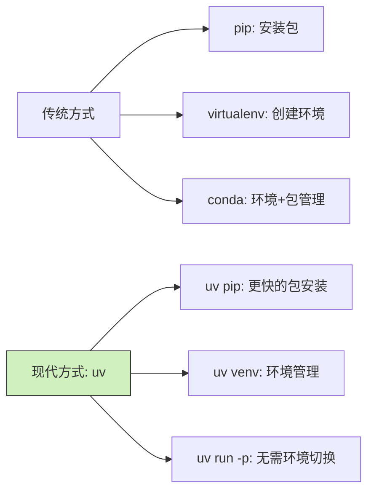

Управление окружением Python всегда было проблемой для разработчиков. Устав от раздутости conda и хлопот с virtualenv, uv может стать тем спасителем, которого вы так долго ждали.

<!--more-->

## 什么是 uv？

Фэн - новый аналитик данных, и каждый раз, когда он получает новое задание, ему приходится тратить полдня на настройку среды. Случайно коллега порекомендовал ему uv:

"Знаете что? Есть инструмент uv, написанный на Rust, который устанавливает пакеты в 10-100 раз быстрее, чем pip, и заменяет такие инструменты, как virtualenv и pip".

Вкратце, uv - это современный менеджер пакетов и инструмент управления окружением Python, который невероятно быстр, прост в использовании и может заменить традиционные pip, virtualenv и даже частично заменить conda.

## 快速上手 uv

### 安装 uv

Откройте терминал и введите следующую команду:

```bash
# Linux/macOS 用户
curl -LsSf https://astral.sh/uv/install.sh | sh

# macOS 使用 Homebrew
brew install uv
```

### 创建虚拟环境

Фон получила новый проект по анализу данных, и ей нужно было создать чистую рабочую среду:

```bash
# 在当前目录创建一个名为 .venv 的虚拟环境
uv venv

# 激活环境（bash/zsh 用户）
source .venv/bin/activate

# fish shell 用户
source .venv/bin/activate.fish
```

### 安装包

Малышу Вону нужно установить несколько обычных пакетов для анализа данных:

```bash
# 安装单个包
uv pip install pandas

# 安装多个包
uv pip install numpy matplotlib seaborn

# 安装特定版本
uv pip install requests==2.28.1

# 从 requirements.txt 安装
uv pip install -r requirements.txt
```

### 直接使用任意 Python 版本

Сяо Фенг обнаружил одну из самых мощных особенностей uv - возможность использовать любую версию Python без необходимости создавать или переключать окружение:

```bash
# 启动指定版本的 Python 交互式解释器
uv run -p 3.10 python
uv run -p 3.12 python

# 直接使用 Python 3.10 运行脚本
uv run -p 3.10 python my_script.py

# 甚至直接运行指定版本的 pip
uv run -p 3.11 pip install pandas
```

Фенг был поражен этой возможностью! Если раньше вам нужно было создавать различные окружения с помощью conda или virtualenv, то теперь вы можете переключаться между версиями Python с помощью простой команды, что значительно упрощает разработку и тестирование нескольких версий. Это просто спасение, особенно если вам нужно быстро проверить совместимость вашего кода с разными версиями Python.

## 为什么使用 uv？

Любопытствуя, Фенг спрашивает, почему ультрафиолет лучше традиционных инструментов:

1. **Потрясающая скорость**: установка пакетов в 10-100 раз быстрее, чем pip!
2. **Упрощенный рабочий процесс**: один инструмент вместо многих (pip, virtualenv и т. д.)
3. **Не нужно предварительно устанавливать Python**: некоторые операции даже не требуют наличия интерпретатора Python!
4. **Гибкость версий**: легко переключаться между различными версиями Python
5. **Малый размер**: намного легче, чем conda, быстро устанавливается и запускается!

## 日常使用技巧

После некоторого времени использования Сяо Фэн подытожил несколько практических советов:

### 项目依赖管理

```bash
# 使用 pyproject.toml 管理项目
uv pip install --project .

# 查看已安装的包
uv pip list

# 查看过期的包
uv pip list --outdated
```

### 快速切换 Python 版本

```bash
# 不同脚本用不同的 Python 版本
uv run -p 3.9 script_for_39.py
uv run -p 3.11 script_for_311.py
```

### 临时安装并使用包

```bash
# 安装包并立即使用，不污染环境
uv pip install pandas && uv run python -c "import pandas; print(pandas.__version__)"
```

## 总结

Используя uv, Фенг решил проблему управления средой Python и повысил эффективность своей работы. Будь то ежедневный проект или разовая задача, uv помогает ему быстро настроить необходимое окружение и эффективно завершить работу.

Для большинства пользователей Python uv является отличной альтернативой pip, virtualenv и даже conda во многих случаях, так что если вы устали от традиционных инструментов, которые громоздки и раздуты, попробуйте этот современный и эффективный инструмент.

(Примечание: необходимо добавить сравнительную таблицу инструментов, показывающую сравнение ультрафиолетовых и традиционных инструментов)



Пробовали ли вы использовать ультрафиолет? Не стесняйтесь поделиться своим опытом!