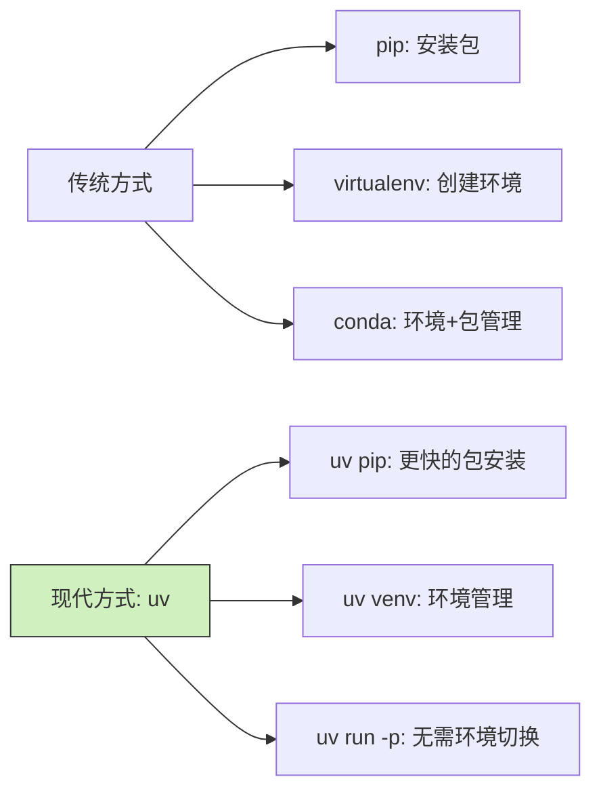

Управление окружением Python всегда было проблемой для разработчиков. Устав от раздутости conda и хлопот с virtualenv, uv может стать тем спасителем, которого вы так долго ждали.

<! ---далее-->

## Что такое uv?

Фенг - недавно нанятый аналитик данных, которому приходится по полдня заниматься настройкой среды каждый раз, когда он получает новую задачу. Случайно один из его коллег порекомендовал ему uv:

"Знаешь что? Есть инструмент uv, написанный на Rust, который устанавливает пакеты в 10-100 раз быстрее, чем pip, и может заменить такие инструменты, как virtualenv и pip".

Короче говоря, uv - это современный менеджер пакетов и окружения на Python, невероятно быстрый, простой в использовании, способный заменить pip, virtualenv и даже частично заменить conda.

## Быстрое начало работы с uv

### Установка uv

Откройте терминал и введите следующую команду:

```bash
# Linux/macOS 用户
curl -LsSf https://astral.sh/uv/install.sh | sh

# macOS 使用 Homebrew
brew install uv
```.

### Создайте виртуальную среду

Фон получил новый проект по анализу данных и должен создать чистую рабочую среду:

```bash
# 在当前目录创建一个名为 .venv 的虚拟环境
uv venv

# 激活环境（bash/zsh 用户）
source .venv/bin/activate

# fish shell 用户
source .venv/bin/activate.fish
```.

### Установите пакет

Маленькому Фенгу нужно установить несколько пакетов, обычно используемых для анализа данных:

```bash
# 安装单个包
uv pip install pandas

# 安装多个包
uv pip install numpy matplotlib seaborn

# 安装特定版本
uv pip install requests==2.28.1

# 从 requirements.txt 安装
uv pip install -r requirements.txt
```

### Используйте любую версию Python напрямую

Сяо Фенг обнаружил одну из самых мощных возможностей uv - возможность использовать любую версию Python без создания или переключения окружения:

```bash
# 启动指定版本的 Python 交互式解释器
uv run -p 3.10 python
uv run -p 3.12 python

# 直接使用 Python 3.10 运行脚本
uv run -p 3.10 python my_script.py

# 甚至直接运行指定版本的 pip
uv run -p 3.11 pip install pandas
```.

Эта возможность поразила Сяофэна! Если раньше вам нужно было создавать различные окружения через conda или virtualenv, то теперь вы можете переключать версии Python простой командой, что значительно упрощает разработку и тестирование нескольких версий. Это отличный способ упростить многоверсионную разработку и тестирование, особенно если вам нужно быстро проверить совместимость вашего кода с разными версиями Python.

## Зачем использовать uv?

Фенгу интересно узнать, почему uv лучше традиционных инструментов:

1. **Потрясающая скорость**: установка пакетов в 10-100 раз быстрее, чем с помощью pip
2. **Упрощенный рабочий процесс**: один инструмент заменяет несколько (pip, virtualenv и т. д.)
3. **Не нужно предварительно устанавливать Python**: некоторые операции даже не требуют наличия интерпретатора Python!
4. **Гибкость версий**: легко переключаться между различными версиями Python
5. **Малый размер**: намного легче, чем conda, быстро устанавливается и запускается!

## Советы для повседневного использования

После некоторого времени использования Feng обобщил несколько полезных советов:

### Управление зависимостями проекта

```bash
# 使用 pyproject.toml 管理项目
uv pip install --project .

# 查看已安装的包
uv pip list

# 查看过期的包
uv pip list --outdated
```.

### Быстрое переключение версий Python

```bash
# 不同脚本用不同的 Python 版本
uv run -p 3.9 script_for_39.py
uv run -p 3.11 script_for_311.py
```

### Временная установка и использование пакетов

```bash
# 安装包并立即使用，不污染环境
uv pip install pandas && uv run python -c "import pandas; print(pandas.__version__)"
```

## Резюме

Используя uv, Фенг решил проблему управления окружением Python и повысил эффективность своей работы. Будь то ежедневный проект или разовая задача, uv помогает ему быстро настроить необходимое окружение и эффективно завершить работу.

Для большинства пользователей Python uv может заменить pip, virtualenv и даже conda во многих случаях, так что если вы устали от утомительности и раздутости традиционных инструментов, попробуйте этот современный и эффективный инструмент.

(Примечание: вам нужно добавить диаграмму сравнения инструментов, чтобы показать, как uv сравнивается с традиционными инструментами)



А вы пробовали использовать uv? Не стесняйтесь поделиться своим опытом!
