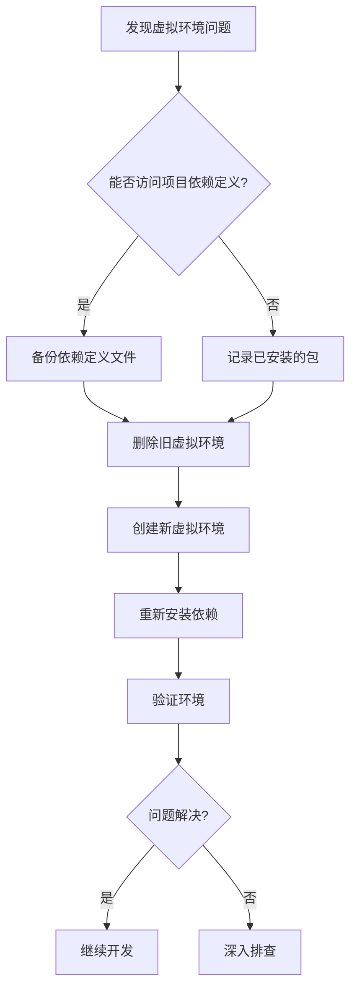

你是否曾经遇到过这样的情况：项目昨天还能正常运行，今天却突然启动失败了？错误信息令人费解，但你确信代码没有变更过。别担心，很可能只是你的Python虚拟环境出了问题，而解决方法可能比你想象的简单得多。

<!--more-->

## 问题场景：虚拟环境突然罢工

小王是一名数据分析师，负责维护公司的数据处理流程。一天早上，他按照惯例启动了日常的数据分析脚本，却意外收到了一连串错误信息：

```
dyld[50054]: Library not loaded: @executable_path/../lib/libpython3.11.dylib
Referenced from: /Users/xiaowang/projects/data-analyzer/.venv/bin/python3
Reason: tried: '/Users/xiaowang/projects/data-analyzer/.venv/lib/libpython3.11.dylib' (no such file)
```

小王回忆起，昨天他确实手动安装了一个包来测试新功能，之后又卸载了这个包及其依赖。难道是这个操作破坏了虚拟环境？

## 为什么虚拟环境会损坏？

在使用Python进行开发时，虚拟环境（Virtual Environment）是隔离项目依赖的重要工具。它创建了一个独立的Python解释器和库集合，使得不同项目可以使用不同版本的依赖而不互相干扰。

虚拟环境损坏的常见原因包括：

1. 手动删除或修改虚拟环境内的关键文件
2. 不正确地安装或卸载包（特别是使用了不同的包管理工具）
3. 操作系统升级后与虚拟环境的兼容性问题
4. Python版本升级导致的库路径变化

在小王的例子中，错误消息清楚地指出了问题：虚拟环境中缺少关键的动态链接库文件`libpython3.11.dylib`，这可能是手动卸载包时意外删除的结果。

## 快速解决方案：重建虚拟环境

对于使用uv工具管理的Python项目，解决虚拟环境问题的最简单方法就是重新创建它。以下是具体步骤：

### 1. 备份项目依赖配置（如果需要）

```bash
# 备份pyproject.toml（uv项目通常使用这个文件定义依赖）
cp pyproject.toml pyproject.toml.bak
```

### 2. 删除并重建虚拟环境

```bash
# 删除旧的虚拟环境
rm -rf .venv

# 使用uv创建新的虚拟环境
uv venv

# 激活新的虚拟环境
# 如果使用bash或zsh
source .venv/bin/activate
# 如果使用fish shell
source .venv/bin/activate.fish
```

### 3. 重新安装项目依赖

```bash
# 安装项目依赖
uv pip install -e .

# 如果是MCP项目，可能还需要安装MCP相关的依赖
uv pip install "mcp[cli]"
```

### 4. 验证环境是否正常

```bash
# 检查Python版本和安装位置
which python
python --version

# 尝试运行你的应用
python your_script.py
```

这个简单的过程可以解决绝大多数虚拟环境损坏的问题，无需深入排查或复杂的修复步骤。

## 为什么这个方法有效？

重建虚拟环境有效的原因在于，它完全绕过了尝试修复已损坏环境的复杂过程，直接创建一个全新的、干净的环境。这种方法：

1. 确保所有系统文件和库都是最新且完整的
2. 避免了由于部分文件损坏或缺失导致的问题
3. 使用项目定义的依赖列表重新安装所有需要的包
4. 消除了不同包管理工具之间可能存在的冲突



## 使用uv的优势

在Python生态系统中，uv是一个相对较新但非常高效的包管理和虚拟环境工具。与传统的pip和venv相比，uv提供了以下优势：

1. 更快的依赖解析和安装速度
2. 更一致的依赖锁定机制
3. 简化的环境管理命令
4. 更好的并行下载支持

对于像MCP（Model Context Protocol）这样的现代Python项目，使用uv可以显著提高开发效率和环境稳定性。

## 预防胜于治疗：避免虚拟环境损坏的最佳实践

虽然修复虚拟环境很简单，但预防问题总是更好的策略。以下是一些建议：

1. **保持工具一致性**：如果项目使用uv管理依赖，避免使用pip或其他工具手动安装/卸载包
2. **使用依赖定义文件**：确保所有依赖都在pyproject.toml或requirements.txt中定义
3. **创建环境快照**：在重大更改前考虑对虚拟环境进行备份
4. **避免手动修改虚拟环境文件**：不要直接编辑或删除.venv目录中的文件
5. **定期更新工具**：保持uv和其他包管理工具的版本更新

## 结语

Python虚拟环境问题虽然令人沮丧，但通常有简单快速的解决方案。下次当你遇到奇怪的环境错误时，不要立即怀疑是应用代码的问题，而是考虑虚拟环境本身可能已损坏。使用本文介绍的方法重建环境，往往能在几分钟内解决问题，让你回到正常的开发工作中。

记住，对于使用uv管理的项目（包括MCP等现代Python框架），保持工具链的一致性是避免环境问题的关键。当遇到故障时，简单地重建虚拟环境通常是最直接有效的解决方案。

如果你有任何关于Python虚拟环境问题的经验或解决方案，欢迎在评论区分享！
