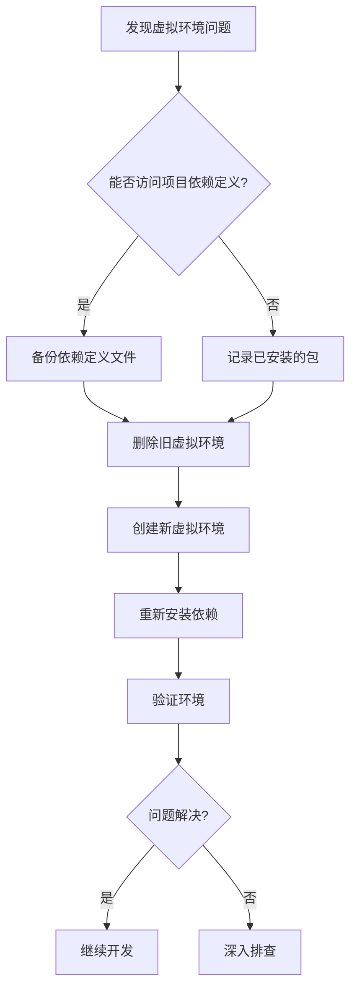

Приходилось ли вам сталкиваться с ситуацией, когда вчера проект работал нормально, а сегодня вдруг не запускается? Сообщение об ошибке озадачивает, но вы уверены, что код не менялся. Не волнуйтесь, скорее всего, это просто проблема с вашей виртуальной средой Python, и решение может быть гораздо проще, чем вы думаете.

<!--more-->

## 问题场景：虚拟环境突然罢工

Ванг - аналитик данных, отвечающий за поддержку процессов обработки данных в компании. Однажды утром он, как обычно, запустил свой ежедневный сценарий анализа данных, но неожиданно получил серию сообщений об ошибках:

```
dyld[50054]: Library not loaded: @executable_path/../lib/libpython3.11.dylib
Referenced from: /Users/xiaowang/projects/data-analyzer/.venv/bin/python3
Reason: tried: '/Users/xiaowang/projects/data-analyzer/.venv/lib/libpython3.11.dylib' (no such file)
```

Ванг вспоминает, что вчера он вручную установил пакет для тестирования новой функции, а затем удалил пакет и его зависимости. Могла ли эта операция повредить виртуальную среду?

## 为什么虚拟环境会损坏？

При разработке на Python виртуальная среда (VE) является важным инструментом для изоляции проектных зависимостей. Она создает отдельную коллекцию интерпретаторов и библиотек Python, позволяя разным проектам использовать разные версии зависимостей, не мешая друг другу.

К распространенным причинам повреждения виртуальной среды относятся:

1. ручное удаление или изменение критических файлов в виртуальной среде
2. некорректная установка или удаление пакетов (особенно если используются различные средства управления пакетами)
3. проблемы совместимости с виртуальными средами после обновления операционной системы
4. изменение путей к библиотекам в связи с обновлением версии Python

В случае Сяо Ванга сообщение об ошибке четко указывает на проблему: критический файл библиотеки динамических связей `libpython3.11.dylib` отсутствует в виртуальной среде, вероятно, в результате случайного удаления при ручной деинсталляции пакета.

## 快速解决方案：重建虚拟环境

Для Python-проектов, управляемых с помощью uv-инструментов, самый простой способ решить проблему виртуального окружения - воссоздать его. Вот точные шаги:

### 1. 备份项目依赖配置（如果需要）

```bash
# 备份pyproject.toml（uv项目通常使用这个文件定义依赖）
cp pyproject.toml pyproject.toml.bak
```

### 2. 删除并重建虚拟环境

```bash
# 删除旧的虚拟环境
rm -rf .venv

# 使用uv创建新的虚拟环境
uv venv

# 激活新的虚拟环境
# 如果使用bash或zsh
source .venv/bin/activate
# 如果使用fish shell
source .venv/bin/activate.fish
```

### 3. 重新安装项目依赖

```bash
# 安装项目依赖
uv pip install -e .

# 如果是MCP项目，可能还需要安装MCP相关的依赖
uv pip install "mcp[cli]"
```

### 4. 验证环境是否正常

```bash
# 检查Python版本和安装位置
which python
python --version

# 尝试运行你的应用
python your_script.py
```

Этот простой процесс позволит решить подавляющее большинство проблем с повреждением виртуальной среды без необходимости углубленного поиска неисправностей или сложных шагов по восстановлению.

## 为什么这个方法有效？

Эффективность восстановления виртуальной среды заключается в том, что она полностью обходит сложный процесс восстановления поврежденной среды и переходит к созданию новой, чистой среды. Этот метод:

1. обеспечение актуальности и полноты всех системных файлов и библиотек
2. избегайте проблем, вызванных поврежденными или отсутствующими частями файлов
3. переустанавливает все необходимые пакеты, используя определенный проектом список зависимостей
4. устраняет возможные конфликты между различными инструментами управления пакетами



## 使用uv的优势

В экосистеме Python uv - это относительно новый, но очень эффективный инструмент для управления пакетами и виртуальными средами. По сравнению с традиционными pip и venv, uv обладает следующими преимуществами:

1. более быстрое разрешение и установка зависимостей
2. более последовательный механизм блокировки зависимостей
3. упрощенные команды управления окружением
4. улучшенная поддержка параллельной загрузки

Для современных Python-проектов, таких как MCP (Model Context Protocol), использование uv может значительно повысить эффективность разработки и стабильность среды.

## 预防胜于治疗：避免虚拟环境损坏的最佳实践

Хотя исправить виртуальную среду очень просто, предотвращение проблем всегда является лучшей стратегией. Вот некоторые рекомендации:

1. **Поддерживайте согласованность инструментов**: если проект использует uv для управления зависимостями, избегайте использования pip или других инструментов для ручной установки/удаления пакетов
2. **Используйте файлы определения зависимостей**: убедитесь, что все зависимости определены в файлах pyproject.toml или requirements.txt
3. **Создавайте моментальные снимки среды**: перед внесением серьезных изменений создавайте резервные копии виртуальной среды
4. **Избегайте ручного изменения файлов виртуальной среды**: не редактируйте и не удаляйте напрямую файлы в каталоге .venv
5. **Регулярно обновляйте инструменты**: поддерживайте версию uv и других инструментов управления пакетами в актуальном состоянии

## 结语

Проблемы с виртуальной средой Python, хотя и досадные, обычно имеют простые и быстрые решения. В следующий раз, когда вы столкнетесь со странной ошибкой среды, вместо того чтобы сразу подозревать, что это проблема с кодом приложения, подумайте о том, что сама виртуальная среда может быть повреждена. Восстановление среды с помощью методов, описанных в этой статье, часто решает проблему за считанные минуты, позволяя вам вернуться к обычной работе над проектом.

Помните, что для проектов, использующих управление uv (включая современные фреймворки Python, такие как MCP), сохранение последовательности инструментария является ключом к избежанию проблем с окружением. При возникновении сбоя простая перестройка виртуальной среды обычно является наиболее простым и эффективным решением.

Если у вас есть опыт или решения проблем с виртуальной средой Python, поделитесь ими в разделе комментариев!