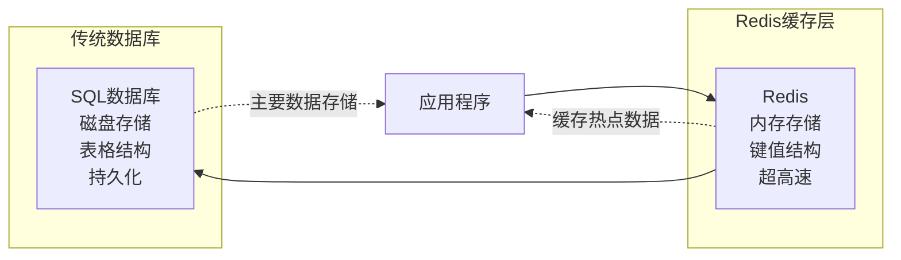
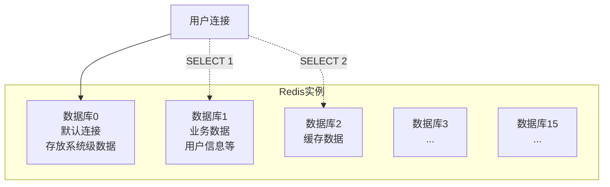
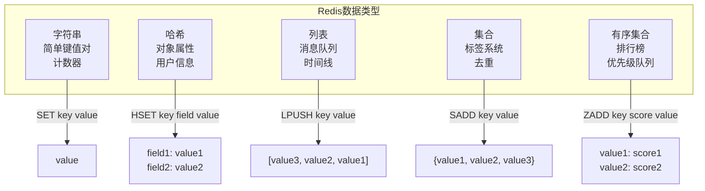
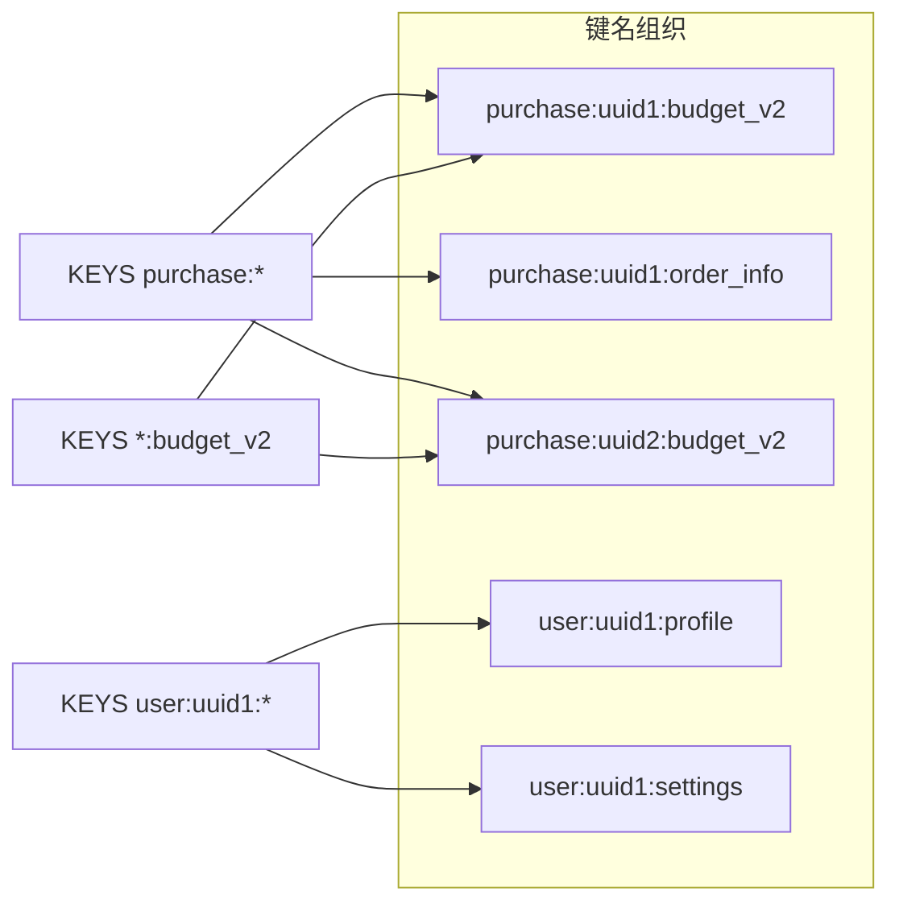
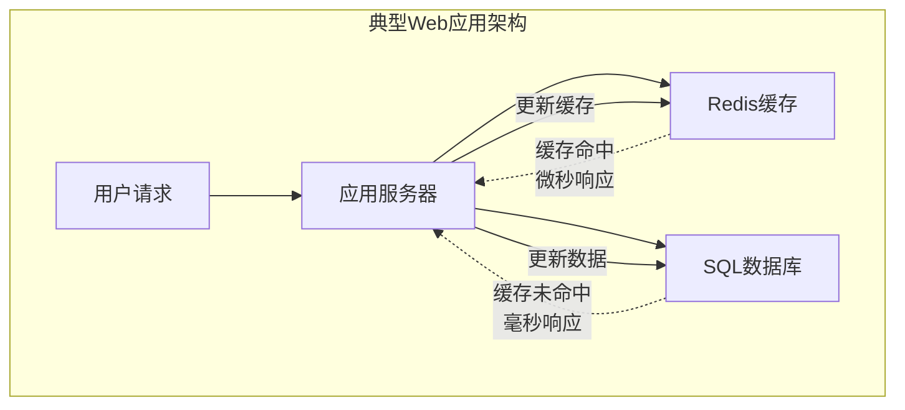

Redis对很多开发者来说是一个既熟悉又陌生的名词。我们可能听说过它很快，是内存数据库，但当真正需要接触和使用Redis时，往往会被它的数据结构和操作方式搞得一头雾水。本文将通过可视化图表和实际操作，帮助没有Redis经验的小白快速理解Redis的核心概念和使用方法。

<!--more-->

## 第一印象：Redis是什么

想象一下你在图书馆工作。传统的SQL数据库就像是那种有着严格分类系统的大型图书馆，每本书都按照杜威十进分类法放在固定的书架上，查找时需要先找到正确的分类区域，再按照编号逐个寻找。

而Redis就像是图书管理员桌上的那个小型快速查阅架。所有最常用的参考资料都放在这里，你只需要告诉管理员书名，他立即就能递给你，速度快得惊人。但这个快速查阅架空间有限，不能存放所有书籍，而且如果管理员下班了（服务器重启），这些书可能需要重新整理。



## Redis的数据空间：16个独立房间

Redis有一个独特的特性：它内部有16个独立的数据库（编号0-15）。这就像一栋有16个房间的仓库，每个房间里都有自己独立的货架和物品，互不干扰。



在实际操作中，当你连接Redis时，默认进入数据库0。如果需要切换到其他数据库，使用`SELECT`命令：

```bash
# 默认在数据库0
redis-cli> KEYS *
1) "gq:search-index-docs-count"

# 切换到数据库1
redis-cli> SELECT 1
OK

# 现在在数据库1，可以看到完全不同的数据
redis-cli[1]> KEYS *
1) "client:all:quota_last_updated_minute"
2) "purchase:820f672f-98bf-9639-41b8-1150b535aef5:budget_v2"
...
```

注意命令行提示符的变化：`redis-cli[1]>`中的`[1]`表示当前在数据库1中。

## Redis的数据类型：不只是简单的键值对

如果你熟悉Python或JSON，可能会认为键值对就是字符串映射字符串。但Redis提供了5种专门优化的数据类型，每种都有特定的用途：

### 1. 字符串（String）
最基础的类型，可以存储文本、数字、甚至二进制数据：

```bash
SET user:name "张三"
GET user:name
# 返回: "张三"

SET counter 100
INCR counter
# 返回: 101
```

### 2. 哈希（Hash）
这里的"哈希"不是加密概念，而是像Python字典一样的字段-值映射。特别适合存储对象信息：

```bash
HSET user:1000 name "张三" age 30 email "zhang@example.com"
HGETALL user:1000
# 返回:
# 1) "name"
# 2) "张三"
# 3) "age"
# 4) "30"
# 5) "email"
# 6) "zhang@example.com"
```

这正是我们之前看到的购买记录的结构：

```bash
HGETALL purchase:820f672f-98bf-9639-41b8-1150b535aef5:budget_v2
# 返回预算相关的4个字段和值
```

### 3. 列表（List）
有序的元素序列，支持从两端插入和删除：

```bash
LPUSH messages "最新消息"
LPUSH messages "较早消息"
LRANGE messages 0 -1
# 返回: ["最新消息", "较早消息"]
```

### 4. 集合（Set）
无序且不重复的元素集合：

```bash
SADD tags "redis" "数据库" "nosql"
SMEMBERS tags
# 返回: ["redis", "数据库", "nosql"]
```

### 5. 有序集合（Sorted Set）
每个元素都有一个分数，按分数排序：

```bash
ZADD leaderboard 100 "玩家A" 85 "玩家B" 120 "玩家C"
ZRANGE leaderboard 0 -1 WITHSCORES
# 返回按分数排序: ["玩家B", "85", "玩家A", "100", "玩家C", "120"]
```



## Redis键名的命名艺术

Redis没有真正的层次结构，所有键都是扁平的。但开发者通过冒号（:）创建了一种"伪层次"命名约定：

```
purchase:820f672f-98bf-9639-41b8-1150b535aef5:budget_v2
^~~~~~~  ^~~~~~~~~~~~~~~~~~~~~~~~~~~~~~~~~~~  ^~~~~~~~~
类型      唯一标识符(UUID)                     属性/版本
```

这种命名方式带来几个好处：

1. **清晰的组织结构**：一眼就能看出数据的用途
2. **模式匹配查询**：可以使用通配符查找相关键
3. **避免命名冲突**：不同功能模块的键不会重名



重要的是要理解：对Redis而言，整个字符串就是一个键名，没有父子关系。当你执行`KEYS purchase:*`时，Redis会返回所有匹配的完整键名，而不是像文件系统那样返回"子目录"。

## 实际操作：连接和查询Redis

### 连接到Redis

如果你在Kubernetes环境中，可以创建一个Redis客户端Pod：

```yaml
apiVersion: v1
kind: Pod
metadata:
  name: redis-client
spec:
  containers:
  - name: redis-client
    image: redis
    command: [ "sh", "-c", "sleep 3h" ]
```

然后进入Pod并连接Redis：

```bash
# 进入Pod
kubectl exec -it redis-cli -- bash

# 连接Redis（替换为你的实际连接信息）
redis-cli -h your-redis-host -p 6379 -a your-password

# 如果使用SSL（Azure Redis默认启用）
redis-cli -h your-redis-host -p 6380 --tls -a your-password
```

### 基础查询命令

连接成功后，你可以使用这些非侵入性命令探索数据：

```bash
# 测试连接
PING
# 返回: PONG

# 查看当前数据库的所有键（小心使用，数据量大时会很慢）
KEYS *

# 更安全的方式：分批查看键
SCAN 0 MATCH purchase:* COUNT 10

# 查看数据库中键的总数
DBSIZE

# 检查特定键的类型
TYPE purchase:820f672f-98bf-9639-41b8-1150b535aef5:budget_v2
# 返回: hash

# 查看键的过期时间
TTL some-key
# 返回剩余秒数，-1表示永不过期，-2表示键不存在
```

### 根据数据类型查询内容

```bash
# 如果是字符串
GET key-name

# 如果是哈希
HGETALL key-name
HKEYS key-name    # 只看字段名
HVALS key-name    # 只看值

# 如果是列表
LRANGE key-name 0 -1   # 查看所有元素
LLEN key-name          # 查看列表长度

# 如果是集合
SMEMBERS key-name      # 查看所有成员
SCARD key-name         # 查看成员数量

# 如果是有序集合
ZRANGE key-name 0 -1 WITHSCORES  # 查看所有成员和分数
ZCARD key-name                   # 查看成员数量
```

## Redis的使用场景和价值

### 为什么需要Redis？

Redis的核心优势是**速度**。作为内存数据库，它能提供微秒级响应时间，这在以下场景中特别有价值：

1. **缓存层**：减轻数据库压力
   - 将热点数据存储在Redis中
   - 应用先查Redis，没有再查数据库
   - 大幅提升响应速度

2. **实时功能**：
   - 在线用户计数
   - 实时排行榜
   - 限流器（防止API滥用）

3. **会话存储**：
   - 用户登录状态
   - 购物车内容
   - 临时配置信息

4. **消息队列**：
   - 简单的任务队列
   - 发布/订阅消息



### 持久性：临时存储还是主存储？

Redis的定位取决于你的配置：

**作为缓存（默认模式）**：
- 数据存储在内存中
- 服务器重启后数据丢失
- 主要数据仍在SQL数据库中
- Redis只是加速层

**作为主存储（配置持久化）**：
- 启用RDB快照或AOF日志
- 数据会定期保存到磁盘
- 可以作为某些数据的唯一存储

在企业环境（如Azure Redis Cache）中，通常会启用持久化功能，确保数据的可靠性。

## 实践建议

### 安全的探索方式

当你刚接触公司的Redis时，建议使用这些安全的命令：

```bash
# 查看基本信息
INFO
INFO memory
INFO stats

# 安全地浏览键（避免使用KEYS *）
SCAN 0 MATCH *your-pattern* COUNT 10

# 查看样本数据
RANDOMKEY
TYPE <random-key>
# 然后根据类型使用相应的查看命令
```

### 注意事项

1. **避免阻塞命令**：在生产环境中，`KEYS *`和`MONITOR`命令可能影响性能
2. **使用SCAN代替KEYS**：对于大数据集，SCAN命令更安全
3. **理解数据库概念**：记住不同数据库的数据是完全隔离的
4. **注意TTL**：某些键可能有过期时间，过期后会自动删除

通过本文的介绍，相信你已经对Redis有了基本的认识。Redis不仅仅是一个"快速的键值存储"，它是一个功能强大的内存数据结构服务器，为现代应用提供了高性能的数据处理能力。

接下来，你可以在安全的环境中尝试这些命令，逐步熟悉Redis的操作。记住，理解Redis的关键是要意识到它与传统关系型数据库的根本不同：它是扁平的、内存的、面向数据结构的，这些特性成就了它的独特价值。
