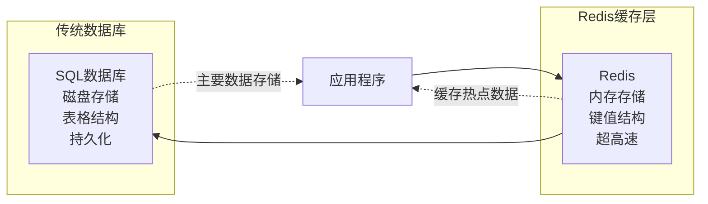
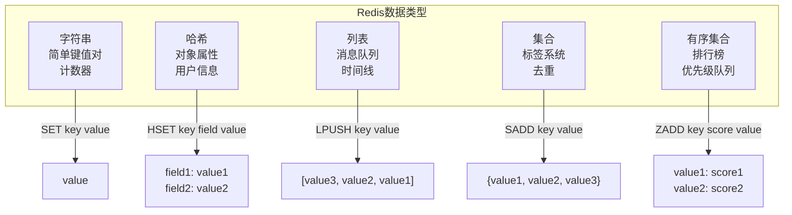

Redis - одновременно знакомый и незнакомый термин для многих разработчиков. Возможно, мы слышали, что он быстрый и является базой данных in-memory, но когда действительно нужно связаться и использовать Redis, часто путаемся в его структуре данных и работе. В этой статье мы будем использовать визуальные диаграммы и практические операции, чтобы помочь людям, не имеющим опыта работы с Redis, быстро понять основные концепции Redis и то, как его использовать.

<! -еще-->

## Первые впечатления: что такое Redis?

Представьте, что вы работаете в библиотеке. Традиционные базы данных SQL похожи на большие библиотеки со строгой системой классификации, где каждая книга размещена на фиксированной полке в соответствии с десятичной классификацией Дьюи, и вам нужно сначала найти нужную область классификации, а затем искать ее по очереди в соответствии с ее номером.

Redis - это как маленькая полка быстрого доступа на столе библиотекаря. Там размещены все наиболее часто используемые справочные материалы, и вам достаточно сказать библиотекарю название книги, и он тут же выдаст ее вам, что невероятно быстро. Но полка быстрого доступа имеет ограниченное пространство, она не может вместить все книги, и если администратор отлучается (перезагрузка сервера), книги может потребоваться переставить.



## Пространство данных Redis: 16 отдельных комнат

Redis обладает уникальной особенностью: внутри него находится 16 отдельных баз данных (пронумерованных 0-15). Это похоже на здание склада с 16 комнатами, в каждой из которых есть свои отдельные полки и предметы, не мешающие друг другу.

```mermaid
graph TD
    subgraph "Redis实例"
        DB0["数据库0<br/>默认连接<br/>存放系统级数据"]
        DB1["数据库1<br/>业务数据<br/>用户信息等"]
        DB2["数据库2<br/>缓存数据"]
        DB3["数据库3<br/>..."]
        DBO["数据库15<br/>..."]
    end
    
    USER["用户连接"] --> DB0
    USER -.-> |SELECT 1| DB1
    USER -.-> |SELECT 2| DB2
```.

На практике, когда вы подключаетесь к Redis, по умолчанию используется база данных 0. Если вам нужно переключиться на другую базу данных, используйте команду `SELECT`:

```bash
# 默认在数据库0
redis-cli> KEYS *
1) "gq:search-index-docs-count"

# 切换到数据库1
redis-cli> SELECT 1
OK

# 现在在数据库1，可以看到完全不同的数据
redis-cli[1]> KEYS *
1) "client:all:quota_last_updated_minute"
2) "purchase:820f672f-98bf-9639-41b8-1150b535aef5:budget_v2"
...
```

Обратите внимание на изменение в подсказке командной строки: `[1]` в `redis-cli[1]>` указывает на то, что вы сейчас находитесь в базе данных 1.

## Типы данных Redis: больше, чем простые пары ключ-значение

Если вы знакомы с Python или JSON, вы можете думать о парах ключ-значение как о строках, сопоставленных со строками. Но Redis предоставляет пять специально оптимизированных типов данных, каждый из которых имеет определенное назначение:

### 1. String (Строка)
Самый базовый тип, который может хранить текст, числа и даже двоичные данные:

```bash
SET user:name "张三"
GET user:name
# 返回: "张三"

SET counter 100
INCR counter
# 返回: 101
```.

### 2. Hash
Hash - это не криптографическая концепция, а сопоставление полей и значений, как в словаре Python. Он особенно подходит для хранения информации об объектах:

```bash
HSET user:1000 name "张三" age 30 email "zhang@example.com"
HGETALL user:1000
# 返回:
# 1) "name"
# 2) "张三"
# 3) "age"
# 4) "30"
# 5) "email"
# 6) "zhang@example.com"
```.

Именно такую структуру записи о покупке мы видели ранее:

```bash
HGETALL purchase:820f672f-98bf-9639-41b8-1150b535aef5:budget_v2
# 返回预算相关的4个字段和值
```

### 3. Список
Упорядоченная последовательность элементов, поддерживающая вставку и удаление с обоих концов:

```bash
LPUSH messages "最新消息"
LPUSH messages "较早消息"
LRANGE messages 0 -1
# 返回: ["最新消息", "较早消息"]
```

### 4. Набор
Неупорядоченная и неповторяющаяся коллекция элементов:

```bash
SADD tags "redis" "数据库" "nosql"
SMEMBERS tags
# 返回: ["redis", "数据库", "nosql"]
```

### 5. Сортированное множество
Каждый элемент имеет оценку и отсортирован по ней:

```bash
ZADD leaderboard 100 "玩家A" 85 "玩家B" 120 "玩家C"
ZRANGE leaderboard 0 -1 WITHSCORES
# 返回按分数排序: ["玩家B", "85", "玩家A", "100", "玩家C", "120"]
``` ### 5.



## Искусство именования имен ключей Redis

В Redis нет настоящей иерархии, все ключи плоские. Однако разработчики создали "псевдоиерархическое" соглашение об именовании, используя двоеточия (:):

```
purchase:820f672f-98bf-9639-41b8-1150b535aef5:budget_v2
^~~~~~~  ^~~~~~~~~~~~~~~~~~~~~~~~~~~~~~~~~~~  ^~~~~~~~~
类型      唯一标识符(UUID)                     属性/版本
```.

Это соглашение об именовании имеет несколько преимуществ:

1. **Четкая организация**: с первого взгляда видно, для чего используются данные
2. **Запросы с подбором шаблонов**: для поиска совместимых ключей можно использовать подстановочные знаки
3. **Предотвращение конфликтов имен**: ключи для разных функциональных модулей не переименовываются

```mermaid
graph LR
    subgraph "键名组织"
        K1["purchase:uuid1:budget_v2"] 
        K2["purchase:uuid1:order_info"]
        K3["purchase:uuid2:budget_v2"]
        K4["user:uuid1:profile"]
        K5["user:uuid1:settings"]
    end
    
    Q1["KEYS purchase:*"] --> K1
    Q1 --> K2
    Q1 --> K3
    
    Q2["KEYS *:budget_v2"] --> K1
    Q2 --> K3
    
    Q3["KEYS user:uuid1:*"] --> K4
    Q3 --> K5
```.

Важно понимать: для Redis вся строка - это имя ключа, без отношений "родитель-ребенок". Когда вы выполняете `KEYS purchase:*`, Redis возвращает все совпадающие полные имена ключей, а не "подкаталоги", как в файловой системе.

## Практическая работа: подключение к Redis и запрос к нему

### Подключение к Redis

Если вы работаете в среде Kubernetes, вы можете создать клиентский подкаст Redis:

```yaml
apiVersion: v1
kind: Pod
metadata:
  name: redis-client
spec:
  containers:
  - name: redis-client
    image: redis
    command: [ "sh", "-c", "sleep 3h" ]
```.

Затем перейдите в подкаст и подключитесь к Redis:

```bash
# 进入Pod
kubectl exec -it redis-cli -- bash

# 连接Redis（替换为你的实际连接信息）
redis-cli -h your-redis-host -p 6379 -a your-password

# 如果使用SSL（Azure Redis默认启用）
redis-cli -h your-redis-host -p 6380 --tls -a your-password
```

### Основные команды запроса

После успешного подключения вы можете использовать эти неинтрузивные команды для изучения данных:

```bash
# 测试连接
PING
# 返回: PONG

# 查看当前数据库的所有键（小心使用，数据量大时会很慢）
KEYS *

# 更安全的方式：分批查看键
SCAN 0 MATCH purchase:* COUNT 10

# 查看数据库中键的总数
DBSIZE

# 检查特定键的类型
TYPE purchase:820f672f-98bf-9639-41b8-1150b535aef5:budget_v2
# 返回: hash

# 查看键的过期时间
TTL some-key
# 返回剩余秒数，-1表示永不过期，-2表示键不存在
```

### Запрос содержимого на основе типа данных

```bash
# 如果是字符串
GET key-name

# 如果是哈希
HGETALL key-name
HKEYS key-name    # 只看字段名
HVALS key-name    # 只看值

# 如果是列表
LRANGE key-name 0 -1   # 查看所有元素
LLEN key-name          # 查看列表长度

# 如果是集合
SMEMBERS key-name      # 查看所有成员
SCARD key-name         # 查看成员数量

# 如果是有序集合
ZRANGE key-name 0 -1 WITHSCORES  # 查看所有成员和分数
ZCARD key-name                   # 查看成员数量
```

### Сценарии использования Redis и их значение

### Зачем вам нужен Redis?

Основная сила Redis - это **скорость**. Будучи базой данных in-memory, он обеспечивает микросекундное время отклика, что особенно ценно в следующих сценариях:

1. **кэширующий слой**: снижение нагрузки на базу данных
   - Хранение горячих данных в Redis
   - Приложение сначала проверяет Redis, а не базу данных
   - Значительное улучшение времени отклика

2. **Функция реального времени**:
   - подсчет пользователей в режиме онлайн
   - Таблицы лидеров в реальном времени
   - Ограничитель потока (для предотвращения злоупотребления API)

3. **Хранилище сессий**:
   - статус входа пользователя
   - Содержимое корзины
   - Временная информация о конфигурации

4. **Очередь сообщений**:
   - Простая очередь задач
   - Публикация/подписка сообщений

```mermaid
graph TD
    subgraph "典型Web应用架构"
        USER["用户请求"] --> APP["应用服务器"]
        APP --> REDIS["Redis缓存"]
        APP --> DB["SQL数据库"]
        
        REDIS -.-> |缓存命中<br/>微秒响应| APP
        DB -.-> |缓存未命中<br/>毫秒响应| APP
        
        APP --> |更新数据| DB
        APP --> |更新缓存| REDIS
    end
```.

### Постоянство: временное или основное хранилище?

Позиционирование Redis зависит от вашей конфигурации:

** как кэш (режим по умолчанию)**:
- Данные хранятся в памяти
- Данные теряются после перезагрузки сервера
- Основные данные остаются в базе данных SQL
- Redis - это просто слой ускорения

**В качестве основного хранилища (настройка персистентности)**:
- Включите снимки RDB или ведение журнала AOF
- Данные периодически сохраняются на диск
- Может использоваться как уникальное хранилище для определенных данных

В корпоративных средах (например, Azure Redis Cache) постоянство часто включается для обеспечения надежности данных.

## Практические рекомендации

### Безопасный способ исследования

Если вы только начинаете работать с Redis, рекомендуем использовать эти безопасные команды:

```bash
# 查看基本信息
INFO
INFO memory
INFO stats

# 安全地浏览键（避免使用KEYS *）
SCAN 0 MATCH *your-pattern* COUNT 10

# 查看样本数据
RANDOMKEY
TYPE <random-key>
# 然后根据类型使用相应的查看命令
```.

### Примечания

1. **Избегайте блокирующих команд**: в производственных средах команды `KEYS *` и `MONITOR` могут повлиять на производительность.
2. **Используйте SCAN вместо KEYS**: Команды SCAN более безопасны для больших наборов данных.
3. **Понимайте концепции баз данных**: помните, что данные в разных базах данных полностью изолированы.
4. **Обратите внимание на TTL**: некоторые ключи могут иметь срок действия и будут автоматически удалены после истечения срока действия.

Я полагаю, что благодаря этой статье вы получили базовое представление о Redis. Redis - это не просто "быстрое хранилище ключей и значений", это мощный сервер структур данных in-memory для современных приложений, обеспечивающий высокопроизводительную обработку данных.

Далее вы можете попробовать выполнить эти команды в безопасной среде, чтобы ознакомиться с Redis. Помните, что ключ к пониманию Redis - это осознание того, что он принципиально отличается от традиционных реляционных баз данных: он плоский, in-memory и ориентирован на структуру данных, и эти характеристики способствуют его уникальной ценности.
