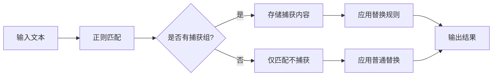

你有没有在编辑或处理文本时，需要替换某些模式但又想保留其中的一部分？比如将网页链接转换为markdown格式，或重新排列日期格式？正则表达式中的"捕获组"正是解决这类问题的强大工具。

<!--more-->

## 捕获组：正则表达式中的"记忆"功能

在日常文字处理或编程工作中，我们常常需要进行复杂的查找和替换操作。例如，将格式为"姓,名"的文本转换为"名 姓"，或者将普通URL转换为markdown链接格式。这些看似简单的任务，如果没有合适的工具，可能需要手动一个个修改，既耗时又容易出错。

正则表达式的捕获组功能就像是一个"记忆"和"引用"系统，它能够在匹配过程中捕获文本片段，并在替换时重新使用这些片段。这就为复杂的文本转换提供了便捷的解决方案。

## 什么是捕获组？

捕获组（Capture Groups）是正则表达式中用于"记住"匹配文本的一种机制。通过在正则表达式中使用括号`()`，我们可以将想要保留的部分"捕获"下来，并在后续的替换操作中引用它们。

最基本的捕获组语法很简单：只需在正则表达式中使用圆括号`()`包围要捕获的模式部分。

```
(pattern)
```

当正则表达式匹配成功时，每个括号内匹配到的内容会被单独保存，可以在替换字符串中引用。

## 捕获组的引用方式

根据不同的工具和语言环境，捕获组的引用方式主要有两种：

1. **反斜杠引用法** (`\1`, `\2`, `\3`...): 
   - 常见于Unix/Linux工具（如sed、grep、awk）
   - Perl语言
   - 许多编辑器的搜索替换功能（如Vim）
   - 命令行工具中

2. **美元符引用法** (`$1`, `$2`, `$3`...):
   - JavaScript和Web相关技术
   - PHP的preg_replace函数
   - 许多现代编程语言
   - Visual Studio Code等现代编辑器

记忆技巧：Unix系工具偏爱反斜杠语法，而Web/脚本语言则倾向于使用美元符。

## 捕获组的基本应用

让我们以一个简单例子来说明捕获组的用法：

**问题**：将"姓,名"格式的文本转换为"名 姓"格式。

例如：将"李,小明"转换为"小明 李"。

**解决方案**：

在sed中：
```bash
echo "李,小明" | sed 's/\([^,]*\),\([^,]*\)/\2 \1/'
# 输出: 小明 李
```

在JavaScript中：
```javascript
"李,小明".replace(/([^,]*),([^,]*)/, "$2 $1")
// 输出: "小明 李"
```

这个例子中：
- 第一个捕获组`([^,]*)`匹配逗号前的所有字符（姓）
- 第二个捕获组`([^,]*)`匹配逗号后的所有字符（名）
- 在替换字符串中，我们引用这些捕获组，但颠倒了它们的顺序

## 命名捕获组：提高代码可读性

随着正则表达式复杂度的增加，仅使用数字引用（如`\1`、`$1`）可能会让代码难以理解和维护。这时，命名捕获组就派上用场了。

命名捕获组允许我们给捕获组指定一个有意义的名称，而不是仅仅依靠它们的位置顺序。

**语法**：
```
(?<name>pattern)
```

**例子**：将URL转换为markdown链接格式

在VSCode中：
```
查找: (?<url>https?://.*?)(?: |,|$)
替换: [${url}](${url})$2
```

这里，我们创建了一个名为"url"的捕获组，它匹配以http或https开头的URL。在替换字符串中，我们可以通过`${url}`来引用这个捕获组。

命名捕获组的好处是显而易见的：它使正则表达式更加自文档化，尤其是在处理复杂模式时。

## 非捕获组：提高性能的小技巧

有时，我们需要在正则表达式中使用括号进行分组，但并不需要捕获这些组以供后续引用。这时，可以使用非捕获组：

**语法**：
```
(?:pattern)
```

非捕获组的优势：
1. 提高性能 - 减少内存使用和处理时间
2. 简化替换操作 - 不会影响捕获组的编号

在上面的URL例子中，`(?: |,|$)`就是一个非捕获组，它匹配URL后面的空格、逗号或行尾，但不会被保存为一个单独的捕获组。

## 高级应用案例

### 案例1：日期格式转换

将"MM/DD/YYYY"格式转换为"YYYY-MM-DD"格式：

```javascript
// JavaScript示例
"04/16/2025".replace(/(\d{2})\/(\d{2})\/(\d{4})/, "$3-$1-$2")
// 输出: "2025-04-16"
```

### 案例2：提取和重组电子邮件地址

将"username@domain.com"拆分并重组：

```javascript
// JavaScript示例
"user123@example.com".replace(/([^@]*)@([^.]*)\.(.*)/, "Domain: $2.$3, User: $1")
// 输出: "Domain: example.com, User: user123"
```

### 案例3：代码重构

将JavaScript的旧语法转换为新语法：

```javascript
// 将 var x = function() {} 转换为 const x = () => {}
"var calculateTotal = function(price, tax) { return price * (1 + tax); }".replace(/var\s+(\w+)\s*=\s*function\s*\((.*?)\)\s*\{(.*?)\}/g, "const $1 = ($2) => {$3}")
```

## 不同环境中的捕获组差异

除了基本的引用语法差异（`\1`与`$1`），不同环境对捕获组的支持也有所不同：

1. **正则引擎差异**：
   - PCRE（PHP、Python的re模块等）支持最多功能
   - JavaScript直到较新版本才支持命名捕获组
   - POSIX基本正则表达式（如grep）支持最少功能

2. **转义差异**：
   - 某些环境（如sed）需要对括号进行转义：`\(pattern\)`
   - 其他环境则不需要：`(pattern)`

3. **命名捕获组语法差异**：
   - Python/PCRE: `(?P<name>pattern)`
   - .NET/JavaScript: `(?<name>pattern)`

```python
# Python示例
import re
re.sub(r'(?P<first>[^,]*),(?P<last>[^,]*)', r'\g<last> \g<first>', "李,小明")
# 输出: "小明 李"
```

## 实用技巧与陷阱

1. **嵌套捕获组**：捕获组可以嵌套，但要注意括号的配对和引用顺序。

   ```
   (a(b(c)))  # 有三个捕获组：(a(b(c)))、(b(c))和(c)
   ```

2. **贪婪与非贪婪匹配**：在捕获组中使用`.*?`（非贪婪匹配）而不是`.*`（贪婪匹配）可以避免过度匹配。

   ```
   http://.*?/  # 匹配到第一个斜杠就停止
   http://.*/   # 匹配到最后一个斜杠才停止
   ```

3. **空捕获**：当捕获组匹配空字符串时，替换可能不如预期。

4. **过度使用捕获组**：不必要的捕获组会增加复杂性和降低性能，合理使用非捕获组。

## 可视化正则匹配过程



## 调试工具推荐

正则表达式可能复杂难解，以下工具可以帮助可视化和调试：

1. [Regex101](https://regex101.com/) - 实时测试和解释正则表达式
2. [RegExr](https://regexr.com/) - 交互式正则学习和测试工具
3. [Regexper](https://regexper.com/) - 将正则表达式转换为可视图表

## 小结

正则表达式的捕获组是一个强大而灵活的功能，掌握它可以大大提高文本处理的效率和精确度。无论是简单的文本替换，还是复杂的数据提取和转换，捕获组都是不可或缺的工具。

关键是要记住：
- 捕获组使用括号`()`定义
- 捕获组可以通过数字（`\1`或`$1`）或名称（`${name}`）引用
- 环境不同，语法也有差异
- 合理使用非捕获组和命名捕获组可以提高代码的可读性和性能

下次当你面对复杂的文本处理任务时，别忘了考虑使用捕获组这一强大工具！

## 思考问题

在你的日常工作中，你是否遇到过需要批量转换文本格式的情况？试着用本文介绍的捕获组技术来解决一个实际问题，比如将一组普通URL转换为markdown链接。你会发现，一旦掌握了捕获组，许多看似繁琐的文本处理任务都可以变得简单高效。
