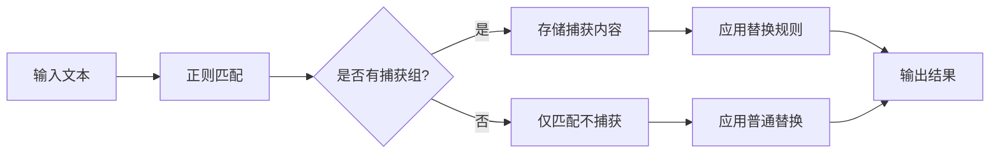

Приходилось ли вам редактировать или работать с текстом и заменять некоторые детали, но при этом сохранять некоторые из них? Например, преобразовать веб-ссылку в формат markdown или изменить формат даты? Группы захвата в регулярных выражениях - мощный инструмент для решения подобных задач.

<!--more-->

## 捕获组：正则表达式中的"记忆"功能

В повседневной работе с текстом или в программировании нам часто приходится выполнять сложные операции поиска и замены. Например, преобразование текста в формате "фамилия, имя" в "имя, фамилия" или преобразование обычного URL в формат ссылок markdown. Если у вас нет подходящих инструментов для выполнения этих, казалось бы, простых задач, вам, возможно, придется изменять их вручную, что отнимает много времени и чревато ошибками.

Функция группы захвата в регулярных выражениях действует как система "памяти" и "ссылок", захватывая фрагменты текста при подборе и используя их при замене. Это обеспечивает удобное решение для сложных преобразований текста.

## 什么是捕获组？

Группы захвата - это механизм, используемый в регулярных выражениях для "запоминания" совпадающего текста. Используя круглые скобки `()` в регулярном выражении, мы можем "захватывать" части, которые хотим сохранить, и ссылаться на них в последующих подстановках.

Самый простой синтаксис группы захвата прост: просто обведите часть шаблона, которую нужно захватить, круглыми скобками `()` в регулярном выражении.

```
(pattern)
```

При успешном совпадении регулярного выражения каждое совпадение, заключенное в скобки, сохраняется отдельно и может быть заключено в кавычки в строке замены.

## 捕获组的引用方式

В зависимости от инструмента и языковой среды существует два основных способа ссылки на группы захвата:

1. **Ссылки на обратную косую черту** (`\1`, `\2`, `\3`...) :
   - Часто используются в инструментах Unix/Linux (например, sed, grep, awk).
   - Язык Perl
   - Поиск и замена во многих редакторах (например, Vim).
   - В инструментах командной строки

2. **Ссылки на долларовые символы** (`$1`, `$2`, `$3`...) :
   - JavaScript и технологии, связанные с Web
   - Функция preg_replace в PHP
   - Многие современные языки программирования
   - Современные редакторы, такие как Visual Studio Code

Мнемоническая подсказка: инструменты на базе Unix предпочитают синтаксис обратного слеша, в то время как в языках веб-скриптинга обычно используются знаки доллара.

## 捕获组的基本应用

Давайте проиллюстрируем использование групп захвата на простом примере:

**Проблема**: Преобразование текста в формате "фамилия, имя" в формат "имя, фамилия".

Например, преобразуйте "Li, Xiaoming" в "Xiaoming Li".

**Решения**:

在sed中：
```bash
echo "李,小明" | sed 's/\([^,]*\),\([^,]*\)/\2 \1/'
# 输出: 小明 李
```

在JavaScript中：
```javascript
"李,小明".replace(/([^,]*),([^,]*)/, "$2 $1")
// 输出: "小明 李"
```

В данном примере:
- Первая группа захвата `([^,]*)` соответствует всем символам перед запятой (фамилия).
- Вторая группа захвата `([^,]*)` соответствует всем символам после запятой (фамилия).
- В строке замены мы приводим эти группы захвата, но в обратном порядке

## 命名捕获组：提高代码可读性

По мере увеличения сложности регулярных выражений использование только числовых ссылок (например, `\1`, `$1`) может сделать код сложным для понимания и сопровождения. Именно здесь на помощь приходят именованные группы захвата.

Именование групп захвата позволяет нам присвоить группе захвата значимое имя, а не полагаться только на порядок их размещения.

**语法**：
```
(?<name>pattern)
```

**Пример**: преобразование URL-адресов в форматы ссылок в формате markdown

在VSCode中：
```
查找: (?<url>https?://.*?)(?: |,|$)
替换: [${url}](${url})$2
```

Здесь мы создали группу захвата с именем "url", которая соответствует URL-адресам, начинающимся с http или https. В строке замены мы можем ссылаться на эту группу захвата по `${url}`.

Преимущество именованных групп захвата очевидно: они делают регулярные выражения более самодокументированными, особенно при работе со сложными шаблонами.

## 非捕获组：提高性能的小技巧

Иногда нам нужно сгруппировать регулярные выражения с помощью круглых скобок, но не нужно захватывать эти группы для последующих обращений. В этом случае можно использовать не захваченные группы:

**语法**：
```
(?:pattern)
```

Преимущества групп без захвата:
1. повышение производительности - уменьшение объема памяти и времени обработки
2. упрощенная замена - не влияет на нумерацию групп захвата

В приведенном выше примере URL-адреса `(? : |,|$)` - это группа не захвата, которая соответствует пробелам, запятым или окончаниям строк после URL, но не сохраняется как отдельная группа захвата.

## 高级应用案例

### 案例1：日期格式转换

Преобразование формата "ММ/ДД/ГГГГ" в формат "ГГГГ-ММ-ДД":

```javascript
// JavaScript示例
"04/16/2025".replace(/(\d{2})\/(\d{2})\/(\d{4})/, "$3-$1-$2")
// 输出: "2025-04-16"
```

### 案例2：提取和重组电子邮件地址

Разделите и реорганизуйте "username@domain.com":

```javascript
// JavaScript示例
"user123@example.com".replace(/([^@]*)@([^.]*)\.(.*)/, "Domain: $2.$3, User: $1")
// 输出: "Domain: example.com, User: user123"
```

### 案例3：代码重构

Преобразует старый синтаксис JavaScript в новый:

```javascript
// 将 var x = function() {} 转换为 const x = () => {}
"var calculateTotal = function(price, tax) { return price * (1 + tax); }".replace(/var\s+(\w+)\s*=\s*function\s*\((.*?)\)\s*\{(.*?)\}/g, "const $1 = ($2) => {$3}")
```

## 不同环境中的捕获组差异

Помимо основных различий в синтаксисе ссылок (`\1` против `$1`), поддержка групп захвата варьируется от среды к среде:

1. **Регулярные различия в движках**:
   - PCRE (PHP, модуль re в Python и т. д.) поддерживает наибольшее количество функций.
   - JavaScript не поддерживал именованные группы захвата до новых версий
   - Базовые регулярные выражения POSIX (например, grep) поддерживают наименьшую функциональность

2. **Различия в утверждениях**:
   - Некоторые среды (например, sed) требуют экранирования скобок: `\(pattern\)`.
   - Другие среды этого не делают: `(pattern)`.

3. **Различия в синтаксисе именованных групп захвата**:
   - Python/PCRE: `(?P<имя>паттерна)`.
   - NET/JavaScript: `(? <имя>шаблон)`.

```python
# Python示例
import re
re.sub(r'(?P<first>[^,]*),(?P<last>[^,]*)', r'\g<last> \g<first>', "李,小明")
# 输出: "小明 李"
```

## 实用技巧与陷阱

1. **Вложенные группы захвата**: Группы захвата могут быть вложены друг в друга, но при этом следует внимательно относиться к сопряжению скобок и порядку ссылок.

```
   (a(b(c)))  # 有三个捕获组：(a(b(c)))、(b(c))和(c)
   ```

2. **Жадное и нежадное соответствие**: использование `...*?' в группах захвата. *? ` (не жадное сопоставление) вместо `. *` (жадное сопоставление) позволяет избежать избыточного сопоставления.

```
   http://.*?/  # 匹配到第一个斜杠就停止
   http://.*/   # 匹配到最后一个斜杠才停止
   ```

3. **Пустой захват**: когда группа захвата соответствует пустой строке, замена может быть не такой, как ожидалось.

4. **Чрезмерное использование групп захвата**: ненужные группы захвата усложняют и снижают производительность, используйте группы, не связанные с захватом, с умом.

## 可视化正则匹配过程



## 调试工具推荐

Регулярные выражения могут быть сложными и трудно интерпретируемыми, поэтому следующие инструменты могут помочь в визуализации и отладке:

1. [Regex101](https://regex101.com/) - тестирование и интерпретация регулярных выражений в реальном времени
2. [RegExr](https://regexr.com/) - интерактивный инструмент для изучения и тестирования регулярных выражений
3. [Regexper](https://regexper.com/) - преобразование регулярных выражений в визуальные диаграммы
4. [Pyrexp](https://pythonium.net/regex) - тестирование и визуализация регулярных выражений

## 小结

Группа захвата регулярных выражений - это мощная и гибкая функция, освоив которую можно значительно повысить эффективность и точность обработки текста. Будь то простая замена текста или сложное извлечение и преобразование данных, группа захвата - незаменимый инструмент.

Главное - помнить:
- Группы захвата определяются с помощью круглых скобок `()`.
- На группы захвата можно ссылаться по номеру (`\1` или `$1`) или по имени (`${имя}`)
- Синтаксис зависит от среды
- Правильное использование групп без захвата и именованных групп захвата может улучшить читаемость и производительность кода

В следующий раз, когда вы столкнетесь со сложной задачей обработки текста, не забудьте воспользоваться мощным инструментом групп захвата!

## 思考问题

Приходилось ли вам в повседневной работе сталкиваться с ситуацией, когда необходимо пакетное преобразование текстовых форматов? Попробуйте использовать технику группы захвата, представленную в этой статье, для решения реальной задачи, например преобразования набора обычных URL-адресов в ссылки в формате markdown. Вы увидите, что после освоения группы захвата многие, казалось бы, утомительные задачи по обработке текста могут стать простыми и эффективными.