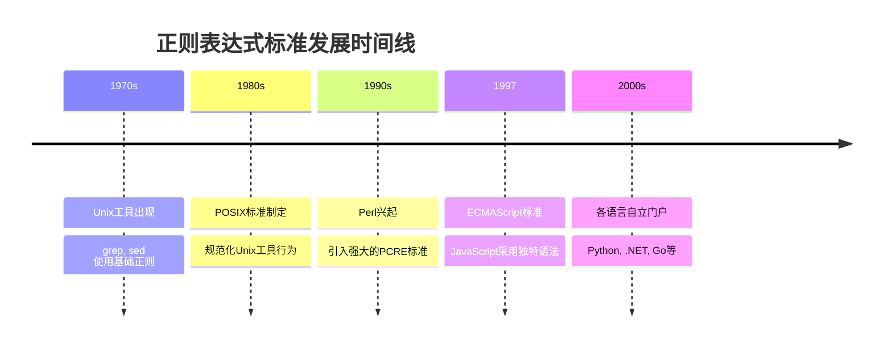
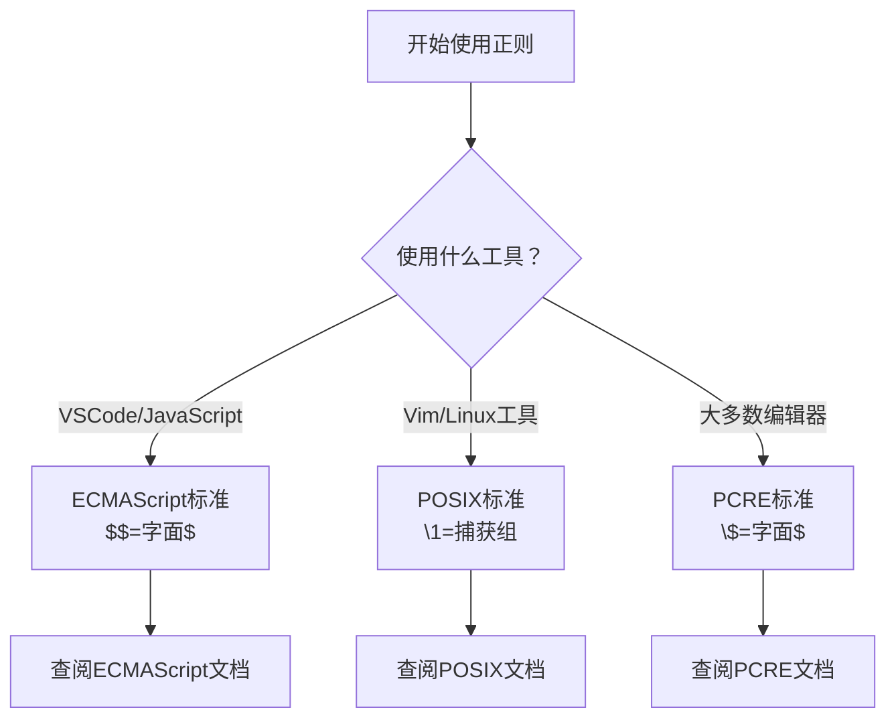

你是否遇到过这样的困扰：在一个编辑器中完美运行的正则表达式，复制到另一个工具中却完全不工作？或者，你花了很长时间调试一个替换操作，最后发现问题出在一个小小的转义符号上？

如果你有过这样的经历，那么你并不孤单。正则表达式虽然是程序员的得力工具，但它在不同工具和环境中的表现差异，常常让人头疼不已。

<!--more-->

## 一个真实的案例：VSCode 中的美元符号陷阱

让我们从一个具体的例子开始。假设你正在将一些 shell 脚本从 zsh 格式转换为 fish shell 格式，需要把 `${variable}` 这样的变量引用改为 `$variable`。

在 VSCode 中，你可能会这样操作：

**搜索模式**：`\$\{([^}]+)\}`  
**替换模式**：`$$1`

但当你执行替换后，所有匹配的文本都变成了 `$1`，而不是你期望的 `$variable`。

### 问题出在哪里？

这个问题的根源在于不同工具对替换字符串中特殊字符的处理方式不同。在 VSCode 中：

- `$$` 表示字面的 `$` 符号
- `$1` 表示第一个捕获组

所以 `$$1` 被解释为：字面的 `$` + 字面的 `1`，而不是：字面的 `$` + 第一个捕获组的内容。

### 正确的做法

在 VSCode 中，要输出 `$` + 第一个捕获组，应该使用：

**替换模式**：`$$$1`

解释：
- 前两个 `$$` = 转义的字面 `$` 符号
- `$1` = 第一个捕获组的内容

## 为什么会有这些差异？

正则表达式的这些"方言"差异并非偶然，而是有其历史和技术原因的。

### 标准的演进历程



每个时代的工具都在前人基础上进行改进，但同时也带来了不兼容性。

### 主要的正则"方言"

现在主要存在这几种正则表达式标准：

| 标准类型 | 主要使用者 | 替换语法特点 | 举例 |
|---------|-----------|-------------|------|
| **ECMAScript** | VSCode, JavaScript, Node.js | `$$` = 字面`$`<br/>`$1` = 捕获组 | `$$$1` |
| **PCRE** | PHP, Python, 大多数编辑器 | `\$` = 字面`$`<br/>`$1` = 捕获组 | `\$$1` |
| **POSIX** | Linux工具, grep, sed | `\&` = 整个匹配<br/>`\1` = 捕获组 | `$\1` |
| **.NET** | C#, PowerShell | `$$` = 字面`$`<br/>`$1` = 捕获组 | `$$$1` |

## 实用的工具对比指南

### VSCode vs 其他主流编辑器

让我们看看同样的替换操作在不同工具中的正确写法：

**任务**：将 `${name}` 替换为 `$name`

#### VSCode / JavaScript 环境
```
搜索：\$\{([^}]+)\}
替换：$$$1
```

#### Vim / Neovim
```
搜索：\${\([^}]\+\)}
替换：$\1
```

#### Sublime Text / Atom
```
搜索：\$\{([^}]+)\}
替换：\$$1
```

#### IntelliJ IDEA / WebStorm
```
搜索：\$\{([^}]+)\}
替换：\$$1
```

### 编程语言中的差异

不同编程语言的正则库也有类似的差异：

#### Python
```python
import re
text = "${name} and ${age}"
result = re.sub(r'\$\{([^}]+)\}', r'$\1', text)
# 结果：$name and $age
```

#### JavaScript
```javascript
const text = "${name} and ${age}";
const result = text.replace(/\$\{([^}]+)\}/g, '$$$1');
// 结果：$name and $age
```

#### Java
```java
String text = "${name} and ${age}";
String result = text.replaceAll("\\$\\{([^}]+)\\}", "\\$$1");
// 结果：$name and $age
```

## 避坑指南：如何应对这些差异

### 1. 了解你的工具

在开始使用正则表达式之前，先确认你使用的工具或语言采用的是哪种标准：



### 2. 使用在线测试工具

[regex101.com](https://regex101.com) 是一个优秀的正则表达式测试平台，它支持多种引擎切换，你可以：

1. 输入你的正则表达式
2. 选择对应的引擎（JavaScript/PCRE/Python等）
3. 测试替换效果
4. 查看详细的解释

### 3. 建立你的"词典"

为常用的替换操作建立一个对照表：

```markdown
## 我的正则替换速查表

### 输出字面美元符号 + 捕获组
- VSCode: $$$1
- Vim: $\1  
- 大多数编辑器: \$$1

### 输出整个匹配内容
- VSCode: $&
- Vim: &
- POSIX工具: &

### 输出匹配前的内容
- VSCode: $`
- 其他: （通常不支持）
```

### 4. 保持简单

当可能时，尽量使用所有引擎都支持的基础语法：

**好的做法**：
```
搜索：name=([a-zA-Z]+)
替换：title=$1
```

**避免的做法**：
```
搜索：(?<=name=)([a-zA-Z]+)  # 后行断言，不是所有引擎都支持
替换：$`title=$1$'           # 复杂的替换语法
```

## 具体场景的最佳实践

### 场景1：批量重命名变量

**需求**：将 `oldName` 改为 `newName`

**VSCode 中**：
```
搜索：\boldName\b
替换：newName
```

**命令行中（sed）**：
```bash
sed 's/\boldName\b/newName/g' file.txt
```

### 场景2：格式化日期

**需求**：将 `2024-01-15` 改为 `15/01/2024`

**VSCode 中**：
```
搜索：(\d{4})-(\d{2})-(\d{2})
替换：$3/$2/$1
```

**Python 中**：
```python
re.sub(r'(\d{4})-(\d{2})-(\d{2})', r'\3/\2/\1', text)
```

### 场景3：清理HTML标签

**需求**：移除简单的HTML标签但保留内容

**VSCode 中**：
```
搜索：<([^>]+)>(.*?)</\1>
替换：$2
```

**注意**：这个例子在某些引擎中可能不工作，因为 `\1` 的反向引用在搜索模式中不是所有引擎都支持。

## 总结：拥抱差异，提高效率

正则表达式的"方言"问题虽然令人困扰，但了解这些差异后，你会发现它们各有特色和优势。关键是要：

1. **了解你的工具**：每次使用新工具时，先了解它的正则标准
2. **建立参考资料**：为常用操作建立自己的速查表
3. **善用测试工具**：使用在线工具验证复杂表达式
4. **保持简单**：优先使用通用性强的基础语法

记住，工具是为了提高效率而存在的。与其抱怨标准不统一，不如掌握这些差异，让正则表达式真正成为你的得力助手。

下次遇到正则表达式在不同工具中表现不一致时，你就知道该怎么办了！
