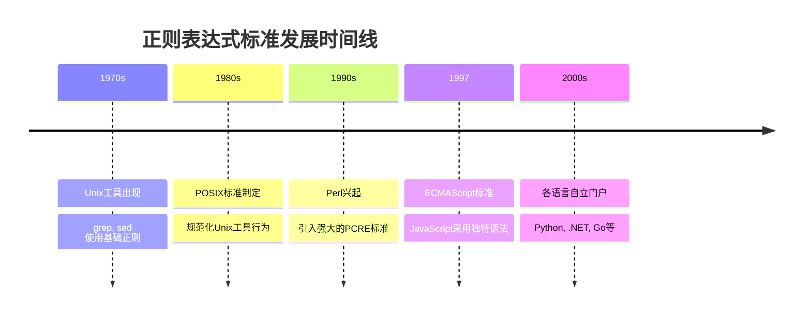
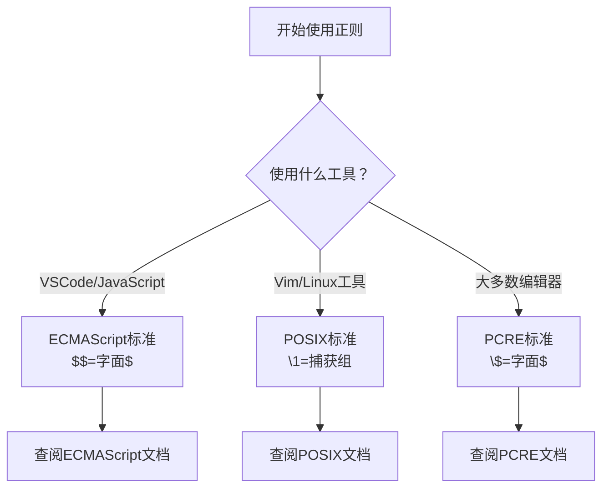

Приходилось ли вам сталкиваться с проблемой, когда регулярное выражение, прекрасно работающее в одном редакторе, при копировании в другой инструмент не работает вообще? Или, может быть, вы долго отлаживали операцию подстановки, только чтобы выяснить, что проблема кроется в маленьком символе escape?

Если вы сталкивались с этим, то вы не одиноки. Хотя регулярные выражения являются удобным инструментом для программистов, различия в их поведении в разных инструментах и средах часто становятся головной болью.

<!--more-->

## 一个真实的案例：VSCode 中的美元符号陷阱

Давайте начнем с конкретного примера. Предположим, вы конвертируете некоторые shell-скрипты из формата zsh в формат fish shell, и вам нужно изменить ссылки на переменные типа `${variable}` на `$variable`.

В VSCode вы можете действовать следующим образом:

**Шаблон поиска**: `\$\{([^}]+)\}`.
**Режим замены**: `$$1`

Но когда вы выполняете замену, весь совпадающий текст становится `$1`, а не `$variable`, как вы ожидали.

### 问题出在哪里？

Корень этой проблемы в том, что разные инструменты по-разному обрабатывают специальные символы в строке замены. В VSCode:

- `$$` обозначает литеральный символ `$`.
- `$1` обозначает первую группу захвата

Поэтому `$$1` интерпретируется как: литерал `$` + литерал `1`, а не как: литерал `$` + содержимое первой группы захвата.

### 正确的做法

Чтобы вывести `$` + первую группу захвата в VSCode, нужно использовать:

**Шаблон замены**: `$$$1`

Объяснение:
- Первые два `$$` = экранированные символы литерала `$`.
- `$1` = содержимое первой группы захвата

## 为什么会有这些差异？

Эти "диалектные" различия в регулярных выражениях не случайны, а имеют исторические и технические причины.

### 标准的演进历程



Инструменты каждой эпохи улучшали своих предшественников, но при этом вносили несовместимость.

### 主要的正则"方言"

Это основные стандарты регулярных выражений, существующие на сегодняшний день:

| Стандартные типы | Основные пользователи | Особенности синтаксиса замены | Примеры
|---------|-----------|-------------|------|
| **ECMAScript** | VSCode, JavaScript, Node.js | `$$` = литерал `$`<br/> `$1` = группа захвата | `$$1` |
| **PCRE** | PHP, Python, большинство редакторов | `\$` = литерал `$`<br/>`$1` = группа захвата | `\$$1` |
| **POSIX** | Linux tools, grep, sed | `\&` = целое совпадение<br/>`\1` = группа захвата | `$$\1` |
| **.NET** | C#, PowerShell | `$$` = литерал `$$`<br/>`$1` = группа захвата | `$$$1` |

## 实用的工具对比指南

### VSCode vs 其他主流编辑器

Давайте посмотрим, как правильно записывается одна и та же операция замены в разных инструментах:

**Задача**: Замените `${имя}` на `$имя`.

#### VSCode / JavaScript 环境
```
搜索：\$\{([^}]+)\}
替换：$$$1
```

#### Vim / Neovim
```
搜索：\${\([^}]\+\)}
替换：$\1
```

#### Sublime Text / Atom
```
搜索：\$\{([^}]+)\}
替换：\$$1
```

#### IntelliJ IDEA / WebStorm
```
搜索：\$\{([^}]+)\}
替换：\$$1
```

### 编程语言中的差异

Аналогичные различия есть и в регулярных библиотеках разных языков программирования:

#### Python
```python
import re
text = "${name} and ${age}"
result = re.sub(r'\$\{([^}]+)\}', r'$\1', text)
# 结果：$name and $age
```

#### JavaScript
```javascript
const text = "${name} and ${age}";
const result = text.replace(/\$\{([^}]+)\}/g, '$$$1');
// 结果：$name and $age
```

#### Java
```java
String text = "${name} and ${age}";
String result = text.replaceAll("\\$\\{([^}]+)\\}", "\\$$1");
// 结果：$name and $age
```

## 避坑指南：如何应对这些差异

### 1. 了解你的工具

Прежде чем приступить к использованию регулярных выражений, проверьте, какой стандарт использует используемый вами инструмент или язык:



### 2. 使用在线测试工具

[regex101.com](https://regex101.com) 是一个优秀的正则表达式测试平台，它支持多种引擎切换，你可以：

1. Введите регулярное выражение.
2. Выберите соответствующий движок (JavaScript/PCRE/Python и т. д.).
3. Протестируйте эффект замены.
4. просмотрите подробное объяснение

### 3. 建立你的"词典"

Создайте таблицу перекрестных ссылок для распространенных операций подстановки:

```markdown
## 我的正则替换速查表

### 输出字面美元符号 + 捕获组
- VSCode: $$$1
- Vim: $\1  
- 大多数编辑器: \$$1

### 输出整个匹配内容
- VSCode: $&
- Vim: &
- POSIX工具: &

### 输出匹配前的内容
- VSCode: $`
- 其他: （通常不支持）
```

### 4. 保持简单

По возможности старайтесь использовать базовый синтаксис, который поддерживается всеми движками:

**好的做法**：
```
搜索：name=([a-zA-Z]+)
替换：title=$1
```

**避免的做法**：
```
搜索：(?<=name=)([a-zA-Z]+)  # 后行断言，不是所有引擎都支持
替换：$`title=$1$'           # 复杂的替换语法
```

## 具体场景的最佳实践

### 场景1：批量重命名变量

**Требование**: изменить `старое имя` на `новое имя`.

**VSCode 中**：
```
搜索：\boldName\b
替换：newName
```

**命令行中（sed）**：
```bash
sed 's/\boldName\b/newName/g' file.txt
```

### 场景2：格式化日期

**Запрос**: замените `2024-01-15' на `15/01/2024'

**VSCode 中**：
```
搜索：(\d{4})-(\d{2})-(\d{2})
替换：$3/$2/$1
```

**Python 中**：
```python
re.sub(r'(\d{4})-(\d{2})-(\d{2})', r'\3/\2/\1', text)
```

### 场景3：清理HTML标签

**Требования**: удалить простые HTML-теги, но сохранить содержимое

**VSCode 中**：
```
搜索：<([^>]+)>(.*?)</\1>
替换：$2
```

**ПРИМЕЧАНИЕ**: Этот пример может не работать в некоторых системах, поскольку обратные ссылки `\1` поддерживаются не всеми системами в режиме поиска.

## 总结：拥抱差异，提高效率

Проблема "диалекта" регулярных выражений раздражает, но как только вы поймете разницу, вы увидите, что у каждого из них есть свои особенности и преимущества. Главное - это:

1. **Знайте свои инструменты**: каждый раз, когда вы используете новый инструмент, сначала изучите его канонические стандарты.
2. **Создавайте справочники**: создавайте собственные краткие справочники по распространенным операциям
3. **Используйте инструменты тестирования**: используйте онлайн-инструменты для проверки сложных выражений
4. **Сохраняйте простоту**: отдавайте предпочтение использованию базового синтаксиса, который носит общий характер

Помните, что инструменты нужны для повышения эффективности. Вместо того чтобы жаловаться на несоответствия в стандартах, освойте их и сделайте регулярные выражения действительно своей правой рукой.

В следующий раз, когда вы столкнетесь с регулярным выражением, которое не ведет себя одинаково в разных инструментах, вы будете знать, что делать!