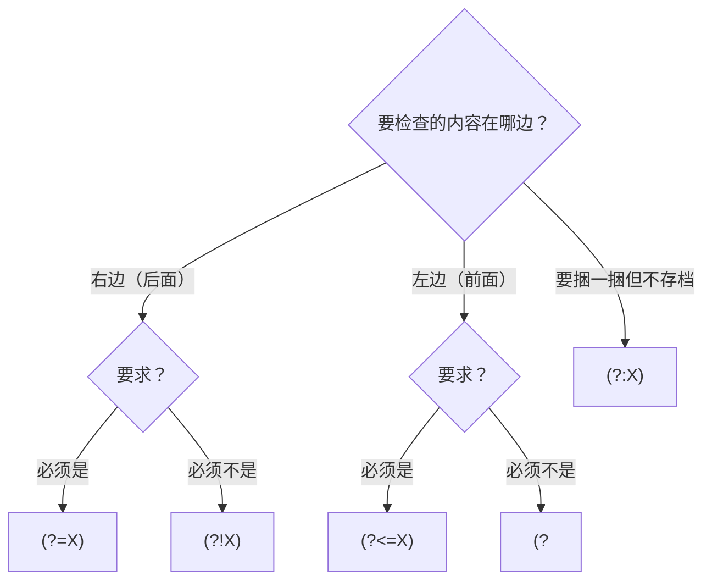

[上一篇]()的练习 3 里埋了一个坑：千分位正则遇到"位数恰好是 3 的倍数"的数字时会出错——`re.sub(r'(?=(\d{3})+$)', ',', '123456')` 的输出是 `',123,456'`，开头多了一个逗号。根源在于 `(?=` 只看得见右边，缺了"左边是不是数字"这半边条件。补上这半边的主角，就是本篇要讲的后顾断言 `(?<=`、`(?<!`。本文的每一段输出同样全部实测。

<!--more-->

先把坑完整地挖开。上一篇的千分位写法是这样：

```python
re.sub(r'(?=(\d{3})+$)', ',', '1234567')   # '1,234,567'  ✓ 七位数没问题
```

换成位数是 3 的倍数的数字，立刻翻车：

```python
re.sub(r'(?=(\d{3})+$)', ',', '123456')    # ',123,456'  ✗ 开头多了一个逗号
re.sub(r'(?=(\d{3})+$)', ',', '123')       # ',123'      ✗ 同样的问题
```

为什么？回看插入点的筛选条件："**右边**剩下的数字是 3 的整数倍"。对 `123456` 来说，位置 0（字符串最开头）的右边恰好是 6 个数字——条件成立，于是逗号被插到了最前面。`(?=` 对"左边是不是数字"完全无感，而"开头不能插逗号"恰恰需要这条信息。

这篇就来把"回头看"的能力补齐，顺便把四个断言的全家福拼完整。

## 第一章 `(?<=` 正向后顾：回头核对来路

### 符号拆解：四个字符各干什么

上一篇讲了 `?=`、`?!` 两个组合，这次把 **`(?<=` 的四个字符**一次拆完：

| 字符 | 角色 | 含义 |
|---|---|---|
| `(` | 外壳 | 分组符号，必须成对 |
| `?` | 扩展开关 | 宣告"这不是普通捕获组"（此时它不是量词） |
| `<` | **方向标记** | 指向左：回头检查 |
| `=` | **极性标记** | 必须是（否定式换成 `!`） |

于是 `(?<=X)` 的完整语义是：**站在当前位置，回头看紧邻左侧的内容，必须能匹配上 X；无论结果如何，都不吃字符、不占编号。**

### 为什么右边不用标方向，左边却要

一个上一篇没展开的设计问题：为什么有 `(?<=`，却没有 `(?>="` 这样"向右看"的显式标记？

因为引擎（和你阅读文字的眼睛一样）**默认从左往右走**——"往右看"是默认动作，不需要特别说明；而"回头往左看"是逆着默认方向的动作，必须用 `<` 这个指向左的箭头明确标出来。这套"默认方向不标注、逆向方向才标注"的习惯，和所有文字系统的阅读方向是一致的。

### 例 1：修复千分位——把缺的半边条件补上

```python
re.sub(r'(?<=\d)(?=(\d{3})+$)', ',', '123456')    # '123,456'   ✓
re.sub(r'(?<=\d)(?=(\d{3})+$)', ',', '1234567')   # '1,234,567' ✓
```

现在每个候选插入点要被两道关卡同时审查：

- `(?<=\d)`：**左边**紧邻必须是数字——位置 0 不满足，被排除，开头那个多余的逗号消失了；
- `(?=(\d{3})+$)`：**右边**剩下的数字必须是 3 的整数倍。

这就是上一篇练习 3 的答案。顺便得到一个通用启示：**单条断言往往只是"半边条件"；真正严密的匹配，常常需要一前一后两颗镜头配合**——一颗管右、一颗管左，把位置的完整上下文钉死。

### 例 2：价格提取——单位在前用后顾

上一篇有个"提价格不带单位"的例子：

```python
re.findall(r'\d+(?= 元)', '苹果 12 元，香蕉 8 元')   # ['12', '8']   单位在后 → 前瞻
```

单位在**前面**时，把镜头反过来装：

```python
re.findall(r'(?<=\$)\d+', '总计 $1500 和 ¥2000，再加 $99')   # ['1500', '99']
```

`¥2000` 没有被匹配——因为"左边紧邻是 `$`"这个条件它不满足。前瞻管"后面跟什么"，后顾管"前面是什么"，两者是同一枚硬币的两面。

### 例 3：提取 @用户名——后顾和捕获组的第一回合

```python
text = '转发 @alice 和 @bob_92，以及 #话题1'

re.findall(r'@\w+',     text)   # ['@alice', '@bob_92']    ← 带着 @
re.findall(r'@(\w+)',   text)   # ['alice', 'bob_92']      ← 捕获组出手
re.findall(r'(?<=@)\w+', text)  # ['alice', 'bob_92']      ← 后顾出手
```

三种写法都能拿到干干净净的用户名（第二种为什么不含 `@`，用的是上一篇讲过的 findall 组规则）。既然结果一样，后顾的价值在哪？看**替换**场景：

```python
re.sub(r'(?<=@)\w+', lambda m: m.group().upper(), text)
re.sub(r'@(\w+)',  lambda m: '@' + m.group(1).upper(), text)
```

两个版本都得到 `'转发 @ALICE 和 @BOB_92，以及 #话题1'`。但捕获组版必须手动把 `@` 拼回替换结果里——**因为 `@` 被吃掉了，替换时它默认消失**。后顾版没有这个负担：匹配什么就替换什么，`@` 原地自动保留。

把这一回合的结论收窄成一句：**提取场景两者等价，看心情；替换场景里，凡是"前缀/后缀不能动"的，后顾更省心。**

### 一句话记住

**`(?<=X)` = 回头核对来路，看完就走（不吃字符），此路必须有过 X。**

## 第二章 `(?<!` 负向后顾：回头确认"它不是"

### 一句话定义

`(?<=` 的否定式：**回头看一眼，左边紧邻的内容如果能匹配 X，就失败——必须"不是 X"才放行。** 同样零宽、同样不吃字符、同样不占编号。

### 例 1：独立的三位数——四个断言首次同台

需求：从一串数字里挑出"独立的三位数"，即前后都不挨着其他数字的：

```python
re.findall(r'(?<!\d)\d{3}(?!\d)', '1234 456 7890 321')   # ['456', '321']
```

念一遍这条正则，它读起来像一句路卡口令：

- `(?<!\d)`：左边不能是数字——`1234` 里的 `123` 被它拦下；
- `\d{3}`：放行 3 个数字；
- `(?!\d)`：右边也不能是数字——`7890` 里的 `789` 被它拦下。

到这里，断言家族就齐了：**向前看、向后看 × 要求"是"、要求"不是"**。像 `(?<!\d)\d{3}(?!\d)` 这种"两侧各设一道哨卡"的写法，是断言组合的常见形态——把"独立单元"的完整定义写出来，前后边界一次钉死。

### 例 2：回头弥补上一篇的陷阱

上一篇第三章讲过一个"连 AI 都会写错"的 bug：想匹配"不以数字结尾的内容"，写成 `(.*?)(?![0-9.]+$)`，结果捕获组全是空字符串。当时的诊断结论是：

> 断言检查的永远是"当前位置之后的输入"，不是"我已经吃进肚子的那部分"——向前看的前瞻，管不了身后的路。

现在有了后顾，可以正面修好它。需求：**过滤出"不以数字结尾的行"**：

```python
text = '订单A123\n订单B\n备注C42\n说明D\n'
re.findall(r'^.+?(?<!\d)$', text, re.M)   # ['订单B', '说明D']
```

逐句念：

- `^.+?`：从行首出发，一个字符一个字符地把行"吃"进来；
- `(?<!\d)`：每停一处，回头看一眼——刚吃进来的最后一个字符**不是**数字吧？
- `$`：光这样还不够，还必须已经停在行尾。

两个条件互锁：中途的位置过了后顾，过不了 `$`；`订单A123` 这种行就算吃到行尾，`(?<!\d)` 也永远不点头（行尾左边紧邻是 `3`）——所以整行不匹配。

这里藏着后顾相对于前瞻的一个本质能力：**它站在"已消费内容的结束边界"上回头看，能检查到"我刚吃进来的那部分长什么样"**——恰好补上前瞻的盲区。两个写法对照：

| 写法 | 断言的站位 | 看的方向 | 能看到什么 |
|---|---|---|---|
| `(.*?)(?![0-9.]+$)` | 停在内容中途 | 向右 | 字符串剩余部分（盲区：已吃掉内容的结尾） |
| `^.+?(?<!\d)$` | 停在内容结尾 | 向左 | 刚吃掉的最后一个字符 ✓ |

### 一句话记住

**`(?<!X)` = 回头确认"X 没跟来"，才放行。**

## 第三章 全景图：把四个符号念成人话

### 2×2 矩阵

四个符号不过是两个维度的交叉——**往哪边看 × 要求是/不是**：

|  | 必须"是"（正 / positive） | 必须"不是"（负 / negative） |
|---|---|---|
| **向右看**（前瞻 lookahead） | `(?=X)` | `(?!X)` |
| **向左看**（后顾 lookbehind） | `(?<=X)` | `(?<!X)` |

### 每个符号念一句人话

记不住符号时，把它念出来，一秒钟消歧：

| 符号 | 念作 |
|---|---|
| `(?=X)` | 我右边必须是 X |
| `(?!X)` | 我右边不能是 X |
| `(?<=X)` | 我左边必须是 X |
| `(?<!X)` | 我左边不能是 X |

### 和捕获组的边界：什么时候别用断言

断言不是"更高级的写法"，它有自己的适用范围。等价场景下，**优先捕获组**：

- **兼容性**：re2 系引擎（Go、Rust 的 regex crate）完全不支持断言；rg 默认引擎也不支持，需要 `rg -P` 切到 PCRE2。捕获组则遍地都认。
- **性能**：回溯引擎里，后顾在每个候选位置都要"退回去"再比一遍，成本比普通匹配高。
- **可读性**：`@(\w+)` 出错时能数着组调试；多层断言出错时要画图。

断言的"专属领地"也是三块：

1. `re.sub` 的原地插入/删除（千分位就是标准案例）；
2. 检查的对象本身"不该被消费"（前缀、后缀、分隔符）；
3. 多个条件的联立（左右同时设卡，如 `(?<!\d)\d{3}(?!\d)`）。

### 一句话记住

**拿不准时问一句：我要的条件，是"半边"还是"整体"？半边——上断言；整体——用捕获组。**

## 第四章 避坑指北：`(?<` 的身世之谜

### 地雷 1：`(?<url>…)` 不是后顾

看到 `(?<` 就以为是"向左看"——这是最顺理成章的误判，因为 `(?<url>https?://.*?)` 这种写法长得太像了。但这里 `(?<url>…)` 是**命名捕获组**：给捕获组起一个名字 `url`，和方向毫无关系。

为什么会撞车？一段真实的历史：

- 1997 年，Perl 5.005 引入后顾断言，用了 `(?<=`、`(?<!`——`<` 指向左；
- 随后 .NET 设计命名捕获组时，也选了 `(?<name>…)` 的写法，PCRE、Java、JS 后来都跟进了 .NET 的路线；
- 于是 `(?<` 这个前缀，被两个不同年代的设计"重载"了。

判定规则一句话：**`(?<` 后面紧跟 `=` 或 `!`，才是"向左看"；后面跟的是名字，就是命名组。**

### 地雷 2：Python 里命名组要写 `(?P<…>)`

从别处（教程、StackOverflow、AI 的回答）抄来的 `(?<url>…)`，在 Python 里会直接报错，Python 3.13 实测：

```
re.error: unknown extension ?<u at position 1
```

Python 标准库 `re` 的命名组语法是带 `P` 的 `(?P<url>…)`；而 `(?<url>…)` 是 .NET / PCRE / JS / Java 系的写法。这是跨语言抄正则时最常踩的移植坑。（第三方 `regex` 模块两种都支持。）

### 地雷 3：后顾必须"固定宽度"

Python 的后顾断言只接受**宽度固定**的模式：

```python
re.compile(r'(?<=https?://)\w+')
# re.error: look-behind requires fixed-width pattern
```

`s?` 让 `https?` 可长可短（4 或 5 个字符），宽度不定，Python 直接拒绝。而且它比想象中更严格——下面这些规则都值得知道：

```python
re.findall(r'(?<=aa|bb)X', 'aaX bbX')          # OK：等宽分支（各 2 个字符）被允许
re.findall(r'(?<=http://|https://)\w+', '...') # ✗ 报错：异宽分支（7 与 8）被拒绝
```

也就是说：重复写死的固定长度（`\d\d`）、**所有分支等宽**的 `|`，都可以；`?`、`*`、`+`、`{m,n}`，以及"各分支各自定宽但彼此不等宽"（PCRE 允许，Python 不允许）都不行。

那 https 场景怎么办？最好的思路不是"绕开"，而是**把断言锚定到真正固定宽度的那一段**——注意 `://` 是恒定 3 个字符：

```python
re.findall(r'(?<=://)[\w.]+', 'http://a.com https://b.com')   # ['a.com', 'b.com'] ✓
```

断言离目标越近越好，只锚定真正必需的固定字符，反而顺手绕开了宽度限制。如果这也不行（比如宽度差异就在紧邻位置），退路是改用捕获组提取，或者换用支持变长后顾的第三方 `regex` 模块。

### 一句话记住

**`(?<` 后面是 `=`/`!` 就问方向，跟着名字就是命名组；Python 命名组带 `P`，后顾宽度必须定死，最好锚定固定段。**

## 收尾：系列总表与练习

把上、下两篇合起来，五个符号的全家福：

| 语法 | 名字 | 看哪边 | 要求 | 吃字符 | 占编号 | 一句话 |
|---|---|:---:|---|:---:|:---:|---|
| `(?:X)` | 非捕获组 | — | — | ✅ | ❌ | 只捆不存 |
| `(?=X)` | 正向前瞻 | 右 | 必须是 | ❌ | ❌ | 只探路，此路必须通 |
| `(?!X)` | 负向前瞻 | 右 | 必须不是 | ❌ | ❌ | 探路，此路必须不通 |
| `(?<=X)` | 正向后顾 | 左 | 必须是 | ❌ | ❌ | 回头核对来路 |
| `(?<!X)` | 负向后顾 | 左 | 必须不是 | ❌ | ❌ | 回头确认没跟来 |

选型时走一遍这张图：



**最值得带走的一句话**：零宽断言让你从"匹配字符"升级到"操作位置"；而前瞻和后顾是两颗方向相反的镜头，凑齐了，才能把一个位置的完整上下文看全。

### 留三个练习

1. 上一篇讲过：正则里有捕获组时，`findall` 返回的是组的内容而不是整体。那 `re.split` 呢？`re.split(r'@(\w+)', text)` 和 `re.split(r'(?<=@)\w+', text)` 的结果会一样吗？动手跑一下，看看两者差在哪里，再想想 split 对捕获组藏着什么规则。
2. 把千分位修正版里的 `$` 去掉：`re.sub(r'(?<=\d)(?=(\d{3})+)', ',', '1234567')` 会输出什么？为什么？（提示：去掉行尾锚点后，"右边剩 3 的倍数个数字"这个条件在字符串的内部位置还成立吗？）
3. 其实你早就用过零宽断言了——`^`、`$`、`\b` 都是**内建的**零宽断言。想一想：`\b` 和手写的 `(?<!\w)` / `(?!\w)` 是什么关系？它们完全等价吗，有没有边角情况对不上？

照例：动手跑一遍，比读十遍都有用。
