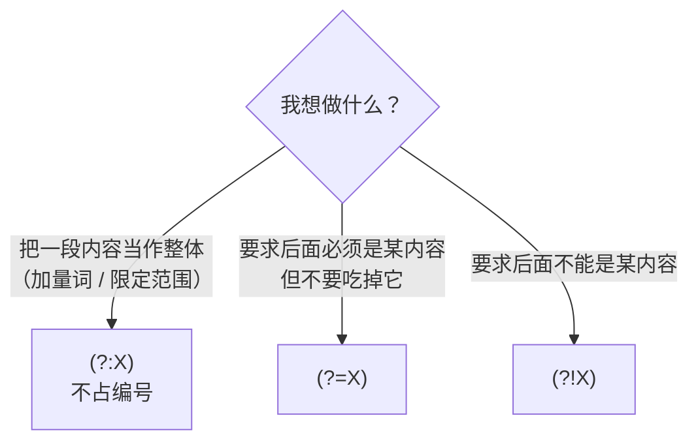

正则里的括号 `()` 其实在偷偷干两件事：把内容捆成一捆（分组），再把捆好的内容拍照存档（捕获）。而 `(?:`、`(?=`、`(?!` 这三兄弟，就是把这两件事拆开、各取所需——它们是从「正则能用」到「正则用得舒服」的分水岭。这篇文章用三个章节、十几个能直接跑的例子，把三个语法一次讲透，每一段代码都是实测输出。

<!--more-->

## 引子：普通括号在偷偷干两件事

先看一个实验，两行代码只有一处不同：

```python
re.findall(r'(ab)+', 'ababab')    # ['ab']      ← 结果不对劲？
re.findall(r'(?:ab)+', 'ababab')  # ['ababab']  ← 这才是想要的
```

为什么 `(ab)+` 只匹配到一个 `'ab'`？

因为普通括号做的是**两件事**：

1. **分组**：把 `ab` 捆成一个整体，让 `+` 能作用于「整捆」；
2. **捕获**：把括号里的内容存进「相册」，按左括号出现的顺序编号（`\1`、`\2`，或 Python 的 `group(1)`、`group(2)`）。

而 `re.findall` 有两条隐藏规则，叠在一起就产生了上面那个反直觉的结果：

- 只要正则里有捕获组，`findall` 返回的是**捕获组的内容**，而不是整体匹配；
- 捕获组在重复匹配时**只保留最后一次**。

两条规则叠加，`(ab)+` 返回的就是最后那一次捕获的 `'ab'`——明明整体匹配了 `ababab`，你拿到的却只有一小截。

### 三兄弟的定位

| 你真正想要的 | 用哪个 |
|---|---|
| 只要分组，不要存档 | `(?:` |
| 检查「后面必须是某内容」，但别碰它 | `(?=` |
| 检查「后面必须不是某内容」，但别碰它 | `(?!` |

这三个合起来，是把正则从「匹配字符」提升到「操作位置」的第一步。下面一章一个。

## 第一章 `(?:` 非捕获组：只要分组，不要编号

### 一句话定义

`(?:X)` 和 `(X)` 相比，**匹配行为完全一样，唯一区别是不存档、不占编号**。

### 例 1：让量词有「整捆」可作用

```python
re.findall(r'(?:ab)+', 'ababab')   # ['ababab']
```

拆开看：`(?:ab)` 把 `a`、`b` 捆成一捆，`+` 对整捆生效。它和 `(ab)+` 吃掉的内容一模一样，区别只在「记不记」。

**记忆点**：`(?:` 不改变「能匹配什么」，只改变「记不记」——它是一对没有副作用的括号。

### 例 2：保护编号不被污染

日期时间里，时间部分常常是可选的、我们并不关心：

```python
m = re.search(r'(\d{4})-(\d{2})-(\d{2})(?:T\d{2}:\d{2}:\d{2})?', '2026-10-06T20:50:16')
m.groups()   # ('2026', '10', '06')
```

用 `(?:` 包住时间部分，它就只参与匹配、不占编号，前三个捕获组永远稳定地是年、月、日。如果写成三个普通括号，编号就会往下排，`group(2)` 可能指到秒上去——**捕获组的编号是你和正则之间的接口，接口应该稳定。**

### 例 3：框住「或」的范围（最容易踩的坑）

```python
re.search(r'^cat|dog$', 'catfood')     # 匹配成功！但不是你想要的那种
re.search(r'^(?:cat|dog)$', 'catfood') # 不匹配 ✓
```

为什么第一种写法会让 `catfood` 通过？因为 `|` 的优先级低到超乎想象——它不是「把 cat 和 dog 选一个」，而是**把整条正则从中劈成两半**：

```
^cat|dog$    实际上等于    (^cat) | (dog$)
```

`catfood` 命中的是前半段 `^cat`。想把「或」限制在局部，就用 `(?:` 把它括起来。

**规则：只要写 `|`，先想一想它的作用范围到底是什么。**

### 顺带一提：性能

不存档也意味着引擎少记一本账。超长文本、海量匹配的场景下，`(?:` 比 `()` 略快——这是附赠的好处，不是使用它的主要理由。

### 一句话记住

**`(?:` = 只捆不存。**

## 第二章 `(?=` 正向前瞻：先探头看一眼，但不进门

### 先建立一个模型：正则在「位置」上走路

这是整篇文章最重要的一次认知升级。

初学者以为正则在「匹配字符」；实际上，引擎是在字符串的**位置**上从左往右走，每一步都站在两个字符之间的缝里：

```
字符串:   a  1  b  2  c
位置:   0   1   2   3   4   5
        ↑   ↑   ↑   ↑   ↑   ↑
```

`(?=X)` 的语义是：**站在当前位置问一句「从这里往后，能匹配上 X 吗？」——能，就通过；不能，就失败。无论结果如何，引擎都不前进、不吃掉任何字符。**

这类「只看不吃」的结构统称**零宽断言**（zero-width assertion）。验证一下它真的不吃字符：

```python
re.search(r'foo(?=bar)', 'foobar').group(0)   # 'foo' —— 只匹配到 foo，bar 没被吃掉
re.search(r'(?=foo)', 'foobar').group(0)      # ''    —— 纯前瞻匹配到一个空字符串
```

### 例 1：提取价格数字，但不带单位

```python
re.findall(r'\d+(?= 元)', '苹果 12 元，香蕉 8 元')   # ['12', '8']
```

对比把单位写进正则：

```python
re.findall(r'\d+ 元', '苹果 12 元，香蕉 8 元')   # ['12 元', '8 元'] —— 还得再洗一遍
```

前瞻的好处：**「元」参与了判断，但没有进入结果。** 提取「后面跟着冒号的词」「后面跟着百分号的数字」，都是同一个套路。

### 例 2：经典实战——密码强度校验

```python
re.fullmatch(r'(?=.*\d)(?=.*[a-zA-Z]).{8,}', 'abc12345')   # 通过
re.fullmatch(r'(?=.*\d)(?=.*[a-zA-Z]).{8,}', 'abcdefgh')   # 拒绝（没有数字）
```

逐段念一遍这句话：

- 引擎站在字符串开头；
- `(?=.*\d)`：向前扫一遍，要求「后面某处必须有数字」← 不吃字符；
- `(?=.*[a-zA-Z])`：再扫一遍，要求「后面某处必须有字母」← 不吃字符；
- `. {8,}`：到这里才真正开始吃字符。

妙处在于：**因为侦察兵不吃字符，你可以派无限多个，全部站在同一个起点上，各自提出一个独立要求。** 要加「必须含特殊符号」，再加一个前瞻就行。

⚠️ 代价：每个前瞻里的 `.*` 都要把整串扫一遍，字符串很长、规则很多时性能会掉。这个写法胜在可读性，不是性能。

### 例 3：千分位——在「位置」上做插入

```python
re.sub(r'(?=(\d{3})+$)', ',', '1234567')   # '1,234,567'
```

`re.sub` 默认是「找到内容 → 换成别的内容」。但这里的前瞻什么都不吃，于是替换变成了**纯插入**：在每个「后面恰好剩 3 的倍数个数字」的位置，插一个逗号。

这是「用位置思考」的第一个甜头：**不吃字符的东西，反而能精准地往缝隙里塞东西。**

### 一句话记住

**`(?=` = 只问路、不走路的侦察兵。**

## 第三章 `(?!` 负向前瞻：排除法的唯一正统写法

### 一句话定义

`(?=` 的反面：站在当前位置问「从这里往后，**能不能**匹配 X？」——必须是**不能**，才通过。同样零宽、同样不吃字符、同样不存档。

### 例 1：排除一类文件名

```python
re.findall(r'^(?!.*\.pdf$).+$', 'a.pdf\nb.txt\nc.pdf\nd.md', re.M)   # ['b.txt', 'd.md']
```

逐段念一遍：站在行首 → 用 `(?!.*\.pdf$)` 检查「这一行不能以 .pdf 结尾」→ 通过了，才允许 `.+$` 把整行吃掉。

这里有一个关键的思维转换：**正则里没有「不匹配」这个动作**，只有「吃」和「不吃」。想做排除，标准做法是——**用零宽断言在门口设一道关卡，通过关卡的内容，才放行给后面正常匹配。**

### 例 2：组合技——「任何不包含 X 的内容」

先看需求：提取 Markdown 里每个 `##` 标题下的正文（到下一个标题为止）。

```python
doc = "## 第一章\n内容 A\n内容 B\n## 第二章\n内容 C\n"
re.findall(r'^## ([^\n]+)$\n((?:(?!^## ).)*)', doc, re.M | re.S)
# [('第一章', '内容 A\n内容 B\n'), ('第二章', '内容 C\n')]
```

盯住第二个捕获组：`(?:(?!^## ).)*`，把它拆成三层：

- **外层 `(?:`**：把里面那一整套捆成一捆，让 `*` 有作用对象（第一章的知识）；
- **内层 `(?!^## )`**：在每一个字符位置问一次「这里是不是新标题的开头？」（本章的知识）；
- **最后的 `.`**：不是新标题开头，就吃掉一个字符。

合起来读：**一个字符一个字符地吃，但只要发现「下一个标题」要开始了，立刻停下。**

这个句式有一个专门的名字：**tempered greedy token**（字面「被调温的贪心匹配」，也有译作「排除型匹配」）。它是「匹配到某个分隔符为止」这类需求的通用解，值得直接抄进小本本：

```python
(?:(?!分隔符).)*
```

**这是本章的高潮，也是这篇文章想把你送到的地方**：`(?:` 和 `(?!` 单独看都很朴素，但组合起来，就得到了一个语法里原本不存在的新能力——「任何不包含某内容的东西」。

### 例 3：⚠️ 陷阱——断言管不了「已经吃掉的字符」

这一节是本文最值钱的部分，因为它是一个**连 AI 助手都会写错**的地方（真实案例）。先看一个看起来很合理的错误示范：

```python
re.findall(r'(\d{2}/\d{2}/\d{4})\s+(.*?)(?![0-9.]+$)', text, re.S)
```

作者的本意是：「匹配日期 + 后面的内容，但内容不能以数字结尾」。跑起来是这样的：

```
[('12/12/2024', ''), ('15/03/2024', '')]     # 捕获组全部为空字符串
```

为什么捕获全是空的？因为——

> **断言检查的永远是「当前位置之后的输入」，不是「我已经吃进肚子的那部分」。**

`.*?` 是「懒」的：先试着吃 0 个字符，然后把控制权交给后面的断言。断言站在这个位置往后看——看到的是**字符串的剩余部分**（而不是匹配结果）——一看「后面不像纯数字结尾」，就说「通过」。于是 `.*?` 吃 0 个字符就收工了，捕获组自然是空的。

想表达「匹配的内容不以 X 结尾」，正确姿势有两个：

1. **匹配完之后在代码里过滤**：先匹配出来，再判断 `content.endswith(...)`；
2. **用后顾断言 `(?<!...)`**：回头看已经匹配的部分——这是下一个成员的故事。

记住这条铁律：**向前看的前瞻，管不了身后的路。**

### 一句话记住

**`(?!` 是排除法的唯一正统写法；但它的视力只有「前方」。**

## 收尾：三者对照与决策图

| 语法 | 名字 | 吃字符吗 | 占编号吗 | 一句话 |
|------|------|:---:|:---:|------|
| `(?:` | 非捕获组 | ✅ | ❌ | 只捆不存 |
| `(?=` | 正向前瞻 | ❌ | ❌ | 只探路，此路必须通 |
| `(?!` | 负向前瞻 | ❌ | ❌ | 只探路，此路必须不通 |

拿不定主意时，走一遍这张图：



好消息：这三个语法在所有主流引擎里写法完全一致——Python、JavaScript、Java、.NET、Ruby、PCRE 都一样。唯一的例外在命令行：GNU grep 需要加 `-P`（PCRE 模式）才有前瞻，`grep -E` 不支持。

**最值得带走的一句话**：这三兄弟的共同点，是让你从「匹配字符」升级到「操作位置」。这一步跨过去，正则就从「背语法」变成了「做设计」。

### 留三个练习

1. `(?=\d)` 和 `\d` 有什么区别？分别在什么场合用？
2. 用本章知识，写一条「匹配不包含连续三个数字的单词」的正则。
3. 千分位那个例子，如果数字恰好是 3 的倍数位（比如 `123456`），会发生什么？想想为什么，下一篇讲后顾断言时会回来收拾它。

动手跑一遍，比读十遍都有用。
