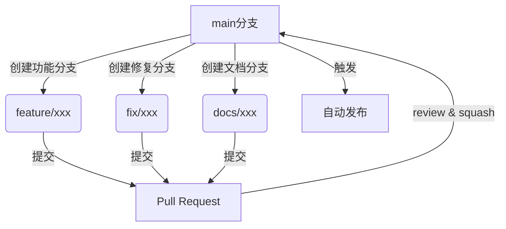
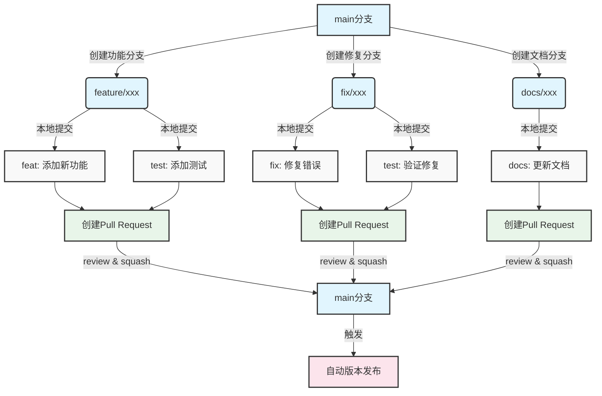
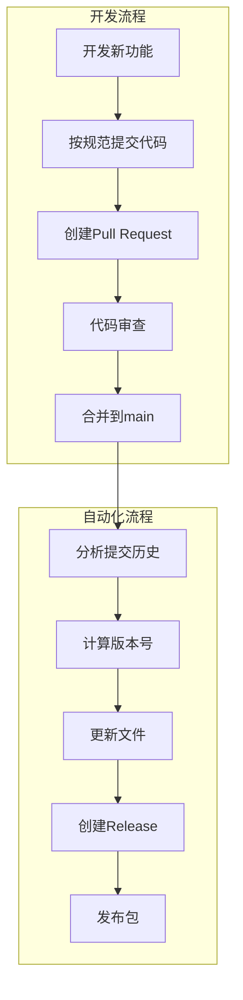

最近在优化项目的发布流程时，发现虽然我们都知道"规范很重要"，但在实际操作中往往会陷入"为了快速发布而忽视规范"的怪圈。本文将分享如何通过自动化工具和规范化流程，让项目发布变得更加可控和高效。

<!--more-->

## 从手动到自动：为什么要改变？

在传统的手动发布流程中，我们通常需要：
1. 手动修改版本号
2. 更新 changelog
3. 创建 release
4. 发布到包管理平台

这个过程存在几个明显的问题：
- 容易忘记更新版本号
- changelog 格式不统一
- release notes 质量参差不齐
- 发布步骤可能遗漏

更重要的是，手动操作使得发布过程变得不可预测和难以重复。我们需要一个更加自动化和规范化的解决方案。

## 自动化工具选择

在众多自动化工具中，semantic-release 系列工具（特别是 python-semantic-release）提供了一个完整的解决方案。它能够：

1. 自动判断版本号
2. 自动生成 changelog
3. 自动创建 release
4. 自动发布到 PyPI

工具的核心理念是通过规范化的提交信息来驱动整个发布流程。

## 提交信息规范化

要充分利用自动化工具，首先需要规范化提交信息。标准格式如下：

```bash
<type>(<scope>): <description>

[可选的详细说明]

[可选的脚注]
```

其中 type 主要包括：
- feat: 新功能
- fix: 错误修复
- docs: 文档更新
- style: 代码格式调整
- refactor: 代码重构
- test: 测试相关
- chore: 构建过程或辅助工具的变动

例如：

```bash
feat(database): 添加连接池自动清理功能

添加了空闲连接的自动清理机制，可以通过配置设置清理时间间隔。
支持手动触发清理。

Breaking Changes:
- 移除了旧的手动连接关闭接口
```

## 分支管理最佳实践

为了确保提交的质量和可追踪性，建议采用基于分支的开发模式：



### 分支命名规范
- feature/xxx：新功能开发
- fix/xxx：问题修复
- docs/xxx：文档更新
- chore/xxx：构建脚本更新



### Pull Request 最佳实践

1. 使用模板确保提供必要信息
2. 进行自我代码审查
3. 合并时使用 squash 保持主分支历史清晰
4. 确保提交信息符合规范

## 自动化发布流程

完整的自动化发布流程如下：



### 工具配置

以 python-semantic-release 为例，需要在 pyproject.toml 中添加配置：

```toml
[tool.semantic_release]
version_variable = [
    "pyproject.toml:version",
]
branch = "main"
upload_to_pypi = true
upload_to_release = true
build_command = "python -m build"
```

### GitHub Actions 配置

```yaml
name: Release
on:
  push:
    branches: [main]

jobs:
  release:
    runs-on: ubuntu-latest
    steps:
      - uses: actions/checkout@v4
        with:
          fetch-depth: 0
      
      - name: Python Semantic Release
        uses: python-semantic-release/python-semantic-release@v8.7.2
        with:
          github_token: ${{ secrets.GITHUB_TOKEN }}
```

## 最佳实践建议

1. 版本号管理
   - 严格遵循语义化版本规范
   - 让工具自动处理版本号更新
   - 不要手动修改版本号

2. 提交信息
   - 使用工具（如 commitizen）辅助生成规范提交信息
   - 在 PR 阶段审查提交信息的规范性
   - 合并时确保最终提交信息清晰有意义

3. 分支策略
   - 保护主分支，必须通过 PR 合并
   - 使用命名规范的功能分支
   - 及时删除已合并的分支

4. 发布过程
   - 配置自动化测试确保代码质量
   - 使用环境变量管理敏感信息
   - 为每个发布版本维护完整的文档

## 进阶建议

1. 预发布版本
   - 使用 beta/alpha 标签进行预发布
   - 在预发布环境进行充分测试

2. 多包管理
   - 考虑使用 monorepo 工具（如 changesets）
   - 统一管理多个包的版本发布

3. 发布通知
   - 集成 Slack/钉钉等通知
   - 自动生成发布公告

## 总结

自动化发布不仅仅是工具的使用，更是一种开发文化的转变。它要求我们：
- 更加重视提交信息的质量
- 更加注重开发流程的规范
- 更加关注代码变更的影响

通过规范化和自动化，我们可以：
- 提高发布效率
- 减少人为错误
- 提升项目质量
- 促进团队协作

最重要的是，这些实践让项目的维护变得更加可持续和专业。

---

## 相关资源

- [Conventional Commits](https://www.conventionalcommits.org/)
- [Semantic Versioning](https://semver.org/)
- [python-semantic-release](https://python-semantic-release.readthedocs.io/)
- [GitHub Actions](https://docs.github.com/cn/actions)
- [About pull request merges](https://docs.github.com/en/pull-requests/collaborating-with-pull-requests/incorporating-changes-from-a-pull-request/about-pull-request-merges)
