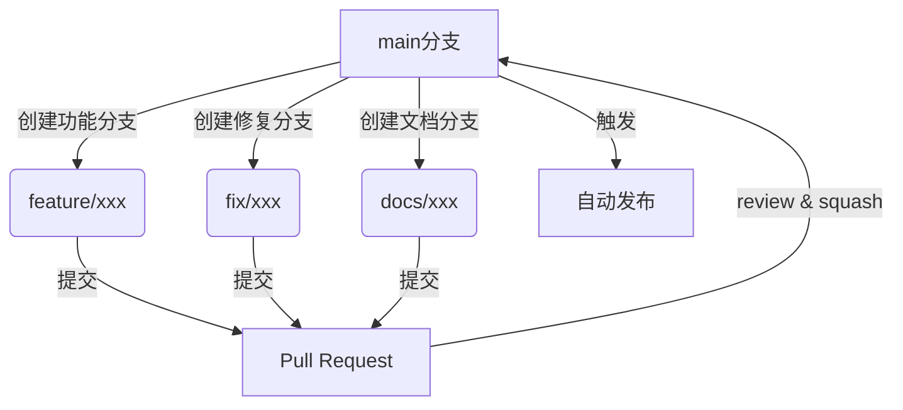
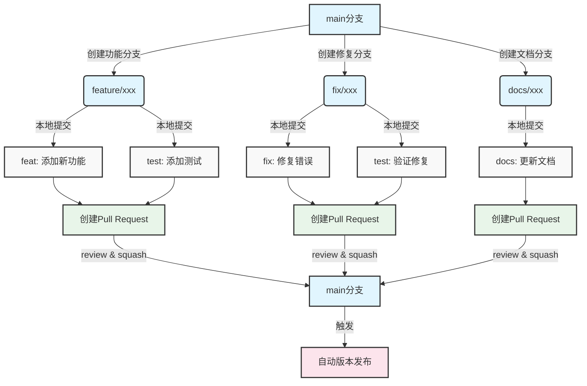
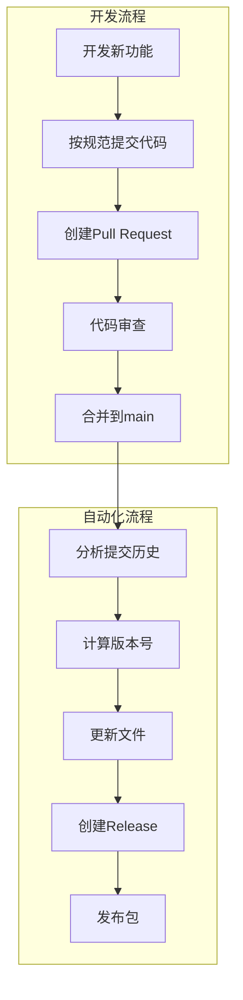

Недавно, оптимизируя процесс выпуска проекта, мы обнаружили, что, хотя все мы знаем, что "спецификация важна", на практике мы часто попадаем в странный круг "игнорирования спецификации ради быстрого выпуска". В этой статье мы расскажем о том, как автоматизировать инструменты и стандартизировать процессы, чтобы сделать выпуск проекта более контролируемым и эффективным.

<!--more-->

## 从手动到自动：为什么要改变？

При традиционном ручном выпуске обычно требуется:
1. вручную изменить номер версии
2. обновить журнал изменений
3. создать релиз
4. опубликовать на платформе управления пакетами

У этого процесса есть несколько очевидных проблем:
- Легко забыть обновить номер версии
- формат журнала изменений непоследователен
- примечания к выпуску имеют разное качество
- этапы выпуска могут быть пропущены

Более того, ручные операции делают процесс публикации непредсказуемым и трудно повторяемым. Нам требовалось более автоматизированное и стандартизированное решение.

## 自动化工具选择

Среди множества средств автоматизации семейство инструментов semantic-release (особенно python-semantic-release) представляет собой комплексное решение. Оно способно:

1. автоматическое определение номера версии
2. автоматическая генерация журнала изменений
3. автоматическое создание релиза
4. автоматический релиз на PyPI

Основная концепция инструмента заключается в том, чтобы управлять всем процессом выпуска с помощью нормализованной информации о подаче.

## 提交信息规范化

Чтобы в полной мере использовать преимущества автоматизированных инструментов, сначала необходимо стандартизировать информацию о подаче. Стандартный формат приведен ниже:

```bash
<type>(<scope>): <description>

[可选的详细说明]

[可选的脚注]
```

Тип в основном включает в себя:
- фича: новые возможности
- fix: исправления ошибок
- docs: обновления документации
- style: переформатирование кода
- refactor: рефакторинг кода
- test: связанное с тестированием
- chore: изменения в процессе сборки или вспомогательных инструментах

Пример:

```bash
feat(database): 添加连接池自动清理功能

Добавлен механизм автоматической очистки неработающих соединений, в настройках которого можно задать интервал очистки.
Поддерживается очистка, запускаемая вручную.

Breaking Changes:
- 移除了旧的手动连接关闭接口
```

## 分支管理最佳实践

Чтобы обеспечить качество и прослеживаемость коммитов, рекомендуется использовать модель разработки, основанную на ветвях:



### 分支命名规范
- feature/xxx：新功能开发
- fix/xxx：问题修复
- docs/xxx：文档更新
- chore/xxx：构建脚本更新



### Pull Request 最佳实践

1. используйте шаблоны, чтобы обеспечить предоставление необходимой информации
2. проводите самопроверку кода
3. используйте сквош при слиянии, чтобы сохранить историю мастер-ветви чистой
4. убедитесь, что коммиты соответствуют требованиям

## 自动化发布流程

Полный автоматизированный процесс выпуска выглядит следующим образом:



### 工具配置

В случае с python-semantic-release необходимо добавить конфигурацию в pyproject.toml:

```toml
[tool.semantic_release]
version_variable = [
    "pyproject.toml:version",
]
branch = "main"
upload_to_pypi = true
upload_to_release = true
build_command = "python -m build"
```

### GitHub Actions 配置

```yaml
name: Release
on:
  push:
    branches: [main]

jobs:
  release:
    runs-on: ubuntu-latest
    steps:
      - uses: actions/checkout@v4
        with:
          fetch-depth: 0
      
      - name: Python Semantic Release
        uses: python-semantic-release/python-semantic-release@v8.7.2
        with:
          github_token: ${{ secrets.GITHUB_TOKEN }}
```

## 最佳实践建议

1. управление номерами версий
   - Строго следуйте спецификациям семантического версионирования
   - Позвольте инструменту автоматически обрабатывать обновления номеров версий
   - Не изменяйте номера версий вручную

2. Информация о представлении
   - Использование инструментов (например, commitizen) для помощи в подготовке нормативных представлений
   - Проверьте сабмит на регулярность на этапе PR
   - Убедитесь, что окончательный коммит понятен и значим при объединении

3. Стратегия ветвления
   - Защита основной ветки, которая должна быть объединена через PR
   - Функциональные ветви со стандартизированными именами
   - Своевременно удалять слитые ветки

4. Процесс выпуска
   - Настройка автоматизированных тестов для обеспечения качества кода
   - Использование переменных окружения для управления конфиденциальной информацией
   - Ведение полной документации для каждого релиза

## 进阶建议

1. предварительные версии
   - Предварительный выпуск с использованием тегов beta/alpha
   - Полностью протестирована в предрелизной среде

2. Управление несколькими пакетами
   - Рассмотрите возможность использования инструмента monorepo (например, changesets) для
   - Унифицированное управление несколькими выпусками пакетов

3. Уведомления о публикации
   - Интеграция с уведомлениями Slack/Pinned
   - Автоматически генерируемое уведомление о публикации

## 总结

Автоматизация релизов - это не просто использование инструментов, это изменение культуры разработки. Это требует от нас:
- Уделять больше внимания качеству предоставляемых материалов
- Уделять больше внимания стандартизации процесса разработки
- уделять больше внимания влиянию изменений кода

Нормализация и автоматизация позволяют:
- Повысить эффективность выпуска
- Сократить количество человеческих ошибок
- Повысить качество проекта
- Облегчить командную работу

Самое главное, что эти практики делают обслуживание проектов более устойчивым и профессиональным.

---

## 相关资源

- [Обычные коммиты](https://www.conventionalcommits.org/)
- [Семантическое версионирование](https://semver.org/)
- [python-semantic-release](https://python-semantic-release.readthedocs.io/)
- [GitHub Actions](https://docs.github.com/cn/actions)
- [О слиянии pull request'ов](https://docs.github.com/en/pull-requests/collaborating-with-pull-requests/incorporating-changes-from-a- pull-request/about-pull-request-merges)