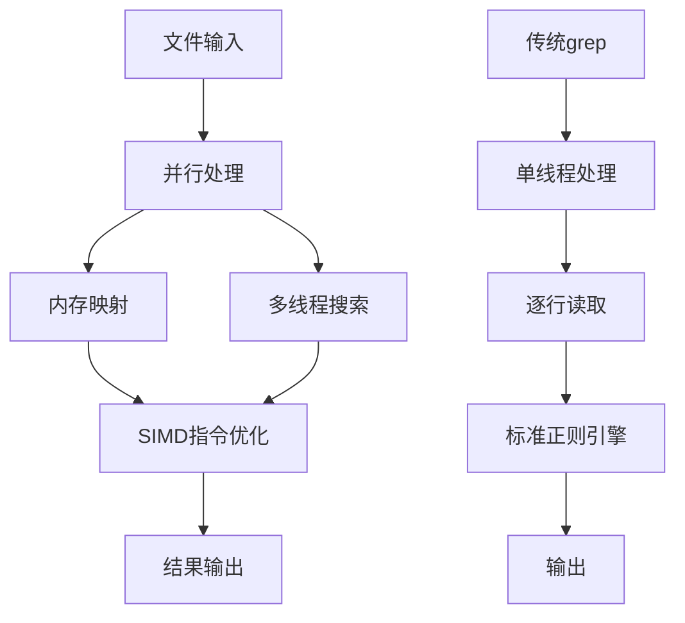
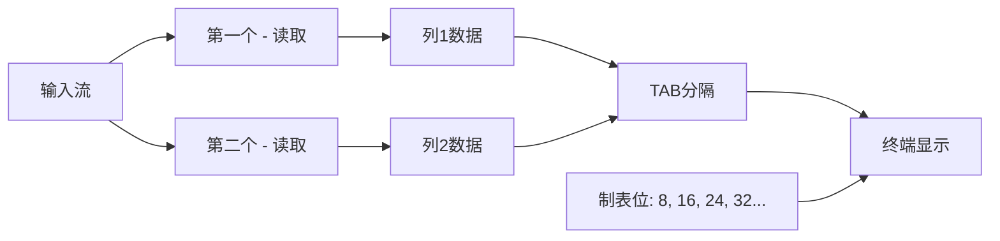
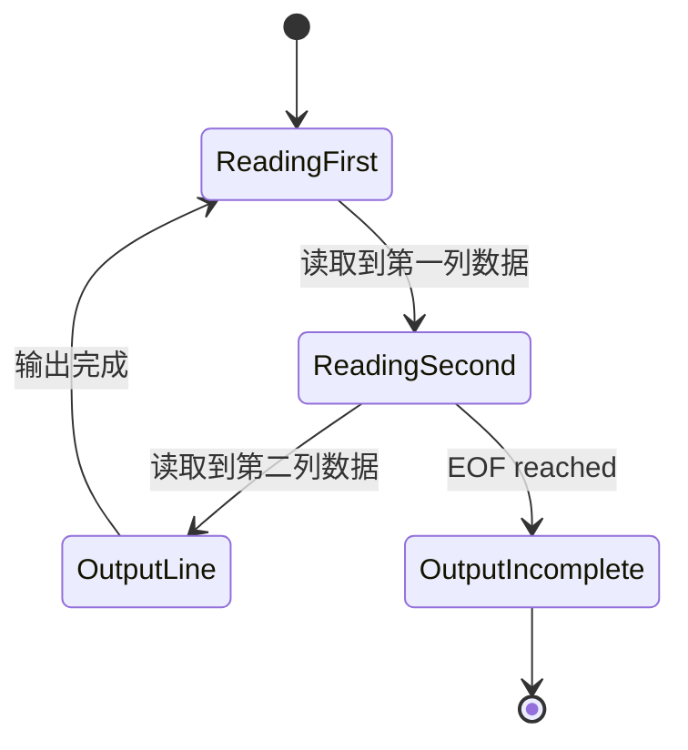
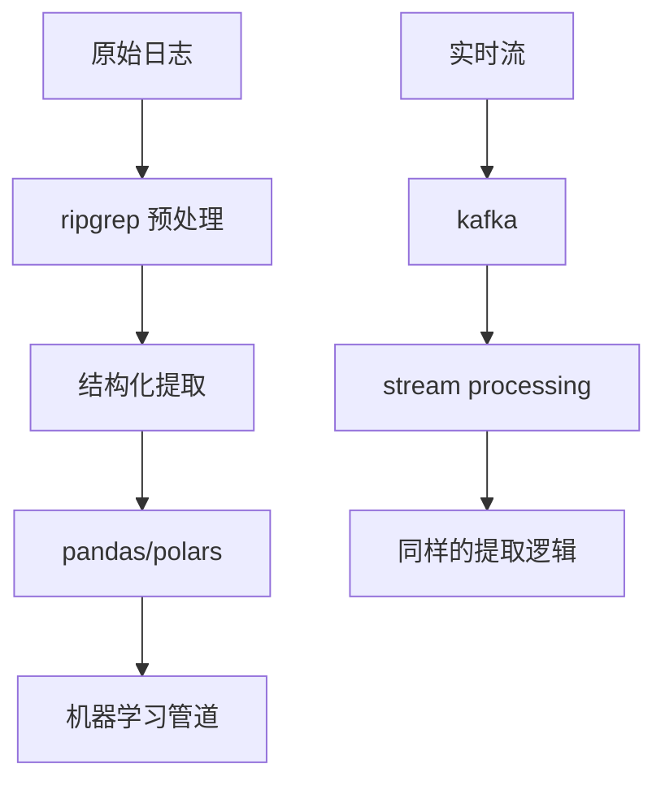

在现代数据处理中，命令行工具的组合使用体现了Unix哲学的精髓：每个工具专注做好一件事，通过管道协作完成复杂任务。本文将深入分析 ripgrep 多模式匹配与 Unix 管道数据处理的技术原理，以库存管理场景为例，探索高效数据提取的最佳实践。

<!--more-->

## 技术背景：为什么选择 ripgrep 而非 grep

### 性能优势的底层原理

ripgrep 相比传统 grep 的性能优势来源于多个层面的优化：



**关键技术差异：**

1. **并行文件处理**：ripgrep 能同时处理多个文件，而 grep 需要顺序处理
2. **内存映射优化**：对大文件使用 mmap，减少 I/O 开销
3. **SIMD 指令集**：利用现代 CPU 的向量化指令加速字符串匹配
4. **智能编码检测**：自动处理 UTF-8 和二进制文件

### 多模式匹配的实现机制

#### ripgrep vs grep 的语法差异

```bash
# grep 的多模式匹配
grep -e "pattern1" -e "pattern2" file

# ripgrep 的多模式匹配
rg "pattern1|pattern2" file
# 或者
rg -e "pattern1" -e "pattern2" file
```

**技术原理差异：**

grep 的 `-e` 参数创建多个独立的匹配器，而 ripgrep 的 `|` 操作符在正则引擎层面进行优化，能够：
- 共享公共前缀和后缀
- 利用有限状态自动机的并行状态转换
- 减少回溯次数

## 深入分析：paste 命令的工作机制

### TAB 字符与终端渲染

当我们使用 `paste - -` 时，输出中的"空格"实际上是 TAB 字符。理解这个机制对于数据处理至关重要：



**TAB 字符的渲染规则：**
- 制表位通常每 8 个字符设置一个
- TAB 将光标移动到下一个制表位
- 不同长度的前导文本导致 TAB 显示宽度不同

验证这一机制：
```bash
echo -e "short\tlong" | cat -A
# 输出：short^Ilong$

echo -e "very_long_text\tshort" | cat -A  
# 输出：very_long_text^Ishort$
```

### paste 命令的内存模型

paste 命令的工作原理可以用状态机来描述：



## 实际案例：处理不一致数据的策略

### 问题分析：数据错位的根本原因

在我们的实际案例中，遇到了这样的数据：

```
商品ID: SKU001
'stock': 20000,
'productType': 'laptop-pro'
商品ID: SKU002  
'productType': 'monitor-4k'  # 缺少 stock 字段
商品ID: SKU003
'stock': 100000,
'productType': 'tablet-mini'
```

使用 `paste - - -` 时，由于第二条记录缺少 stock 字段，导致后续所有数据错位。

### 解决方案的技术实现

#### 方案一：状态驱动的 awk 处理

```bash
awk '
BEGIN { record = "" }
/ [A-Z]{3}\d{3} / { 
    if (record != "") print record
    record = $0
    next 
}
{ 
    record = record "," $0 
}
END { if (record != "") print record }
'
```

这个 awk 脚本实现了一个简单的状态机：
- 遇到 商品ID 模式时开始新记录
- 累积后续字段到当前记录
- 在下一个 商品ID 或文件结束时输出完整记录

#### 方案二：预处理填充缺失字段

```bash
awk '
/^ [A-Z]{3}\d{3} / { 
    id = $0; 
    getline; 
    if (!/stock/) {
        print id "\n" "'\''stock'\'': None,"
    }
    print id; 
    if (!/stock/) next 
}
{ print }
'
```

这种方法在检测到缺失字段时主动插入占位符，保持数据结构的一致性。

## 性能分析与优化策略

### 管道效率的理论基础

Unix 管道的效率来源于：

1. **零拷贝机制**：数据在进程间通过共享缓冲区传递
2. **并行执行**：管道两端的进程可以同时运行
3. **流式处理**：不需要等待上游处理完成即可开始下游处理

### 实际性能测试

```bash
# 测试大文件处理性能
time cat large_file.txt | rg "pattern" | rg -o "extract_rule" | paste - -

# 对比直接正则处理
time cat large_file.txt | rg "complex_pattern_with_groups"
```

**性能优化建议：**

1. **减少管道层数**：每个管道都有开销，能合并的操作尽量合并
2. **使用更精确的模式**：避免过度匹配后再过滤
3. **考虑内存使用**：对于超大文件，评估是否需要分块处理

## 扩展应用与 AI 时代的思考

### 与现代数据处理工具的结合

传统命令行工具与现代数据栈的结合：



### AI 工具的补充作用

虽然 LLM 能处理复杂的文本解析任务，但命令行工具在以下场景仍有优势：

1. **确定性输出**：正则表达式的匹配结果是可预测的
2. **资源效率**：处理大文件时内存和 CPU 开销更小
3. **可组合性**：易于集成到自动化脚本中
4. **调试能力**：每个步骤的输出都可以独立验证

## 总结：Unix 哲学在现代数据处理中的价值

我们探讨的这套方法体现了几个重要原则：

1. **单一职责**：每个工具只做一件事，但做到极致
2. **可组合性**：通过管道将简单工具组合成强大系统
3. **文本流导向**：一切皆文本，便于处理和传递
4. **渐进式优化**：从简单方案开始，逐步处理边界情况

在AI时代，这些原则依然有效。命令行工具提供了可靠的"数据清洗前端"，为后续的AI分析奠定基础。掌握这些技能，不仅能提高当前的工作效率，也为适应未来的技术栈做好准备。

理解这些底层机制，让我们不仅知道"怎么做"，更知道"为什么这样做"，这正是技术深度的体现。
