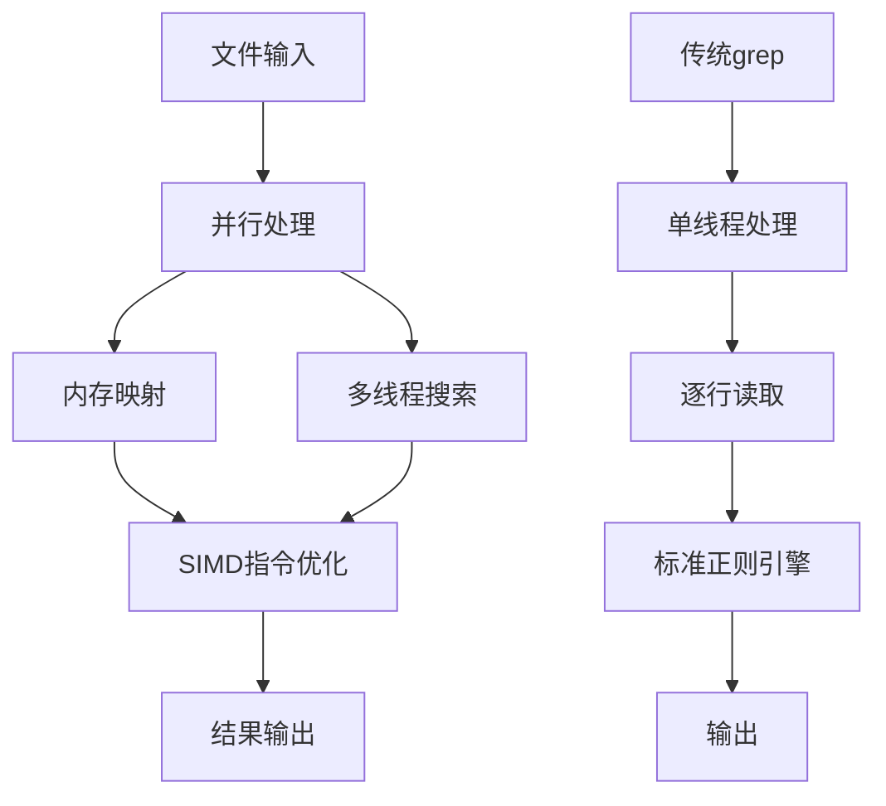
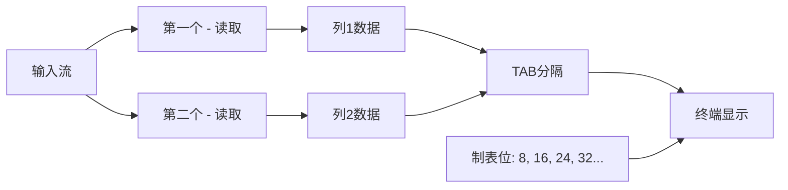
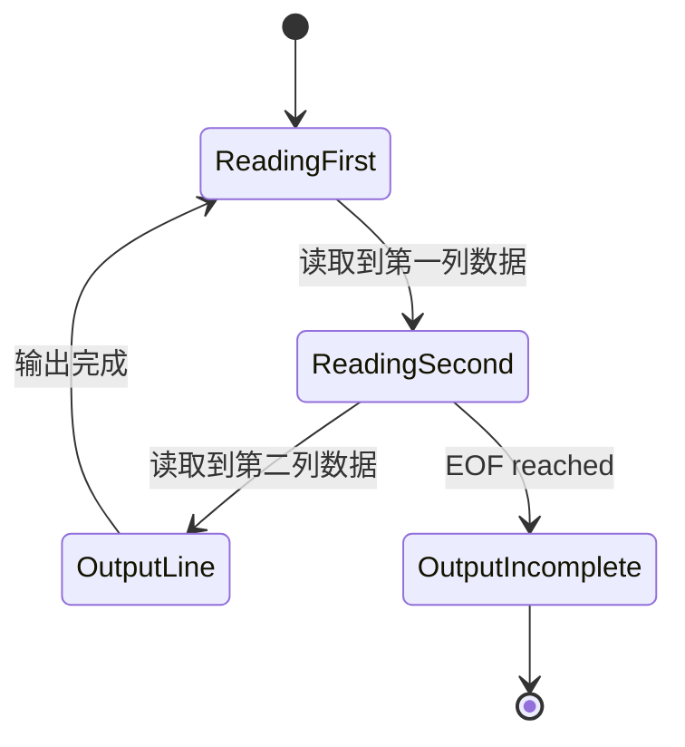
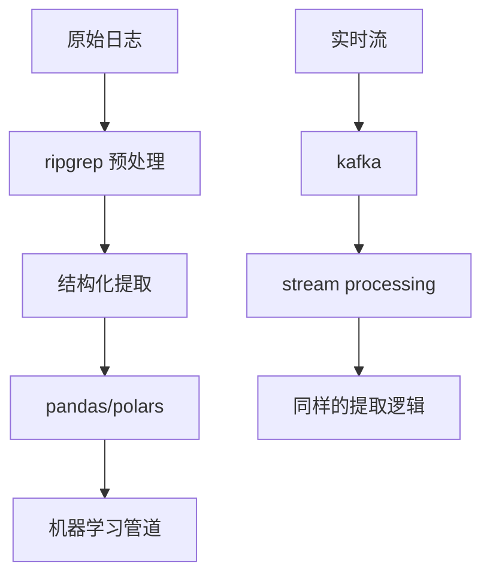

В современной обработке данных комбинированное использование инструментов командной строки отражает суть философии Unix: каждый инструмент фокусируется на выполнении одной задачи, а для выполнения сложных задач взаимодействует через конвейер. В этой статье мы глубоко проанализируем технические принципы многошаблонного сопоставления ripgrep и конвейерной обработки данных Unix, а также рассмотрим лучшие практики эффективного извлечения данных на примере сценариев управления запасами.

<!--more-->

## 技术背景：为什么选择 ripgrep 而非 grep

### 性能优势的底层原理

Преимущество производительности ripgrep перед традиционным grep обусловлено оптимизацией на нескольких уровнях:



**Основные технические отличия:**

1. **Параллельная обработка файлов**: ripgrep может обрабатывать несколько файлов одновременно, в то время как grep должен обрабатывать их последовательно.
2. **Оптимизация отображения памяти**: используйте mmap для больших файлов, чтобы уменьшить накладные расходы на ввод-вывод.
3. **Набор инструкций SIMD**: ускоряет сопоставление строк с помощью векторных инструкций на современных процессорах.
4. **Умное определение кодировки**: автоматическая обработка UTF-8 и бинарных файлов.

### 多模式匹配的实现机制

#### ripgrep vs grep 的语法差异

```bash
# grep 的多模式匹配
grep -e "pattern1" -e "pattern2" file

# ripgrep 的多模式匹配
rg "pattern1|pattern2" file
# 或者
rg -e "pattern1" -e "pattern2" file
```

**Различия в технических принципах:**.

Аргумент `-e` в grep создает несколько независимых матчеров, а оператор `|` в ripgrep оптимизирован на уровне регулярного движка:
- разделять общие префиксы и суффиксы
- использовать общие префиксы и суффиксы
- сократить количество обратных путей

## 深入分析：paste 命令的工作机制

### TAB 字符与终端渲染

Когда мы используем `paste - -`, "пробелы" в выводе на самом деле являются символами TAB. Понимание этого механизма очень важно для обработки данных:



**Правила рендеринга для символов TAB: **TAB
- Табуляции обычно устанавливаются через каждые 8 символов.
- TAB перемещает курсор на следующую табуляцию.
- Разная длина текста, идущего впереди, приводит к разной ширине отображения TAB.

验证这一机制：
```bash
echo -e "short\tlong" | cat -A
# 输出：short^Ilong$

echo -e "very_long_text\tshort" | cat -A  
# 输出：very_long_text^Ishort$
```

### paste 命令的内存模型

Работа команды paste может быть описана в терминах машины состояний:



## 实际案例：处理不一致数据的策略

### 问题分析：数据错位的根本原因

В нашем реальном случае мы столкнулись с такими данными:

```
商品ID: SKU001
'stock': 20000,
'productType': 'laptop-pro'
商品ID: SKU002  
'productType': 'monitor-4k'  # 缺少 stock 字段
商品ID: SKU003
'stock': 100000,
'productType': 'tablet-mini'
```

При использовании `вставки - - - -` все последующие данные оказываются неверными из-за отсутствия поля stock во второй записи.

### 解决方案的技术实现

#### 方案一：状态驱动的 awk 处理

```bash
awk '
BEGIN { record = "" }
/ [A-Z]{3}\d{3} / { 
    if (record != "") print record
    record = $0
    next 
}
{ 
    record = record "," $0 
}
END { if (record != "") print record }
'
```

Этот awk-скрипт реализует простую машину состояний:
- Начинает новую запись, когда встречает шаблон ID элемента
- Накапливает последующие поля в текущей записи
- Накапливает последующие поля в текущей записи. Выводит полную запись при следующем идентификаторе товара или в конце файла.

#### 方案二：预处理填充缺失字段

```bash
awk '
/^ [A-Z]{3}\d{3} / { 
    id = $0; 
    getline; 
    if (!/stock/) {
        print id "\n" "'\''stock'\'': None,"
    }
    print id; 
    if (!/stock/) next 
}
{ print }
'
```

Этот подход проактивно вставляет заполнители при обнаружении отсутствующих полей, поддерживая согласованность структуры данных.

## 性能分析与优化策略

### 管道效率的理论基础

Эффективность конвейеров Unix обусловлена:

1. **Механизм нулевого копирования**: данные передаются между процессами через общий буфер
2. **Параллельное выполнение**: процессы на обоих концах конвейера могут выполняться одновременно
3. **Потоковое выполнение**: последующая обработка может начаться, не дожидаясь завершения последующей обработки

### 实际性能测试

```bash
# 测试大文件处理性能
time cat large_file.txt | rg "pattern" | rg -o "extract_rule" | paste - -

# 对比直接正则处理
time cat large_file.txt | rg "complex_pattern_with_groups"
```

**Рекомендации по оптимизации производительности:**.

1. **Сократите количество уровней конвейера**: каждый конвейер имеет накладные расходы, объединяйте операции там, где это возможно.
2. **Используйте более точные шаблоны**: избегайте чрезмерного сопоставления и последующей фильтрации
3. **Подумайте об использовании памяти**: для очень больших файлов оцените, нужна ли разбивка на части

## 扩展应用与 AI 时代的思考

### 与现代数据处理工具的结合

Традиционные инструменты командной строки соответствуют современным стекам данных:



### AI 工具的补充作用

Хотя LLM может решать сложные задачи разбора текста, инструменты командной строки все же имеют преимущества в следующих сценариях:

1. **Детерминированный вывод**: регулярные выражения имеют предсказуемые результаты сопоставления
2. **Экономия ресурсов**: меньше затрат памяти и процессора при работе с большими файлами
3. **Удобство компоновки**: легкая интеграция в сценарии автоматизации
4. **Возможность отладки**: результаты каждого шага могут быть независимо проверены

## 总结：Unix 哲学在现代数据处理中的价值

Набор изученных нами методов воплощает в себе несколько важных принципов:

1. **Однозадачность**: каждый инструмент делает одно дело, но делает его по максимуму
2. **Комбинируемость**: простые инструменты объединяются в мощные системы с помощью конвейеров
3. **Ориентация на текстовый поток**: все является текстом, его легко обрабатывать и передавать дальше
4. **Инкрементальная оптимизация**: начинайте с простых сценариев и постепенно работайте с граничными случаями

Эти принципы остаются актуальными и в эпоху ИИ. Инструменты командной строки обеспечивают надежный "фронт-энд" для очистки данных, который закладывает основу для последующих анализов ИИ. Овладение этими навыками не только повышает текущую производительность, но и готовит вас к работе с технологическим стеком будущего.

Понимание этих основополагающих механизмов позволяет нам знать не только "как", но и "почему", и вот тут-то и проявляется техническая глубина.