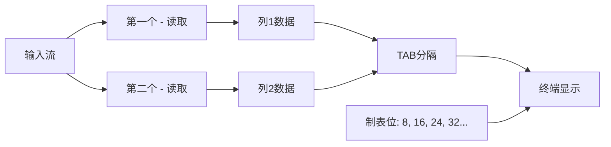
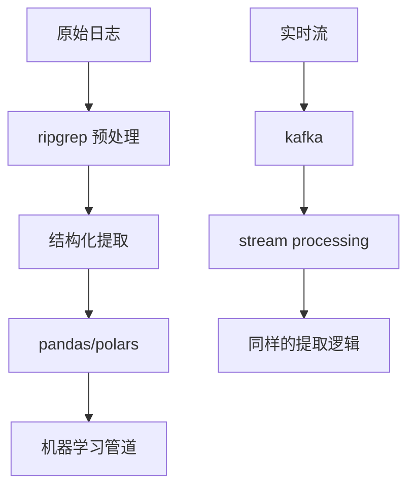

В современной обработке данных комбинированное использование инструментов командной строки отражает суть философии Unix: каждый инструмент фокусируется на выполнении одной задачи, а для выполнения сложных задач взаимодействует через конвейер. В этой статье мы глубоко проанализируем технические принципы многошаблонного сопоставления ripgrep и конвейерной обработки данных Unix, а также рассмотрим лучшие практики эффективного извлечения данных на примере сценариев управления запасами.

<! --подробнее-->

## Техническая основа: Почему стоит выбрать ripgrep вместо grep?

### Основополагающее обоснование преимущества в производительности

Преимущество производительности ripgrep перед традиционным grep обусловлено несколькими уровнями оптимизации:

```mermaid
graph TD
    A[文件输入] --> B[并行处理]
    B --> C[内存映射]
    B --> D[多线程搜索]
    C --> E[SIMD指令优化]
    D --> E
    E --> F[结果输出]
    
    G[传统grep] --> H[单线程处理]
    H --> I[逐行读取]
    I --> J[标准正则引擎]
    J --> K[输出]
```.

**Ключевые технические отличия:**

1. **Параллельная обработка файлов**: ripgrep может обрабатывать несколько файлов одновременно, в то время как grep должен обрабатывать их последовательно.
2. **Оптимизация отображения памяти**: используйте mmap для больших файлов, чтобы уменьшить накладные расходы на ввод-вывод.
3. **Набор инструкций SIMD**: ускоряет сопоставление строк с помощью векторных инструкций на современных процессорах.
4. **Умное определение кодировки**: автоматическая обработка UTF-8 и бинарных файлов.

### Механизм реализации многошаблонного сопоставления

#### Разница в синтаксисе между ripgrep и grep

```bash
# grep 的多模式匹配
grep -e "pattern1" -e "pattern2" file

# ripgrep 的多模式匹配
rg "pattern1|pattern2" file
# 或者
rg -e "pattern1" -e "pattern2" file
```

**Различия в технических принципах:**

Параметр `-e` в grep создает несколько независимых матчеров, в то время как оператор `|` в ripgrep оптимизирован на уровне регулярного движка, чтобы быть в состоянии:
- использовать общие префиксы и суффиксы
- использовать параллельные переходы состояний конечных автоматов состояний
- сократить количество обратных ходов

## Глубокий анализ: работа команды paste.

### Символы TAB и рендеринг терминала

Когда мы используем `paste - -`, "пробелы" в выводе на самом деле являются символами TAB. Понимание этого механизма очень важно для обработки данных:



**Правила рендеринга для символов TAB
- Табуляции обычно устанавливаются через каждые 8 символов.
- TAB перемещает курсор на следующую табуляцию.
- Разная длина текста, идущего впереди, приводит к разной ширине отображения TAB.

Проверьте этот механизм:
```bash
echo -e "short\tlong" | cat -A
# 输出：short^Ilong$

echo -e "very_long_text\tshort" | cat -A  
# 输出：very_long_text^Ishort$
```.

### Модель памяти для команды paste

Работа команды paste может быть описана в терминах машины состояний:

```mermaid
stateDiagram-v2
    [*] --> ReadingFirst
    ReadingFirst --> ReadingSecond: 读取到第一列数据
    ReadingSecond --> OutputLine: 读取到第二列数据
    OutputLine --> ReadingFirst: 输出完成
    ReadingSecond --> OutputIncomplete: EOF reached
    OutputIncomplete --> [*]
```.

## Примеры из реального мира: стратегии обработки противоречивых данных

### Анализ проблемы: основная причина несогласованных данных

В нашем практическом примере мы столкнулись с такими данными:

```
商品ID: SKU001
'stock': 20000,
'productType': 'laptop-pro'
商品ID: SKU002  
'productType': 'monitor-4k'  # 缺少 stock 字段
商品ID: SKU003
'stock': 100000,
'productType': 'tablet-mini'
```.

При использовании `paste - - -` все последующие данные оказываются неверными из-за отсутствия поля stock во второй записи.

### Техническая реализация решения

#### Решение 1: Обработка awk с учетом состояния

```bash
awk '
BEGIN { record = "" }
/ [A-Z]{3}\d{3} / { 
    if (record != "") print record
    record = $0
    next 
}
{ 
    record = record "," $0 
}
END { if (record != "") print record }
'
```

Этот awk-скрипт реализует простую машину состояний:
- Начинает новую запись, когда встречает шаблон идентификатора товара
- Накапливает последующие поля в текущей записи
- Накапливать последующие поля в текущей записи. Выводить полную запись при следующем идентификаторе товара или в конце файла.

#### Вариант 2: Предварительная обработка для заполнения недостающих полей

```bash
awk '
/^ [A-Z]{3}\d{3} / { 
    id = $0; 
    getline; 
    if (!/stock/) {
        print id "\n" "'\''stock'\'': None,"
    }
    print id; 
    if (!/stock/) next 
}
{ print }
'
```

Этот подход проактивно вставляет заполнители при обнаружении отсутствующих полей, сохраняя целостность структуры данных.

## Анализ производительности и стратегии оптимизации

### Теоретические основы эффективности конвейера

Эффективность конвейеров Unix определяется:

1. **механизм нулевого копирования**: данные передаются между процессами через общие буферы
2. **Параллельное выполнение**: процессы на обоих концах конвейера могут выполняться одновременно
3. **Потоковое выполнение**: последующая обработка может начаться, не дожидаясь завершения обработки в верхнем потоке

### Фактические тесты производительности

```bash
# 测试大文件处理性能
time cat large_file.txt | rg "pattern" | rg -o "extract_rule" | paste - -

# 对比直接正则处理
time cat large_file.txt | rg "complex_pattern_with_groups"
```.

**Рекомендации по оптимизации производительности:**

1. **Уменьшите количество уровней конвейера**: каждый конвейер имеет накладные расходы, объединяйте как можно больше операций.
2. **Используйте более точные шаблоны**: избегайте чрезмерного совпадения перед фильтрацией
3. **Подумайте об использовании памяти**: для очень больших файлов оцените необходимость использования кусков

## Масштабирование приложений и мышления в эпоху искусственного интеллекта

### Интеграция с современными инструментами обработки данных

Сочетание традиционных инструментов командной строки с современными стеками данных:



### Взаимодополняющие роли инструментов ИИ

Хотя LLM может решать сложные задачи по разбору текста, инструменты командной строки все же имеют преимущества в следующих сценариях:

1. **Детерминированный результат**: результаты сопоставления регулярных выражений предсказуемы
2. **Эффективность использования ресурсов**: меньше затрат памяти и процессора при работе с большими файлами
3. **Компонуемость**: легкость интеграции в сценарии автоматизации
4. **Отлаживаемость**: результаты каждого шага могут быть проверены независимо друг от друга

## Резюме: значение философии Unix в современной обработке данных

Рассмотренный нами набор подходов воплощает в себе несколько важных принципов:

1. **однозадачность**: каждый инструмент делает одно дело, но в предельном объеме
2. **комбинируемость**: объединение простых инструментов в мощные системы с помощью конвейеров
3. **Ориентация на текстовый поток**: все является текстом, его легко обрабатывать и передавать дальше
4. **Инкрементальная оптимизация**: начинайте с простых сценариев и постепенно работайте с граничными случаями

В эпоху искусственного интеллекта эти принципы остаются актуальными. Инструменты командной строки обеспечивают надежную "фронтальную очистку данных", которая закладывает основу для последующих анализов ИИ. Овладение этими навыками не только повышает текущую производительность, но и готовит вас к будущим технологическим стекам.

Понимание этих основополагающих механизмов позволяет нам не только знать "как делать", но и "зачем делать", что как раз и является воплощением технической глубины.
