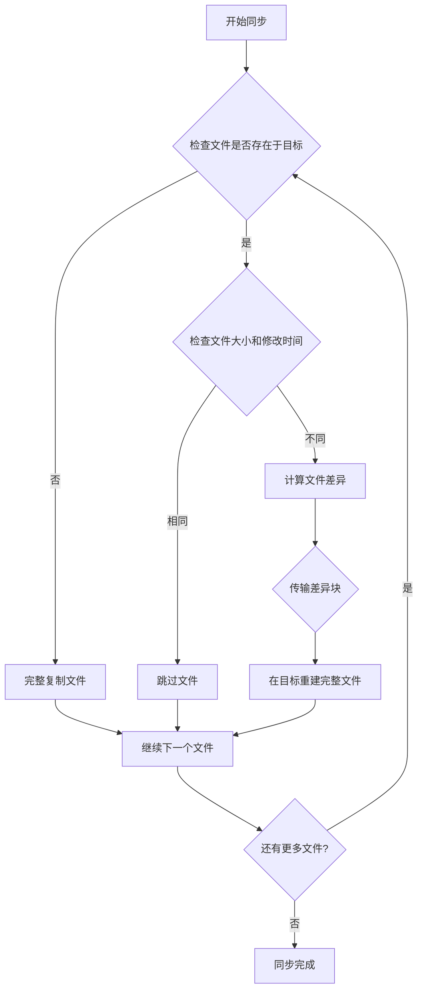

你是否曾经需要在两台电脑之间传输大量文件？或者需要备份重要数据但又担心文件属性（如修改时间、权限）丢失？今天介绍的rsync工具不仅能解决这些问题，还能让你的文件传输更快更可靠。无论你是普通用户还是专业人士，这篇指南都能帮你轻松掌握这个强大工具。

<!--more-->

## 什么是rsync？

rsync（远程同步，remote synchronization）是一个在类Unix系统（包括macOS）上广泛使用的文件同步工具。它可以在本地文件系统之间或通过网络在不同计算机之间高效地传输和同步文件。

简单来说，rsync就像一个聪明的搬运工（文件传输工具），它的特别之处在于：
- 只复制有变化的文件，节省时间和带宽
- 可以保留文件的原始属性（时间戳、权限等）
- 支持断点续传，传输中断后可以从断点继续
- 提供详细的进度显示

## 为什么要用rsync？

想象一下这些场景：

- **设计师小王**需要将完成的设计文件从工作电脑复制到家里的备份硬盘，但USB拷贝太慢，而且经常丢失文件的创建时间
- **会计李姐**每周需要备份财务数据，但希望备份文件的修改日期保持不变，以便追踪文件历史
- **学生小陈**经常在两台电脑间同步学习资料，但网络不稳定导致传输中断，每次都要重新开始

这些情况下，rsync都能完美解决问题。

## 开始使用rsync前的准备

### 安装最新版本

macOS自带的rsync版本较旧，功能有限。建议通过Homebrew安装最新版本：

```bash
brew install rsync
```

安装后，可以通过以下命令检查版本：

```bash
rsync --version
```

如果显示的版本号是3.x.x（如3.2.x或更高），那么恭喜你，可以使用本文介绍的所有高级功能了！

### 了解基本命令结构

rsync的基本命令格式是：

```bash
rsync [选项] 源路径 目标路径
```

## rsync基础：简单实用的同步命令

### 最基础的同步命令

```bash
rsync -av 源文件夹/ 目标文件夹/
```

这个命令中：
- `-a` 是"归档模式"，会保留几乎所有文件属性
- `-v` 代表"详细输出"，会显示正在复制的文件

例如，将"我的文档"同步到外部硬盘：

```bash
rsync -av "~/Documents/" "/Volumes/ExternalDrive/Documents/"
```

### 添加进度显示

进行大文件或大量文件的同步时，了解进度非常重要：

```bash
rsync -av --progress 源文件夹/ 目标文件夹/
```

## 进阶技巧：让rsync完全满足你的需求

### 不同的进度显示方式

rsync提供多种进度显示选项，适合不同的场景：

1. **`--progress`**：显示每个文件的传输进度
   ```bash
   rsync -av --progress 源文件夹/ 目标文件夹/
   ```
   适合：想看到每个文件详细进度的场景

2. **`--info=progress2`**（推荐，需要新版rsync）：显示总体传输进度
   ```bash
   rsync -av --info=progress2 源文件夹/ 目标文件夹/
   ```
   适合：同步大量文件时，只想看整体进度

3. **`-P`**：这是`--progress --partial`的组合，允许断点续传并显示进度
   ```bash
   rsync -avP 源文件夹/ 目标文件夹/
   ```
   适合：网络不稳定环境下的传输

### 保持原始时间戳和属性

有时你可能发现同步后文件的修改时间变成了当前时间，这可以通过确保使用正确的选项来避免：

```bash
rsync -avt 源文件夹/ 目标文件夹/
```

其中：
- `-t` 专门用于保留文件的修改时间

对于Mac用户，还可以添加`-E`选项保留macOS特有的文件属性：

```bash
rsync -avtE 源文件夹/ 目标文件夹/
```

### 镜像同步（删除目标中多余的文件）

如果你想让目标文件夹完全匹配源文件夹（删除目标中源没有的文件）：

```bash
rsync -av --delete 源文件夹/ 目标文件夹/
```

⚠️ 请小心使用`--delete`选项，它会删除目标位置中源位置没有的文件。

### 先测试，再执行

在进行重要同步前，可以先用`--dry-run`选项进行演练：

```bash
rsync -av --dry-run 源文件夹/ 目标文件夹/
```

这会显示将要进行的操作，但不会实际执行。

### 排除特定文件或文件夹

排除不需要同步的文件：

```bash
rsync -av --exclude='*.tmp' --exclude='temp/' 源文件夹/ 目标文件夹/
```

## rsync如何工作：了解原理

rsync之所以高效，是因为它采用了一种聪明的算法来识别文件变化。



这种增量传输方式只传输文件中变化的部分，大大提高了效率。例如，一个10GB的文件如果只有几MB的变化，rsync只会传输那几MB的数据。

## 常见场景的最佳实践

### 场景一：备份重要文档

保留所有属性，并显示总体进度：

```bash
rsync -avE --info=progress2 ~/Documents/ /Volumes/Backup/Documents/
```

### 场景二：同步两台Mac之间的文件夹

网络环境不稳定，需要断点续传和压缩传输：

```bash
rsync -avzP ~/Projects/ user@remote-mac:~/Projects/
```

### 场景三：创建完全镜像的备份

完全镜像同步，保留所有属性：

```bash
rsync -avE --delete --info=progress2 ~/Pictures/ /Volumes/Backup/Pictures/
```

## 排查常见问题

1. **文件权限问题**：如果遇到权限错误，尝试加上`sudo`运行命令
2. **时间戳变化**：确保使用了`-a`或`-t`选项
3. **速度太慢**：添加`-z`选项启用压缩
4. **找不到高级选项**：检查rsync版本，可能需要升级

## 总结

rsync是一个非常强大的文件同步工具，掌握它可以极大地提高你的文件管理效率。从简单的备份到复杂的远程同步，从基础用法到高级选项，希望这篇指南能帮助你充分利用rsync的潜力。

无论你是一名设计师需要备份作品，一名会计需要保存财务数据，还是一名学生需要在多台设备间同步学习资料，rsync都能满足你对文件同步的所有期望。

## 思考问题

如果你经常在多台设备之间同步文件，可以尝试创建一个简单的脚本来自动化这个过程。你认为对于定期备份任务，rsync相比其他备份软件的优势和劣势各是什么？实际使用中，你会如何平衡自动化和数据安全之间的关系？
