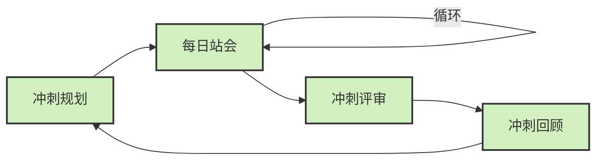

作为一线开发者，我不知道你是否曾经有过这样的体验：听PM或团队负责人讨论什么"Scrum"、"Kanban"，而你只能一脸茫然地点头。别担心，我也曾是你中的一员——专注于代码实现，对这些"管理术语"知之甚少。

<!--more-->

# 从开发者视角理解Scrum与Kanban

我不打算用高大上的项目管理术语来解释这两种方法。相反，我想分享作为普通开发者，你在这两种工作方式下的真实体验会有什么不同——毕竟，不管管理层怎么定义，最终都是我们这些写代码的人要在这些框架下工作。

## Scrum：生活在短跑循环中

简单来说，Scrum就像是把工作切分成一个个固定长度的"冲刺"（通常是两周）。当你在Scrum团队工作时，你的日常可能是这样的：

* **周一早晨的大会**：冲刺开始时，大家聚在一起，讨论接下来两周要做什么。你可能会听到"故事点"这样的术语，基本上就是估算任务有多复杂。
* **每日站会**：每天早上15分钟，轮流说"我昨天做了什么"、"今天打算做什么"、"有什么阻碍"，然后各自散去工作。
* **任务认领制**：任务通常在冲刺开始时分配好，或者由团队成员"认领"。一旦开始冲刺，基本上这批任务就"锁定"了。
* **展示与复盘**：冲刺结束时，向相关人员展示两周的成果，然后团队内部讨论这两周哪里做得好，哪里可以改进。

在Scrum中，作为开发者，你会有一种明确的节奏感和边界感——任务有明确的起止时间，这两周就干这些事，别的先不管。

## Kanban：持续流动的工作方式

Kanban则完全不同，它更像是一条生产线，或者更像客服中心处理工单的方式。在Kanban团队中：

* **没有固定周期**：工作持续流动，没有"冲刺"的概念。
* **可视化看板**：工作被放在看板上（通常是Trello或Jira这样的工具），分为"待办"、"进行中"、"完成"等几列。
* **拉取任务制**：完成一个任务后，你自己从"待办"列拉取下一个任务，就像客服人员处理下一个来电一样。
* **在制品限制**：每一列有任务数量上限，防止工作堆积和超负荷。
* **会议更少更灵活**：没有固定的规划和回顾会议，沟通更加即时和针对性。

作为开发者，在Kanban中你拥有更大的任务选择自由度，工作节奏更加均匀，但也需要更好的自我管理能力。

# 开发者的真实感受差异

从我的经验和与同行交流中，我总结了在这两种工作方式下最明显的体验差异：

## 时间体验的不同

在Scrum中，我的工作时间是这样分配的：
* 大约10-15%的时间用于各种会议
* 冲刺开始和结束时有明显的"忙闲"起伏
* 有时冲刺结束前会有赶工压力

而在Kanban中：
* 会议时间大大减少，更多零散的即时讨论取而代之
* 工作压力相对均匀，没有明显的周期性波动
* 更容易进入"心流"状态，专注于当前任务

## 工作自主性的差异

Scrum给我的感觉：
* 任务通常提前规划和分配
* 知道未来两周要做什么，可预见性高
* 需求变更相对较少（理论上如此）

Kanban给我的感觉：
* 更大的任务选择自由度
* 可以根据自己的专长和状态选择下一个任务
* 需求和优先级可能随时调整，需要更好的适应能力

## 成就感来源的不同

这点很微妙但很重要：
* Scrum中的成就感往往来自于冲刺结束时的"大交付"
* Kanban中的成就感来自于每完成一个任务的小胜利，更加频繁

# 哪种方式更好？一个开发者的个人观点

经历过两种工作方式后，我的个人感受是：**没有绝对更好的方法，只有更适合你和你团队的方法**。

不过，我确实认为Kanban在某些方面展现出了更现代、更符合软件开发实际的特点：

1. **适应变化的能力**：软件开发中需求变化是常态，Kanban的流动性更能适应这种变化
2. **减少无效会议**：作为开发者，我们都知道过多的会议会打断思路
3. **问题可视化**：Kanban能更直观地显示工作流中的阻塞点
4. **自组织团队**：给予开发者更多自主权，往往能激发更高的积极性

然而，对于一些团队，特别是需要清晰交付节奏和预测性的项目，Scrum的结构化优势不可忽视。

# 真实世界的混合实践

值得一提的是，真实世界中的团队很少严格遵循纯粹的Scrum或Kanban。大多数团队采用混合方法，结合两者优点：

* 保留Scrum的周期性规划和回顾会议
* 采用Kanban的可视化工作流和WIP限制
* 根据项目阶段和团队特点灵活调整

作为开发者，最重要的是理解这些方法背后的原则，而不是拘泥于形式。在任何管理方法下，良好的团队沟通和协作始终是成功的关键。

# 给普通开发者的建议

如果你刚接触这些工作方式，我的建议是：

1. **关注实际工作体验**：不管团队采用什么方法，重点是它如何影响你的日常工作
2. **提出改进建议**：不要觉得这些流程是"上面定的"就无法改变，好的团队总是欢迎建设性意见
3. **理解背后目的**：这些方法都是为了让团队更高效地交付价值，理解这一点有助于你更好地适应

最后，无论是Scrum的结构化还是Kanban的灵活性，都只是工具而非目的。真正重要的是，找到让你和你的团队能够高效、愉快工作的方式。

作为一个写了十多年代码的老兵，我越来越相信：适应团队的工作方式很重要，但更重要的是，找到让自己保持高效和热情的工作节奏。毕竟，再好的管理方法，也比不上一个内在驱动、自我管理良好的开发团队。

你们团队使用哪种工作方式？感觉如何？欢迎在评论区分享你的体验。
